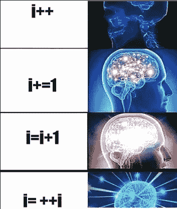
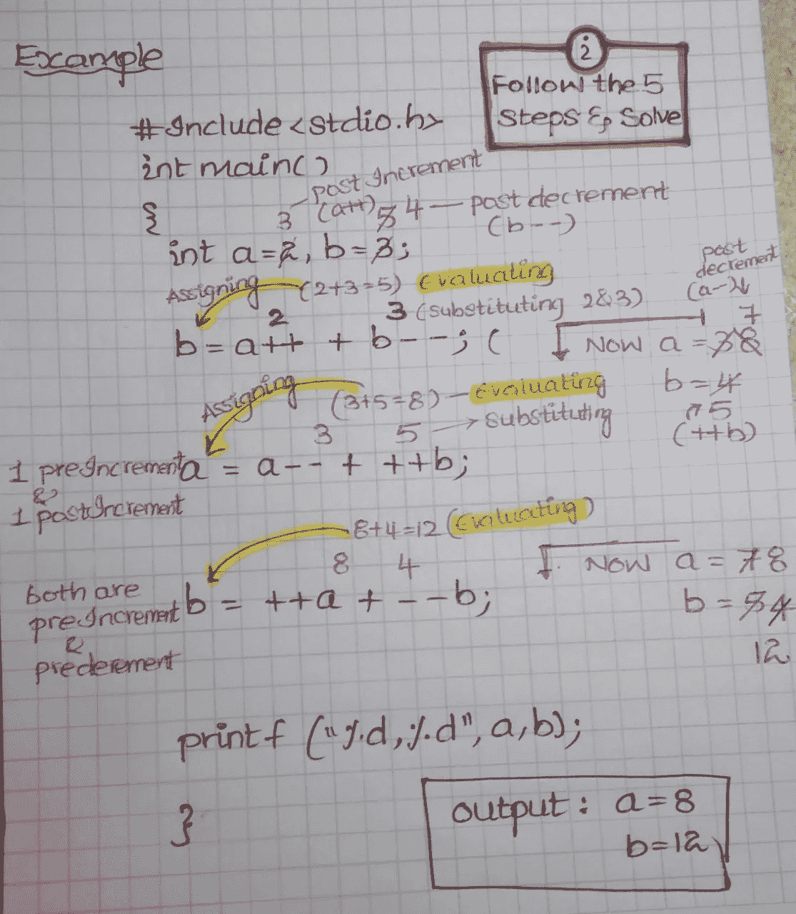

# 修改运算符

> 原文：<https://medium.com/analytics-vidhya/modify-operators-ade8bb1e5ccd?source=collection_archive---------13----------------------->

你有没有在回答 MCQ 的编码测试时烦恼过，这些修改操作符的问题总是不正确，并经历过这种情况…



是的，我完全像迷因一样沮丧，在很少的实践中，我很容易地解决了它们，如果你对这些感到困惑，不要担心，我给出了我最好的直觉，所以，你永远不会在这个概念上失去你的分数，眨眼..眨眼..让我们开始吧。

修改运算符在 C 程序设计语言中也称为一元运算符，它的意思是，一个运算符可以对单个操作数执行一个运算，只有一个操作数足以执行该运算的称为一元运算符。

**不同类型的修改运算符有**
1。增量
~后增量(var++)
~前增量(++var)
2。递减量
~后递增量
~前递减量(- -var)

**所以在解决问题之前，先看看这些步骤** 步骤 1:先解决前递增或前递减
步骤 2:替换那些值
步骤 3:评估是否有任何表达式
步骤 4:赋值
步骤 5:解决后递增或后递减

现在让我们看几个例子，

```
**What is the output?**
#include<stdio.h>
int main()
{
intx=10,y;
y=++x;
printf("%d,%d",x,y);
}**step1**, check for pre increment or predecrement
we have ++x, so now **x** value is 11.
**step2,** substitute the values
**step3,** since there is no evaluation skip this step.
**step4,** Assign the values(now **x=11** and **y=11)
step5,** check for any post increment or post decrement,since there weren't any your'e output is (**x=11, y=11**)It looks little complex but on practice it will be a cake walk for you, lets look into one more example.**What is the output?**
#include<stdio.h>
int main()
{
intx=10,y;
y=x++;
printf("%d,%d",x,y);
}**step1**, check for pre increment or predecrement
since we don not have any skip this
**step2,** substitute the values
**step3,** since there is no evaluation skip this step.
**step4,** Assign the values(now **x=10** and **y=10)
step5,** check for any post increment or post decrement,since there is a post increment(x++) now x becomes 11,your'e output is (**x=11, y=10**)It looks little complex but on practice it will be a cake walk for you, lets look into one more example.
```

**试试这个……**

```
**What is the output?**#include<stdio.h>
int main()
{
int a=2,b=3;
b=a++ + b--;
a=a-- + ++b;
b=++a + --b;
printf("%d,%d",a,b);
}
```

无法想象解决方案，所以为了更好地理解，我在纸上解决，并尽我所能传达这个概念…看看这个轻松的解决方案。



希望你明白这个概念，所以从现在开始不要混淆，不要在考试中犯任何错误，取得好成绩。