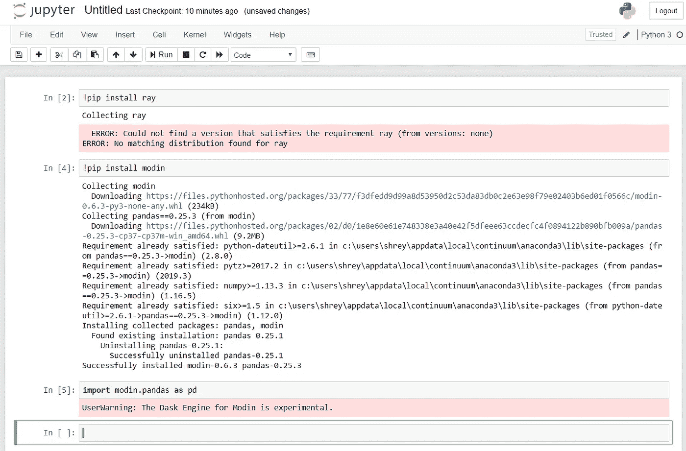
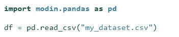
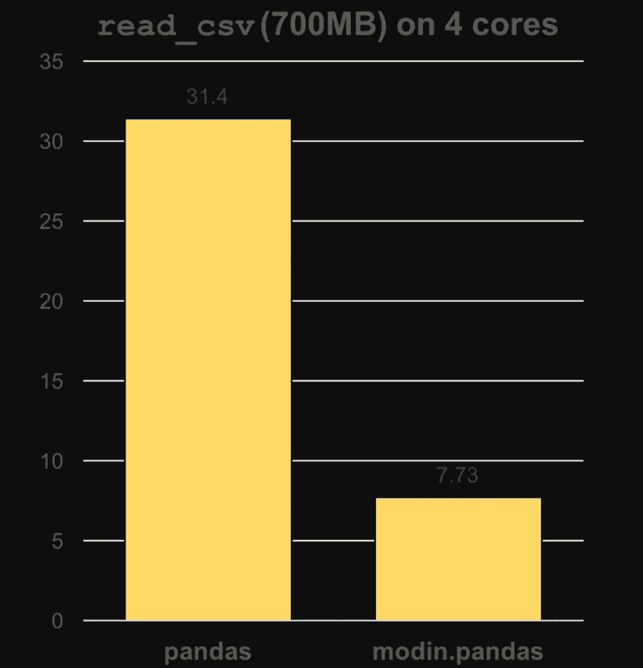

# Modin(加载大型数据集的 Python 库)

> 原文：<https://medium.com/analytics-vidhya/modin-a-python-library-to-load-large-dataset-5f3f466fb9f3?source=collection_archive---------15----------------------->

在这篇博客中，我将谈论“**摩丁**”。这是一个 Python 开源库，用于在 Jupyter Notebook 中加载大型数据集。所以我想分享一些基本的东西。

使用 Modin，您不需要担心您的 CPU 有多少个内核，也不需要指定如何分发数据。事实上，您可以继续使用以前的 pandas 笔记本，同时体验到来自 Modin 的相当大的速度提升，即使是在单台机器上。一旦更改了 import 语句，就可以像使用熊猫一样使用 Modin 了。

我附了几张我的 Jupyter 笔记本的截图，让语法清晰！！！

**安装**

**用法**

正在加载数据集！！

# **摩丁和熊猫的对比！！！！**

**Modin** 可用于 **1TB+数据集**，可由任何 CPU 轻松处理

熊猫一次只使用一个 CPU 核心，而摩丁使用所有 CPU 核心，这使得它更强大。

**熊猫和摩登熊猫的比较**

感谢阅读！！！！

我希望你喜欢这个博客。欢迎在评论区分享你的想法，也可以和我联系:-
Linkedin—[https://www.linkedin.com/in/shreyak007/](https://www.linkedin.com/in/shreyak007/)
Github—[https://github.com/Shreyakkk](https://github.com/Shreyakkk)
Twitter—[https://twitter.com/Shreyakkkk](https://twitter.com/Shreyakkkk)
insta gram—[https://www.instagram.com/shreyakkk/](https://www.instagram.com/shreyakkk/)
Snapchat—shreyak 001
脸书—[https://www.facebook.com/007shreyak](https://www.facebook.com/007shreyak)
谢谢。