# 熊猫-数据分析基础

> 原文：<https://medium.com/analytics-vidhya/module-6-pandas-5b053ee1e1a1?source=collection_archive---------10----------------------->

*   用于数据操作和分析的开源库
*   Panda 代表面板数据，这是一种多维数据，包含一段时间内的测量结果

熊猫的特征

1.  系列对象和数据帧—用于处理 1D(系列对象)和 2D 标签数据(数据帧)和面板数据(3D，时间序列)
2.  缺失数据的处理— NaN
3.  数据对齐—用户可以忽略预定义的标签，让 Pandas 为您自动标记数据
4.  按功能分组
5.  切片、索引和分租
6.  合并和加入
7.  重塑
8.  轴的分层标记
9.  强大的 I/p、O/p 工具——适用于处理表格、任意和时间序列数据类型。
10.  时序特定功能

对于大数据集，Pandas 的性能比 numpy 好 50 万以上。

Pandas Series 对象更灵活，因为我们可以定义带标签的索引来访问数组的元素，而在 Numpy 中只能通过默认的整数位置来访问

> 进口熊猫作为 pd
> 
> a= pd.read_csv(' …')

系列对象

*   一维标记数组
*   包含相似或混合类型的数据(异构数据)

```
import pandas as pd
data = [1,2,3,4]
series1 = pd.Series(data)
series1
o/p:
0    1
1    2
2    3
3    4
dtype: int64type(series1)
o/p:
pandas.core.series.Series#Changing the index of a series object, data can be array, dictonary # or scalar
series1 = pd.Series(data, index =['a','b','c','d'])
series1
o/p:
a    1
b    2
c    3
d    4
dtype: int64#series1 = pd.Series(data, index =['a','b','c']) <-- notice only3
**#Error: ValueError**: Length of passed values is 4, index implies 3
```

熊猫数据框

*   具有潜在不同类型的列的二维标记数据结构
*   不同的列类型、可变大小、带标签的轴、算术运算可应用于行和列#创建一个数据帧

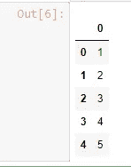

```
# creating a DataFrame using a list
import pandas as pd
data = [1,2,3,4,5]
df =pd.DataFrame(data)
df
```

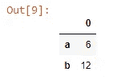

```
#creating a dataframe using a series
series = pd.Series([6,12],index=['a','b'])
df = pd.DataFrame(series)
df
```

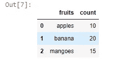

```
#creating a dataframe using a dictionary
dictionary ={'fruits':['apples','banana','mangoes'],'count':[10,20,15]}
df = pd.DataFrame(dictionary)
df
```

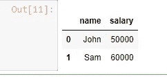

```
#creating a datafram using a numpy array
import numpy as np
import pandas as pdnumpyarray = np.array([[50000,60000],['John','Sam']])
df =pd.DataFrame({'name':numpyarray[1],'salary':numpyarray[0]})
df
```

## 合并、联接和连接

## 合并

```
import pandas as pd
player =['Player1','Player2','Player3']
point =[8,9,6]
title = ['Game1','Game2','Game3']
df1 =pd.DataFrame({'Player':player,'Points':point,'Title':title})
df1
```


```
player =['Player1','Player5','Player6']
power =['Punch','Kick','Elbow']
title = ['Game1','Game5','Game6']
df2 =pd.DataFrame({'Player':player,'Power':power,'Title':title})
df2
```

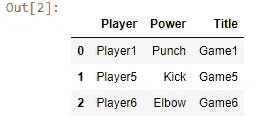

```
#inner merge
df1.merge(df2, on = 'Title', how ='inner')
```

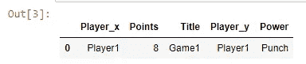

```
df1.merge(df2) # by default it is inner merge
```

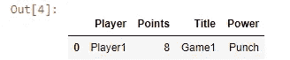

```
#left merge
df1.merge(df2,on='Player',how ='left')
```

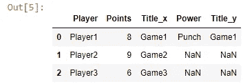

```
#Right Merge
df1.merge(df2, on ='Player',how='right')
```

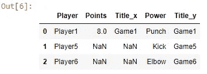

```
#Outer Merge
df1.merge(df2, on ='Player', how ='outer')
```

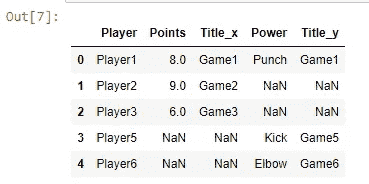

## 加入

*   连接-基于索引值，而不是数据帧中的属性名
*   要连接的数据框的所有属性名称都应该不同，否则会引发错误。错误:**值错误**:列重叠，但未指定后缀:Index([…]，dtype='object ')

```
player =['Player1','Player2','Player3']
point =[8,9,6]
title = ['Game1','Game2','Game3']
df3 =pd.DataFrame({'Player':player,'Points':point,'Title':title},index=['L1','L2','L3'])
df3
```

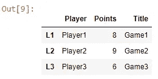

```
player =['Player2','Player3','Player4']
point =[38,39,36]
title = ['Game2','Game3','Game4']
df4 =pd.DataFrame({'Playerx':player,'Pointsx':point,'Titlex':title},index=['L2','L3','L4'])
df4
```

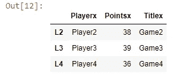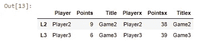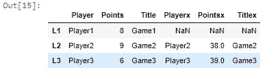

```
df3.join(df4,how ='inner')df3.join(df4,how='left')
```

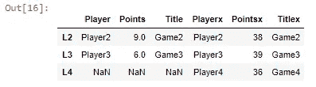

```
 df3.join(df4,how='right')
```

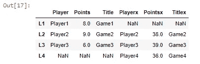

```
df3.join(df4,how='outer') 
```

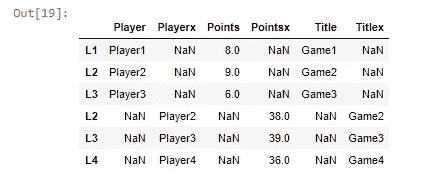

```
#how to concatenate dataframes in pandas
pd.concat([df3,df4], sort ='True')
```

## 导入和分析数据集

数据集:【https://www.dropbox.com/s/9zg3u3zqj3ct3zf/mtcars2.csv?dl=0 

将数据集导入熊猫数据框架

```
#import pandas library
import pandas as pd
#read dataset and store into a dataframe
cars=pd.read_csv("mtcars2.csv")
#print the dataframe
cars
```

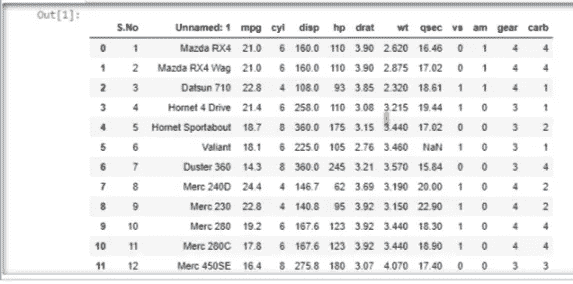

数据集分析

```
#check the type
type(cars)
o/p:
pandas.core.frame.DataFrame#view only the first five records
cars.head()#view only the first ten records
cars.head(10)#view only the last five records
cars.tail()#view only the last ten records
cars.tail(10)#view number of rows and columns in the dataframe
cars.shape
o/p: (32,13)#print a concise summary of the columns
cars.info(null_counts=True)
```

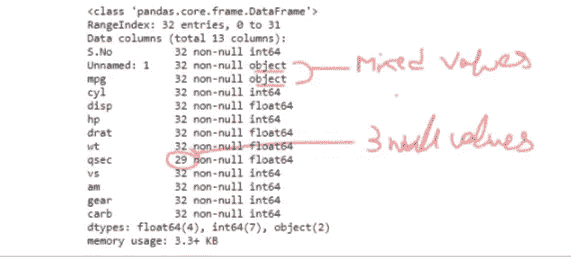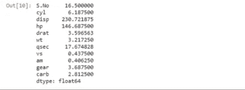

```
#mean
cars.mean()
```

列方面的其他统计度量

```
#median
cars.median()#standard deviation
cars.std()#maximum of each attribute
cars.max()#minimum of each attribute
cars.min()#number of non-null records in each column
cars.count()#descriptive statistics summary
cars.describe()
```

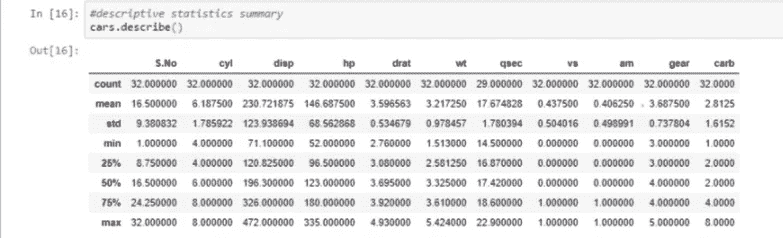

清洗数据集

```
#rename column (1)
cars=cars.rename(columns={'Unnamed: 1':'model'})
#cars#Fill the null values with mean of the column  (2)
cars.qsec=cars.qsec.fillna(cars.qsec.mean())
#cars#drop unwanted column - no value in analysis NaN(3)
cars = cars.drop(columns=['S.No'])
cars
```

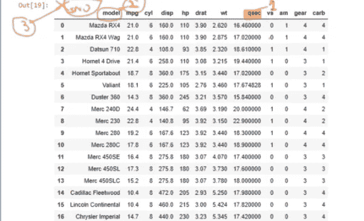

```
#find correlation matrix
df=cars[['mpg','cyl','disp','hp','drat','wt','qsec','vs','am','gear','carb']].corr()
#df#So change mpg from string to float to perform correlation
#see the change yellow highlights -difference compared to previous #info resultcars.mpg = cars.mpg.astype(float)
cars.info(null_counts=True)
```

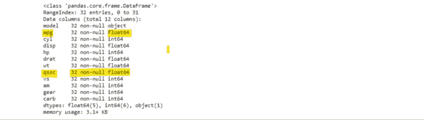

```
#Again find the correlation including mpg
df=cars[['mpg', 'cyl','disp','hp','drat','wt','qsec','vs','am','gear','carb']].corr()
df
```

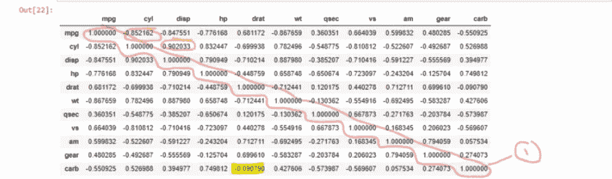

1-相同属性的最高相关性
2-mpg 与 cyl 的高度相关，即 mpg 增加 1 个单位将导致折叠减少 0.852+高度相关 is cyl 与 disp
3 -忽略几乎不相关的属性示例-黄色高亮显示 carb 与 drat

操纵

按位置索引

```
#view drat column only, Dont forget about [] brackets
cars.iloc[:,5] #first five records of hp column
cars.iloc[0:5,4]#all rows, all columns
cars.iloc[:,:]#for attributes from hp to carb see all the records from index 6
cars.iloc[6:,4:]
```

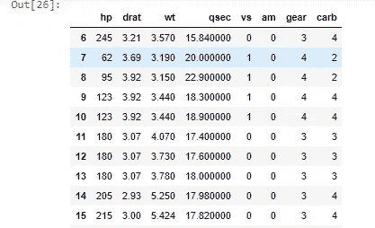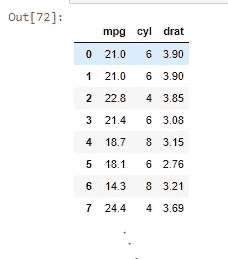

```
#Now we want to look at all the rows and only the first column
cars.iloc[:,1]
cars.iloc[:,lambda df: [1,2,5]]
# alternatively - cars.iloc[:,[1,2,5]]
```

使用列标签 loc 可以进行类似操作

```
#see all the record of mpg column
cars.loc[:,"mpg"]#display the records from index 0 to index 6 from mpg column
cars.loc[:6,"mpg"]#see the first 7 records from mpg to qsec column
cars.loc[:6,"mpg":"qsec"]
```

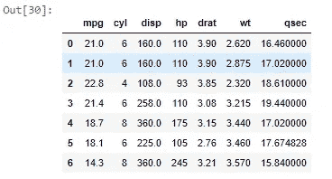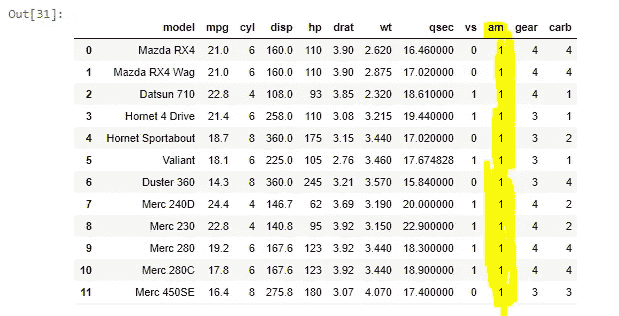

```
#set value 1 to column 'am'
cars['am'] = 1
cars
```

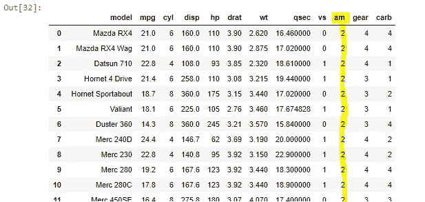

```
 #double up records in 'am' using lambda fxn
f = lambda x: x*2
cars['am']= cars['am'].apply(f)
cars
```

文档:

 [## 熊猫。DataFrame.iloc - pandas 0.25.1 文档

### 完全基于整数位置的索引，用于按位置选择。主要基于整数位置(从到的…

pandas.pydata.org](https://pandas.pydata.org/pandas-docs/stable/reference/api/pandas.DataFrame.iloc.html) 

整理

```
#sort cyl in descending order
cars.sort_values(by='cyl', ascending=False)
```

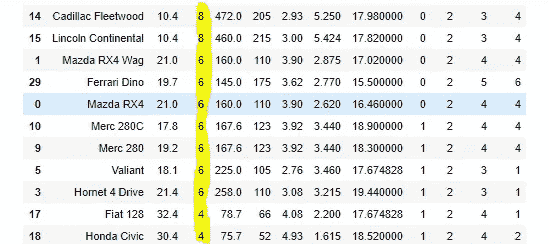

过滤

```
#filter records with more than 6 cylinders
cars['cyl'] > 6
o/p:
0     False
1     False
2     False
3     False
4      True
5     False
6      True
7     False
8     False
9     False
10    False
...#filter records with more than 6 cylinders
filter1 = cars['cyl'] > 6
#apply filter to dataframe
filtered_new = cars[filter1]
#view filtered dataframe
filtered_new#filtering with multiple columns
filtered_new = cars[(cars['cyl'] > 6) & (cars['vs'] == 0)]
#view filtered dataframe
filtered_new
```

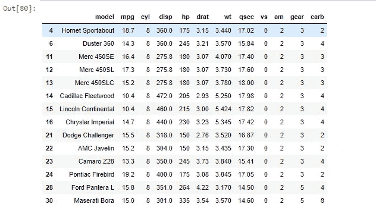

更多示例:

数据集:虹膜数据集

1.  加载 Iris 数据集，浏览数据集的前 5 行和后 5 行。还要找到行数和列数

```
import pandas as pd
iris =pd.read_csv('IRIS.csv')
print(iris.head(5))
print(iris.tail(5))
print(iris.shape)
```

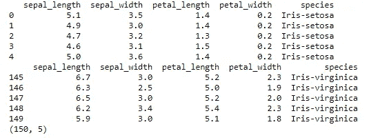

2.找出数据集的简单汇总统计数据

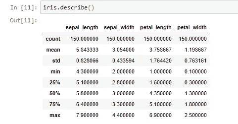

3.将 sepal_width 的列名更改为 sepWid，并查找花瓣长度和花瓣宽度之间的相关性

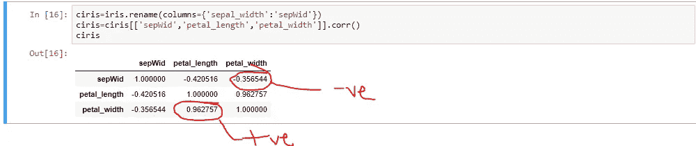

4.提取从 10 到 15 的所有行，列:花瓣长度和花瓣宽度

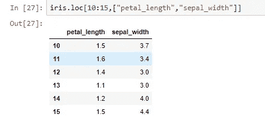

5.基于花瓣长度对数据集进行排序

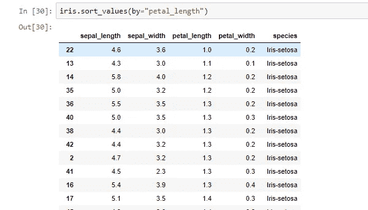