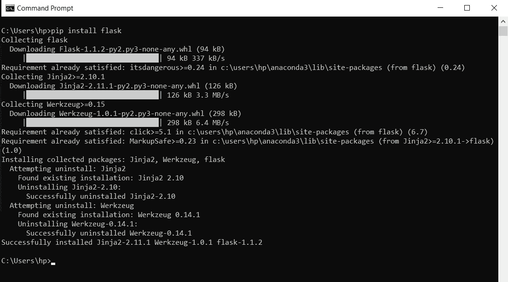
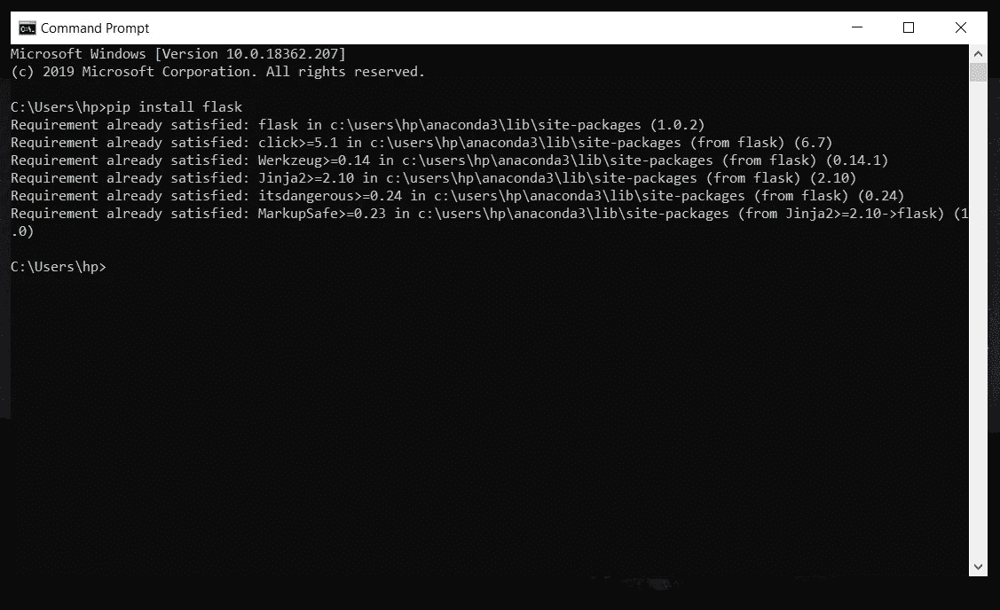

# Python 中的模块和 Pip

> 原文：<https://medium.com/analytics-vidhya/modules-pip-in-python-467918c639fc?source=collection_archive---------27----------------------->

> 有时，我们需要在我们的 python 程序中使用别人的代码，因为这将节省我们的大量时间，而且它是合法和免费的。因此，为了使用它，有时我们必须在我们的系统中安装一些模块/库。

# 模块/库:

> 这是一个包含几个函数、类等实现的文件。这些都是别人以最好的方式免费编写的。

## 模块类型:

python 中有两种类型的模块。

*   ***内置模块:***

内置模块是那些预先安装在 python 中的模块。使用前无需下载。它们自带 python 解释器。

示例:随机、操作系统等。

完整的内置模块列表可以在 这里找到 [***。***](https://docs.python.org/3/py-modindex.html)

*   ***外部模块:***

这些模块不是预先安装在 python 中的，在我们的 python 程序或项目中使用它们之前，我们需要下载它们。

例如:熊猫、熊猫等。

## 如何安装模块？

我们可以使用 Pip 在我们的系统中安装任何模块。

# PIP:

> Pip 是 python 中的**包管理器**，它帮助我们下载和安装 python 中的外部模块。
> 
> 也就是说，它是帮助我们从某处获得某物的东西。

## 在 python 中安装模块的步骤:

*   打开系统中的命令提示符(cmd)或 Powershell。
*   键入 pip 安装模块名称，然后按 enter 键。
*   然后模块将开始下载并自动安装在您的系统中。

*如果模块已经安装在您的系统中，您将收到消息，说明要求已经满足。*

> 在 python 中安装任何模块后，您可以将其导入到您的程序或 Python 项目中。

> 这就是 python 中模块和 Pip 的全部内容。

# 参考:

1.  [https://docs.python.org/3/py-modindex.html](https://docs.python.org/3/py-modindex.html)
2.  [https://realpython.com/what-is-pip/](https://realpython.com/what-is-pip/)