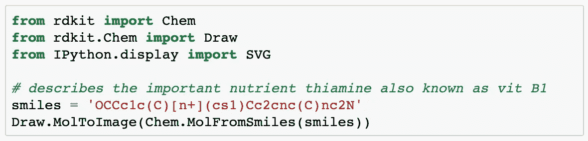
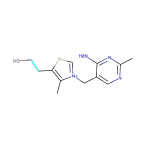
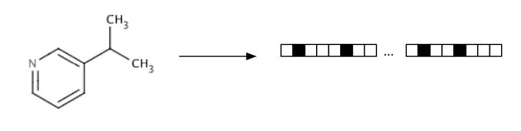
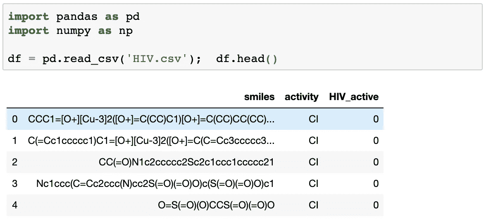
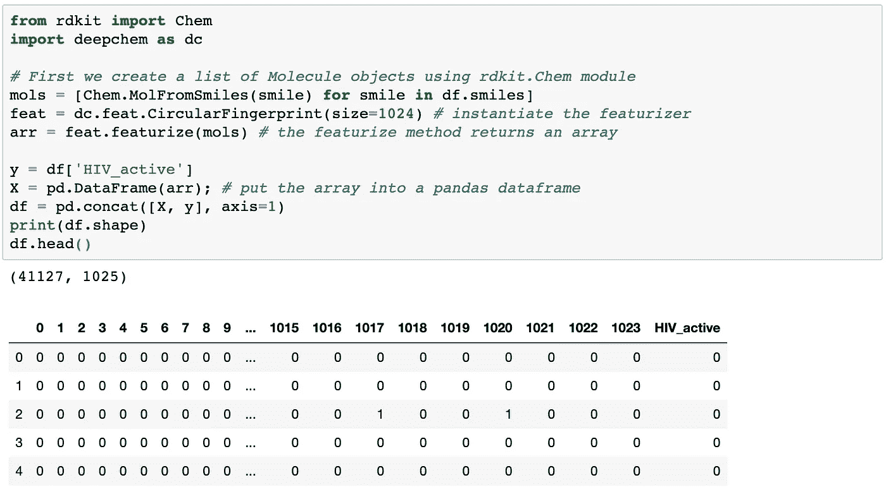
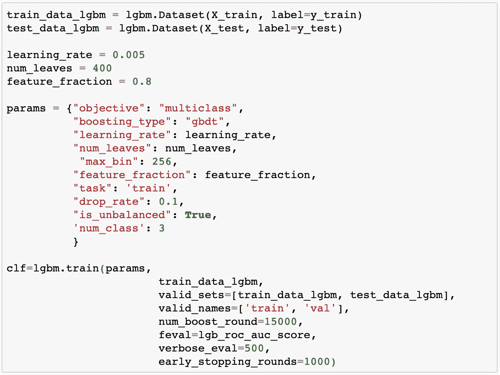
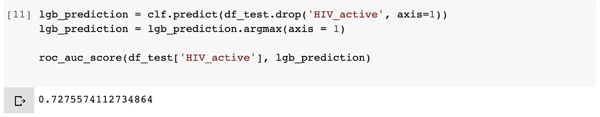
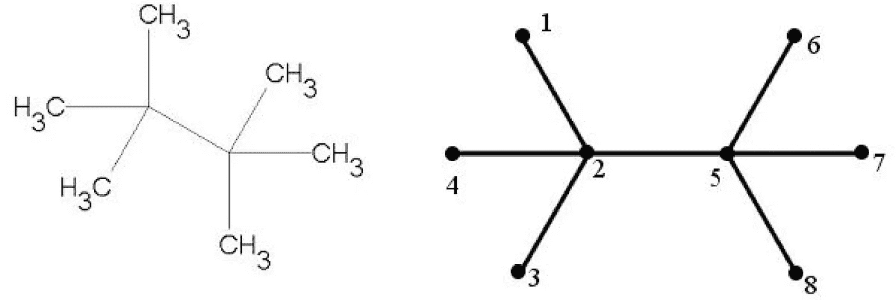
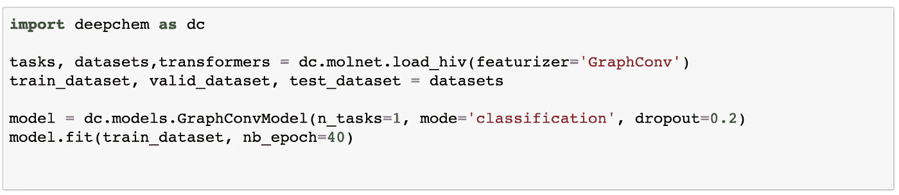
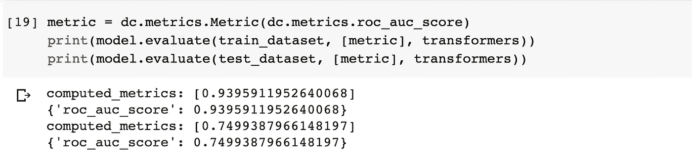

# 分子机器学习:建立预测分子性质的 ML 模型介绍。

> 原文：<https://medium.com/analytics-vidhya/molecular-machine-learning-introduction-to-building-ml-models-to-predict-molecular-properties-5918517e14ff?source=collection_archive---------13----------------------->

药物发现是一个昂贵而漫长的过程，充满了许多错误的线索和不成功的努力。制药业是世界上监管最严格的行业之一，政府实施了许多规则和法规来保护公众的健康和福祉。一种药物通过临床试验阶段的概率小于 12%，大多数药物由于安全原因而失败[1]。在美国，一种实验性药物从理论到实践平均需要 10-12 年，临床试验大约需要 6 年的时间。研究和开发每种成功药物的平均成本估计为 26 亿美元。这个数字包含了失败的成本——在 R&D 的早期阶段，可能会筛选和评估数千甚至数百万种化合物，但只有少数化合物最终获得批准[1]。因此，在简化药物开发流程方面，尤其是在药物进入临床试验之前的每一步，都有很大的改进空间。

幸运的是，制药和生物技术行业需要处理大量的数据，但实际上只有很小一部分数据经过处理，才能提供任何切实的结果。因此，有机会在药物发现的所有阶段应用机器学习方法，从药物靶标验证、生物活性预测、识别预后生物标志物等。[2].但是在我们可以将机器学习应用于分子之前，我们需要一种方法来以机器可以理解和使用的形式来表示它们。通常，当我们想到分子时，我们会想象用化学键相互连接的原子群。为了让机器处理分子数据，用线符号的形式表示它们是很重要的。这样的系统被称为**简化的分子输入行输入系统** **(笑)。**最初的 SMILES 规范始于 20 世纪 80 年代，它在使用短 ASCII 字符串描述化学物种的结构方面非常有用[3]。例如，字符串“OCC C1 C(C)[n+](CS1)cc 2 CNC(C)nc2N”代表重要的营养物质硫胺素，也称为维生素 B1 [4]。大多数化学数据库利用药物的微笑字符串符号。

我们不需要记住这些符号，因为大多数现代分子编辑器可以自动将微笑字符串转换为 2D 或分子的 3D 模型。使用最重要的开源化学信息学和机器学习工具包 RDKit [5]，它可以很容易地转换成 python。模块 rdkit.Chem 中包含绝大多数基本分子功能。以下代码显示了如何将硫胺素微笑字符串转换为 2D 分子表示。

即使微笑字符串允许我们根据字符串的序列来考虑分子，它仍然不是许多机器学习模型的正确格式。这是因为分子通常具有不同的原子数和不同的序列长度。许多 ML 模型要求输入长度相同。为了解决这个问题，我们必须将微笑字符串转化为固定长度的向量[4]。有很多方法可以做到这一点，但在这篇博客文章中，我们将重点关注两种方法，甚至对这两种方法进行最大似然预测，看看它们的表现如何。我们将使用来自 http://moleculenet.ai/datasets-1 的生物物理艾滋病数据集。MoleculeNet 管理多个公共数据集，建立评估指标，并提供多个先前提出的分子特征和学习算法的高质量开源实现。

# **扩展连接指纹:**

关于 ECFP，我不会说太多细节，因为有一篇很好的博文描述了不同种类的分子指纹，更多细节请查看[6]。基本上，扩展连接指纹(ECFP)是 1 和 0 的向量，代表分子中特定特征的存在或不存在。他们提取分子的特征，将它们散列，并使用散列来确定应该设置为向量的位[7]。这有助于结合分子的几个有用的特征，并把任意大小的分子转换成固定长度的向量[4]，以备在 ML 模型中使用。

它们使得比较不同的模型变得容易，因为我们可以简单地获取两个分子的指纹并比较相应的元素。匹配的元素越多，分子就越相似。ECFP 的唯一缺点是，指纹编码了大量关于分子的信息，但有些信息会丢失。两个不同的分子可能有相同的指纹，给定一个指纹，不可能唯一地确定它来自哪个分子[4]。

我们可以通过在 MoleculeNet.ai 的数据集上应用指纹来看看指纹是如何工作的。你可以从以下链接下载数据集 [**艾滋病毒**](https://s3-us-west-1.amazonaws.com/deepchem.io/datasets/molnet_publish/hiv.zip) 。一旦我们解压缩文件，我们可以看看文件包含什么。

HIV 数据集由药物治疗计划(DTP)艾滋病抗病毒筛选引入，该筛选测试了超过 40，000 种化合物抑制 HIV 复制的能力。对筛查结果进行评估，并将其分为三类:确认不活跃(CI)、确认活跃(CA)和确认中度活跃(CM)。他们还为筛查结果提供了另一个带有二元标签的列:1(表示 CA/CM)和 0 (CI)。

我们现在来看看，当我们表演 ECFP 时，这些微笑线会发生什么变化。我们将需要一个新的库来做这件事，它叫做 deepchem，你可以在这里了解更多关于他们的信息[https://deepchem.io/](https://deepchem.io/)。当我们想要处理化学数据集时，这是一个非常有用的包，它基于 RDKit 工具包。我们可以如下描述数据集中的 SMILES 列。我们可以看到，我们最终得到了一个包含 1025 列的数据帧。这是因为在实例化 featurizer 模块时，我们将大小设置为 1024。

在特征化过程中，分子被分解成更小的环状亚结构。该亚结构包含一个中心原子，其相邻原子按距中心的距离分组[8]。在散列了所有的子结构之后，我们得到了一个固定长度的二进制指纹。据认为，这种二进制表示包含有关分子拓扑特征的信息，这使其能够应用于类似搜索和活性预测等任务[9]。

当我们查看在这个数据集上执行的测试的最新结果时，我们发现 Xgboost 表现最好，roc/auc 得分为 0.841[【http://moleculenet.ai/latest-results】T2]。在这篇博文中，我们将在我们的特色数据集上实现一个基本的 lightGBM 模型，以检查它与 Xgboost 相比表现如何。我们可以如下实现它:

当我们查看最终迭代的 roc_auc_score 时，我们发现得分为 0.73。对于一个没有进行脚手架拆分的基本版本，我认为这个模型做得很好。

对于博客文章的最后一部分，我们可以看看另一种特征化方法，它可以用于大多数基于图形的模型。我们将在 deepchem 中实现整个代码，看看在 deepchem 中构建一个简单的 DL 模型有多容易。

# **图形卷积:**

尽管 ECFP 在表征分子数据方面做得很好，但它在识别化合物的环状结构方面存在严重缺陷。这是因为分子本质上是图形，每个原子可以被看作节点，它们之间的键可以表示边。许多真正重要的问题通常以图的形式出现，如社会网络、知识图、蛋白质相互作用网络。然而，直到最近，很少有人关注试图重构神经网络体系结构以处理结构化图形。这导致了一些真正强大的图形卷积网络的创建，这些网络可以很容易地用它们的二维表示来表示节点的接近程度。如果你想了解更多关于图卷积网络的知识，你可以看看下面两篇博文[12，13]。

图片来自

图形卷积特征化为每个原子计算初始特征向量和邻居列表。该特征向量以包含相邻原子类型、杂化类型和价结构的列表的形式总结了原子的局部环境。该列表表示整个分子的连接性，可以通过基于图形的模型处理成一般的图形结构。Deepchem 包带有一个方便的模块来加载 MoleculeNet 数据集，在加载数据集时，我们可以指定我们希望在数据集上执行哪种特征化。我们可以用几行代码实现整个加载和建模[4]。

当我们计算最终指标时，我们看到我们的模型过度适合训练数据集，并且在测试数据集上的 roc/auc 得分为 0.74。仍有改进的余地。在该数据集上使用 GraphConv 的官方基准是 roc/auc 得分 0.79。考虑到这只是来自深度化学库的 GraphConv 模型的开箱即用实现，我们的分数还不算太差。如果我们真的想，我们可以改变一些参数，以确保我们达到基准性能。

# **参考文献:**

1.  [http://phr ma-docs . phr ma . org/sites/default/files/pdf/rd _ book _ 022307 . pdf](http://phrma-docs.phrma.org/sites/default/files/pdf/rd_brochure_022307.pdf)

2.Vamathevan，j .，Clark，d .，Czodrowski，P. *等*机器学习在药物发现和开发中的应用。*国家修订药物发现* **18，**463–477(2019)doi:10.1038/s 41573–019–0024

3.[https://en . Wikipedia . org/wiki/Simplified _ molecular-input _ line-entry _ system](https://en.wikipedia.org/wiki/Simplified_molecular-input_line-entry_system)

4.拉姆森达尔湾等。al (2019)生命科学的深度学习，奥赖利(2019 年 4 月 12 日)

5.[https://www.rdkit.org/docs/GettingStartedInPython.html](https://www.rdkit.org/docs/GettingStartedInPython.html)

6.[https://towards data science . com/a-practical-introduction-to-use-of-molecular-fingerprints-in-drug-discovery-7f 15021 be 2 b 1](https://towardsdatascience.com/a-practical-introduction-to-the-use-of-molecular-fingerprints-in-drug-discovery-7f15021be2b1)

7.【https://www.rdkit.org/UGM/2012/Landrum_RDKit_UGM. Fingerprints.Final.pptx.pdf

8.[https://depth-first . com/articles/2019/01/11/extended-connectivity-fingerprints/](https://depth-first.com/articles/2019/01/11/extended-connectivity-fingerprints/)

9.[https://pubs . RSC . org/en/content/article landing/2018/sc/c7sc 02664 a #！双摘要](https://pubs.rsc.org/en/content/articlelanding/2018/sc/c7sc02664a#!divAbstract)

10.胡萨玛尼，苏尼库玛。(2016).控制参数与辛烷异构体理化性质的相关性。应用数学和非线性科学。1.345–352.10.21042/AMNS

11.基普夫，托马斯&韦林，马克斯。(2016).基于图卷积网络的半监督分类。

12.[https://towards data science . com/how-to-do-deep-learning-on-graphs-with-graph-卷积网络-7d2250723780](https://towardsdatascience.com/how-to-do-deep-learning-on-graphs-with-graph-convolutional-networks-7d2250723780)

13.

 [## 图卷积网络有多强大？

### 许多重要的现实世界数据集以图表或网络的形式出现:社会网络、知识图表…

tkipf.github.io](https://tkipf.github.io/graph-convolutional-networks/)