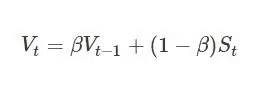

# 动量:一种简单而有效的优化技术

> 原文：<https://medium.com/analytics-vidhya/momentum-a-simple-yet-efficient-optimizing-technique-ef76834e4423?source=collection_archive---------0----------------------->

**先决条件:**对神经网络和损失函数的基本了解

## 介绍

在当今世界，一个飞速发展的世界***(记住这个词，将来会派上用场)*你肯定想了解最新的活动，无论是体育、新闻、科技、音乐等等。然而，如果没有使其成为可能的基本组件，目前的技术仍然无法发挥作用。没有晶体管的智能手机..呃？**

**可以对在相当多的先进深度学习模型中使用的最流行的优化技术之一进行类似的类比。在我们深入研究动量之前，我们将简要地看一下其他几个主题，在我们研究动量之前，你需要了解这些主题。**

## **1.梯度下降**

****

**均方误差的损失函数**

**假设我们有一个由 **n** 个训练示例组成的训练数据集和一个必须训练的给定模型。让我们假设一个损失函数 L，它有参数 y 和带帽子的 y。上面的图像中给出了损失函数的示例，其中均方误差用作损失函数。y 是假设函数 *h(W)* 的结果，代表训练数据集的实际标签，带有帽子的 y 代表我们在数据集上训练时从模型获得的输出。**

> ****损失函数几乎是学习模型的基础。在统计学中，典型的损失函数用于** [**参数估计**](https://en.wikipedia.org/wiki/Parameter_estimation) **，所讨论的事件是某个数据实例的估计值与真实值之差的函数。****

**训练模型通常从将模型的权重(参数)设置为一些随机初始值开始。随着迭代的进行，权重被更新和优化，以最小化损失。任何第 j 个参数的梯度下降公式如下:**

****

**α 表示梯度下降算法的学习率。它是用来控制我们在每次迭代中走多远。这是训练神经网络时需要调整的最重要的超参数。**

**损失函数相对于相应的权重进行微分，以便获得损失函数相对于该权重的梯度值。这允许我们在最佳方向上更新权重。**

**图像中 **m** 的值可以是 1，这种情况称为随机梯度下降(更新每个训练样本上的权值)或者任意数 **> 1 且≤n** ，这种情况称为批量梯度下降(每组 m 个训练样本训练一次权值)。**

## **2.简单移动平均线**

**如果我们有一个序列 **V** 有 **n** 个元素，那么简单移动平均定义为:**

****

## **3.指数移动平均线**

**现在让我们取另一个序列 **S** 与 **n** 元素。指数移动平均线将新序列 **V** 定义为:**

****

**V —新序列。S —原始序列。**

**这里β被称为**平滑常数**。这是新序列的术语的结果:**

****

**解决更多的问题，**

****

**从这个等式中我们看到，新序列的第*个*号的值依赖于所有先前的值 *1..来自 S 的所有值都被赋予一定的权重。这个权重是β乘以 s 的第*(t-I)*个值的 *i* 的幂乘以 *(1-* β *)* ，因为β小于 1，所以当我们取β的某个正数的幂时，它会变得更小。因此 S 的**旧值得到小得多的权重**，因此**对 v 的当前点的总体值贡献较少**，S 的**最近值得到较高权重**并且**对 v 的当前值贡献较多**。***

## **4.动力**

**我们已经定义了一种方法来获得一些序列的“移动”平均值，它随着数据一起变化。我们如何将此应用于训练神经网络？**

**他们可以对我们的梯度值进行平均。让我来解释一下动量是如何工作的以及为什么会工作。**

**因此，梯度下降并不能准确地为我们提供损失函数的方向，即损失函数的导数。因此，我们可能不会总是朝着最佳方向前进。这主要是因为损失函数的早期导数在更新权重的后期阶段充当噪声。这导致训练和收敛缓慢。**

**动量技术帮助我们解决了收敛速度慢的问题。考虑这样一种情况，在丘陵地带的一个球试图到达最深的山谷。如果山坡在某个阶段非常陡峭，那么球就会获得很大的动量，并且能够以自己的方式通过小山坡。随着坡度的减小，球的动量和速度也减小，最终停在山谷的最深处。**

> **指数级！记得名字吗？？**

**动量技术通过引入表示速度的新变量 *V* 和摩擦系数/平滑常数β来修改梯度下降法，这有助于控制 *V* 的值，避免过冲最小值，同时允许更快的收敛。**

**回想一下我们之前讨论的指数移动平均线方程。我们可以将该方程与梯度下降更新步骤一起应用，以获得以下动量更新规则:**

****

**另一种方法是忽略(1- β)项，这种方法不太直观。**

********

**这与第一对等式基本相同，唯一的区别在于需要用 *(* 1- β *)* 因子来衡量学习率。**

**动量与梯度下降一起工作有两个主要原因:**

1.  **指数移动平均法有助于我们更加重视损失函数导数的最新值，并为我们提供比噪声计算更接近实际导数的更好估计。**
2.  **有时，损失函数往往具有这样的结构**

****

**病理曲线:图像来源:[https://bit.ly/2NkbnF9](https://bit.ly/2NkbnF9)**

**蓝色区域代表一个类似峡谷的结构。**

> **峡谷是一个表面在一个维度上比在另一个维度上弯曲得更陡的区域。在深度学习中，峡谷在局部最小值附近很常见，梯度下降很难引导它们。**

**如果在任何迭代中我们进入这个峡谷区域，损失函数可能会像下面一样不断地从峡谷壁上反弹。下面的这个区域被称为*病理弯曲*。**

****

**有些人可能会说，“为什么你不降低学习速度呢？”**

**嗯，当您接近最小值时，这是有意义的，但是想想这样一个情况，您处于病理曲率中，要达到最小值，您还有很长的距离要走。这是一些动力有所帮助的地方。**

****

**当梯度下降到达峡谷中段的某个点时，动量技术有助于识别最近的导数，从而以这种方式增强梯度下降的方向。在上图中，注意到每个梯度更新已经被分解为沿 *w1* 和 *w2* 方向的分量。如果我们将这些向量单独求和，它们沿 *w1* 方向的分量抵消，而沿 *w2* 方向的分量增强。在一次更新中，这被认为是 *w2* 的方向被增强，而 *w1* 分量被置零，导致更快地向最小值移动。**

**在实践中，动量的值通常初始化在 0.5 左右，然后慢慢退火到 0.9，并更接近于 0.9。我也将张贴关于动量的实际模拟的文章。**

## **结论**

**动量背后的基本思想是通过在相关和最佳方向上加速梯度下降来减少收敛时间。这种技术用于各种类型的深度神经网络模型，其中必须减少噪声数据。要了解更多详细的数学知识，我建议你参考下面的文章**

** [## 为什么动量真的有效

### 这里有一个关于动量的流行故事:梯度下降是一个人走下山坡。他沿着最陡的路径…

蒸馏. pub](https://distill.pub/2017/momentum/) 

## 文章参考文献

[1][https://towards data science . com/random-gradient-descent-with-momentum-a 84097641 a 5d](https://towardsdatascience.com/stochastic-gradient-descent-with-momentum-a84097641a5d)

[2][https://blog . paper space . com/intro-to-optimization-momentum-rms prop-Adam/](https://blog.paperspace.com/intro-to-optimization-momentum-rmsprop-adam/)**