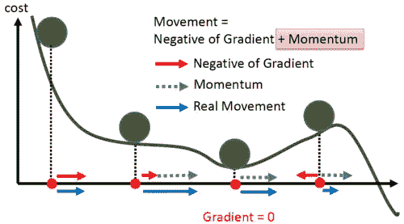

# 动量梯度下降、RMSprop 和 Adam 优化器

> 原文：<https://medium.com/analytics-vidhya/momentum-rmsprop-and-adam-optimizer-5769721b4b19?source=collection_archive---------3----------------------->

优化器是一种我们用来最小化损失或增加准确性的技术。我们通过寻找成本函数的局部最小值来做到这一点。

我们的参数更新如下:

当我们的成本函数本质上是凸的，只有一个最小值，这是它的全局最小值。我们可以简单地使用梯度下降优化技术，这将在超参数的一点调整后收敛到全局最小值。

但是在现实世界的问题中，成本函数有很多局部极小值。梯度下降技术在这里失败了，我们可能会陷入局部极小值而不是全局极小值。

因此，为了避免我们的模型陷入局部极小值，我们使用了梯度下降的高级版本，其中我们使用了动量。

想象一个球，我们从某个点开始，然后球向下坡或下降的方向运动。如果球具有足够的动量，那么球将从井或我们的成本函数图中的局部最小值中逃逸。

具有动量的梯度下降考虑过去的梯度以平滑更新。它计算梯度的指数加权平均值，然后使用该梯度更新权重。

假设我们的偏差参数为“b ”,权重为“w ”,因此当使用动量梯度下降时，我们的参数更新方程为:

# RMSprop 优化器:

下面是一个 2D 等高线图，用于可视化 RMSprop 算法的工作，实际上有更高的维度。

当我们处理大型数据集时，我们一次使用一批数据。由于它包含巨大的变化和噪声，梯度下降在其路径上产生巨大的振荡，并且需要长时间和更多的迭代来收敛。在 RMSprop 优化技术中，我们以这样的方式更新我们的参数，使得权重 w 方向上的移动大于‘b’方向上的移动。

这是梯度的指数平均值。我们假设 dw 小于 db，因此 dw 的指数平均值小于 db 的指数平均值。

因此，当我们将梯度除以它们各自的指数平均值的根时，“W”中的更新将比“b”中的更新更多，这允许我们在水平方向上采取更大的步骤并更快地收敛，这也减少了收敛到最优值的迭代次数。这就是该算法的名称“均方根传播”。

# Adam 优化器:

事实证明，当我们一起使用 momentum 和 RMSprop 时，我们最终会得到一个更好的优化算法，称为自适应动量估计。

这里，第一个方程考虑了我们在上面看到的动量，第二个方程来自 RMSprop 优化算法。我们还引入了一个新的超参数'**ε'**ε，它确保我们不会以除以非常小的指数平均值结束，默认情况下，超参数为:

必须调整学习率的值。

Adam 优化算法在深度学习的许多不同问题中表现非常好。

# 结论:

有许多优化器可供选择，了解它们的工作原理将有助于您为自己的应用选择一种优化技术。我希望这篇文章对您有所帮助；)

