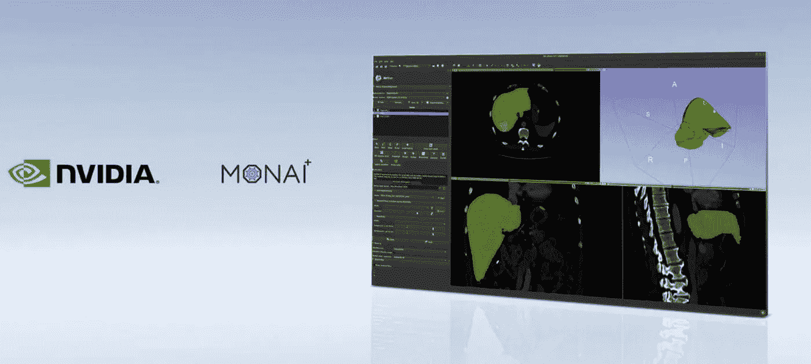
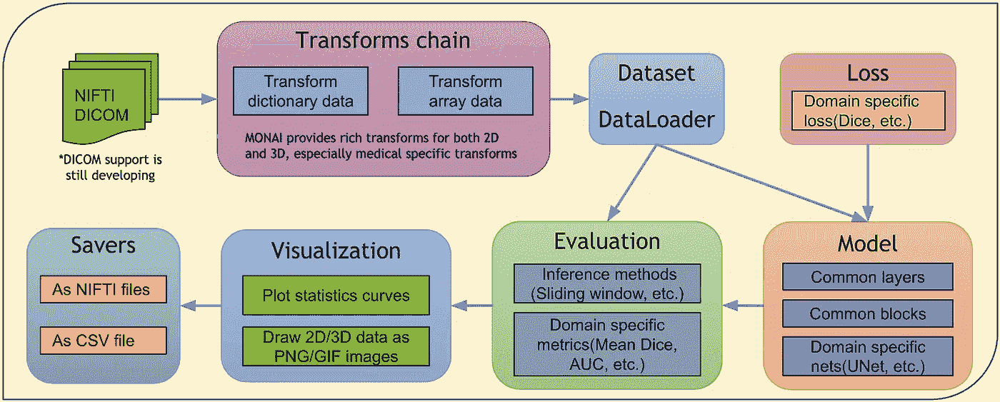
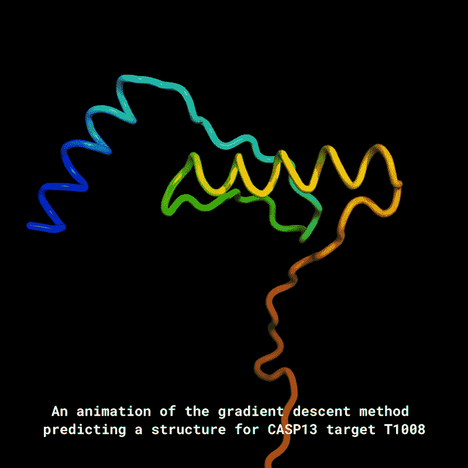
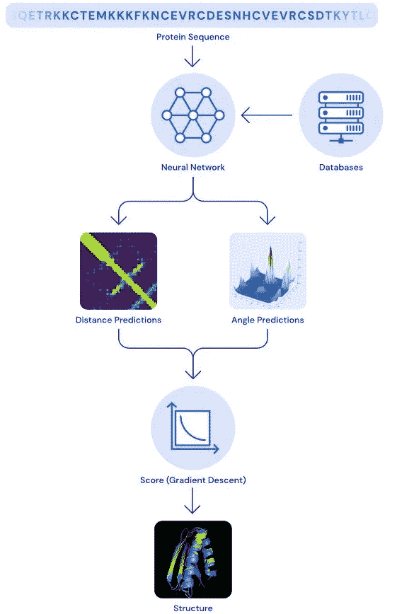

# 人工智能医学开放网络

> 原文：<https://medium.com/analytics-vidhya/monai-medical-open-network-for-ai-898fdc3ea635?source=collection_archive---------23----------------------->

[莫奈项目](https://monai.io/)

[MONAI](https://monai.io/) 框架是由 Project MONAI 创建的开源基础。MONAI 是一个免费的、社区支持的、基于 [PyTorch](https://pytorch.org/) 的框架，用于医疗成像领域的深度学习。它为在本地 PyTorch 范例中开发[医疗成像](https://en.wikipedia.org/wiki/Medical_imaging)培训工作流提供了领域优化的基础功能。

当疫情号穿越海洋、国家并以它的速度传播时。MONAI 开源框架为人工智能从业者带来了一线希望，该工具主要专注于医疗保健和医学图像数据。its 于 2020 年 4 月在新冠肺炎中部推出，现在已被医疗机构广泛接受，其数据处理能力、高性能培训工作流程和 SOTA(最先进)算法的可重复参考实施。

[MONAI 成像框架快速进入生产阶段| NVIDIA 博客](https://blogs.nvidia.com/blog/2020/11/30/monai-ai-imaging-framework/)

英伟达自己的医疗保健应用框架[【Clara】](https://developer.nvidia.com/clara)支持人工智能成像、基因组学以及智能传感器的开发和部署，已经与 MONAI 合作，并准备在英伟达 Clara 的即将发布中投入生产。

> MGH Athinoula a . Martinos 生物医学成像中心 QTIM 实验室主任 Jayashree Kalpathy-Cramer 博士表示:“MONAI 正在成为医疗保健的 PyTorch，为数据科学家和临床医生之间的更密切合作铺平了道路。"全球采用 MONAI 正在通过联合学习促进全球合作."

# M ONAI 特性:

*   多维医学成像数据的灵活预处理；
*   组合式可移植 API，便于集成到现有工作流程中；
*   针对网络、损耗、评估指标等的特定领域实施；
*   针对不同用户专业知识的可定制设计；
*   多 GPU 数据并行支持。

> ***医疗保健有多大的轶事&生命科学领域:***

*作为一门学科，从最广泛的意义上来说，医学影像学与***融合了* [*放射学*](https://en.wikipedia.org/wiki/Radiology) *，即采用 X 线* [*放射摄影术*](https://en.wikipedia.org/wiki/Radiography)*[*磁共振成像*](https://en.wikipedia.org/wiki/Magnetic_resonance_imaging)*[*超声*](https://en.wikipedia.org/wiki/Ultrasound) **[*热成像*](https://en.wikipedia.org/wiki/Thermography)*[*医学摄影*](https://en.wikipedia.org/wiki/Medical_photography)*[*核医学*](https://en.wikipedia.org/wiki/Nuclear_medicine) [*功能成像*](https://en.wikipedia.org/wiki/Functional_imaging) *技术********

# **体系结构**

**医疗保健和生命科学领域 MONAI 的端到端工作流**

****

**[end _ to _ end . png(3050×1226)(monai . io)](https://docs.monai.io/en/latest/_images/end_to_end.png)**

***现在我们已经了解了一些关于 MONAI 的信息，它的功能，架构和参考消息，它还有一个竞争对手* [***DeepMind 的人工智能系统 AlphaFold***](https://deepmind.com/research/case-studies/alphafold) *，它已经产生了一些显著的结果，如“解决了 50 年来确定蛋白质结构的重大挑战，也称为‘蛋白质折叠问题’*。**

****

**[https://deep mind . com/blog/article/alpha fold-Using-AI-for-scientific-discovery](https://deepmind.com/blog/article/AlphaFold-Using-AI-for-scientific-discovery)**

****

**架构示意图(AlphaFold)**

***所以，看看研发发生的绝对速度，我们都是许多生物技术公司发现疫苗的观众，如* [Moderna](https://en.wikipedia.org/wiki/Moderna) *、*Oxford—*阿斯利康、* Bharat Biotech *等。医疗领域已经采用了最全面的技术，我们肯定会在未来几年看到一些非凡的工作。***

**不断学习，保持好奇！！！**