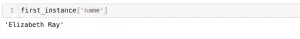

# Python 初学者教程中的 MongoDB(使用 PyMongo)

> 原文：<https://medium.com/analytics-vidhya/mongodb-in-python-tutorial-for-beginners-using-pymongo-4c43129721fd?source=collection_archive---------9----------------------->

# 概观

*   MongoDB 是一个数据科学家应该知道的流行的非结构化数据库。
*   我们将讨论如何使用 Python(和 PyMongo 库)处理 MongoDB 数据库。
*   我们将使用 Python 讲述 MongoDB 中的所有基本操作。

# 结构化数据库的挑战

我们现在正以前所未有的速度产生数据。这些数据的规模和大小令人难以置信！看看这些数字:

*   脸书仅在一天之内就产生了 4pb 的数据
*   **谷歌**每天产生 20 Pb 的数据
*   此外，**大型强子对撞机** (27 公里长的世界上最强大的粒子加速器)每秒产生 1pb 的数据。最重要的是，这些数据是非结构化的

您能想象使用 SQL 处理如此大量的数据吗？这是在给自己做噩梦！

作为一名数据科学家，SQL 是一门很好的学习语言，当我们处理结构化数据时，它确实工作得很好。但是，如果您的组织处理非结构化数据，SQL 数据库无法满足要求。

结构化数据库有两个主要缺点:

*   **可伸缩性:**随着数据库变大，很难伸缩
*   **弹性:**结构化数据库需要预定义格式的数据。如果数据不符合预定义的格式，关系数据库不会存储它

那么我们如何解决这个问题呢？如果不是 SQL，那是什么？

这是非结构化数据库的发展方向。在众多这样的数据库中，MongoDB 被广泛使用，因为它具有丰富的查询语言和快速访问索引等概念。简而言之，MongoDB 最适合管理大数据。让我们看看结构化和非结构化数据库之间的区别:

本文是使用 [Python](https://courses.analyticsvidhya.com/courses/introduction-to-data-science?utm_source=blog&utm_medium=mongodb-in-python-tutorial-for-beginners-using-pymongo) 入门 MongoDB 的终极指南。我们将借助示例和 PyMongo 库演示 MongoDB 上的各种操作。

# 目录

1.  什么是 MongoDB？
2.  理解问题陈述
3.  PyMongo 是什么？
4.  MongoDB 安装指南
5.  对 MongoDB 数据库的基本操作
6.  将提取的数据转换为结构化形式
7.  其他有用的功能
8.  下一步是什么？

# 1.什么是 MongoDB？

MongoDB 是一个非结构化数据库。它以文档的形式存储数据。MongoDB 能够非常高效地处理大量数据，并且是使用最广泛的 NoSQL 数据库，因为它提供了丰富的查询语言和灵活快速的数据访问。

在进入本教程的核心之前，让我们花点时间来理解 MongoDB 数据库的架构。

# MongoDB 数据库的体系结构

*   每个文档都是键值对的集合
*   每个键值对被称为一个 ***字段***
*   每个文档都有一个 ***_id*** 字段，唯一标识文档
*   文档也可以包含嵌套文档
*   文档可能有不同数量的字段(它们也可以是空白的)

与传统数据库不同，MongoDB 中数据一般存储在单个集合中，因此没有联接的概念(除了 ***$lookup*** 运算符，它执行***left-outer-join***like 操作)。MongoDB 拥有嵌套的文档。

# 2.理解问题陈述

让我们来理解我们将在本教程中解决的问题。这将让您很好地了解可以选择哪些项目来进一步磨练您的 MongoDB Python 技能。

假设您正在为一个向客户提供应用程序的银行系统工作。这个应用程序将数据发送到您的 MongoDB 数据库。这些数据存储在三个集合中:

*   ***账户*** 集合包含所有账户的信息
*   ***客户*** 集合包含关于客户的信息
*   最后， ***交易*** 集合包含客户交易数据

我从全球云数据库服务 [MongoDB Atlas](https://docs.atlas.mongodb.com/sample-data/available-sample-datasets/) 中获取了本教程的样本数据库。我们将使用***【sample _ analytics】***数据库来处理这个问题陈述。该数据库包含与金融服务相关的数据。

# 3.PyMongo 是什么？

> PyMongo 是一个 Python 库，它使我们能够与 MongoDB 连接。它允许我们在 MongoDB 数据库上执行基本操作。

那么，[为什么是 Python](https://courses.analyticsvidhya.com/courses/introduction-to-data-science) ？这是一个合理的问题。

我们选择 Python 与 MongoDB 交互，因为它是最常用的语言之一，也是数据科学领域最强大的语言之一。PyMongo 允许我们用类似字典的语法检索数据。

我们还可以使用点符号来访问 MongoDB 数据。它简单的语法让我们的工作变得容易多了。此外，PyMongo 丰富的文档总是助一臂之力。我们将使用这个库来访问 MongoDB。

# 4.MongoDB 安装指南

MongoDB 可用于 Linux、Windows 和 Mac OS X 操作系统。

如果您是 Linux 用户，请按照本视频中的说明进行操作:

Mac 用户可以看这个视频安装 MongoDB:

如果您想在 Windows 操作系统上安装 MongoDB，请参考此视频:

一旦你安装了数据库，你需要启动 ***mongod*** 服务。如果你在安装过程中有任何问题，请在这篇文章下面的评论区联系我。

# 5.对 MongoDB 数据库的基本操作

是时候启动您的 Python 笔记本并开始编码了！我们对 MongoDB 有一个很好的概念——让我们将这些知识付诸实践。

我们将使用 PyMongo 库在 Python 中的 MongoDB 数据库上执行一些关键的基本操作。

# 5.1 连接到数据库

为了从 MongoDB 数据库中检索数据，我们将首先连接到它。在 Jupyter 单元中编写并执行以下代码，以便连接到 MongoDB:

让我们看看可用的数据库:

我们将使用 ***sample_analytics*** 数据库来实现我们的目的。让我们将光标设置到同一个数据库:

***list _ collection _ names***命令显示所有可用收藏的名称:

让我们看看我们有多少顾客。我们将连接到 ***客户*** 集合，然后打印该集合中可用的文档数量:

**输出:500**

在这里，我们可以看到我们有 500 个客户的数据。接下来，我们将从这个表中获取一个 MongoDB 文档，并查看那里有什么信息。

# 5.2 检索/获取数据

我们可以使用类似字典的符号或 PyMongo 中的点运算符来查询 MongoDB。在上一节中，我们使用了点操作符来访问 MongoDB 数据库。在这里，我们还将看到一个类似字典的语法演示。

首先，让我们从 MongoDB 集合中获取一个文档。为此我们将使用 ***find_one*** 函数:

我们可以看到函数返回了一个字典。让我们看看这本词典的检索表，然后我会解释每个检索表的用途。

我们可以看到一些键是不言自明的。让我解释一下每个键存储的内容:

*   ***账户:*** 存储给定用户持有的所有账户列表。一个用户可以有多个帐户
*   ***teir _ and _ details:****所属类别(白银、黄金等。)存储在此参数中。此字段还存储他们有权享受的福利*

*现在，让我们看一个 MongoDB 的字典式访问的例子。让我们从 MongoDB 文档中获取客户的名称:*

**

*我们还可以使用 ***查找*** 功能来获取文档。 ***find_one*** 一次只取一个文档。另一方面， ***find*** 可以从 MongoDB 集合中获取多个文档:*

# *5.3 插入功能*

****insert_one*** 函数可以用来在 MongoDB 中一次插入一个文档。我们将首先创建一个字典，然后将其插入到 MongoDB 数据库中:*

***输出:** qwertyui123456*

> **MongoDB 是一个非结构化的数据库，因此集合中的所有文档不必遵循相同的结构。**

*例如，我们在上面的例子中插入的字典不包含我们在前面获取的 MongoDB 文档中看到的一些字段。*

****。如果字典中没有提供，inserted_id*** 提供默认分配的 ***_id*** 字段。在我们的例子中，我们已经明确地提供了这个字段。最后，操作返回插入的 MongoDB 文档的 ***_id*** 。它存储在上述情况下的 ***post_id*** 变量中。*

*到目前为止，我们只能在 MongoDB 集合中插入一个文档。如果我们必须一次插入成千上万个文档，我们该怎么办？会循环运行 ***insert_one*** 吗？一点也不！*

*我们有 ***insert_many*** 功能为此:*

**

*我们已经导入了 *datetime* 库，因为 Python 中没有内置的日期和时间数据类型。这个库将帮助我们分配日期时间类型的值。在上面的例子中，我们在 MongoDB 数据库中插入了一个字典列表。每个元素都作为独立的文档插入到 MongoDB 集合中。*

# *5.4 过滤条件*

*之前我们已经向 MongoDB 集合中插入了一个文档，其 ***名称*** 字段为 Gyan。让我们看看如何使用过滤条件获取 MongoDB 文档:*

**

*如果我们对 ***_id*** 字段应用过滤条件，将不会返回任何内容，因为它们的数据类型是 ***ObjectId*** 。这不是内置的数据类型。我们需要将字符串值转换为***ObjectId****类型，以在 ***_id*** 上应用过滤条件。首先，我们将定义一个函数来转换字符串值，然后我们将获取 MongoDB 文档:**

****

# **5.5 删除**

****

**我们现在将删除这个 MongoDB 文档:**

****

**让我们试着在删除后取回这个文档。如果这个文档在我们的 MongoDB 集合中不可用，那么 ***find_one*** 函数将返回 nothing。**

****输出:** *不返回任何内容。***

**由于我们没有得到任何回报，这意味着 MongoDB 文档不再存在。**

**我们看到 ***insert_many*** 函数用于在 MongoDB 集合中插入多个文档， ***delete_many*** 用于一次删除多个文档。让我们尝试通过 ***name*** 字段删除两个 MongoDB 文档:**

**这里，deleted count 存储了操作过程中删除的 MongoDB 文档的数量。 ***'$in'*** 是 MongoDB 中的一个操作符。**

# **5.6 创建数据库和集合**

**在 MongoDB 中，创建任何数据库和集合都是一个非常简单的过程。您可以使用检索的语法来做到这一点。如果你试图访问一个不存在的数据库，MongoDB 会为你创建一个。**

**让我们创建一个数据库和一个集合:**

**这里已经创建了 MongoDB 数据库，但是如果我们运行 ***list_database_names，*** 这个数据库将不会被列出。MongoDB 不显示空数据库。因此，我们必须在那里插入一些东西。让我们在 MongoDB 集合中插入一个文档:**

****

**现在我们可以看到我们的数据库在 MongoDB 数据库列表中可用。**

# **6.将非结构化数据转换为结构化形式**

**作为一名数据科学家，你不仅需要获取数据，还需要分析数据。以结构化形式存储数据简化了这项任务。在这一节中，我们将学习如何将从 MongoDB 获取的数据转换成结构化格式。**

# **6.1 存储到数据帧中**

**find 函数从 MongoDB 集合中返回一个字典。您可以直接将其插入数据帧。首先，让我们获取 100 个 MongoDB 文档，然后我们将这些文档存储到一个数据帧中:**

****

**这个数据帧的可读性远远好于函数返回的默认格式。**

# **6.2 写入文件**

**[熊猫数据帧](https://courses.analyticsvidhya.com/courses/pandas-for-data-analysis-in-python)可以直接导出为 CSV、Excel 或 SQL。让我们尝试将这些数据存储到一个 CSV 文件中:**

**同样，您可以使用 ***to_sql*** 函数将数据导出到 sql 数据库中。**

# **7.一些其他有用的 MongoDB 函数**

**您已经积累了足够的知识，可以开始使用 MongoDB 了！到目前为止，我们已经用例子讨论了所有的基本操作。我们也了解了 MongoDB 的几个理论概念。**

**在我结束这篇文章之前，让我分享 PyMongo 的几个有用的功能:**

*   *****排序:*** 我们已经看到了这个函数的例子。此功能的目的是对文档进行排序**
*   *****限制:*** 该函数限制 find 函数获取的 MongoDB 文档的数量**

**您可以在这里查看更多 MongoDB 函数。**

# **8.下一步是什么？**

**一旦您掌握了我们在本教程中介绍的概念，您应该学习与 MongoDB 相关的更高级的主题。让我来定义一些高级主题:**

*   *****索引:*** 索引是在 MongoDB 中对集合的某个属性(字段)创建一个的过程。这使得检索过程更快。在没有索引的集合中，当您试图根据字段上的给定条件过滤出特定文档时，它将扫描整个数据库。如果有数以亿计的文档，这个过程需要时间。索引后，MongoDB 使用大量内存来存储索引信息。该索引允许您根据过滤条件跳转到特定的文档，而无需扫描整个数据库**
*   *****分片:*** 跨多台机器存储数据的过程称为分片。分片有助于数据库的水平扩展**
*   *****运算符:*** 我们已经在 MongoDB 中看到了 ***$in*** 运算符。还有其他几个有用的运算符，它们执行一些特定的功能**

# **结束注释**

**在本文中，我们学习了 MongoDB 的所有基本概念。这足以让您在非结构化数据库方面有一个坚实的开端。**

**我鼓励你自己尝试，并在评论区分享你的经验。此外，如果你对以上任何一个概念有任何问题，欢迎在下面的评论中问我。**

**感谢阅读，继续学习！**

**你也可以在分析 Vidhya 的 Android 应用上阅读这篇文章**

****

***原载于 2020 年 2 月 20 日 https://www.analyticsvidhya.com***。****