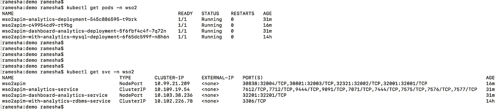
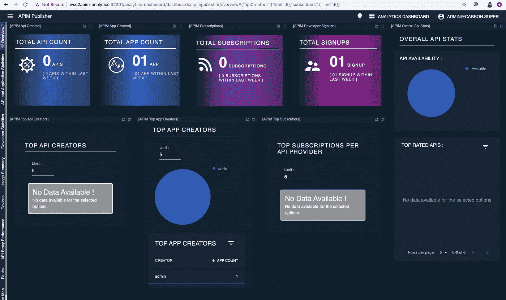
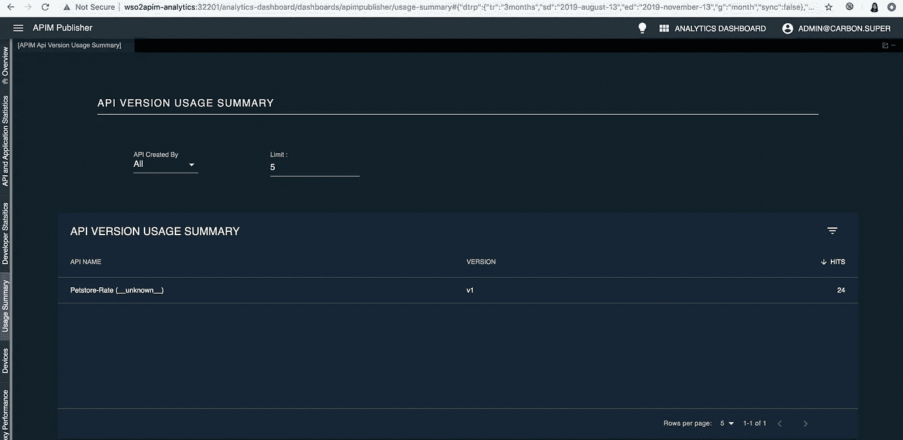

# 在 Kubernetes 中监控你的微服务的统计数据

> 原文：<https://medium.com/analytics-vidhya/monitor-the-statistics-of-your-micro-service-in-kubernetes-f649f8960b0a?source=collection_archive---------20----------------------->


Kubernetes 正在成为微服务和集装箱化技术领域的趋势。在这篇博客中，我们将了解如何使用 Kubernetes 的 API 操作器、WSO2 API Manager 和 WSO2 API Manager Analytics 来监控和可视化您在 Kubernetes 中的微服务的统计数据。

API Operator 使得在 Kubernetes 中将微服务作为托管 API 进行管理成为一项简单的任务，并且拥有最佳的架构和技术。它还提供了与 API Portal 和 API Dashboard 集成以实现可视化的能力，这为您在 Kubernetes 中的部署增加了额外的价值。

# 先决条件

1.  [库贝克特尔](https://kubernetes.io/docs/tasks/tools/install-kubectl/)
2.  [Kubernetes v1.12 或以上](https://kubernetes.io/docs/setup/)
3.  DockerHub 或私有 docker 注册表中的帐户
4.  Kubernetes 的 API 操作员。下载 [api-k8s-crds-1.0.0.zip](https://github.com/wso2/k8s-apim-operator/releases/download/v1.0.0/api-k8s-crds-1.0.0.zip) 并解压
5.  从[https://github.com/wso2/product-apim-tooling/releases/](https://github.com/wso2/product-apim-tooling/releases/)下载适用于您的操作系统的 API 控制器 3.0.0 版

## 步骤 1:部署 API 操作符

1.  导航到先决条件 4 中解压缩的 zip 中的 *api-k8s-crds-1.0.0* 目录
2.  部署与 API 操作符相关的工件

```
kubectl apply -f apim-operator/controller-artifacts/
```

3.Kubernetes 的 API 操作符通过将托管 API 映像推送到 DockerHub，使它可以在另一个集群中重用。您可以按如下方式输入 DockerHub 信息，并部署控制器配置。

*   打开 apim-operator/controller-configs/controller _ conf . YAML，更新*用户的 docker 注册表*。

```
dockerRegistry: <username-docker-registry>
```

*   打开 apim-operator/controller-configs/Docker _ secret _ template . YAML .
    输入 Docker-Hub 账户的 base 64 编码用户名和密码

```
data:
 username: ENTER YOUR BASE64 ENCODED USERNAME
 password: ENTER YOUR BASE64 ENCODED PASSWORD
```

*   执行以下命令来部署控制器配置。

```
kubectl apply -f apim-operator/controller-configs/
```

4.部署与分析相关的工件。这将部署与分析相关的配置以及默认证书。

```
kubectl apply -f apim-operator/apim-analytics-configs/
```

注意:如果要禁用特定 API 的分析，可以将*apim-analytics-configs/apim _ analytics _ conf . YAML*中数据下的 **analyticsEnabled** 属性更改为 false。

5.配置 [API 控制器](https://wso2.com/api-management/tooling/)，这是一个综合的命令行工具，用于处理与 API 操作符相关的操作。

*   提取 API 控制器发行版，并使用命令行工具在提取的文件夹中导航
*   将提取的文件夹的位置添加到系统的 PATH 变量中，以便能够从任何地方访问可执行文件。
*   将 API 控制器的模式设置为 Kubernetes

```
apictl set --mode k8s
```

## 步骤 2:部署 API 门户和分析仪表板

我们将使用 [WSO2 API Manager 3.0.0](https://wso2.com/api-management/) 作为 API 门户，API Manager Analytics 3.0.0 作为分析仪表板，以监控和可视化 Kubernetes 中微服务的统计数据。

*   导航到我们在先决条件 4 中提取的 wso2am-k8s-crds-1.0.0 目录。
*   为资源创建命名空间

```
apictl apply -f k8s-artifacts/api-portal-with-analytics/wso2-namespace.yaml
```

*   WSO2 API 管理器和分析的几个数据库需要彼此共享，因此我们可以在 Kubernetes 中部署 mysql，并在 mysql 中配置必要的数据库，如下所示。

```
apictl apply -f k8s-artifacts/api-portal-with-analytics/mysql/
```

*   使用下面的命令将 API Manager Analytics 3.0.0 部署为 Kubernetes 中的分析仪表板。这将用于监控和可视化 kubernetes 中托管 API 的统计数据。

```
apictl apply -f k8s-artifacts/api-portal-with-analytics/api-analytics/
```

*   将 WSO2 API Manager 3.0.0 部署为 Kubernetes 中的 API 门户。这可用于生成访问令牌。

```
apictl apply -f k8s-artifacts/api-portal-with-analytics/api-portal/
```

您可以确认它们是否正确部署，如下图所示。



如何检查是否部署了 API 门户和仪表板

要访问 API 门户和仪表板，您必须将它们在/etc/hosts 中的主机名与 kubernetes 节点的 IP 进行映射，如下所示。如果使用 minikube，可以使用 minikube ip 如果使用 Docker for Mac，可以使用 localhost 如果使用 GKE，可以使用任何 kubernetes 节点。

```
<minikube IP>  wso2apim
<minikube IP>  wso2apim-analytics
```

您可以使用以下 URL 访问 API 门户和仪表板。

API 门户—[https://WSO 2 API:32001/dev Portal](https://wso2apim:32001/devportal)
API 分析仪表板—[https://WSO 2 API-Analytics:32201/Analytics-Dashboard](https://wso2apim-analytics:32201/analytics-dashboard)

## **步骤 3:将您的微服务部署为托管 API**

最后一步，让我们在 Kubernetes 中部署我们的托管 API。我这里使用的是样本 swagger 定义可用[](https://github.com/RameshaKaru/crd-demo/blob/master/swagger2.yaml)**。您可以通过“x-wso2-production-endpoints”扩展以同样的方式使用部署在 kubernetes 中的微服务的端点。**

```
apictl add api -n petstore-test --from-file=swagger2.yaml
```

**API 操作者将运行 kaniko 作业，用给定的 swagger 文件创建微网关的映像。由于启用了分析，它将使用给定的分析配置来改变微网关的配置，并将分析证书添加到微网关的客户端信任库。此外，它将在微网关上安装一个 EmptyDir 卷来临时存储分析数据。**

**API 服务需要一段时间才可用。在 API 服务可用之后，我们可以调用 API。**

```
TOKEN=eyJ0eXAiOiJKV1QiLCJhbGciOiJSUzI1NiIsIng1dCI6IlpqUm1ZVE13TlRKak9XVTVNbUl6TWpnek5ESTNZMkl5TW1JeVkyRXpNamRoWmpWaU1qYzBaZz09In0.eyJhdWQiOiJodHRwOlwvXC9vcmcud3NvMi5hcGltZ3RcL2dhdGV3YXkiLCJzdWIiOiJhZG1pbkBjYXJib24uc3VwZXIiLCJhcHBsaWNhdGlvbiI6eyJvd25lciI6ImFkbWluIiwidGllciI6IlVubGltaXRlZCIsIm5hbWUiOiJzYW1wbGUtY3JkLWFwcGxpY2F0aW9uIiwiaWQiOjMsInV1aWQiOm51bGx9LCJzY29wZSI6ImFtX2FwcGxpY2F0aW9uX3Njb3BlIGRlZmF1bHQiLCJpc3MiOiJodHRwczpcL1wvd3NvMmFwaW06MzIwMDFcL29hdXRoMlwvdG9rZW4iLCJ0aWVySW5mbyI6e30sImtleXR5cGUiOiJQUk9EVUNUSU9OIiwic3Vic2NyaWJlZEFQSXMiOltdLCJjb25zdW1lcktleSI6IjNGSWlUM1R3MWZvTGFqUTVsZjVVdHVTTWpsUWEiLCJleHAiOjM3MTk3Mzk4MjYsImlhdCI6MTU3MjI1NjE3OSwianRpIjoiZDI3N2VhZmUtNTZlOS00MTU2LTk3NzUtNDQwNzA3YzFlZWFhIn0.W0N9wmCuW3dxz5nTHAhKQ-CyjysR-fZSEvoS26N9XQ9IOIlacB4R5x9NgXNLLE-EjzR5Si8ou83mbt0NuTwoOdOQVkGqrkdenO11qscpBGCZ-Br4Gnawsn3Yw4a7FHNrfzYnS7BZ_zWHPCLO_JqPNRizkWGIkCxvAg8foP7L1T4AGQofGLodBMtA9-ckuRHjx3T_sFOVGAHXcMVwpdqS_90DeAoT4jLQ3darDqSoE773mAyDIRz6CAvNzzsWQug-i5lH5xVty2kmZKPobSIziAYes-LPuR-sp61EIjwiKxnUlSsxtDCttKYHGZcvKF12y7VF4AqlTYmtwYSGLkXXXw
```

**现在让我们用默认的 JWT 令牌调用 API，它允许所有用户。**

```
curl -X GET "https://<external IP of LB service>:9095/petstorerate/v1/pet/55" -H "accept: application/xml" -H "Authorization:Bearer $TOKEN" -k
```

**如果您使用 GKE 集群，您可以使用我们部署的托管 API 服务的外部 IP。如果您使用的是 minikube，您可以使用节点端口，该服务与 minikube IP 一起公开。**

**作为一个例子，你可以看到我在 minikube 中使用的以下命令。**

```
curl -X GET "https://192.168.99.121:32111/petstorerate/v1/pet/55?[1-4]" -H "accept: application/xml" -H "Authorization:Bearer $TOKEN" -k
```

**现在您可以访问[https://WSO 2 apim-analytics:32201/analytics-dashboard](https://wso2apim-analytics:32201/analytics-dashboard)并监控与您的微服务相关的统计数据。**

****

**API 仪表板**

****

**微服务的使用统计**

**希望你喜欢这个博客，你可以通过下面的博客找到如何将商业计划添加到你的微服务中。**

**[https://medium . com/@ ramesha . karu/apply-a-business-plan-for-your-micro-service-in-kubernetes-33 e 46 BF 33 f 15](/@ramesha.karu/apply-a-business-plan-for-your-micro-service-in-kubernetes-33e46bf33f15)**