# 利用控制图监测糖尿病治疗的有效性

> 原文：<https://medium.com/analytics-vidhya/monitoring-effectiveness-of-diabetic-treatment-using-contol-charts-c35d011349d7?source=collection_archive---------21----------------------->

如果你在研究生阶段上过统计学课，很可能你的老师会从中心极限定理(CLT)开始这门课。在我们开始之前，回顾一下 CLT:

不管总体的分布如何，样本均值的抽样分布是正态的，前提是样本是用替换随机抽取的，样本量足够大(n≥30)。

如果总体呈正态分布，则样本均值的抽样分布即使在样本量较低的情况下也呈正态分布。

随着样本量的增加，抽样分布的均值越来越接近真实均值(总体均值)。

样本均值的采样分布的标准偏差与样本大小成反比，即随着样本大小的增加，采样分布的标准偏差减小。

嗯，这是教科书式的。为了帮助更好地理解，让我们从 Kaggle 中选取一个数据集，尝试并复制结果。我们选择了一个糖尿病患者数据集，并假设如下:

a.选择的数据集是人口。

b.我们只关心糖尿病患者住院的天数。数据集中的所有其他字段/要素/特征与本文无关。

c.实际上无法获得所有患者的住院细节。

不多说了，让我们开始吧！

人口分布如下:

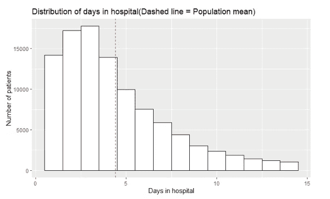

向右倾斜，意味着较少的病人花很多时间在医院里

总体平均值为 4.4 天，标准差为 2.99 天。

> 事实上，人们可能永远无法捕捉到人口数据。即使可以，也划算吗？

如果是这种情况，如何估计集中趋势(如均值)或扩散(如标准差)的度量？这就是中心极限定理派上用场的地方。在实施我们的项目之前，我们将逐点确认我们对 CLT 的理解。

**第一点:正态分布**

我们将从总体中随机抽取 1000 个样本，每个样本大小 n = 2，10，20，40。不同样本量的样本均值直方图如下:

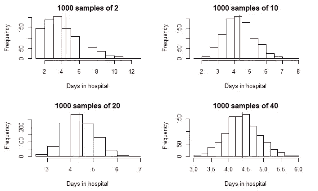

随着样本量从 2 增加到 40，样本均值呈现正态分布

可以注意到，在每种情况下，不同大小的样本的平均值(红色实线)接近 4.4 天(群体平均值)。随着样本量的增加，样本均值的分布发生了变化。从直方图中可以看出，当 n = 40 时，分布是正常的。检验正态性的另一种图形方法是 Quanlite-Quantile 图或 Q-Q 图。

当 n = 40 时，1000 个样本的 Q-Q 图为:

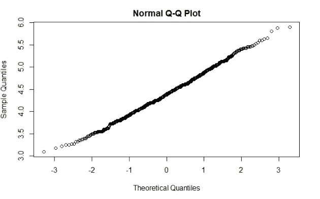

位于直线上的点表示分布是正态的

**第二点:估计平均值趋向于总体平均值**

既然我们知道样本均值的抽样分布是正态的，那么让我们检查一下估计的均值与总体相比表现如何:

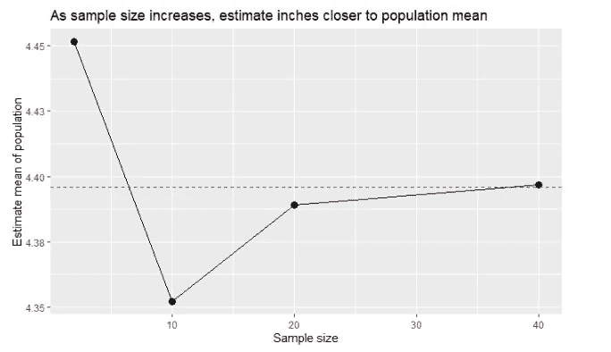

红色虚线是人口平均值，实际上可能不知道

**第三点:标准差与样本量成反比**

按照 CLT 的说法，标准偏差随着样本量的增加而减小，让我们来验证一下:

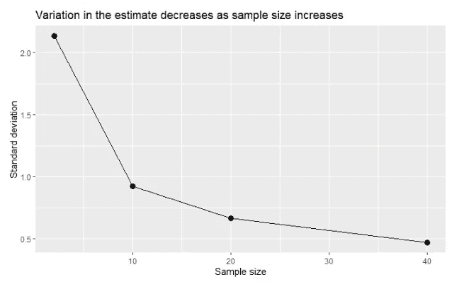

分布范围随着样本量的增加而减小

根据 CLT 的说法:

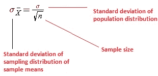

来源:维基百科

根据上面的等式，2.99 / Sqrt(40) = 0.47，这与我们已经获得的结果一致。

好，同意！我们以前都知道，我们可以用这些信息做什么。

**中心极限定理信息的应用:**

首先，如果人口分布呈正态分布，可以使用如下累积概率分布图:

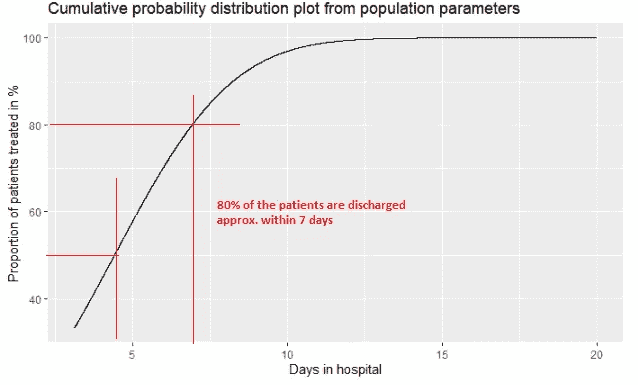

从上面的图中，还可以推断出几乎 100%的患者需要住院少于 12.5 天。

但是，我们知道总体不是正态分布的。那么，我们还有什么？我们可以监控病人住院的平均天数，以保持治疗质量。什么？怎么会？

**控制图**

控制图是一种有效的可视化工具，用于监控一致绩效所需的指标。在我们的案例中，病人住院的平均天数是对治疗效果的间接衡量。我们建立和使用它们的方法是建立一个无效假设和一个替代假设。

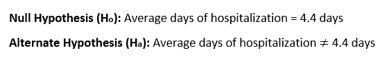

假设您是一名医疗管理员，手头的任务是确保平均住院时间保持在现有持续时间或减少(这将是理想的)。无论是住院天数大于还是小于 4.4 天，我们都必须保持警惕。必须努力纠正效率低下的现象，或者继续努力。控制图可以帮助您监控相同的情况。下面是你如何建立它们:

1.  随机抽取亚组样本(我们案例中的患者)。我们选择的样本量为 10，并为我们的研究抽取了 40 个样本(在本例中是从总体中抽取)。
2.  然后，我们将计算平均值和标准偏差，用控制极限绘制相同的图。
3.  控制限值可以由过程设定，也可以由客户或行业指定。在我们的例子中，我们将使用过程控制极限。
4.  将平均值和标准差相对于子组编号作图，以检查是否有任何模式或超出控制限值的点数。

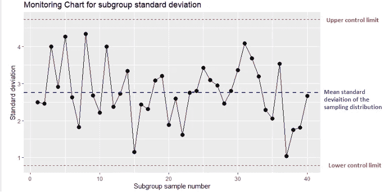

检查该图的不规则性，如趋势、高方差和超出控制极限的点

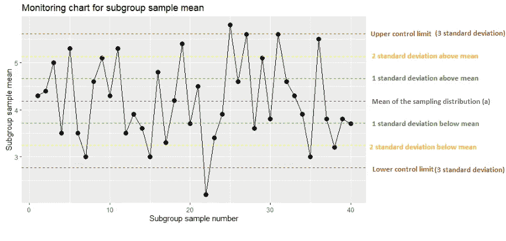

对于非常一致和稳定的过程，子组平均值位于第一个标准偏差内

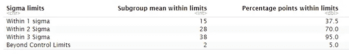

极少数点超出了控制极限，进行 t 检验也无妨

虽然所获得的子组样本平均值确实显示出变化，但似乎没有任何趋势。此外，40 个样本中有 2 个样本的平均值超出了规定的控制限值。对于我们来说，检查从该过程中获得的平均值是否具有统计显著性以便进一步研究是有意义的。

**对统计显著性进行 t 检验**

我们可以进行单样本双尾 t 检验，其中 t 统计量如下所示:

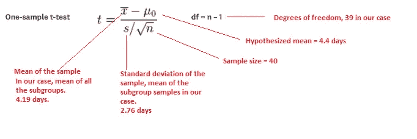

t 统计值为-0.48122

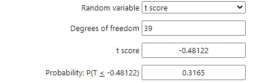

p 值为 0.3165 表明获得的平均值在 5%显著性水平上不具有统计学显著性

从上述结果中，我们未能拒绝零假设，并得出结论，糖尿病患者的治疗和以前一样有效。

**概要:**

> 我们使用一个数据集体验了中心极限定理，该数据集捕获了一个糖尿病患者住院的天数。
> 
> 开发控制图，使用控制图监控平均天数是否保持不变。
> 
> 进行 t 检验，以检查获得的结果是否具有统计学意义，表明治疗的有效性。

可以使用下面的链接访问该项目的源代码:

[https://github . com/rohitTheSupplyChainGuy/The-one with-The-master-stroke-theory](https://github.com/rohitTheSupplyChainGuy/The-one-with-the-master-stroke-theorem)