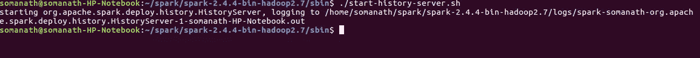
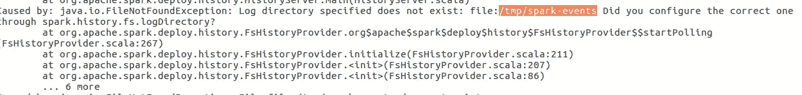
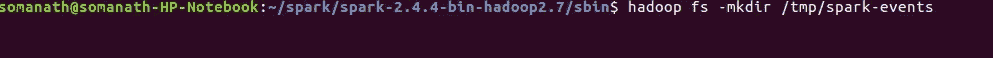
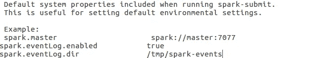
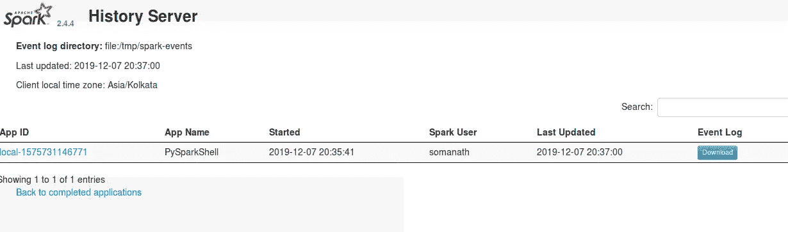
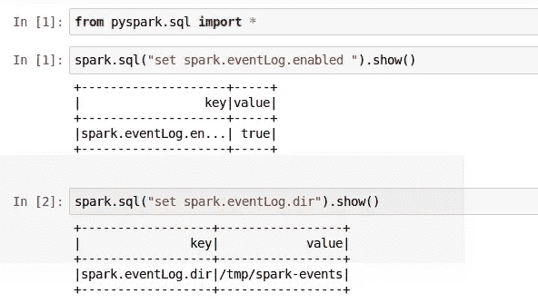
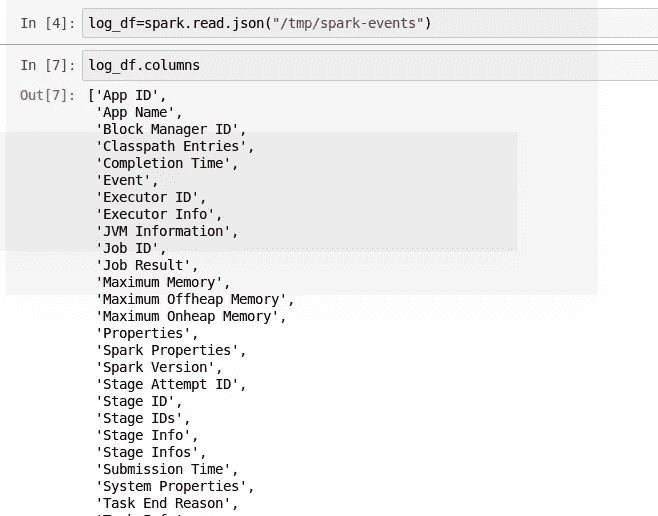
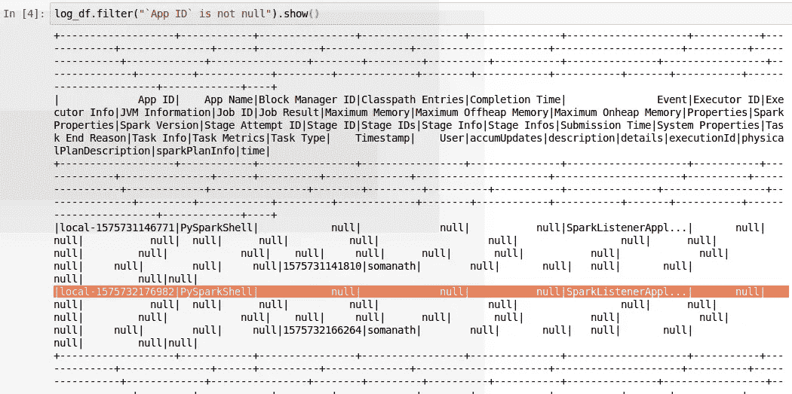

# 使用 spark.sql 在 Spark 中进行监控

> 原文：<https://medium.com/analytics-vidhya/monitoring-in-spark-using-spark-sql-89f8c1907fa6?source=collection_archive---------14----------------------->

Jez Timms 在 [Unsplash](https://unsplash.com?utm_source=medium&utm_medium=referral) 上拍摄的照片

我们通常需要了解我们的 spark 应用程序是如何运行的，并且我们需要收集 spark 指标。我们可以使用 spark Monitoring 以更结构化的方式查看它，而不是通过 web UI 查看。在这个指标中，我们将看到

1.  正在启动火花历史服务器。
2.  配置 spark 历史服务器
3.  使用 Spark sql 查看 Spark 日志
4.  使用

**步骤 1:启动星火历史服务器**

为了激活应用程序，我们需要在 SPARK_HOME/sbin 下激活历史服务器

**。/SPARK _ HOME/sbin/start-history-server . sh 如下图**

**步骤 2:配置 spark 历史服务器**

在查看日志文件时，我发现 spark 需要/tmp/spark-events

然后，我在 hdfs 中创建了目录，并重启了历史服务器

然后我在 **/SPARK_HOME/conf/** 下的 **spark-defauts.conf** 中添加了这个目录

现在我发现 spark 历史服务器在 localhost:18080 端口下监听

**步骤 3:使用 Spark 查看 Spark 日志**

运行中和完成的应用程序的事件日志可以在/tmp/spark-logs 下以 json 格式获得。因此，我将使用 spark.read.json 读取该目录，如下所示，在此之前，我将确保 spark.eventLog 已启用并且 logdir 已设置

通过阅读如下所示的目录，可以找到正在运行的应用程序的各种 spark 指标。一些值得注意的指标包括

因为我没有运行任何任务，所以在上面的截图中，我的大部分指标都是空的

**用途**:

我们可以用它来监控 spark 应用程序，并以结构化的方式对我们的工作进行详细的日志分析

2.我们可以使用该指标来读取集群利用率的应用程序指标和用户指标

今天就到这里吧！！:)

Github 链接:[https://github . com/SomanathSankaran/spark _ medium/tree/master/spark _ CSV](https://github.com/SomanathSankaran/spark_medium/tree/master/spark_csv)

***请给我发 spark 中我必须涉及的话题，并给我改进写作的建议:)***

**学习，也让别人学习！！**