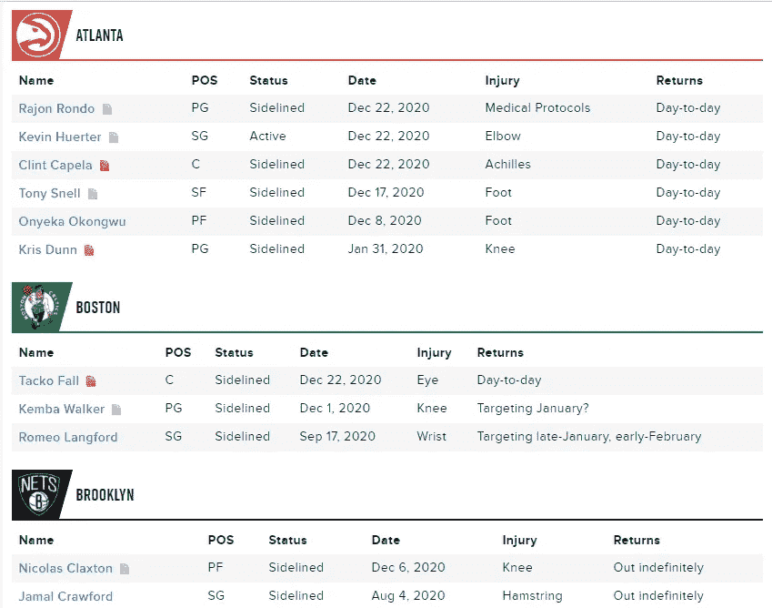
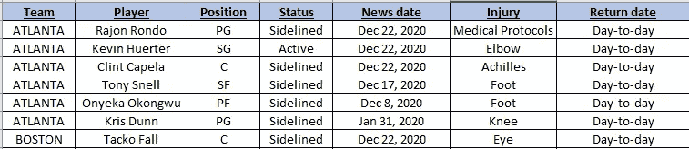

# 用 Python 监控 NBA 伤病

> 原文：<https://medium.com/analytics-vidhya/monitoring-nba-injuries-with-python-bf05ea2aec68?source=collection_archive---------14----------------------->

> 30 秒内:在网上收集更新，存储在 csv 中，通过电子邮件发送。

作为一个终生的 NBA 球迷，我一直很想知道今晚会有哪些球员上场。生活在法国，我总是害怕在凌晨 3 点醒来，看到原本期待的*之夜*变成了*之夜*的比赛，因为某个超级巨星那晚没有上场。

为了避免这种情况，我经常去查看 *Rotoworld* 网站[1]以获得关于玩家受伤的最新消息。但是，当 Python 代码可以为您完成并通过优雅的电子邮件向您发送更新时，为什么还要花费时间查看相同的页面呢？

图 NBA 伤病的 Rotoworld 页面

0-导入库并设置驱动程序位置

I —定义刮削功能

II —抓取页面

三—保存*。csv* 并通过电子邮件发送

**0 —导入磁带库并设置驱动程序位置**

在第一步中，我们首先导入所需的包，我们**在第 10 行定义了 Chrome 驱动程序的位置。**我们还导入了一个名为 *Send_mail* 的自定义库，我们将在第三节中展示它。最后，我们打开 Chrome 驱动程序，进入 *Rotoworld* NBA 伤病页面。

初始化代码如下所示:

图 2:初始化代码

**一—定义刮削功能**

然后我们定义一个名为 *ffi(a)* 的函数来轻松浏览页面:它的目的是收集与一个 *xpath* 相关联的文本，如果它不存在，不会产生任何错误。简而言之，这个函数通过关闭错误来处理错误。

然后我们定义一个名为 *collect_info_line()* 的函数，它将*队号(从 1 到 30，因为有 30 个队)和行 ***i*** 作为输入，**收集 *Rotoworld* 页面上的相关信息**:*

*图 3:定义抓取功能*

***二—刮页***

*一旦我们定义了在页面的每一行为每个团队收集信息的函数，我们只需要浏览所有团队和所有行，以便收集所有数据。下面给出了执行此操作的代码:*

*图 4:在页面上收集伤害信息*

***三—保存*。csv* 并通过电子邮件发送***

*一旦我们在最后一步中收集了原始数据，我们现在可能希望将它保存在一个表中，并通过电子邮件发送出去。*

*首先，我们创建一个脚本来发送一个*。csv* 文件通过电子邮件发送(在 Python 上通过电子邮件发送附件— [2])，请注意**在第 16 行**修改接收电子邮件地址:*

*图 5:定义一个发送*的函数。通过电子邮件发送 csv* 文件*

*最后，我们将从*刮出的*数据转换成表格，保存*。csv* 并通过电子邮件发送:*

*图 6:将表格保存在一个. csv 文件中，并通过电子邮件发送*

***四—结论***

*运行代码后，通过电子邮件发送的最终*刮出的*表如下所示:*

**

*图 7:最终表格概述*

*我们现在已经在 *Rotoworld* 网站上建立了我们的代码来清除伤害。该代码可以被安排在特定的时间运行，这样用户就可以在他的邮箱中接收每日更新。此外，**人们可以考虑修改代码以适应自己的需求**:例如，如果你是一名*快船*的球迷，你可能希望程序在科怀·伦纳德今晚比赛时给你发送一封特定的电子邮件。这可以通过简单地检查科怀·伦纳德的*状态*值是否设置为*活动*来完成。你也可以为各种目的修改代码:体育博彩预测，统计，监测伤害等…*

*最后，我们还可以回忆一下，完整的代码可以在专门的 GitHub 存储库中获得[3]。你可以随意挑选，运行，改编。不要犹豫留下任何反馈/问题/ *掌声*或联系我获取更多信息。*

***另一篇文章** *(用机器学习构建体育博彩算法)* [新冠肺炎如何阻止我在 2020 年成为百万富翁|作者 sébastien Cararo | Analytics vid hya | Dec，2020 | Medium](/analytics-vidhya/how-covid-19-prevented-me-from-being-a-millionnaire-in-2020-5b2144e8bdef)*

***联系人:** sebcararo@hotmail.fr*

***来源***

*[1] Rotoworld NBA 伤病页面*

* [## 为 NFL，MLB，NBA，NHL，CFB，高尔夫，EPL 和 NASCAR 的 Rotoworld 幻想体育新闻和分析

### 为 NFL，MLB，NBA，NHL，CFB，高尔夫，EPL 和 NASCAR 的 Rotoworld 幻想体育新闻和分析

为 NFL，MLB，NBA，NHL，CFB，高尔夫，EPL 和 NASCARwww.rotoworld.com 的 Rotoworld 幻想体育新闻和分析](https://www.rotoworld.com/basketball/nba/injury-report) 

[2]使用 Python 通过电子邮件发送附件

[python——如何发送邮件附件？—堆栈溢出](https://stackoverflow.com/questions/3362600/how-to-send-email-attachments)

[3] GitHub 知识库

 [## SEB 943/NBA _ 伤病 _ 报告

### 🏀 🏀 🏀收集 NBA 伤病报告，将它们整理在一个优雅的表格中，然后通过邮件发送🏀 🏀 🏀ℹ️利用率…

github.com](https://github.com/Seb943/NBA_injuries_report) 

图 8:封面图片(科怀·伦纳德伤 vs 丹佛掘金—[https://www.google.com/url?sa=i&URL = https % 3A % 2F % 2f sports . Yahoo . com % 2f clippers-lose-kaw hi-Leonard-to-bloody-injury-late-in-win-over-掘金-061344718 . html&psig = aovvaw 3 exwwt 4 I-UX 5 IBE 5 hx-vQk&ust = 1609266451161000【中](https://www.google.com/url?sa=i&url=https%3A%2F%2Fsports.yahoo.com%2Fclippers-lose-kawhi-leonard-to-bloody-injury-late-in-win-over-nuggets-061344718.html&psig=AOvVaw3exwWT4I-UX5ibe5hx-vQk&ust=1609266451161000&source=images&cd=vfe&ved=0CAIQjRxqFwoTCKCr3Oum8e0CFQAAAAAdAAAAABAE)*