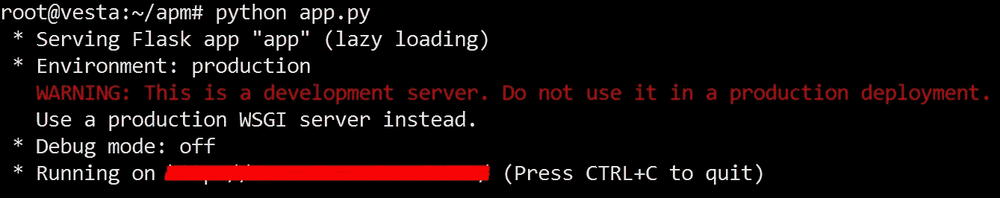

# 使用弹性 APM 监控 Python Flask 应用程序

> 原文：<https://medium.com/analytics-vidhya/monitoring-python-flask-application-with-elastic-apm-bb0853f056ff?source=collection_archive---------3----------------------->


应用程序性能监控(APM)是从最终用户的角度监控已部署应用程序的一个重要方面，从日志记录一直到服务器/应用程序级别的指标。它密切关注应用程序性能，并在一个漂亮直观的仪表板中直观显示资源利用率、错误等性能指标，以深入了解应用程序在一段时间内的运行情况。此外，在部署的应用程序出现严重问题的情况下，APM 工具还可以被配置为发送通知以便立即引起注意！

如今，许多公司提供他们的 APM 产品，如[新遗迹 APM](https://newrelic.com/products/application-monitoring) 、 [AppDynamics](https://www.appdynamics.com/) ，也很受欢迎，但这些都不是免费的。另一方面， [Elastic APM](https://www.elastic.co/products/apm) 是免费的，作为 X-Pack 基本许可的一部分提供。因此，如果您正在考虑开发一个适合您需求的定制 APM 解决方案，那么弹性 APM 是一个不错的选择。在本文中，我们将讨论弹性 APM！

# 弹性 APM 的组件

弹性 APM 有四个组成部分:

*   **Elasticsearch**
    从 APM 的角度来看，Elasticsearch 主要用于存储和索引性能数据。
*   **Kibana**
    Kibana 用于可视化和分析 ES 指标的性能指标。
*   **APM 代理**
    这些是用与您的应用程序相同的语言编写的库。您只需要将它们挂接到您的应用程序中，以积累性能指标。APM 代理收集的数据被发送到 APM 服务器。以下代理目前可用:-

–Go 代理
–Java 代理
–。NET 代理
–node . js 代理
–Python 代理
–Ruby 代理
–JavaScript 真实用户监控(RUM)代理

*   **APM 服务器**

这是一个用 GO 语言编写的应用程序，它接收来自不同 APM 代理的性能数据，并将它们转换成 elasticsearch 文档。然后，这些文档被发送到已配置的 ES 集群。

# 安装 APM 服务器

现在让我们继续在一个`Ubuntu 18.04`实例中安装来自 elastic-6 系列的 APM 服务器。假设您已经在同一个实例中安装了 ES 和 Kibana。首先，将弹性存储库添加到源列表中，并更新 apt 数据库。

```
# wget -qO -  [https://artifacts.elastic.co/GPG-KEY-elasticsearch](https://artifacts.elastic.co/GPG-KEY-elasticsearch) | sudo apt-key add -# echo "deb [https://artifacts.elastic.co/packages/6.x/apt](https://artifacts.elastic.co/packages/6.x/apt) stable main" | sudo tee -a /etc/apt/sources.list.d/elastic-6.x.list# apt update
```

在终端中使用以下命令安装 apm 服务器并启动它:

```
# apt install apm-server  
# service apm-server start
```

APM 服务器首次启动后，将创建一个专门用于 APM 数据的新 ES 索引。使用下面的 CURL 命令验证索引。

```
#  curl -XGET 'localhost:9200/_cat/indices?v&pretty' | grep apm
```

此时，通过*管理- >索引模式- >创建索引模式*，在 kibana UI 中定义一个 ES 索引模式。要完成此操作，请在索引模式文本框中输入`apm*`，并使用`@timestamp`字段作为时间过滤器字段名称。


请记住，APM server 也可以配置为向远程 ES 实例发送性能数据。为此，您只需编辑 APM 服务器配置文件并设置 elasticsearch 的输出。

```
#  vi /etc/apm-server/apm-server.yml  
...  
...  
output.elasticsearch:   
 hosts: ["localhost:9200"]   
...   
...
```


为了简单起见，我们没有在 APM 服务器中使用秘密令牌。只需添加一个秘密令牌，以防您希望 APM 服务器验证来自远程代理的连接。

**注意:**在本文中，apm 服务器、APM 代理、ES 和 Kibana 的配置是在一个系统中完成的。然而，在生产环境中，它们将分散在不同系统中。因此，您需要相应地调整防火墙和其他设置。

# 创建一个烧瓶应用程序

创建一个简单的 flask 应用程序，该应用程序反过来将用于挂钩 apm 库，以便向 APM 服务器发送性能指标。假设您已经为 python flask 应用程序设置了环境，使用以下代码创建 flask app **app.py** 。

```
# vi app.py  
from flask import Flask  
app = Flask(__name__)  
@app.route('/')  
def index():   
 return "Hello World!"  
if __name__ == '__main__':   
 app.run(host='123.45.67.89', port=5000)
```

运行上面的 flask 应用程序，并确保可以使用 curl ping 主机:

```
# python app.py  
# curl -I http://123.45.67.89:5000/
```



万岁！您的 python 应用程序现在已经准备好挂钩 APM 库，我们将在下一步中探索这些库。

# 在应用程序中挂接 APM 代理

我们在上一步中创建的 python flask 应用程序显示一条消息“Hello World！”。那么它将如何向 APM 服务器发送性能指标呢？答案是您需要为 flask 应用程序安装 apm 代理，然后导入并使用 flask 应用程序中的库来将性能指标发送到 APM 服务器。

首先为 flask 应用程序安装 APM 代理。还有其他 apm 代理，如 Java、Node、Ruby 等的 apm 代理。NET，Go，JavaScript 真实用户监控。但是我们对 apm 代理感兴趣，因为我们的应用程序是用 python 写的。请记住，代理的安装取决于应用程序的类型。

```
# pip install elastic-apm[flask]
```

安装 apm agent for flask 后，编辑 flask 应用程序以包含 elasticapm 库，并使用它通过传递 APM 服务器 URL、服务名和秘密令牌来创建 APM 对象。

```
from flask import Flask
from elasticapm.contrib.flask import ElasticAPMapp = Flask(__name__)app.config['ELASTIC_APM'] = {
          'SERVICE_NAME': 'FlaskApp',
          'SECRET_TOKEN': '',         
          'SERVER_URL': '[http://localhost:8200'](http://localhost:8200')
}apm = ElasticAPM(app)[@app](http://twitter.com/app).route('/')def index():
 return "Hello World!"if __name__ == '__main__':
 app.run(host='123.45.67.89', port=5000) 
```

像前面一样，运行 flask 应用程序:

```
# python app.py
```

前往 kibana，查看应用程序是否已经在 APM dashboard 中注册。


一旦在 Kibana dashboard 中注册了应用程序，您还可以分别在 transaction 和 metrics 选项卡下查看事务数据、CPU 和内存使用情况。


到目前为止，我们的 flask 应用程序能够将事务、性能数据(如 CPU 和内存使用情况)发送到 APM 服务器，我们可以在 Kibana UI 中查看这些数据。误差度量呢？让我们在下一节探索它们。

# 模拟事件

## 生成名称错误

让我们尝试在 flask 应用程序中生成一些运行时错误，并验证 APM 服务器中是否记录了这些错误。首先创建一个块来处理 *not found(404)* 错误，而不是在 flask 应用程序中实际导入渲染模板的库。为什么不包括`render_template`头？答案是——>会产生名称错误！因为我们对在 flask 应用程序中生成运行时错误感兴趣。

```
...
...
[@app](http://twitter.com/app).errorhandler(404)
def not_found_error(error):
 return render_template('404.html'), 404
...
...
```

在`templates`文件夹中创建`404.html`文件:

```
# mkdir templates && cd templates  
# echo "File not found" > 404.html
```

运行 flask 应用程序，并在浏览器中键入一个不存在的路径，以便出现 404 异常。该请求将被上述块拦截，并将抛出一个*名称错误:名称“render_template”未定义*。转到 Kibana UI，验证错误是否记录在 APM 服务器的 error 选项卡下。


**注意:**为了消除上面的错误，用下面一行代码导入`render_template`库。

`from flask import Flask, render_template`

## 生成内部服务器错误

让我们尝试在上面的 flask 应用程序中生成一个内部服务器错误并处理异常。

首先创建一个`500.html`文件，该文件将被发送到浏览器，以防 flask 应用程序遇到内部服务器错误。

```
# cd templates  
# echo 'Internal server error !' > 500.html
```

现在添加下面的代码块，它将依次处理您的 flask 应用程序的所有内部服务器错误。

```
...
...
[@app](http://twitter.com/app).errorhandler(500)
def internal_error(error):
 return render_template('500.html'), 500
...
...
```

插入代码以生成内部服务器错误:

```
...
...
[@app](http://twitter.com/app).route('/divbyzero')
def divbyzero():
    num = 2 / 0
    return "hello world - " + str(num)
...
...
```

将浏览器指向[http://SERVER _ IP/div byzero](http://SERVER_IP/divbyzero)来调用上面的代码段。一旦请求到达 flask 应用程序，将生成一个异常，并由 errorhandler 块通过在浏览器中发送 500.html 来处理。转到 Kibana UI，查看错误选项卡下是否记录了异常。


至此，来自 python flask 应用程序的错误数据是如何记录到 APM 服务器中的就变得很清楚了，这些数据可以在 Kibana UI 中可视化。

# 结论

弹性 APM 是监控应用程序以提高性能、修复错误和主动管理应用程序的一个很好的解决方案。这篇文章一定会引导您开始使用弹性 APM 和从各种应用程序到 APM 服务器的流性能指标。现在，您可以继续下一步，例如在出现严重的性能差异或错误时发送警报/电子邮件通知。

Github 中列出了烧瓶代码:
[https://github.com/DwijadasDey/apm](https://github.com/DwijadasDey/apm)