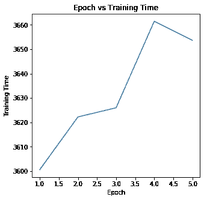

# 使用 UNet 深度学习架构的单目深度估计和背景/前景提取

> 原文：<https://medium.com/analytics-vidhya/monocular-depth-estimation-and-background-foreground-extraction-using-unet-deep-learning-bdfd19909aca?source=collection_archive---------10----------------------->

深度估计包括物体相对于相机有多远。深度估计用于各种应用，如机器人、增强现实、虚拟现实、自动驾驶等。由于场景中的动态对象以及遮挡、光照和各种背景，这是一项具有挑战性的任务。前景/背景分离也是一项具有挑战性的任务，因为涉及到预测前景的掩模。

在这篇文章中，我使用了 120 万幅图像的自定义图像数据集来执行以下操作:

1.  从单目图像估计深度
2.  通过估计前景图像的掩模来分离前景和背景

在[https://github.com/monimoyd/15A_Generate_Mask_Depth_Dataset](https://github.com/monimoyd/15A_Generate_Mask_Depth_Dataset)中给出了关于自定义图像数据集及其生成方式的详细信息

图像数据集以 10 个 zip 文件的形式给出(batch1_images.zip、batch2_images.zip …、batch10_images.zip)。每个 zip 包含以下文件夹:

一、bg_jpg:背景 jpg 图片尺寸:160x160

二。fg_bg_jpg:叠加在背景图像上的前景图像，尺寸:(160x160)

三。mask_black_jpg:黑色背景上前景图像蒙版的地面真实度，尺寸:(160x160)

四。depth_fg_bg_jpg:深度图像的地面真实度，尺寸:(80x80)

完整的数据集可在 google drive 链接中找到:

[https://drive . Google . com/drive/folders/1 YF 4 hvftddwdlypmbokx 4b 5 qzinmvyaza？usp =共享](https://drive.google.com/drive/folders/1YF4HvfTdDwDLYPmBokx4b5QzInMVyAzA?usp=sharing)

GitHub 实施链接:

[https://github . com/monimoyd/predicting maskanddepthusingdeeplearning](https://github.com/monimoyd/PredictingMaskAndDepthUsingDeepLearning/blob/master/assignment15_final_api.ipynb)

**主要亮点**:

*   使用只有 748K 参数的 UNet 架构
*   定制数据加载器加载 120 万张图片，并在 Google Colab 上进行培训
*   使用图像增强 I .高斯噪声 ii。色彩抖动
*   预测遮罩的 IoU 值接近 0.95，而深度图像非常接近地面真实情况
*   使用各种分析工具 tensorboard、cprofile、GPU profiler
*   在训练、复制、解压缩图像期间测量的时间
*   仅使用了 5 个时期来获得非常好的结果
*   使用 Pytorch 来实现这个项目

# 一.培训

下图显示了培训的主要组成部分

这里的输入是

*   160x160 背景图像
*   叠加在背景上的 160x160 前景图像
*   黑色背景上前景蒙版的 160x160 地面真实度
*   80x80 地面真实深度图像

处理由以下人员完成:

*   数据加载器加载数据，而图像增强执行图像的增强。
*   模型用于正向通过神经网络并预测掩码
*   损失函数计算预测掩模图像和真实掩模图像之间以及预测深度图像和真实深度图像之间的损失值。损失值通过神经网络反向传播，并更新模型的权重

产出包括:

*   黑色背景上的前景蒙版(尺寸:160x160)
*   预测深度图像(尺寸:80x80)

# I .数据加载器

数据加载器从图像中加载数据。

下面的流程图解释了数据加载器的工作流程:

所涉及的过程如下:

*   将 google drive 中的所有 zip 文件复制到 Google Colab 本地文件夹/内容/数据中
*   将每个 zip 文件解压到各自的批处理文件夹中。例如，batch1_images.zip 被解压缩到/content/data/batch1 文件夹。

对其他批次也进行类似的处理

*   有两个数据集:

i. TrainImageDataset —该数据集由 9 个 zip 文件(batch1_images.zip，batch1_images.zip，… batch9_images.zip)构成，这些文件解压缩到相应的批处理文件夹(batch1，batch2 4，..batch9)并用于训练。

二。TestImageDataset 此数据集仅使用在 batch10 文件夹中解压缩的 batch10_images.zip 构建

记录填充如下

*   fg_bg_jpg 文件夹中所有文件的多级索引(批次 id，偏移量)
*   **getitem** 方法将 index 作为参数。
*   index 用于通过将 index 除以 40000 来计算 batch_id。余数用于计算偏移量
*   一旦 fg_bg 图像文件被识别，相应的背景图像文件就基于命名约定被识别。例如，fg_bg 图像文件名为 fg_bg_1_100_1_15.jpg，那么按照惯例，fg_bg 后面的第二个数字将是背景图像，在这种情况下，它将是 bg_100.jpg，并且可在相应批次 id 目录下的 bg_jpg 文件夹中获得

根据地面真实遮罩图像的惯例，文件名将具有与 fg_bg 图像文件名相同的后缀。例如，如果 fg_bg 图像文件名为 fg_bg_1_100_1_15.jpg，则地面实况掩模图像对应的文件名将为 bg_mask_1_100_1_15.jpg，该文件名可在批次 id 目录下的 mask_black_jpg 文件夹中找到

类似地，地面真实深度图像文件名将具有与 fg_bg 图像文件名相同的后缀。例如，如果 fg_bg 图像文件名是 fg_bg_1_100_1_15.jpg，则对应深度图像的文件名将是 depth_1_100_1_15.jpg，该文件名将在相应批处理目录下的 depth_fg_bg_jpg 目录中可用。

# 二。数据扩充

对于训练图像，使用了两种增强:

*   火炬视觉的色彩抖动，亮度:0.075，对比度:0.075，饱和度:0.075，色调:0.075
*   自定义类别 GaussianNoise 平均值为 0，标准差为 0.05，概率为 0.2。

相同的数据扩充应用于输入 bg、fg_bg、mask 以及地面真实遮罩和深度图像

# 三。模型

我用的是 UNet 模型。UNet 模型适用于分割作品。

UNet 的原始架构如下[来源:[https://towardsdatascience.com/u-net-b229b32b4a71](https://towardsdatascience.com/u-net-b229b32b4a71)

该建筑看起来像一个“U”形，名副其实。这个架构由三个部分组成:收缩部分、瓶颈部分和扩展部分。收缩段由许多收缩块组成。每个块接受一个输入，应用两个 3×3 卷积层，然后是一个 2×2 最大池。每个块之后的核或特征图的数量加倍，以便架构可以有效地学习复杂的结构。最底层介于收缩层和膨胀层之间。它使用两个 3X3 CNN 层，然后是 2X2 up 卷积层。

但是这个架构的核心在于扩展部分。类似于收缩层，也是由几个膨胀块组成。每个模块将输入传递到两个 3X3 CNN 层，然后是一个 2×2 上采样层。同样在每个块之后，卷积层所使用的特征映射数得到一半以保持对称性。然而，每次输入也得到相应收缩层的附加特征图。这个动作将确保在收缩图像时学习的特征将被用于重建图像。扩展块的数量与收缩块的数量相同。之后，所得到的映射通过另一个 3X3 CNN 层，其特征映射的数量等于期望的分段数量。

最初的 UNet 模型有大约 2500 万个参数，因此要减少参数:

*   使用深度方向可分离卷积
*   频道的数量也减少了

减少后，参数总数为 748K，甚至不到一百万。

该模型的输出具有两个头，一个用于预测尺寸(160×160)的掩模，另一个头用于预测深度(80×80)

# 四。损失函数

使用了两种损失函数:

# a.BCEWitLogitsLoss:

这种损失将一个`Sigmoid`层和二进制交叉熵损失组合在一个单独的类中。

我用这个损失函数来预测遮罩，因为它需要像素级别的比较

# b.SSIM:

结构相似性(SSIM)指数是一种预测数字电视和电影以及其他类型的数字图像和视频的感知质量的方法。SSIM 用于度量两幅图像之间的相似性。

我使用 SSIM 作为损失函数来计算预测和地面真实深度图像之间的损失。

总损失我用了公式:

总损失= 2 *(掩模图像的 BCEWitLogitsLoss(深度图像的 1-SSIM 损失)

(我使用 1-SSIM 损失，因为 SSIM 损失在 0 到 1 的范围内，1 是完全匹配的)

# 动词 （verb 的缩写）使用的度量

损失:这将计算(预测的遮罩图像与地面真实遮罩图像)和(预测的深度图像与地面真实深度图像)的总损失值

IOU:使用 jaccard 相似系数计算预测掩码的 IoU。Jaccard 相似性系数定义为交集的大小除以两个标签集的并集的大小，用于将样本的预测标签集与 y_true 中的相应标签集进行比较

首先，为预测掩模图像和地面掩模图像的每个像素值定义阈值。如果像素值大于阈值，则认为是 1，否则为零。接下来 sklearn.metrics 的 jaccard_score 用于计算 IoU 值。

# 动词 （verb 的缩写）超参数

使用以下超级参数:

> 批量:100 个
> 
> 历元数:5
> 
> 初始学习率:0.01
> 
> 动量:0.9
> 
> 重量衰减:1e-5

# 不及物动词使用的优化程序和调度程序:

使用带有动量的 SGD 优化器。使用步长为 2 且 gamma 为 0.1 的 StepLR 可以降低学习率

# 二。测试

下图显示了测试的主要组成部分

这里的输入是

*   160x160 背景图像
*   叠加在背景上的 160x160 前景图像

处理由以下人员完成:

*   数据加载器加载数据。Dataloader 使用 batch10 中的图像，即 batch10_images.jpg
*   模型用于通过神经网络进行前向传递，并预测掩码

产出包括:

*   黑色背景上前景的 160x160 蒙版
*   80x80 预测深度图像

对于测试，加载来自训练的最佳模型，然后在输入图像上进行评估

# 三。结果

# 测试结果:

# 爱达荷（Idaho 的缩写）

# 背景图像:

# 前景和背景图像:

# 地面真实遮罩图像:

# 预测遮罩图像:

预测的掩码 IoU 值:0.9565858394563042

# 地面真实深度图像(带等离子显示器):

# 预测掩模图像(带等离子显示器):

二。

# 背景图像:

# 前景和背景图像:

# 地面真实遮罩图像:

# 预测遮罩图像:

预测的掩码 IoU 值:0.94254576767867

# 地面真实深度图像(带等离子显示器):

# 预测深度图像(带等离子显示器):

# 四。剖析:

# 一.冲浪板

TensorBoard 是一个分析器和可视化工具，它用于以下目的:

*   跟踪和可视化损失和准确性等指标
*   可视化模型图(操作和层)
*   查看权重、偏差或其他张量随时间变化的直方图

我已经使用 torch.utils.tensorboard 中的 SummaryWriter 为培训和测试添加了度量、IoU 和损耗值的标量值

tensorboard 配置文件是使用 Google Colab 的 runs 文件夹创建的。我从本地下载的 runs 文件夹中创建了一个 tar.gz。

解压缩后，使用命令启动 tensorboard:

张量板— logdir=runs

输出可以在 [http://localhost:6006](http://localhost:6006) 中找到

各种张量板图如下:

# a.培训和测试损失

# 分析:

从图中可以明显看出，训练损失在第一个时期减少到大约 0.2，并在那里保持不变

测试图在 0.118 和 0.126 之间小范围波动。所以测试中的损失值比训练好。这可能是因为我在训练中使用了图像增强

# b.培训和测试 IoU 值

根据训练 IoU，很明显，IoU 值最初增加到大约 0.92，然后在 0.94 和 0.95 之间保持稳定

对于测试，IoU 值在 0.948 和 0.95 的小范围内保持稳定

# 二。cProfile:

cProfile 用于分析 Python 程序。

我在 Jupyter 笔记本的开头使用下面几行代码启用了 cProfile

pr = cProfile。Profile() pr.enable()

在 Jupyter notebook 的末尾，我禁用了 cProfile，并将统计数据转储到文件 cprofile_stats.txt 中

我已经在本地下载了文件 cprofile_stats.txt，并使用 cprofilev 程序进行分析

cprofilev -f cprofile_stats.txt

cProfile 输出可在 [http://127.0.0.1:4000](http://127.0.0.1:4000) 获得

以下是 cProfile 的部分截图:

# 分析:

train_test_utils.py 第 77、24 和 29 行消耗大量时间。第 77 行与训练方法相关，第 24 行和第 29 行与使用的 GPU 分析挂钩相关，将被删除

另一个消耗时间的组件是 unet_model_small.py，第 115 行中的转发函数也消耗了大量时间

像 tornado/stack _ context . py zmq/event loop/zmq _ stream . py 这样的 Python 库也会消耗大量时间

另一个耗时的方法是 tqdm/notebook.py tqdm/std.py，我可以探索任何可用的轻量级版本。

torch/util/data/data_loader.py 和 torch/util/data/_ utils/fetch . py 同样消耗时间，可以通过增加 num_workers 属性来改善。

# 三。GPU 评测

我已经根据以下文章编写了 GPU 性能分析的培训代码:

[https://www . si cara . ai/blog/2019-28-10-deep-learning-memory-usage-and-py torch-optimization-tricks](https://www.sicara.ai/blog/2019-28-10-deep-learning-memory-usage-and-pytorch-optimization-tricks)

我已经将内存配置文件转换为熊猫数据帧，并从那里下载了。csv 文件。下面显示了一些记录:

最后几条记录 depthwise_separable_conv，BatchNorm2d 使用的 mem_cached 值 1000341504 太高，需要进一步注意。

# 四。时间测量

我测量了复制 zip 文件、解压 zip 文件以及训练的时间。

(所有测量单位都是秒)

复制压缩文件所花的总时间:16860.688686868617

解压压缩文件所花的总时间:18660.688686868617

# a.历元与训练时间图

# b.历元与数据加载时间图

# c.历元与杂项时间图

# 分析:

根据该数据，训练时间逐渐增加到大约 60 秒，然后略微减少。数据加载时间和杂项时间在各个时期几乎是恒定的。

通过更改 Dataloader 中的 num_workers 属性，可以进一步减少数据加载时间。

# 动词 （verb 的缩写）型号的 MACs 值:

乘加(MAC)运算给出了模型在运算次数方面的表现。安装 thop 库并使用 profile 方法计算 MACs 值，如下所示:

苹果电脑:892294400.0

# 动词 （verb 的缩写）面临的问题和我如何解决

# I .损失函数

最初，我使用 BCELogitsLoss 进行遮罩和深度预测，但是深度图像质量并不好。当我使用 SSIM 深度和 BCEWitLogitsLoss 蒙版，我发现深度图像更好，甚至蒙版图像 IoU 约为 0.95，这是非常好的

# 二。解压缩批处理 zip 图像文件

最初我试图在 google drive 中解压图片的 zip 文件。每批图像拍摄时间接近 2 小时。因此，我改变了策略，尝试将图像压缩文件复制到本地的 Colab，然后解压缩，这大大减少了时间。然而，缺点是

# 三。禁用 Colab GPU 访问:

我的 GPU 访问 Colab 帐户被暂停，原因是我的使用限制很高。所以改成了 Colab Pro 按月付费订阅

# 四。Jupyter 笔记本挂了，colab 经常断线

Jupyter 笔记本挂了很多次(比如说断网一段时间后)。我意识到这是因为我在几次迭代后显示了太多的图像。所以我把每个时期的图像显示次数减少到只有两次。尽管如此，我还是遇到了问题，所以我使用了来自 https://github.com/satyajitghana/colab-keepalive 的 chrome 扩展。因为我也定期保存模型到谷歌驱动器。万一我不能查看 Jupyter 笔记本，我会继续查看新的模型权重文件，以了解 Colab 仍在 Jupyter 笔记本上工作

# 不及物动词批量选择

最初我尝试更大的批量(256，124)，但是我的内存不够了。最后，我发现批量 100 没有任何内存问题

# 不及物动词结论

在这个项目中，我致力于预测给定背景和前景叠加背景图像的遮罩和深度。我使用了只有 748K 参数(即小于 1M 的参数)的简化 UNet 模型，并预测了几乎更接近地面真实值的掩模和深度。Mask IoU 在 0.95 左右。

我使用了各种分析工具:tensorboard、cprofile、GPU profiler 以及为模型计算的 MACS 值。

# 七。承认

本文基于人工智能学院的泛视觉人工智能 4 第一阶段的最终项目。非常感谢人工智能学院为这个项目提供机会。另外，特别感谢 Chunduri Balaji Tilak 在这个项目上对我的帮助