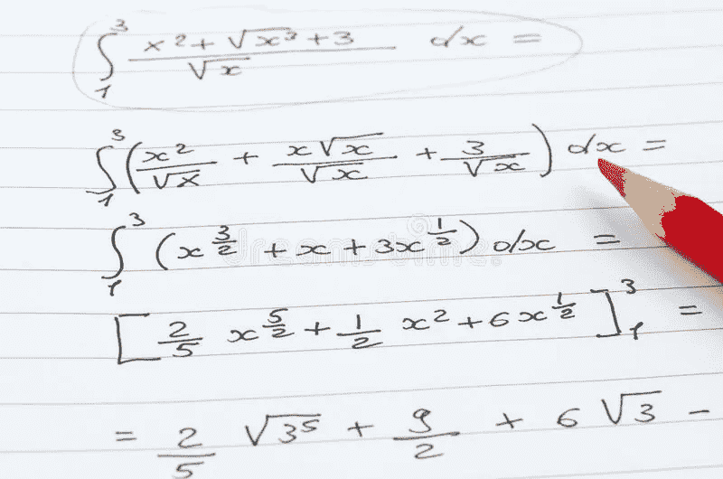

# Python 中的蒙特卡罗集成

> 原文：<https://medium.com/analytics-vidhya/monte-carlo-integration-in-python-dfc12eb91ef?source=collection_archive---------7----------------------->

## [编程](https://towardsai.net/p/category/programming)，[概率](https://towardsai.net/p/category/probability)

## 如何用蒙特卡罗数值估计积分

[图片](https://predictivehacks.com/monte-carlo-integration-in-python/)被预测黑客攻击