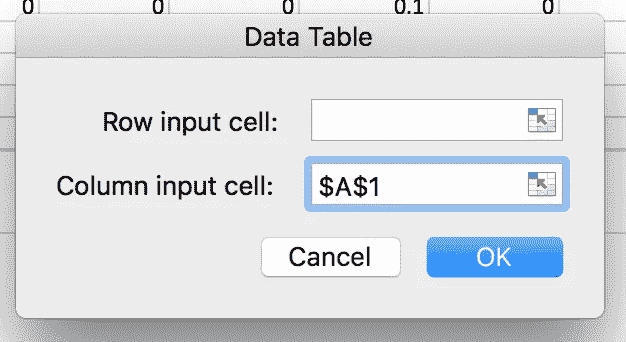

# 使用 Lazycarlo 简化蒙特卡罗模拟

> 原文：<https://medium.com/analytics-vidhya/monte-carlo-simulation-made-easy-with-lazycarlo-f0a54c93e1d3?source=collection_archive---------25----------------------->

没有人，特别是来自科学/工程界的人，会怀疑蒙特卡罗随机抽样方法的强大，特别是当它是关于模拟未知现象或在时间/资源短缺时进行实验计算的时候。

尽管这种方法在广泛的科学和技术领域中非常有用，但是从实现的角度来看，这种方法仍然神秘且耗时。在大多数情况下，你需要成为 Microsoft Excel 专家或经验丰富的程序员来以正确的方式实现它。

在本文中，我们将通过两个具体的 Excel 实现示例来介绍蒙特卡罗方法:计算两个骰子投掷结果和估计房屋建筑项目的成本/工期。

在第二部分中，我们将向 Lazycarlo 展示一个基于蒙特卡罗引擎的用户界面，用它来模拟已经看到的房屋建筑项目。

# 蒙特 卡罗模拟

## 问题定义

花时间明确你想研究的问题是实施蒙特卡罗模拟的关键步骤。一个问题可以被定义为促成一个独特的最终结果的一系列事件。我们在调用蒙特卡罗方法时通常会谈到的一个直观的例子是掷骰子。

让我们假设我们有两个骰子，我们想通过实验来计算投掷两个骰子时每种可能结果的概率。从上面开始，这种情况下的问题可以表示为以下两个事件:

*   掷骰子 1 -可能的结果:[1，2，3，4，5，6]
*   掷骰子 2 -可能的结果:[1，2，3，4，5，6]

## 概率分布

实施模拟时最重要的步骤之一是选择您想要模拟的现象/问题的概率分布，如下所示。对于我们投掷两个骰子的例子，两个事件的概率分布是一致的，这意味着骰子的每个面都有相同的机会发生，在这种情况下 P=1/6。

概率分布的选择可以根据所研究的问题而改变。最常见的发行版如下:

*   均匀分布
*   正态分布
*   对数正态分布

在掷出骰子并知道其遵循均匀分布的情况下，结果可以计算如下:

*   Event1_outcome = rand(1，6)
*   Event2_outcome = rand(1，6)
*   Problem_outcome =兰特(1，6) +兰特(1，6)

这意味着对于每一个骰子，我们取 1 到 6 之间的一个随机值，将结果相加得到问题的结果。

## 模拟

既然问题已经确定，每个事件的可能结果也已知，我们就可以运行模拟了。这一步包括简单地计算结果，我们以前定义的，许多次(epochs)并获得每个值的频率(2 到 12)。这个频率代表相应结果的概率。

## 在 Microsfot Excel 中实现

## 第一步

我们首先简单地为每个骰子分配一个介于 1 和 6 之间的随机值，然后将它们相加。

## 第二步

在这一步中，我们将多次重复步骤 1，比如说 1000 次。我们从添加 1000 个条目的数据序列开始。

1.  我们单击数据系列应该开始的单元格

2.我们点击填充->系列

3.我们选择列，1 作为步长值，1000 作为停止值

这将从我们最初选择的单元格开始生成 1000 个数据条目的列表

4.我们现在可以让每个条目生成随机数，就像我们在步骤 1 中所做的那样。

我们首先将之前在 D6 计算的两个骰子结果的值归结如下

然后，我们选择所有的 1000 列

点击数据->假设分析->数据表

我们选择列输入单元格，并选择任何空单元格(将在背景演算中使用)

一旦完成，所有 1000 个数据条目将被填充以计算为 D6 的随机值。

## 第三步

我们现在计算每个结果的频率。这可以使用 countif 函数来完成，如下所示。累积线包含每个值的所有前导百分比的累积。

在这个阶段，我们可以说我们成功地实现了蒙特卡罗模拟。我们可以将结果可视化，得到如下结果。

我们可以看到，当投掷两个骰子时，最可能的值是 7，概率约为 16%

当绘制累积线时，我们可以看到，我们有大约 70%的概率获得 8 或更低的结果，大约 92%的概率获得 10 或更低的结果值。

# 蒙特卡罗项目管理

现在，我们已经对蒙特卡罗模拟的用途以及如何在 Excel 中实现它有了很好的实际理解，我们可以转向更有趣的东西了。让我们假设你正在建造一所房子，你想估算一下成本，以及你要等多久才能搬进去。我们将使用蒙特卡罗模拟来得到答案！

## 问题定义

房屋建筑项目可以分为几个步骤。对于每一步，我们需要定义成本和持续时间的最小值和最大值。

以下是任务及其最小和最大估计值的列表。这些值将成为模拟输入。

## 什么概率分布

由于我们想要模拟的两个指标(成本和持续时间)都有一个上限和一个下限，并且没有理由说 LB 和 UB 之间的每个值的概率可能是相同的，所以我们将使用正态分布。我们将假设概率遵循正态定律，基于这一假设，我们将使用逆正态函数来计算概率值。我们进行此实施所需的参数是:

*   正态分布的平均值:可以使用公式 mean = (max + min)/2 计算
*   正态分布的标准偏差:可以使用公式计算标准偏差=(最大-最小)/3.29

基于这些参数，可以从随机概率开始计算成本/持续时间值，这可以使用 Excel Norminv()函数来完成，如下所示

=NORMINV(RAND()，均值，标准差)

这里的 RAND()表示当前的概率。

让我们根据上述函数计算每项任务的成本/持续时间。这是结果。

既然我们可以基于随机概率计算每项任务的成本/持续时间，因此我们可以将项目成本/持续时间计算为总和，我们就可以开始模拟了。

## 模拟

掷骰子所用的相同原理也可以用在这里。我们将使用不同的随机概率对相同的成本/持续时间进行 1000 次计算，并得到每次结果的频率。

我们得到以下结果:

**成本频率**

由于成本结果不是离散值，我们将使用 5000 美元的范围。已知最小值项目是 145000 美元，最大值是 192000 美元，我们将计算以下范围的频率:

*   145000 -> 150000
*   150000 -> 155000
*   …
*   190000 -> 195000

这可以使用 Excel COUNTIF()函数来完成，如下所示

当对所有定义的 10 个范围应用相同的计算时，我们得到以下模拟结果

根据这个结果:

*   最有可能的成本值是 170000 美元(在 165000 到 170000 美元之间)
*   根据累积曲线，有 80.5%的概率成本不会超过 175000 美元

**持续频率**

在此期间，我们将把模拟结果转换成整数，然后继续处理骰子。我们得到以下结果:

根据模拟结果:

*   最有可能的持续时间是 46 天
*   根据累积曲线，持续时间不超过 48 天的概率为 86.4%

# Lazycarlo 带来的快乐时光-自动化

是的，这是有趣的时间。你可能会抱怨，用 Excel 运行蒙特卡洛模拟太费时间了。Lazycarlo 是一个用 Ruby 开发的蒙特卡罗引擎，可以通过一个非常简单的用户界面使用，只需要项目名称和指标作为输入进行模拟。我们试着用 Lazycarlo 做同样的房屋建造模拟。

## 步骤 1 -添加项目

我们首先需要登录到 Lazycarlo 并点击 new porject，这将引导我们进入下面的视图，在这里我们填写不同的输入并点击 create project。

项目创建后，我们单击 add new task 来添加我们在创建 Excel 实现时已经定义的任务。

随着您添加新任务，模拟将不断更新。添加完所有任务后，您将看到下面的视图。

如果你向下滚动，你会看到一个初始模拟，你可以通过选择历元数和概率分布来运行一个新的模拟。以下是以 5000 个历元和正态为概率分布的模拟结果。

正如你所注意到的，结果与用 Excel 得到的结果非常相似！

# 结论

基于所处理的两个例子，我们可以看到蒙特卡罗方法是多么有用。它可以用来解决无法解决的问题，并使广大专家的生活更加轻松。我们还可以注意到，在 Excel 中实现它有点棘手，而且耗时较长。一个简单的用户界面 Lazycarlo 可以帮助你让它更有趣，更省时。尽情享受吧！