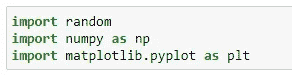
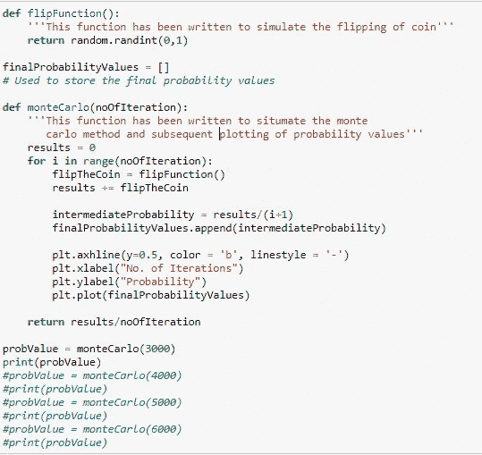
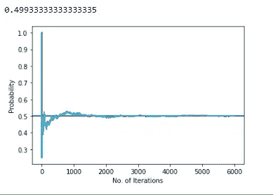
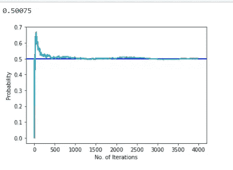
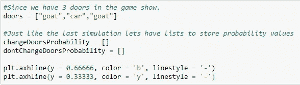
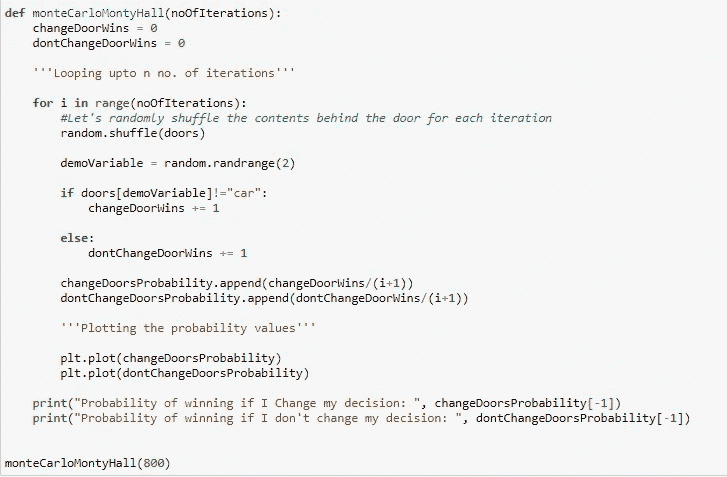
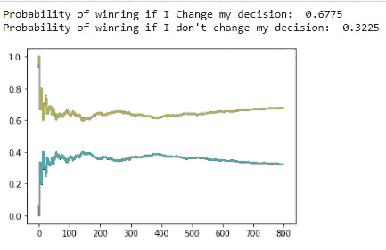
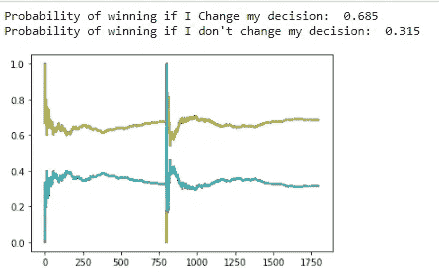

# 用 Python 实现蒙特卡罗模拟

> 原文：<https://medium.com/analytics-vidhya/monte-carlo-simulation-with-python-724ec381ae6e?source=collection_archive---------12----------------------->

显然，商业和金融领域特别受随机变量的支配。从股票回报、大型项目中涉及的风险、资产价格以特定方式移动的可能性、蒙特卡罗的应用甚至范围到天体物理学，甚至计算量巨大的积分形式都可以使用蒙特卡罗模拟来解决，只需不断重复随机样本即可实现我们的结果。

无论你在哪个领域工作，这个模拟都可以用来验证我们决策的可能结果，而决策是我们生活中不可或缺的一部分。

在我的文章开始时，如果不说明蒙特卡罗模拟的经典定义，那将是一种非常罪恶的行为。

# **什么是蒙特卡洛模拟？？？**

蒙特卡罗方法或蒙特卡罗实验是一大类计算算法，用于模拟由于引入随机变量而不容易模拟的过程中不同结果的概率。

蒙特卡洛模拟当然可以用 python 编程。

如果有人让你用实验证明在掷硬币实验中得到正面的概率是 1/2 呢！！通过模拟硬币反复翻转数千次，这种模拟可以很容易地证明这些问题。

## 我将分享 python 代码以及解释每一条语句的注释。

# 抛硬币实验的模拟

导入必要的库。

模拟该方法的函数。

输出:

形象化

当我增加迭代次数时，请注意变化。

迭代次数增加到 4000 时的输出。

这就是蒙特卡罗如何被用来通过实验找到概率值。

# 著名的蒙蒂·霍尔问题

假设你在一个游戏节目中，参赛者有三扇门可供选择，其中一扇门有一辆全新的汽车，其余两扇门有山羊。主持人走到选手面前，让他选一扇门，假设选手选了 1 号门，主持人知道那扇门后有什么，就打开了另一扇有山羊的门。主持人走到你面前，问你是坚持自己的选择，还是选择另一扇门？？在那一刻改变你的选择会有好处吗？？？让我们来了解一下！！！

在初始状态下，
在 3 扇门中得到一辆车的概率是 1/3
只要你选择 1 号门，主人打开另一扇有山羊的门，在 2 号门后面得到一辆车的几率增加 33%。

让我们来看看蒙特卡洛有什么要说的…

门和所需变量的初始化:

驱动程序功能如下。

迭代次数为 800 时的输出:

迭代次数为 1000 时的输出:

注意如果我改变我的决定，获胜的概率值是如何随着迭代次数的增加而增加的。

现在，我们有足够的信心声明，在这种情况下，改变我们的决定对我们有利。

参考资料:走向人工智能，维基百科，Investopedia。

推荐阅读:[https://medium . com/analytics-vid hya/statistical-hypothesis-testing-a-brief-walk-through-338939505 ef0](/analytics-vidhya/statistical-hypothesis-testing-a-brief-walk-through-338939505ef0)

喜欢内容就跟进。非常感谢。谢谢:)