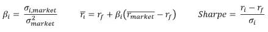

# 股票价格预测的蒙特卡罗模拟[Python]

> 原文：<https://medium.com/analytics-vidhya/monte-carlo-simulations-for-predicting-stock-prices-python-a64f53585662?source=collection_archive---------0----------------------->

蒙特卡洛模拟在许多情况下是一种非常强大的工具，包括运筹学、博弈论、物理学、商业和金融等。这是一种技术，用于在决策时理解风险和不确定性的影响。简而言之，蒙特卡洛模拟使用不确定变量的基础分布产生的不同随机数进行足够多的试验。

在这里，我们将深入研究如何使用蒙特卡洛模拟来预测股票价格！

开始之前，我们需要了解什么？


我们想预测今天股票的价格。我们知道昨天股票的价格。那么，少了什么？我们显然不知道股票今天的日收益率。这就是蒙特卡洛的用武之地！但首先…我们如何估算回报？

**我们如何预测股票的每日回报？布朗运动。**

[布朗运动](https://en.wikipedia.org/wiki/Brownian_motion)将是估算回报的主要驱动力。这是一个随机过程，用于模拟一段时间内的随机行为。布朗运动有两个主要部分:

1.  漂移——过去回报率的方向。也就是股票的预期收益。你可能会问自己:为什么方差要乘以 0.5？因为历史价值在未来会被侵蚀。
2.  波动率——历史波动率乘以一个随机的标准正态变量。


布朗运动适用于股票

这些一起计算布朗运动——即股票的每日回报！

这项技术将被用于你想要预测的未来的每一天，无论蒙特卡洛模拟会运行多少次！让我们开始编码吧！

# 蒙特卡罗模拟的 Python 代码

```
import numpy as np
import pandas as pd
from pandas_datareader import data as wb
import matplotlib.pyplot as plt
import seaborn as sns
from scipy.stats import norm
```

**第一步**:导入股票数据。我们将以谷歌(Google)为例。

```
ticker = 'GOOG'
data = pd.DataFrame()
data[ticker] = wb.DataReader(ticker, data_source = 'yahoo', start = '2010-1-1')['Adj Close]#Plot
data.plot(figsize=(15,6))
```


谷歌股价随时间的变化

这种方法简单明了。使用 pandas_datareader，您可以免费导入股票数据，无需访问键。非常方便我们的目的！

**第二步**:计算谷歌股票的对数回报率

```
log_return = np.log(1 + data.pct_change())#Plot
sns.distplot(log_returns.iloc[1:])
plt.xlabel("Daily Return")
plt.ylabel("Frequency")
```


谷歌每日回报直方图

**步骤 3** :计算漂移

```
u = log_returns.mean()
var = log_returns.var()
drift = u - (0.5*var)
```

**第四步**:计算方差和日收益率

在这一步中，我们必须为预测的每一天以及将要运行的每一次模拟试验生成随机变量。

```
stdev = log_returns.std()
days = 50
trials = 10000
Z = norm.ppf(np.random.rand(days, trials)) #days, trials
daily_returns = np.exp(drift.values + stdev.values * Z)
```

如此接近！现在我们已经在一万次试验中的每一天随机生成了 50 个随机变量，我们所需要的就是计算每一次试验的价格路径！

**步骤 5** :计算每一次试验的股票价格

```
price_paths = np.zeros_like(daily_returns)
price_paths[0] = data.iloc[-1]
for t in range(1, days):
    price_paths[t] = price_paths[t-1]*daily_returns[t]
```

上面的循环是不是看起来很眼熟？没错。它就是我们的股票价格方程，我们在这篇文章中看到的第一个方程！


蒙特卡洛模拟的前 10 次迭代，最后一天价格的直方图

开始了。我们运行了一个蒙特卡洛模拟，预测谷歌未来 50 天的股价。

例如，使用 price_paths 矩阵，现在您可以计算盈利能力的概率或预期的年回报率。在下一节中，我们将两者都做！

# 第 2 部分:自动化蒙特卡罗模拟和显示 CAPM 指标

在这一节中，我们简要回顾一下为完成上述过程中的步骤而创建的函数，这样我们就可以根据您的需要自动模拟任意多的股票！我们还将展示资本资产定价模型中的一些指标。

**第一步**:导入股票数据

```
def import_stock_data(tickers, start = '2010-1-1'):
    data = pd.DataFrame()
    if len([tickers]) ==1:
        data[tickers] = wb.DataReader(tickers, data_source='yahoo', start = start)['Adj Close']
        data = pd.DataFrame(data)
    else:
        for t in tickers:
            data[t] = wb.DataReader(t, data_source='yahoo', start = start)['Adj Close']
    return(data)#Example use
data = import_stock_data(["FB","GOOG","AAPL"], start = '2005-1-1')
```

**第二步**:计算对数日收益

```
def log_returns(data):
    return (np.log(1+data.pct_change()))#Example use
log_return = log_returns(data)
```

**第三步**:计算漂移

```
def drift_calc(data):
    lr = log_returns(data)
    u = lr.mean()
    var = lr.var()
    drift = u-(0.5*var)
    try:
        return drift.values
    except:
        return drift#Example use
drift_calc(data)
```

第四步:计算每日回报

```
def daily_returns(data, days, iterations):
    ft = drift_calc(data, return_type)
    try:
        stv = log_returns(data).std().values
    except:
        stv = log_returns(data).std() dr = np.exp(ft + stv * norm.ppf(np.random.rand(days, iterations))) return dr#Example use
daily_returns(data, 50, 1000)
```

**第五步(CAPM)** :计算每只股票的夏普比率、风险调整后的收益和贝塔系数。



贝塔、风险调整回报和夏普比率方程

从等式中我们可以看出，我们必须将每只股票与市场进行比较。所以我们将导入市场数据(标准普尔 500)。我们还需要无风险利率。我们将用 10 年期美国债券的收益率(2.5%)来估算这个利率。

```
def beta_sharpe(data, mark_ticker = "^GSPC", start='2010-1-1', riskfree = 0.025):
    # Beta
    dd, mark_ret = market_data_combination(data, mark_ticker, start)
    log_ret = log_returns(dd)
    covar = log_ret.cov()*252  # Annualized
    covar = pd.DataFrame(covar.iloc[:-1,-1])
    mrk_var = log_ret.iloc[:,-1].var()*252 #Annualized
    beta = covar/mrk_var

    stdev_ret = pd.DataFrame(((log_ret.std()*250**0.5)[:-1]), columns=['STD'])
    beta = beta.merge(stdev_ret, left_index=True, right_index=True)

    # CAPM
    for i, row in beta.iterrows():
        beta.at[i,'CAPM'] = riskfree + (row[mark_ticker] * (mark_ret-riskfree))
    # Sharpe
    for i, row in beta.iterrows():
        beta.at[i,'Sharpe'] = ((row['CAPM']-riskfree)/(row['STD']))
    beta.rename(columns={"^GSPC":"Beta"}, inplace=True)

    return beta#Example use
#Make sure the start date here is the same as the start day of the original data.
beta_sharpe(data, '2005-1-1') 
```

**第七步(概率)**:计算某种结果的概率

一旦我们对几只股票进行蒙特卡洛模拟，我们可能想要计算我们的投资获得正回报或 25%回报的概率，或者只是股票达到特定价格的概率。因此，我们创建了这个等式来帮你解决这个问题！

```
def probs_find(predicted, higherthan, on = 'value'):
    if on == 'return':
        predicted0 = predicted.iloc[0,0]
        predicted = predicted.iloc[-1]
        predList = list(predicted)
        over = [(i*100)/predicted0 for i in predList if ((i-predicted0)*100)/predicted0 >= higherthan]
        less = [(i*100)/predicted0 for i in predList if ((i-predicted0)*100)/predicted0 < higherthan]
    elif on == 'value':
        predicted = predicted.iloc[-1]
        predList = list(predicted)
        over = [i for i in predList if i >= higherthan]
        less = [i for i in predList if i < higherthan]
    else:
        print("'on' must be either value or return")
    return (len(over)/(len(over)+len(less)))#Example use (probability our investment will return at least 20% over the days specified in our prediction
probs_find(predicted, 0.2, on = 'return')
```

**第 8 步**:对单只股票进行蒙特卡洛模拟

这个步骤是被动的。我们定义了函数，这样我们就可以在最后一步循环遍历它。

```
def simulate_mc(data, days, iterations, plot=True): # Generate daily returns
    returns = daily_returns(data, days, iterations)
    # Create empty matrix
    price_list = np.zeros_like(returns)
    # Put the last actual price in the first row of matrix. 
    price_list[0] = data.iloc[-1]
    # Calculate the price of each day
    for t in range(1,days):
        price_list[t] = price_list[t-1]*returns[t]

    # Plot Option
    if plot == True:
        x = pd.DataFrame(price_list).iloc[-1]
        fig, ax = plt.subplots(1,2, figsize=(14,4))
        sns.distplot(x, ax=ax[0])
        sns.distplot(x, hist_kws={'cumulative':True},kde_kws={'cumulative':True},ax=ax[1])
        plt.xlabel("Stock Price")
        plt.show()

    #CAPM and Sharpe Ratio

    # Printing information about stock
    try:
        [print(nam) for nam in data.columns]
    except:
        print(data.name)
    print(f"Days: {days-1}")
    print(f"Expected Value: ${round(pd.DataFrame(price_list).iloc[-1].mean(),2)}")
    print(f"Return: {round(100*(pd.DataFrame(price_list).iloc[-1].mean()-price_list[0,1])/pd.DataFrame(price_list).iloc[-1].mean(),2)}%")
    print(f"Probability of Breakeven: {probs_find(pd.DataFrame(price_list),0, on='return')}")

    return pd.DataFrame(price_list)#Example use
simulate_mc(data, 252, 1000)
```


股票的单一蒙特卡洛模拟的输出示例

**第 9 步**:根据需要，对尽可能多的股票进行完整的蒙特卡洛模拟！

```
def monte_carlo(tickers, days_forecast, iterations, start_date = '2000-1-1', plotten=False): data = import_stock_data(tickers, start=start_date) inform = beta_sharpe(data, mark_ticker="^GSPC", start=start_date) simulatedDF = []
    for t in range(len(tickers)):
        y = simulate_mc(data.iloc[:,t], (days_forecast+1), iterations)
        if plotten == True:
            forplot = y.iloc[:,0:10]
            forplot.plot(figsize=(15,4))
        print(f"Beta: {round(inform.iloc[t,inform.columns.get_loc('Beta')],2)}")
        print(f"Sharpe: {round(inform.iloc[t,inform.columns.get_loc('Sharpe')],2)}") 
        print(f"CAPM Return: {round(100*inform.iloc[t,inform.columns.get_loc('CAPM')],2)}%")
        y['ticker'] = tickers[t]
        cols = y.columns.tolist()
        cols = cols[-1:] + cols[:-1]
        y = y[cols]
        simulatedDF.append(y)
    simulatedDF = pd.concat(simulatedDF)
    return simulatedDF#Example use
ret_sim_df = monte_carlo(['GOOG','FB','AAPL'], 252, 10000,  start_date='2015-1-1')
```


运行模拟后，我们可以观察到结束日期的值分布，这取决于预测的天数。每只股票的指标，包括平均回报、风险调整回报、盈亏平衡概率、贝塔系数和夏普比率也打印出来。希望，这将帮助你作为一个投资者！

瞧啊。只需加载/运行步骤 1-9 中创建的函数，您就可以为您想要的股票运行自己的蒙特卡洛模拟！你只需要安装合适的库。

需要注意的是，这里的蒙特卡罗模拟假设了收益的正态分布。然而，历史告诉我们，事实并非如此。虽然相似，但最精确的分布是柯西分布。尽管如此，在大多数情况下，正态分布在数千次试验中已经足够精确。

希望你喜欢这个蒙特卡罗模拟预测股票价格的介绍！请随意从 Github 下载并使用 Jupyter 笔记本，并在 LinkedIn 和 Medium 上关注我的其他项目！

github:[https://github.com/eliasmelul/finance_portfolio](https://github.com/eliasmelul/finance_portfolio)

领英:【https://www.linkedin.com/in/melulelias/ 

中:【https://medium.com/@melulfrescoelias】T4

