# 蒙蒂·霍尔问题——从零到英雄

> 原文：<https://medium.com/analytics-vidhya/monty-hall-problem-from-zero-to-hero-e26f3372352e?source=collection_archive---------11----------------------->

统计学是一个奇怪而奇妙的地方，充满了许多反直觉的结果，我认为这就是为什么它对许多人(包括我自己)来说如此难以捉摸。我想我们大多数人都能说出我们认识的精通数学、物理或生物等定量领域的人，但很少有人能说出精通统计学的人。随着大数据、机器学习以及它有望阐明的所有问题的兴起，掌握统计学及其相关学习方法目前是雇主正在寻找的一项广受欢迎的技能。

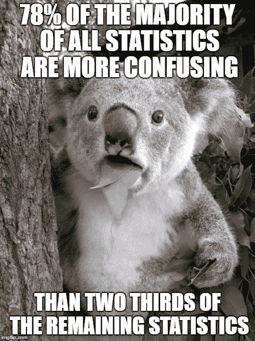

似乎是对的[信贷:[https://imgflip.com/i/17m7k8](https://imgflip.com/i/17m7k8)

在这篇文章中，我希望引导读者通过各种解释来理解统计学学生接触到的一个标准问题——**蒙蒂霍尔问题。**

蒙蒂霍尔问题与其他问题有许多相似之处，例如[三个囚犯问题](https://en.wikipedia.org/wiki/Three_Prisoners_problem)或[伯特兰德盒子悖论](https://en.wikipedia.org/wiki/Bertrand%27s_box_paradox)。这些问题属于一类被称为真理悖论的悖论，通过逻辑推理得出的答案在原始陈述看来是荒谬的。这种悖论的其他例子有著名的[薛定谔的猫](https://en.wikipedia.org/wiki/Schr%C3%B6dinger%27s_cat)思想实验和[无限旅馆悖论](/i-math/hilberts-infinite-hotel-paradox-ca388533f05)。

这篇文章的前半部分将展示你推理荒谬答案的逻辑方法，而后半部分将用数学的通用语言展示答案。坚持到最后，得到一个额外的答案，向你的同伴、室友、重要的人或邮递员炫耀。

# 蒙蒂·霍尔问题

蒙蒂·霍尔是 20 世纪 60 年代初首次播出的电视节目的主持人。在名为*让我们做笔交易的节目中，*观众成员被随机挑选成为“交易者”。在整个展会期间，蒙蒂·霍尔会定期向这些“交易者”提供交易，要么保留他们所拥有的，要么换取一份神秘的奖品。蒙蒂·霍尔问题集中在表演的最后一部分，一个“交易者”放弃了他们所赚的钱，从 3 个门中随机选择一个。其中一个门包含“大交易”,如假期、汽车或大额现金奖励，而其他门包含较低的奖励，如比“交易者”已经积累的钱少。

这个人自己——蒙蒂·霍尔[credit:[https://medium . com/kharpann/why-the-Monty-Hall-problem-is-magnitistic-1ce 475120 af1](/kharpann/why-the-monty-hall-problem-is-fascinating-for-a-statistician-1ce475120af1)]

一旦“交易者”选择了一扇门，Monty Hall 就会打开剩下的两扇门中的一扇门，门后有一个低奖金。为了达到戏剧性的效果，蒙蒂要么打开参赛者的门，表明他们赢得了大奖，要么打开另一扇门，表明他们输了。如果我们退一步，蒙蒂霍尔问题来自这个简单的问题，

> “如果第一个盒子打开后，蒙蒂问你是否愿意更换盒子，你应该吗？”

当学生在他们的第一堂统计学课上遇到这个问题时，脑海中立即浮现的答案是“它可能在剩下的任何一个盒子中，所以机会是 50/50。因为是 50/50，所以没有开关盒的好处”。然后教授继续告诉观众，它实际上在另一个盒子里的可能性是两倍，所以你应该经常换。

# 合乎逻辑的解释

在这个问题以及其他许多问题中，我发现将问题发挥到极致很有用，这有助于逻辑答案变得更加直观。所以我们假设有 100 个盒子，1 个有大奖，另外 99 个里面什么都没有。为了便于讨论，我们假设大奖在 34 号箱子里。

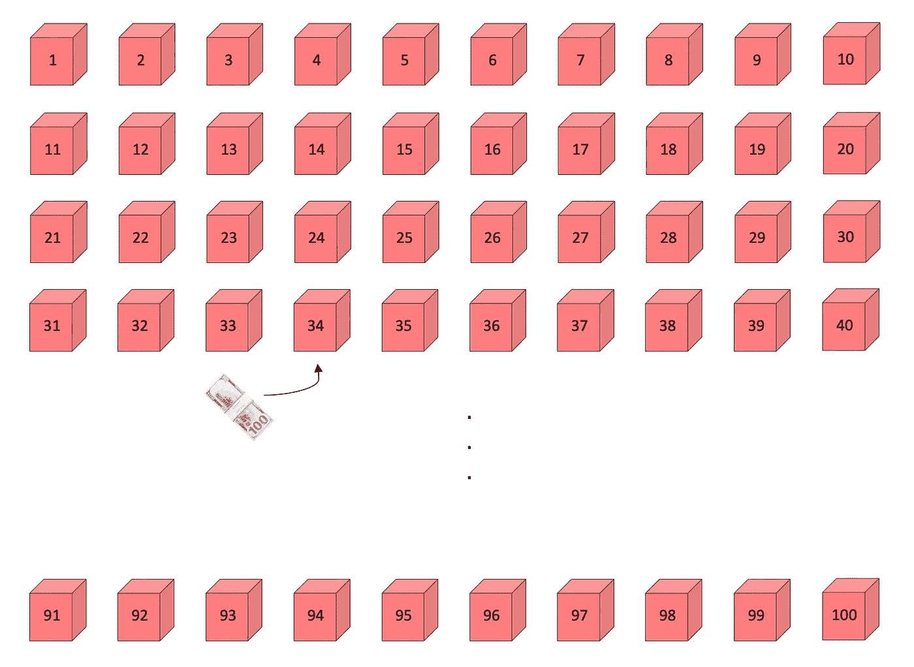

34 号门后面有 100 盒大奖

假设你选择了第 29 个盒子。蒙蒂，*知道奖品在哪里*，开始打开空盒子。

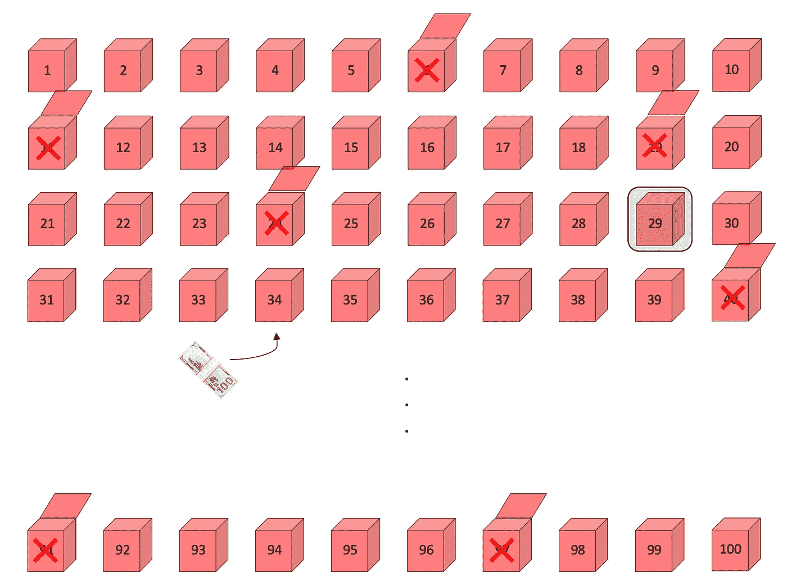

你随机选择一个盒子，蒙蒂知道钱在哪里，开始打开空盒子。

他揭开了 98 个不包含奖品的盒子，现在还剩两个:你的盒子和 34 号盒子。

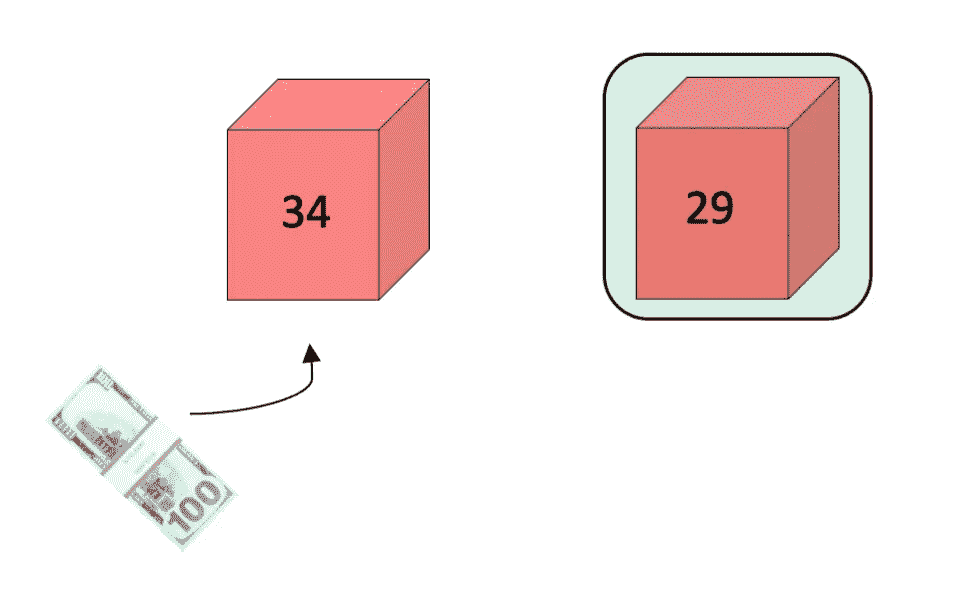

当你选择你的盒子时，你有 1/100 的机会选择里面有大奖的盒子。另一方面，无论你是否获奖，蒙蒂总能揭开 98 个没有标价的盒子。

在一个场景中，你选择了正确的盒子，蒙蒂可以揭开剩余 99 个盒子中的任何 98 个，因为你已经有了奖品。如果我们运行这个游戏 100 次，这种情况平均每 100 个案例中出现 1 个，因为这种情况发生的概率是 1/100，如上所述。

另一种情况是，蒙蒂知道大奖不在你的盒子里，所以他选择了另外 98 个空盒子来揭开谜底。平均 100 个案例中有 99 个会发生这种情况。

所以，如果你运行这个游戏 100 次，你会期望另一个盒子里有 99 次大奖，平均只有 1 次你会期望它是你的盒子。换句话说，大奖在另一个盒子里的可能性是 99 倍，你应该换一个。

# 贝叶斯法则

对于那些通过数字和符号与这个世界互动的人，现在让我们用数学和统计学得出同样的结果。

为此，我们需要使用[贝叶斯法则](https://en.wikipedia.org/wiki/Bayes%27_theorem):

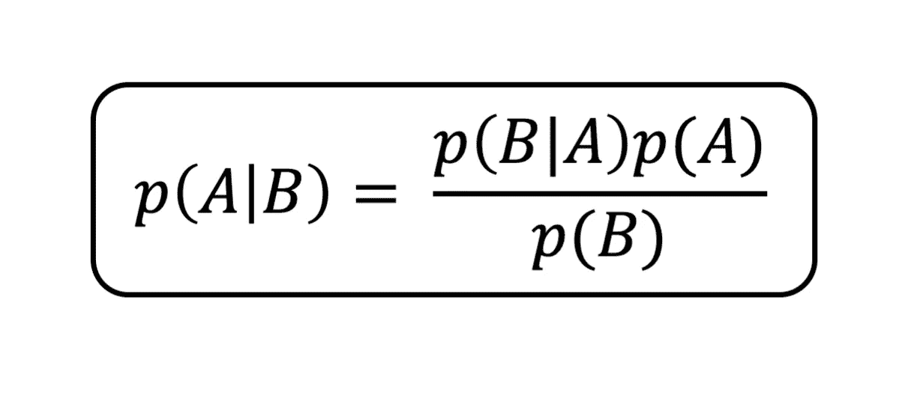

其中我们将 p(A|B)读作 A 发生的概率，假设 B 已经发生，类似地，p(A)和 p(B)分别是 A 和 B 发生的概率。

让我们定义 A 的可能值为{有奖，无奖}，B 为{98 个空盒子}。换句话说，我们想知道这样的概率，要么我们有奖金，因为蒙蒂给我们看了 98 个空盒子，要么我们没有奖金，因为他给我们看了 98 个空盒子。

考虑第一个概率，假设蒙蒂给我们看了 98 个空盒子，我们想计算出我们获奖的概率。贝叶斯规则中使用的相应概率为

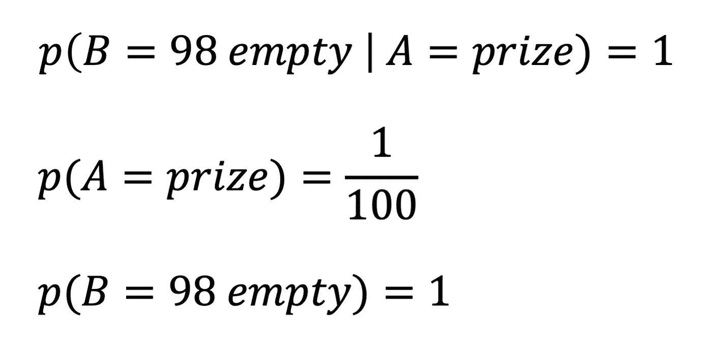

第一个概率 p(B=98 空| A =奖)是假设我们有奖，蒙蒂可以给我们看 98 个空盒子的概率。从前面的部分我们知道，蒙蒂可以 ***总是*** 向我们展示 98 个空盒子，所以概率简单地说就是 1。

第二个概率 p(A=prize)是先验概率，我们选择了有奖品的盒子。如前所述，这是 1/100。

第三个概率 p(B=98 个空盒子)是 Monty 能给我们看 98 个空盒子的先验概率。同样的推理，在我们选择一个盒子之前，他就知道他能向我们展示 98 个空盒子，所以这个概率也是 1。将它代入贝叶斯法则得到:

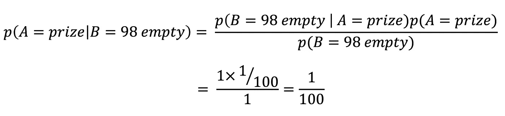

就像之前我们用逻辑推理一样，我们得到的概率是 1/100，因为蒙蒂给我们展示了 98 个空盒子。对 p(A =没有奖金| B = 98 空)遵循类似的过程(或者更容易 p(A =没有奖金| B = 98 空)= 1-p(A =奖金| B = 98 空)给出:

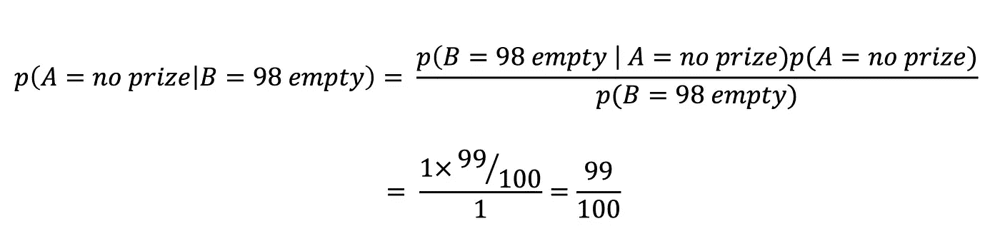

我们现在已经通过使用贝叶斯法则表明，奖品在另一个盒子里的可能性是你最初选择的那个盒子的 99 倍。

稍加思考，我们可以将这两个概率扩展到“交易者”有 N 个盒子或选择的情况。那么，假设 N-2 个盒子已经被打开并且是空的，那么“交易者”获得奖励的概率是

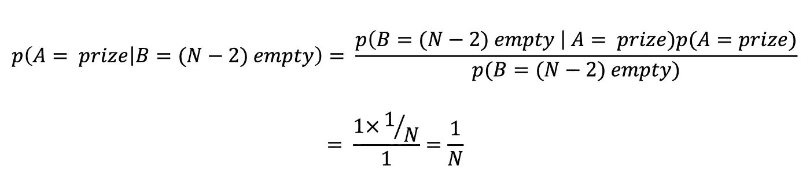

同样，他们没有获奖的概率由下式给出

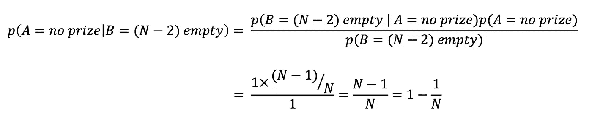

# 奖金:当蒙蒂不知道奖金在哪里

上述分析有一个微妙之处，它产生了另一个反直觉的结果。以上分析只有在蒙蒂知道奖品在哪里的情况下才成立。他知道奖金在哪里的事实影响了先验概率 p(B)和条件概率 p(B|A)。

实际上，为了准确起见，早先我们应该将概率写成 p(A|B，H)，p(B|A，H)，p(B|H)，其中 H 现在表示蒙蒂是否知道奖金在哪里(p(A)不受蒙蒂的知识的影响，因此不会被 H 的值修改)。

让我们只考虑 3 个盒子，问什么是 p(A=prize|B=empty)，也就是说，假设 Monty 偶然发现了一个空盒子，我们获得奖品的概率是多少。记住，他不知道他刚刚打开的盒子会是空的。那么概率就变成了

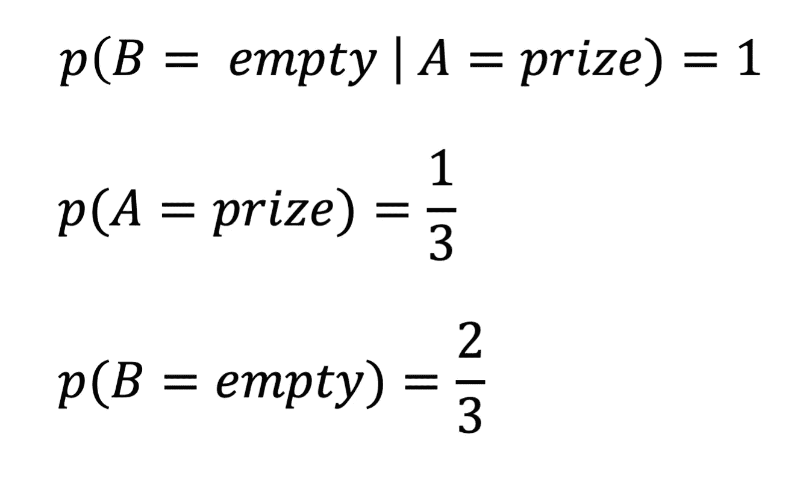

对于第一个概率，p(B =空| A =奖)，这是假设你有奖，蒙蒂刚刚打开的盒子是空的概率。这是 1，因为如果你有奖，两个盒子都是空的。

第二个概率 p(A=prize)是你选择带有奖品的盒子的先验概率，它与之前相比没有改变，只是 1/3。

最终概率 p(B =空)是蒙蒂揭示的盒子将是空的先验概率，它是 2/3。这种情况下的贝叶斯法则变成了

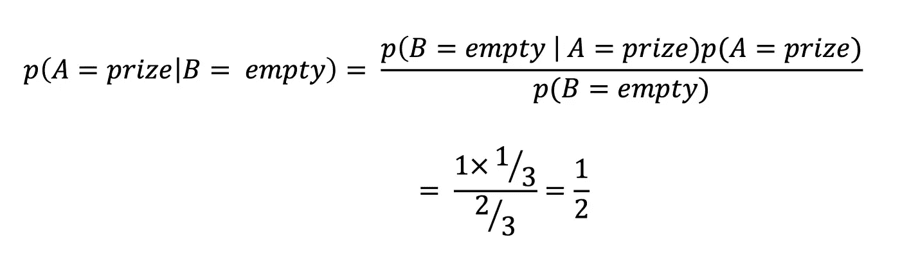

同样，我们没有获奖的概率是因为蒙蒂偶然发现了一个空盒子

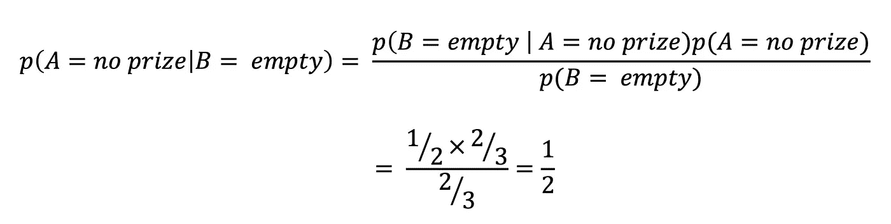

令人惊讶的是，**蒙蒂关于奖品位置的知识**或缺乏知识，实际上改变了**你**应该做的事情！

# 结论

在这篇文章中，我展示了两种方法来说服你自己和其他人相信 Monty Hall 问题的反直觉解决方案。首先，我们看到，通过将这种情况发挥到极致，我们可以推理出合乎逻辑的答案。第二，我们使用贝叶斯法则来计算在给你看的空盒子数量的情况下，你获奖或不获奖的概率。

所以如果你在面试中被问到是否要换盒子的问题，你的回答应该是，

> “嗯，这要看情况，……谁知道奖品在哪里？”