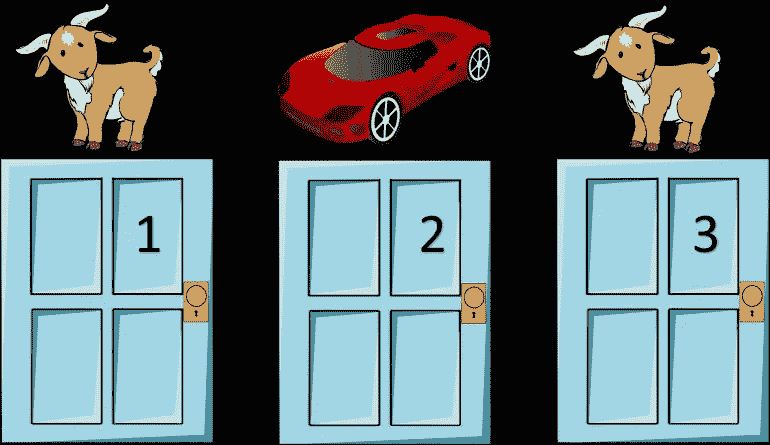
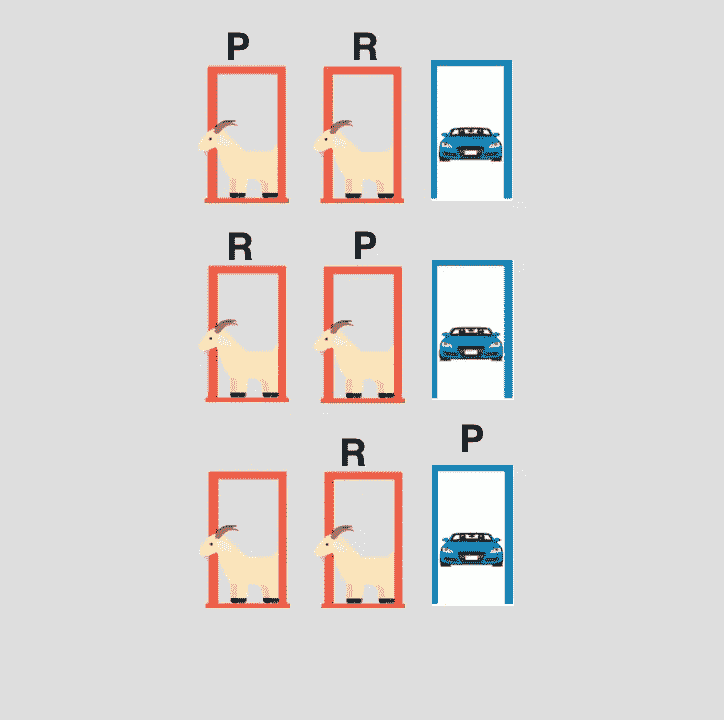
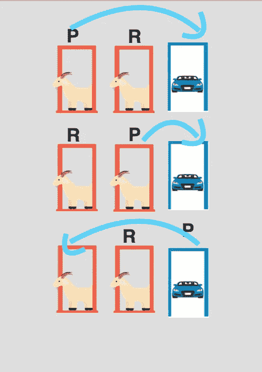

# 蒙蒂霍尔问题——理论概率与实验概率

> 原文：<https://medium.com/analytics-vidhya/monty-hall-problem-theoretical-vs-experimental-probabilities-2050b11818ba?source=collection_archive---------14----------------------->

[让我们做个交易(1973)](https://www.youtube.com/watch?v=hQpbsD5IueA)

*蒙蒂霍尔*问题是*著名的*问题，在条件概率和使用贝叶斯定理的推理中看似矛盾的问题。这篇文章的主要目的是了解 Monty Hall 问题以及实验概率和理论概率的区别。

> **什么是*天魔堂*的问题？**

天魔堂问题得名于天魔堂主持的电视游戏节目 ***让我们做个交易*** 。场景是这样的:你有机会从三扇门中选择一扇门，其中一扇门后有奖品。另外两扇门藏着“山羊”(或其他类似的“非奖品”)，或者什么也没有。一旦你做出选择，蒙蒂大厅将打开剩下的**门**中的一个，显示它**不包含奖品**。然后，他会问你是否愿意将你的选择切换到另一扇未打开的门，或者保持原来的选择。

**天魔堂问题**

从上面的问题陈述可以理解，我们有可能赢得这辆车，概率将帮助我们增加这个赔率。让我们看看概率在这种情况下有什么帮助。相信我，在这篇文章结束时，你会明白概率是如何改变我们的生活的。在进入问题之前，我们先了解两类概率。

*   理论概率
*   实验概率

一袋弹珠

## 理论概率

考虑一袋弹珠。它由两种不同颜色的大理石组成——红色和蓝色。假设有 50 颗红色弹珠和 50 颗蓝色弹珠。理论上，挑选红色弹珠的概率可以计算如下:

> p(挑选红色弹珠)=红色弹珠的数量/袋子中弹珠的总数= 50/100

因此 ***理论指出，我们从袋子里取出的弹珠有 50%的几率是红色的。***

> ***理论上:p(*** ***)摘红弹珠)= 50%***

## 实验概率

现在假设我们开始做一些实验。所以我们拿一个装有 50 颗红色弹珠和 50 颗蓝色弹珠的袋子，然后开始挑选弹珠。每次我们挑选一个弹珠，我们都会记下弹珠的颜色。在 10 次实验之后，我们的结果可能看起来是 10 次实验中有 7 个红色弹珠和 3 个蓝色弹珠。矛盾到前面的 ***理论上的*** 概率(也就是 50%)通过实验我们观察到:

> p(挑选红色弹珠)=观察到红色弹珠的实验次数/实验总数= 7/10

因此 ***实验表明，我们从袋子中取出的弹珠有 70%的几率是红色的。***

> ***实验性地:p(*** ***)采摘红色大理石)= 70%***

**我们观察到了什么？尽管理论概率清楚地定义了结果，但它在一系列实验中失败了。因此，实验概率被认为比理论概率更重要。让我们理解一下实际的含义。**

# 蒙蒂·霍尔问题

## ***理论*** 概率

假设你在参加一个游戏节目，你有三扇门可以选择:一扇门后是一辆车；在其他人后面，山羊。那么找对门的概率有多大呢？

> ***理论上:p(*** ***挑对门)= 1/3 = 33.33%***

你选了一扇门，比如 1 号门，主人知道门后是什么，他打开了另一扇门，比如 3 号门，里面有一只山羊。然后他对你说，“你想选 2 号门吗？”现在找到正确的门的概率是多少？

> ***理论上:p(*** ***)挑对门|假门之一已露)= 1/2 = 50%***

因为其中一扇写着“山羊”的门已经露出来了。现在只剩下两扇门了——你选择的那扇门，另一扇门仍然是个谜。因此 ***理论*** 概率帮助我们做出一些决定。让我们看看实验概率如何帮助我们。

## 实验概率

做这个实验有两种方法。让我们列出可能的实验。

**实验一:**一旦主持人揭露假门，你会改变选择。

**实验二:**即使主持人揭露了假门，你也不会改变选择。

让我们列出进行实验 1 的所有可能的方法。有三种可能性:

*   你挑第一扇门，主持人会揭示第二扇门。
*   您将选择第二扇门，主持人将显示第一扇门。
*   你将选择第三扇门，主持人将显示第一扇门或第二扇门。

请注意，在本实验中，一旦选择了门，我们就不会更改它。

你选吧。主持人透露

> ***实验性地:p(*** ***挑对门)= 1/3 = 33.33%***

现在，让我们列出进行实验 2 的所有可能的方法。有三种可能性:

*   你选择第一扇门，主持人会显示第二扇门，然后你会换到第三扇门。
*   你将选择第二扇门，主持人将显示第一扇门，然后你将换到第三扇门。
*   你将选择第三扇门，主持人将显示第一扇门或第二扇门，你将切换到第一扇门或第二扇门。

请注意，一旦主持人展示了瀑布门，我们将改变我们的决定。

你选吧。主持人透露

> ***实验上:p(*** ***)挑右门= 2/3 = 66.66%***

**结论:**

理论概率表明

*   在第一次尝试中有 33.33%的机会选择正确的门，而一旦主持人展示其中一个假门，有 50%的机会选择正确的门。

实验概率表明

*   如果你在主持人展示其中一扇假门时不改变决定，有 33.33%的机会以正确的门结束；如果你在主持人展示其中一扇假门时改变决定，有 66.66%的机会以正确的门结束。

因此实验概率增加了我们赢得比赛的几率。