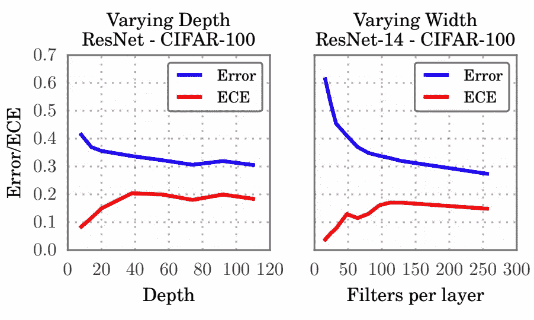
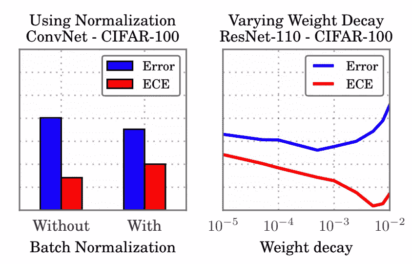
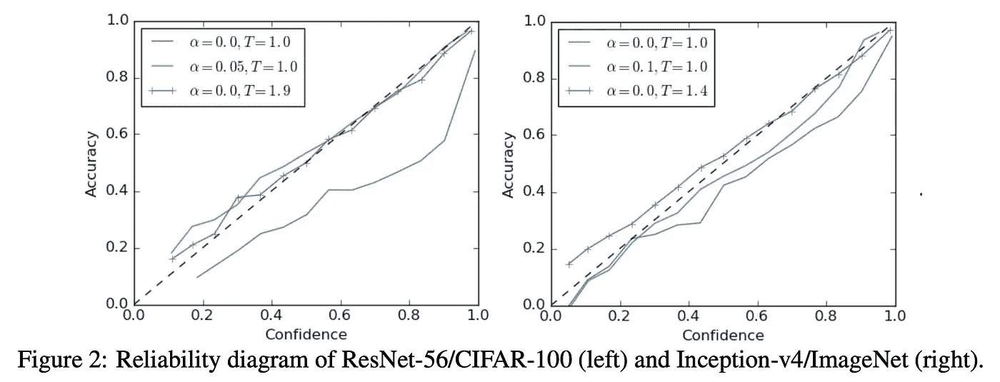
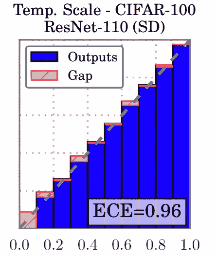

# 关于模型校准的更多信息

> 原文：<https://medium.com/analytics-vidhya/more-about-model-calibration-353dafff9f76?source=collection_archive---------34----------------------->

在上一篇文章[模型校准——专家可能错过的事情](/analytics-vidhya/model-calibration-the-things-that-a-experts-may-miss-62924aef09ed)中，我们已经讨论了模型校准的一些背景信息和测量指标。在本文中，我们将继续我们的探索之旅。

## 模型校准错误的原因

在深度神经网络还没有成为主流的时候，模型失准并不是一个严重的问题。为了确保模型的可靠性，专家们只需要做足够的规范化。但是，当模型越来越大时，故事就变了。

上述曲线表明，较大的模型带来更好的性能，但校准误差更大。

在上面的图中，即测试误差和 ECE 相对于深度 CNN 模型的深度和宽度的图中，我们可以看到误差和 ECE 具有相反的趋势。虽然增加深度和宽度的程度不同，但都提高了性能。但是，我们可以看到，增加尺寸，可靠性越来越差。

当科学家或工程师想要获得更好的模型时，将网络变得更深是一种常见的做法。尽管其背后的机制或理论目前尚不清楚，但深度神经网络的泛化能力来源于此是事实。但这并不适用于模型的可靠性。由于 ECE 反映了置信度图与准确度之间的一致程度，这意味着上述现象表明置信度图的变化与准确度的提高不匹配。

我假设上述现象的原因之一是由于分类模型的贪婪选择的确定性。在概率分类模型中，我们将使用 argmax 进行预测。这意味着，如果你想预测正确的类，你只需要推动该类的信心，以超过其他人一点点的差距。因此，在显著水平上提高精确度并不真的需要在相同程度上提高你的模型置信图，这解释了为什么当测试误差减小时，ECE 变得更差。但是，为什么增加模型大小只是推动具有余量水平的置信图以获得正确的预测，而不是继续推动它以匹配性能改进，这仍然是有待进一步研究的问题。

垂直度量是测试误差或 ECE。

除了规模，我们注意到批量标准化也恶化了模型的可靠性。我觉得原因和型号大小差不多。

但是体重下降的情况很有趣。当衰减因子被设置在一定水平内时，我们实际上可以确保共同提高通用性和可靠性。这意味着置信图的增量和准确度不仅彼此一致，而且它们之间的差距正在缩小，这是我们想要的非常下降的结果。因为如果只是性能提高而可靠性下降，并不会带来太多好处，甚至可能会更糟。模型的可靠性最终会影响到我们是否在推理阶段使用它。这可能是一次彻底的失败。

重量衰减的例子向我们展示了适当的正则化确实有助于误校准问题。但是当然，仅仅应用一些普通的正则化方法，比如 l2 正则化，是不够的。我们将需要一些其他算法来减少 ECE，同时仍然提高精度。

## 标签平滑

标签平滑是一种正则化算法，它在标签的一个热编码表示中为所有类引入均匀的噪声。它使模型能够从真实类之外的类中获取信息。由于有这么多的论文或文章讨论标签平滑，其中一些很好，我不在这里开始长时间的讨论。但其中，我推荐读者应该花点时间阅读[标签平滑什么时候有帮助？](https://arxiv.org/abs/1906.02629)，其中杰弗里·辛顿为作者之一。

这里的标注平滑通过给标注表示引入均匀噪声来减少 ECE。平滑标签编码，不仅可以校准模型，还可以通过很小的努力改善测试误差。但这一秘密背后的机制或理论仍需进一步研究。

## 温度标度

zi 分类层输出在 softmax 之前，用于多类分类。t 是温度系数

温度缩放将通过控制温度来改变分级输出分布。当温度较低时，在 0 和 1 之间，输出的分布将凝结在某个特定的等级，这意味着分布是尖锐的。输出会更确定。另一方面，当温度较高时，在 1 和正无穷大之间，分布将表现得更接近一致。产量会更加不确定。

使用温度标度的大型 ResNet 模型的可靠性图

温度缩放将会变换输出图层，并且肯定会变换置信图。但这里棘手的是，对准确性的影响很小，因为模型只使用 argmax 进行预测，它只贪婪地选择最有信心的一个。所以只要大多数置信等级保持不变，置信图的分布对它就没有影响。因此，它使模型能够独立地调整置信图，使模型在训练过程中得到很好的校准。

在这里，我只向你推荐以上两种算法，它们有助于校准，因为它们在大多数情况下都很容易使用。但是当然，有一些其他的方法也做同样的事情，并且效果也彼此不同。当您需要校准自己的模型时，您可以选择自己的模型来满足您的需要。

到目前为止，我们已经讨论了很长时间的模型校准，这里应该是旅程的终点。然而，关于模型标定还有一些未解之谜。关于它的调查将不会结束。这项研究仍在继续。

如果你喜欢读这篇文章，请毫不犹豫地鼓掌并跟随。更多又酷又有料的文章来了。

参考:

[https://arxiv.org/pdf/1906.02629.pdf](https://arxiv.org/pdf/1906.02629.pdf)—标签平滑什么时候有帮助？

【https://arxiv.org/abs/1706.04599】T2—谈现代神经网络的校准