# 咖啡越多，代码越多，bug 越少？描述统计学简介

> 原文：<https://medium.com/analytics-vidhya/more-coffee-more-code-fewer-bugs-intro-to-descriptive-statistics-4a533ba0115c?source=collection_archive---------15----------------------->

## 如何更好地解释事物，让别人容易理解描述性统计？我会举例说明描述统计学的所有基础知识，提出重要问题并回答。

数据科学就是做预测，如果你不能理解现有数据中的模式，你就不能预测。分析有助于以有意义的方式理解、描述、展示和总结数据。我们将使用一个 [**Kaggle**](https://www.kaggle.com/devready/coffee-and-code) 数据集和 **Python 统计库**，如 **Numpy、Seaborn** 、 **Matplotlib 和 Pandas** 来阐明数据集分析的最常见模式。

**关于数据集的一些话。**这个简短的调查主要针对喝咖啡的程序员。目的是检验程序员喝的咖啡是否高于正常的平均水平，喝的咖啡是否有助于写代码。

> 描述统计学不是在回答问题，而是在提出问题。
> 
> 大家尽量多提问题吧！

群体是你感兴趣的所有人(或所有事物)的整体。它包括一组数据中的所有元素。

> 示例:人口是关于世界上所有程序员消费的咖啡的数据集。


喝咖啡的程序员群体。

**样本(n)** 是从总体中选取的较小群体。

> 示例:样本是参与调查的程序员所喝咖啡的数据子集。


喝咖啡的程序员群体的样本。

> [“样本是你拥有的数据，总体是你*希望*拥有的数据。](https://towardsdatascience.com/what-is-data-8f94ae3a56b4)

**群体参数(μ)** 定义为对整个群体计算的任何数字。示例包括总体均值和总体标准差。但是，您通常没有整个人口的可用数据。因此，该参数为*未知*和*固定*。

> 例如:假设我们有世界上所有程序员喝的咖啡的数据集。如果我们有了整个数据集，我们可以计算平均参数**(μ)=σ(x)/N =(5+4+3+0+5+6+1+3+2+1+1+1+2+1+0+0+1+3+0+1+5+3+4+2+5+2+2+2+1+0)/30 = 2.2**


全世界程序员每天喝咖啡的杯数。

**样本统计量(x̄)** 定义为从样本数据中计算出的任何数字。示例包括样本平均值、中值、样本标准差和百分位数。

> 例子:让我们从一个子集计算程序员每天喝咖啡的平均杯数。样本统计**(x̄)=σ(x)/n =(5+2+0+1+5+3+2+1+2+1+0+0+0+1)/14 = 1.64**


参与调查的程序员每天喝咖啡的杯数。

如你所见，**人口参数**不同于**样本统计**。这种差异称为**采样误差。****抽样误差**是一种统计误差，当分析师没有选择代表全部数据的样本时，就会出现这种误差。***(μ-x̄)=2.2–1.64=0.56.***

## 我们可以使用样本统计数据对人口参数进行有根据的猜测，但我们可能不会 100%准确。

> 什么会使样本统计更接近总体参数？

## 回答:

1.  样本越大，总体参数越接近。
2.  样本必须是随机的。
3.  样本必须是一个群体的无偏代表。

> 这意味着什么，我们的样本必须是一个群体的随机和无偏见的代表？

***这意味着子集的每个成员被选中的概率相等。***

> *随机性的例子:*
> 
> “也许我们能给出的关于****随机分布**** 的科学含义的最好的典型例子是阵雨中雨滴的排列。没有人能猜出一滴水在任何时刻会落到什么地方。但是我们知道，如果我们摊开一张纸，它会逐渐变成均匀的斑点；如果我们在纸上标出任何两个相等的区域，这些将逐渐趋于相同的频率。”
> 
> ——约翰·维恩，《机会的逻辑》，1888 年

# 变量的类型

**自变量**(实验或预测)是在实验中被操纵的变量，目的是观察对因变量的影响。

> 在我们的科学实验中，自变量是程序员每天喝的咖啡杯数。

**因变量**(结果)是科学实验中被检验和测量的变量。

> 在我们的科学实验中，因变量是程序员每天工作的小时数。

# 关系可视化

制作散点图来研究两个变量之间的关系。因此，它通常伴随着相关系数的计算，通常试图衡量线性关系。

> 示例:让我们调查一下自变量(每天的咖啡杯数)和因变量(编码时间)之间是否存在某种相关性。

```
import pandas as pd
import seaborn as sns
import numpy as np
import matplotlib.pyplot as plot# Declare size for pictures
pd.set_option('display.width', 1000)
pd.set_option('display.max_columns', 20)# Data preparation
df = pd.read_csv('C:../DataSet/CoffeeAndCodeLT2018.csv')def look_at_data(dataset):
    print(dataset.head(10))
    print(dataset.info())
    print(dataset.shape)
    print(dataset.describe())
    print(dataset.columns)look_at_data(df)df.plot.scatter(x='CoffeeCupsPerDay', y='CodingHours')plot.show(block=True)
```

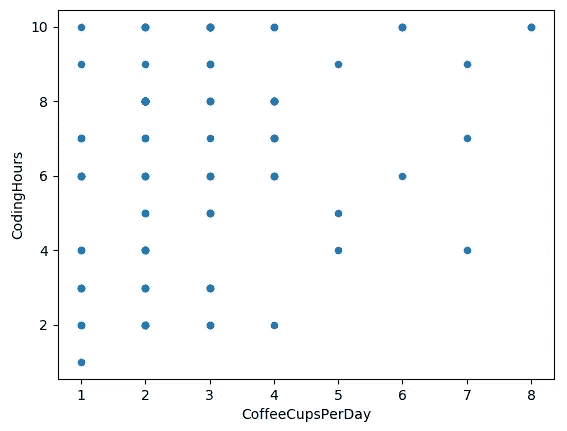

> 例子:如你所见，变量之间没有任何关联。

> 我们能得出喝咖啡的杯数不影响编码时间的结论吗？

## 回答:不，我们不能。

但是我们可以说，咖啡的杯数并不影响编码时间。因为我们不可能 **100%准确的**在我们的假设基础上进行样本统计。

> 例子:如果这些变量相关，我们能说咖啡的杯数倾向于影响编码小时数吗？**不，我们不能。因为:**

> 相关性不能证明因果关系。

## 学习方法

当人们读到一项研究时，他们可能不会注意这项研究是如何设计的。我们通过研究收集信息并得出结论。我们得出的结论类型取决于所用的研究方法:

在一项**观察性研究***中，我们在不试图影响样本成员的情况下对他们进行测量或调查。*

> *观察研究= >显示关系*

> *例如:我们提供的调查是一项观察性研究。我们采访了程序员，询问他们在编码过程中喝了多少咖啡。*

*在**对照实验** *，*中，我们将人或物分组，对其中一组进行一些治疗，而另一组不接受治疗。*

> *受控体验= >显示因果关系*

> *例子:如果我们有两组程序员，一组在编码时喝咖啡，另一组不喝，这将是一个受控实验。而且实验是在同一个房间里进行的，一天中的一部分或者考虑到了另一个可以对调查结果产生影响的因素。*

> *是什么使得从观察性研究的数据中做出因果陈述变得困难？*

## *答案:无关的(或潜伏的变量)*

*潜在变量是指可能影响两个或更多变量之间关系的因素。这就是为什么在我们做出一个自信的因果陈述之前，它应该在一个实验中得到控制。*

> *在我们的调查中，只有一部分程序员来自一个国家，所以数据可能会有偏差。此外，一些回答可能不真实，一些回答者可能以错误的方式理解问题。我们没有问他们通常在一天中的哪个时段喝咖啡，但这个因素可能会影响调查结果。*

> *在一项实验中，研究人员操纵自变量，测量因变量的变化，并试图控制潜在变量。*

## *数据可视化*

> *为什么我们应该可视化数据？*

***回答:**因为只是有数据表，很难快速下结论。它可以帮助我们看到模式，描述数据和做决定。*

*我们可以计算**频率，即相对频率百分比，而不是从有大量无序数据的表格中得出结论。***

***频率**是给定数据在数据集中出现的次数。*

> *有多少男性参加了调查？有多少女性倾向于在编码时喝咖啡？*

```
*In:
print(df['Gender'].value_counts())Out:
Male      74
Female    26*
```

***相对频率**是一个答案出现的次数的分数。它也经常被表示为一个**百分比**，你应该将一个相对频率乘以 100。*

> *例子:参加调查的女性程序员的比例是多少？参与调查的男性程序员比例是多少？*

```
*In:
print(df['Gender'].value_counts(normalize=True))Out:
Male      0.74
Female    0.26In:
print(df['Gender'].value_counts(normalize=True)*100)Out:
Male      74.0
Female    26.0*
```

> *所有比例始终介于或等于 0 和 1 之间。*
> 
> *对于任何频率表，相对频率应加 1。*

## *频率条形图*

*一个**条形图**，用于将一个类别或特征的**频率**与另一个类别或特征进行比较。*

> *举例:参与调查的程序员中有多大比例的人认为喝咖啡有助于修复 bug？*

```
*sns.countplot(df['CoffeeSolveBugs'])
plot.show()*
```

*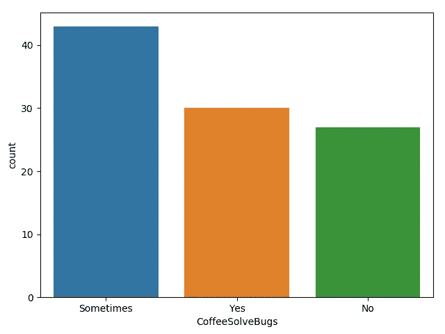*

***频率分布**，在统计学中，一种[图](https://www.britannica.com/science/graph-mathematics)或数据集，组织起来显示多次观察到的可重复事件的每个可能结果的出现频率。*

***频率直方图**是频率分布的图形版本，其中矩形的宽度和位置用于指示各种类别，这些矩形的高度指示数据落入相关类别的频率，如下例所示。*

> *例子:程序员每天喝的咖啡杯数据的分布。*

```
*fig, ax = plot.subplots()
ax.hist(df['CoffeeCupsPerDay'], bins=8, color='c', edgecolor='k', alpha=0.65)
ax.set_xlabel('CoffeeCupsPerDay')
ax.set_ylabel('Frequency')
plot.show()*
```

*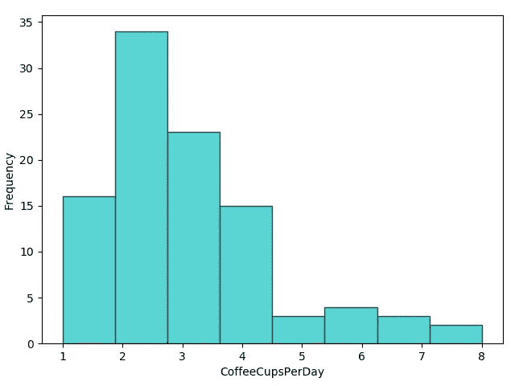*

## *箱子大小*

*要用直方图可视化数据，我们必须将整个范围的值划分为一系列区间，然后计算每个区间内有多少个值。每个间隔是 1 个仓。**箱尺寸**等于直方图中箱的数量。*

*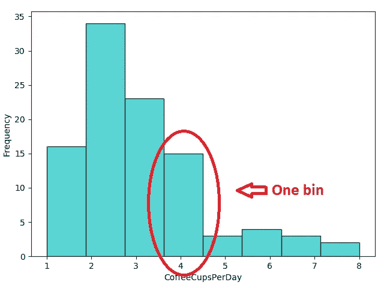*

> *示例:咖啡杯分布数据的箱大小为 8。*

> *为什么当我们用直方图可视化数据时，随着仓尺寸变大，频率变大？*

***答:**当我们把容器变大时，更多的值将落入容器中。*

## *太宽的面元可能会隐藏关于分布的重要细节，而太窄的面元可能会产生大量噪声，并且还会隐藏关于分布的重要信息。*

## *什么是集中趋势？*

***中心倾向**是指有一个单一的值可以描述一整组数据，并代表其分布的中间或中心。*

# ***集中趋势的度量***

*最常见的集中趋势测量方法是算术平均值**、中位数**、众数**和众数**。*****

*****Mean** 是所有数值的数值平均值。***

> *****σ(x)/n*****

> ***举例:程序员每天喝的咖啡杯的平均值是多少？***

```
***fig, ax = plot.subplots()
ax.hist(df['CoffeeCupsPerDay'], bins=8, color='c', edgecolor='k', alpha=0.65)
ax.set_xlabel('CoffeeCupsPerDay')
ax.set_ylabel('Frequency')
plot.axvline(df['CoffeeCupsPerDay'].mean(), color='k', linestyle='dashed', linewidth=1)
min_ylim, max_ylim = plot.ylim()
plot.text(df['CoffeeCupsPerDay'].mean()*1.1, max_ylim*0.9, 'Mean: {:.2f}'.format(df['CoffeeCupsPerDay'].mean()))
plot.show()***
```

***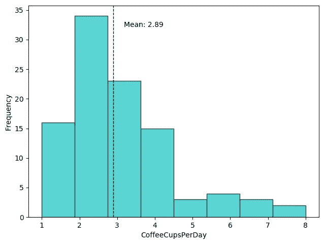***

*****中值**是直接位于数据集中间的值。***

***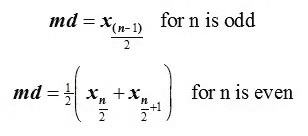***

> ***例如:大多数程序员每天喝多少杯咖啡？***

```
***fig, ax = plot.subplots()
ax.hist(df['CoffeeCupsPerDay'], bins=8, color='c', edgecolor='k', alpha=0.65)
ax.set_xlabel('CoffeeCupsPerDay')
ax.set_ylabel('Frequency')
plot.axvline(df['CoffeeCupsPerDay'].median(), color='k', linestyle='dashed', linewidth=1)
min_ylim, max_ylim = plot.ylim()
plot.text(df['CoffeeCupsPerDay'].median()*1.1, max_ylim*0.9, 'Mean: {:.2f}'.format(df['CoffeeCupsPerDay'].median()))
plot.show()***
```

***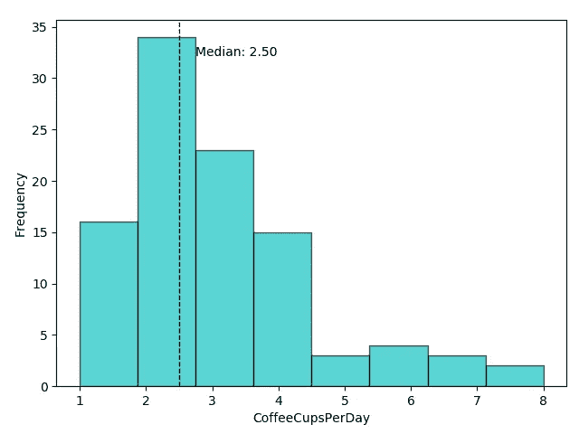***

*****模式**是数据集中最常见的值。***

> ***例如:大多数程序员每天经常喝多少杯咖啡？***

```
***fig, ax = plot.subplots()
ax.hist(df['CoffeeCupsPerDay'], bins=8, color='c', edgecolor='k', alpha=0.65)
ax.set_xlabel('CoffeeCupsPerDay')
ax.set_ylabel('Frequency')
plot.axvline(df['CoffeeCupsPerDay'].mode()[0], color='k', linestyle='dashed', linewidth=1)
min_ylim, max_ylim = plot.ylim()
plot.text(df['CoffeeCupsPerDay'].mode()[0]*1.1, max_ylim*0.9, 'Moda: {:.2f}'.format(df['CoffeeCupsPerDay'].mode()[0]))
plot.show()***
```

***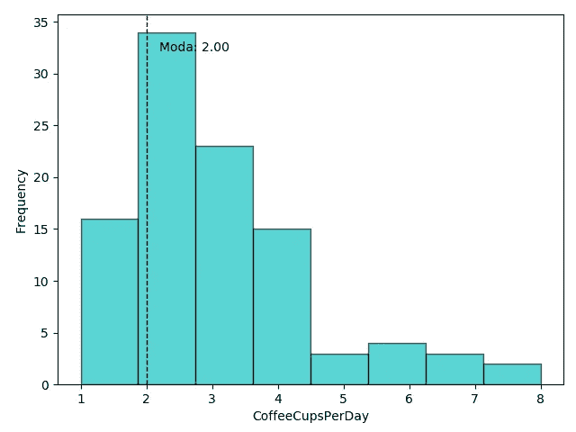***

***如果两个值同时出现并且多于其余的值，那么数据集是**双峰**。如果三个值同时出现并且多于其余的值，则数据集为**三模态**，对于 n 个模式，数据集为**多模态**。如果分配是**统一的**，则它没有**模式。*****

> ***均值和众数对异常值非常敏感。当分布中有异常值时，均值和众数可能会产生误导。***

# ***差异量数***

***集中趋势的度量不足以描述数据。你还需要量化数据点分布的可变性的**度量。*****

> ***我们如何量化分布的延展性或一致性？***

*****答案:**计算分布的范围。***

## *****范围*****

*****范围**是观察到的最大值和最小值之间的差值。***

```
***r=df['CoffeeCupsPerDay'].max()- df['CoffeeCupsPerDay'].min()
print('Range: ',r)***
```

> ***示例:咖啡杯数据的分布范围是 8–1 = 7。***

## *****四分位数*****

*****四分位数**是数据集中的点，它将数据集分成四个相等的部分。Q1、Q2 和 Q3 是数据集的第一、第二和第三个四分位数。***

1.  ***Q1 是这样一个点，其中 25%的分布低于该点，75%的数据高于该点。***
2.  ***50%的数据点位于 Q2 下方，50%位于其上方。Q2 不过是个中等水平。***
3.  ***Q3 是 75%的分布低于该点，25%的数据高于该点的点。***

*****四分位数间距(IQR)** 是 Q1 和第三季度四分位数之间的距离，给出了数据中间 50%的范围。***

> ***例: **IQR** = Q3-Q1 = 4-2 = 2***

***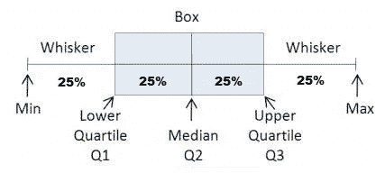***

```
***fig, ax = plot.subplots()
ax.boxplot(df['CoffeeCupsPerDay'], vert=False, showmeans=True, meanline=True, patch_artist=True,
           medianprops={'linewidth': 2, 'color': 'purple'},
           meanprops={'linewidth': 2, 'color': 'red'})
ax.set_xlabel('CoffeeCupsPerDay')
ax.set_ylabel('Frequency')
plot.show()***
```

***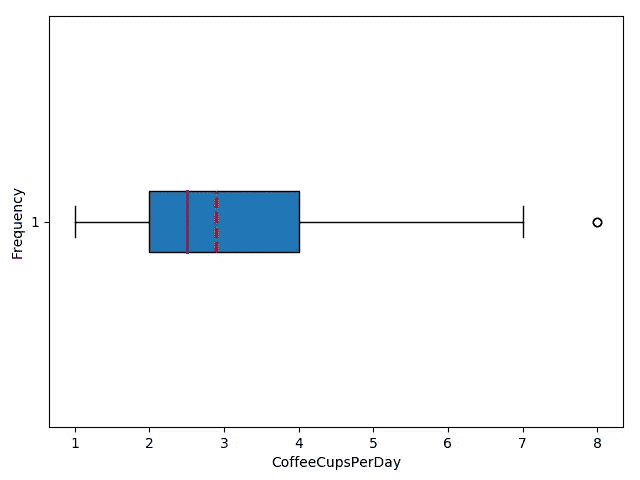***

> ***示例:***
> 
> *****中间的**是红色虚线。***
> 
> *****中间的**是紫线。***
> 
> *****第一个四分位数**是蓝色矩形的左边缘。***
> 
> *****第三个四分位数**是蓝色矩形的右边缘。***
> 
> *****四分位范围**是蓝色矩形的长度。***
> 
> *****范围**包含从左到右的所有内容。***
> 
> *****异常值**是右边的点。***

## *****异常值*****

***一个**异常值**是一个数据点，它明显不同于从一个样本或总体中提取的大多数数据。异常值有许多可能的原因:数据的自然变化、被观察系统行为的改变、数据收集中的错误。如果某个值是**<Q1–1，5 * IQR** 或 **> Q1 + 1，5 * IQR** ，则该值被视为**异常值*****

> ***如何处理离群值？***

*****答:**统计学家通常切尾(Q1 之前的数据和 Q3 之后的数据)，考虑中间的数据值。***

## *****平均值的绝对偏差*****

*****与平均值的绝对偏差—** 通过找出每个数据值与平均值之间的平均距离来描述数据集中的变化。***

***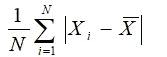***

```
***print(df['CoffeeCupsPerDay'].mad())***
```

> ***示例:程序员每天喝的咖啡杯数据分布的平均绝对偏差= 1.21***

## *****差异*****

*****方差**衡量数据点与平均值的差距。高方差表示数据点分布广泛，而低方差表示数据点更接近数据集的平均值。***

***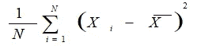***

```
***print(df['CoffeeCupsPerDay'].var())***
```

> ***例如:程序员每天喝的咖啡杯数据的分布的标准方差= 2。36860 . 68636868661***

## *****标准偏差*****

*****标准差**是方差的平方根。***

***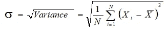***

```
***print(df['CoffeeCupsPerDay'].std())***
```

> ***例如:程序员每天喝的咖啡杯数据的分布的标准偏差= 1。18960 . 688686886617***

*****标准差**允许我们对分布中的特定分数得出一些结论:***

*   ***样本中大约 68%的分数落在平均值的一个标准偏差内***
*   ***样本中大约 95%的分数落在平均值的两个标准偏差内***
*   ***样本中大约 99%的分数在平均值的三个标准偏差范围内***

## *****偏斜度*****

*****偏斜度**是对分布对称性的测量。对分布的偏斜度的一个很好的度量是皮尔逊偏斜系数，它提供了对分布的对称性的快速估计。***

***计算偏斜度最常用的方法是***

***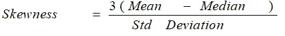******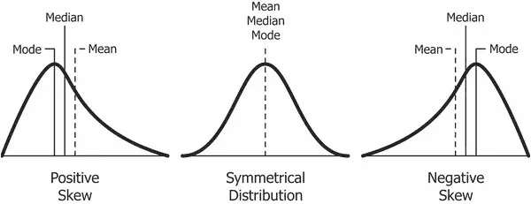***

***[来源](https://en.wikipedia.org/wiki/Skewness)***

```
***fig = sns.distplot(df['CoffeeCupsPerDay'], hist=True, kde=True,
             bins=8, color = 'c',
             hist_kws={'edgecolor':'black'},
             kde_kws={'linewidth': 4})
fig.set_xlabel('CoffeeCupsPerDay')
fig.set_ylabel('Frequency')
plot.show()
print(df['CoffeeCupsPerDay'].skew())***
```

***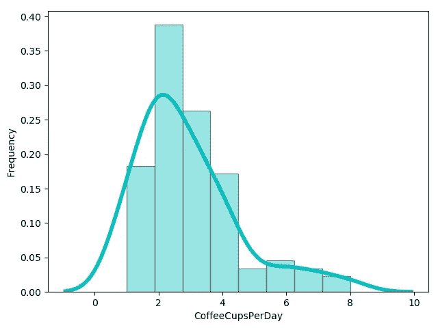***

> ***例如:程序员每天喝的咖啡杯数据的分布是正偏态的。在要求的轴上的无偏偏斜系数= 1。18960 . 688688886617***

> ***如果偏斜度为零，则分布是对称的。如果是负的，分布是负偏态的，如果是正的，分布是正偏态的。***

## *****峰度*****

*****峰度**是数据相对于正态分布是重尾(大量离群值)还是轻尾(缺少离群值)的度量。***

***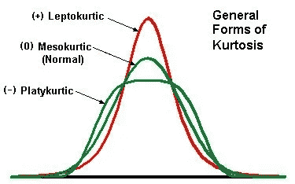***

***[来源](https://financetrain.com/interpretation-of-skewness-kurtosis-coskewness-cokurtosis/)***

# ***理论正态分布***

***所有的统计测试都需要正态分布的数据，但这通常不会发生。**现实生活中的数据很少遵循完美的正态分布**。如果你的数据是对称的、钟形的、居中的和单峰的，则给出正态分布。***

> *****表示**正态分布**的**、**中位数**和**众数**相等。**法线曲线**下的面积等于 1。正态分布是完全对称的。***

***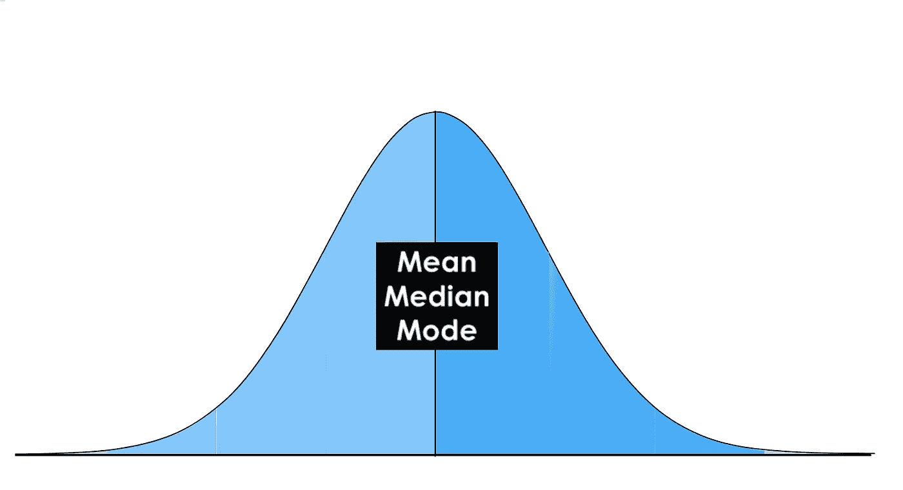***

***正态分布([来源](https://towardsdatascience.com/intro-to-descriptive-statistics-and-probability-for-data-science-8effec826488))***

***在下一篇中帖中，我们将讨论中心极限定理和 Z 分数。***

***我欢迎反馈和建设性的批评，可以通过 Gmail[*Nataliia Rastoropova*](https://medium.com/u/360f48188f63?source=post_page-----4a533ba0115c--------------------------------)*联系。****

 ***[## 乌达城

### 编辑描述

classroom.udacity.com](https://classroom.udacity.com/courses/ud827)*** ***[](https://www.kaggle.com/devready/coffee-and-code) [## 咖啡和代码

### 程序员喝咖啡多吗？(黎巴嫩的情况)

www.kaggle.com](https://www.kaggle.com/devready/coffee-and-code) [](https://towardsdatascience.com/descriptive-statistics-f2beeaf7a8df) [## 描述统计学

### 什么是统计学？

towardsdatascience.com](https://towardsdatascience.com/descriptive-statistics-f2beeaf7a8df)***