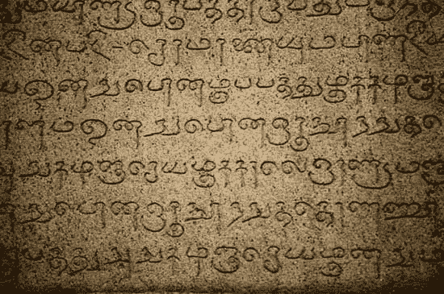

# தமிழ்的形态学处理

> 原文：<https://medium.com/analytics-vidhya/morphological-processing-for-%E0%AE%A4%E0%AE%AE%E0%AE%BF%E0%AE%B4%E0%AF%8D-e3afe8e20a4c?source=collection_archive---------11----------------------->

加入 Saama 研究团队后，我很高兴开始为我的母语泰米尔语进行自然语言处理。在 NLP 研究领域工作了整整 8 年，我很兴奋地看到我们如何将最先进的 NLP 技术应用于这种低资源语言。由于英国的殖民主义和帝国主义政策，在 1945 年第二次世界大战结束时有效地结束了，他们留下了他们系统篡夺的两个主要遗迹——(a)英联邦和(b)建立英语作为全球通用语言。当欧洲的许多地方在政治上和 NLP 空间中维护他们的语言身份时，印度一直在缓慢但坚定地对他们无数的语言做同样的事情。自然，在数字空间中保存古典时代最古老的语言是一件令人满意的事情。

约公元 1000 年在 Brihadeeshwara 寺庙的泰米尔文字

## **தமிழ்的特色**

தமிழ்在许多方面与英国不同。

1.  泰米尔语的句子顺序是多余的。主语、动词和宾语可以自由互换，语法上仍然正确。
2.  泰米尔语是一种粘合性语言——也就是说，后缀起着重要的作用。后缀可以以多种方式添加，让一个词有机地增长，创造一个有意义的词。这导致几乎无限的语法正确的单词不能被存储。
3.  字母之间的细微差别会大大改变意思。从统计学的角度来看，这更有意义。
4.  与印度雅利安语相比，泰米尔语对上下文极其敏感。例如，在改变句子顺序时，可能需要使用不同的后缀。

## தமிழ்最先进的自然语言处理系统

在英语 NLP 研究中，深度学习算法是构建语言模型的主导范式。即便如此，部署在移动设备上的应用程序仍然依赖于统计机器学习来构建轻量级应用程序。

由于(a)数据的缺乏和(b)与英语相比，处理这种复杂性需要更大的语言资源，泰米尔语的神经结构离实用还相差甚远。

尽管有这些挑战，最近在神经领域的工作已经完成。例如，泰米尔语 word2vec 和 BERT 模型已经进行了实验。

在 Saama research，我们现在正在构建一个开源的泰米尔语拼写检查器。如前所述，有了后缀，一个派生单词就有无限多种拼法。这篇文章是关于使用形态学规则扩展拼写检查器的准确性，以便不仅纠正词典中的单词，而且纠正它的转换形式。

## 什么是形态过程？

在语言环境中，形态学是对句法结构和语法的研究。就讨论的范围而言，我们仅限于研究后缀如何影响单词的结构。第一个概念是，两个词不是简单地连在一起的。大多数印度语言都有这个特点，用拼写的微小变化来表示拼接，通常称为**。*接下来，我们描述形态学处理的类型。*

***词尾变化**—在保留类别(如名词、动词等)的同时添加后缀。例如，通过添加后缀，பூனை(猫)变成了பூனைகள்(猫)，但是名词的类别被保留。(单数名词到复数名词)*

***派生**—添加后缀导致类别变化。举例来说，வீரம்(勇敢:名词)变成了வீரமான(勇敢:形容词)*

***复合词**——由两个词组合成一个新词。这可以用கண் +நீர் - > கண்ணீர்.来举例说明*

## *模拟形态学*

*形态学传统上使用有限状态传感器进行建模 [(Jurafsky，2013)](https://www.amazon.in/Speech-Language-Processing-Introduction-Computational/dp/9332518416/ref=sr_1_1?crid=2DAUI78V57LJ3&dchild=1&keywords=speech+and+language+processing+by+jurafsky+and+martin&qid=1590753830&s=digital-text&sprefix=speech+and+language+processingaksh%2Cdigital-text%2C-1&sr=1-1) 。有限状态转换器(FST)非常类似于我们在计算理论中研究的基本确定性有限自动机(DFA)。在 DFA 中，我们建立模型，以便接受或拒绝正则表达式。换句话说，我们只有一个输入磁带。另一方面，在 FST 中，我们有输入磁带和输出磁带。因此，正则表达式不仅仅是被接受或拒绝，而是从一个转换到另一个。这也是一个可逆过程。*

*比方说，在英语中，我们有一个 FST 来构成单词的复数形式。可以制定基本规则来说明是否需要添加“s”或者是否要添加“es”。精明的读者会意识到，不规则代码仍有很大的空间，需要手工编码。由于这个过程是可逆的，单数可以转换成复数，反之亦然。*

*然而，在泰米尔语中，创建它们的复杂性很高。如前所述，可以通过多种方式应用屈折、派生和复合来获得一个无法识别的长单词。此外，由于性别、时态、大小写等因素，词形变化也可能大相径庭。在研究文学方面，在泰米尔语的[词法分析器](http://www.au-kbc.org/research_areas/nlp/projects/morph.html)有稳定的工作。然而，我很难找到一个轻量级的开源实现。最近在[马拉雅拉姆语](https://www.aclweb.org/anthology/W19-6801/)(泰米尔语的近亲)中的一个开源实现揭示了这项任务有多复杂，从提出定制的 POS 标签(数量为 87 个)到将词典中的单词注释为大量类别(如名词、人名、地名、后缀、代词、量词、缩写、形容词、动词、副词、肯定词、连词、指示词、英语借用名词、梵语词根名词、感叹词、语言名称等等)。这些手工注释为形成形态学过程的规则奠定了基础。*

## *结束语*

*即使对英语来说，制作最新技术量表也是一项艰巨的任务。随着泰米尔语的复杂性，应用传统的方法进行词法分析变得更加贴切。检查同样的规则，不禁让我想起了普林斯顿大学开发 WordNet 的十年努力。我也相信轮子的重新发明正在发生，因为我从 2011 年就看到了许多作品，描述了泰米尔语词法分析器的实现。当务之急是有一个相同的开源实现。*

*话虽如此，我也对什么样的统计方法可以应用于同样的问题感到兴奋。孩子们不学习词形变化的规则，而是把它们记在记忆里。通过使用这种语言，他们有机地学习。我可以想到一种简单的方法，使用带注释的数据集将基本形式转换为变形形式(可以使用简单的子集/超集规则来爬行)。这也适用于词典中的未知单词。尽管这是一种更通用的方法，但这也是一项复杂的任务。*