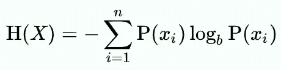

# தமிழ்的形态学处理——无监督方法

> 原文：<https://medium.com/analytics-vidhya/morphological-processing-for-%E0%AE%A4%E0%AE%AE%E0%AE%BF%E0%AE%B4%E0%AF%8D-the-unsupervised-way-68afebc388c4?source=collection_archive---------17----------------------->

这是泰米尔语 NLP 系列文章的一部分。请在这里找到第一个[。](/@sowmyassundaram/morphological-processing-for-தமிழ்-e3afe8e20a4c)

总结之前的帖子，泰米尔语是一种粘合性语言，可以通过潜在的无限后缀构成复杂的单词。我们将形态学定义为研究单词如何改变形式来描述意义的变化。然后，我们描述了如何有限自动机的衍生物，有限状态转换器(FST)可以用于形态分析和生成。

在这篇文章中，我们描述了传统的低资源语言中最重要的瓶颈之一——分析数据和提出形态学分析规则的昂贵开销。文献中的大部分作品表明需要繁琐而冗长的规则。从我自己学习英语的经验来看，在为一项看到 300 多个句子的任务编写规则后，我在一个看不见的 500 个句子的数据集上获得了 0%的准确率。引用[的一篇](https://www.aclweb.org/anthology/W12-5611/)论文:

> 对于泰米尔语，我们已经确定了名词的 **716** 屈折规则和动词的 **519** 规则。

## 无监督设置

在这篇文章中，我们探索一种无监督的形态分析方法。这样，我们的意思是，我们使用一个原始的、未标记的泰米尔语语料库来提出一套规则。为此，我们将使用[约翰·金史密斯(2001)](https://dl.acm.org/doi/10.1162/089120101750300490) 的开创性工作。这项工作产生了基于模式识别自动提取词干和后缀的软件[](http://people.cs.uchicago.edu/~jagoldsm/linguistica-site/)**。我将基于英语解释这项工作，然后展示它在泰米尔语中的表现。**

## **语言学的方法**

**语言学家的想法是提出一组描述词干和一组后缀/前缀(词缀)的 ***签名*** 。例如，单词/词干“play”可以转换为{“plays”、“played”、“playing”、“player”、“play”}。签名基本上是后缀{'-s '，'-ed '，'-ing '，'-er '，' ' }的模板。该算法扫描语料库以寻找频繁模式。**

**这种分析有一个问题:不是所有以'-ing '结尾的词都代表现在进行时(sing，string 等。).同样，以“-y”结尾的单词出现的频率会比“-ty”多得多。语言学家通过使用**最小描述长度优雅地处理了这类突出的问题。****

## **最小描述长度**

**最小描述长度是从信息论中借用的概念。简而言之，它将系统的熵描述为:**

****

**通俗地说，以“2”为基数的对数(某物)，给出了表示该“某物”所需的位数。为了测量我们需要编码的平均信息量，我们测量事件概率的比特数，用它的概率加权。负号与概率是分数这一事实有关。这里的直觉是，如果一个事件的概率是 1/4，那么就有 4 种可能性，我们真正想要的是 log(4)。这由负号 log(4) = -log(1/4)捕获。**

**现在，独立于语料库，系统的熵度量系统有多“紧凑”。在我们的上下文中，在各种签名和后缀中，这个熵的度量，称为“最小描述长度”，让我们知道我们提出的系统是如何紧凑和有效的。这包含了我们在上一节中看到的许多问题的元素。**

**在形态学上下文中，我们测量单词的概率，每个单词由词干和签名组成。**

## **泰米尔语语料库语言学**

****

**我最初试图在马杜赖项目的整套作品中运行代码。因为我的系统的统计数据不足以处理这些数据，所以我使用了一个在[开源库](https://github.com/sarves/thamizhi-morph)中可用的相对较小的单词列表。**

**你不会相信这个代码有多简单。**

```
import linguistica as lxalxa_object = lxa.read_corpus(file_path='Unique-nouns.txt')
print(lxa_object.run_signature_module(verbose=True))
print(lxa_object.signatures())
```

**从这个大约 25000 个名词的数据集中，我能够提取 236 条规则。同样，对于动词，我有 189 条规则。我在下面给你一些摘录的规则供你参考。词干也是从语料库中提取的。**

**茎-茎，茎+க்கு[如செலவு，செலவுக்கு]**

**茎-茎，茎+ த்தை，茎+ மும்，茎+ம்[如பிரஸாத，பிரஸாதத்தை，பிரஸாதமும்，பிரஸாதம்]**

**可以看出，所获得的规则是一个很好的起点。有些问题是可以预见的，尤其是在应用多个后缀的时候。然后，词干化过程也可以在词干中包括后缀。例如，தேசத்து被认为是தேசத்துக்கு.的主干然而，正确的引理是'தேசம்'，词干是'தேச'.该程序没有考虑字母的*转换*，仅仅是由于词干的定义。尽管存在这些滞后，但它构成了一个令人生畏的起点。**

## **结束语**

**通过一个中等大小的数据集，我能够挖掘出一组具有代表性的规则。虽然我承认可能会有错误，也承认它没有解决诸如 FST 这样的语言的无限粘合性，正如在以前的帖子中提到的，但与从头开始编写所有这些规则相比，它提供了一个公平的起点。换句话说，这个练习提供了设计 FST 的数据。这是因为检验和解构一套词法规则比 T2 从头生成一套更容易。**