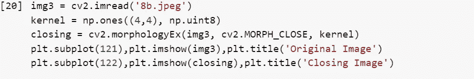
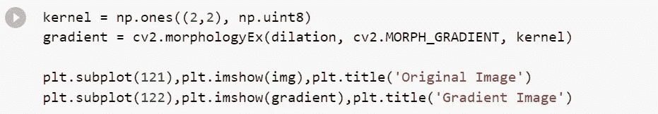

# 使用 OpenCV 的图像形态变换|图像处理第 2 部分

> 原文：<https://medium.com/analytics-vidhya/morphological-transformations-of-images-using-opencv-image-processing-part-2-f64b14af2a38?source=collection_archive---------0----------------------->

在本文中，我们将学习如何用 Python 语言执行更多的图像处理算法。

关于 Python 中图像处理的介绍，什么是图像处理，如何在你的系统上安装 OpenCV，可以参考我的文章-

> [*使用 OpenCV 进行图像的几何变换|图像处理 Part-1*](/@ravjot03/geometric-transformations-of-images-using-opencv-image-processing-part-1-828c9bf98aa7)

# 让我们开始使用 OpenCV 库-

## 1.导入所需的库:

> *cv2* -用于 OpenCV(用于图像处理)
> 
> *matplotlib* -用于 matplotlib(用于绘图和可视化)
> 
> *numpy* -用于 numpy(用于科学计算)
> 
> 熊猫- *为熊猫(用于数据分析)*

所需的库

## 2.使用 OpenCV 库读取图像:

我们可以使用 OpenCV 和 Matplotlib 库来读取图像。

打开图像

## 3.图像的形态变换；

> ***理论***—
> 
> *形态变换是基于图像形状的一些简单操作。它通常在二进制图像上执行。它需要两个输入，一个是我们的原始图像，第二个叫做* ***结构元素*** *或* ***内核*** *，它决定了操作的性质。两种基本的形态学算子是腐蚀和膨胀。然后，它的变体形式，如开放，封闭，梯度等也开始发挥作用。*

***目标-***

*   我们将学习不同的形态学操作，如腐蚀、膨胀、打开、关闭等。
*   我们将看到不同的函数，如:cv2.erode()、cv2 . explain()、cv2.morphologyEx()等。

**3A)侵蚀**

侵蚀的基本概念就像土壤侵蚀一样，它侵蚀掉前景物体的边界。内核滑过图像(如 2D 卷积)。只有当内核下的所有像素都是 1 时，原始图像中的像素(1 或 0)才会被视为 1，否则它会被侵蚀(变为零)。

在这里，作为一个例子，我将使用一个 3x3 的内核，其中充满了 1。让我们看看它是如何工作的:

**3B)膨胀**

它与侵蚀正好相反。这里，如果内核下至少有一个像素为‘1’，则像素元素为‘1’。因此它增加了图像中的白色区域或前景物体的尺寸。通常，在像噪声去除这样的情况下，侵蚀之后是膨胀。因为，侵蚀去除了白噪音，但也缩小了我们的物体。所以我们扩大它。既然噪音没了，他们就不会回来了，但是我们的对象面积增加了。它在连接物体的断裂部分时也很有用。

**3C)开场**

开放只是膨胀之后的侵蚀的另一个名字。正如我们上面解释的那样，它在消除噪声方面很有用。这里我们使用函数， **cv2.morphologyEx()。**

**3D)关闭**

关闭与打开相反，**膨胀后侵蚀**。它在关闭前景对象内的小孔或对象上的小黑点时很有用。

**3E)形态梯度**

这是图像膨胀和腐蚀的区别。

结果将看起来像物体的轮廓。

**3F)高帽**

这是输入图像和打开图像之间的区别。下面的例子是为一个 5x5 内核做的。

**3G)黑帽子**

它是输入图像和输入图像的闭合之间的差异。

这就把我们带到了本文的结尾。希望你已经很清楚的理解了 Python 中 OpenCV 的图像处理基础知识。 ***确保尽可能多的练习*** 。

请留意本系列中的其他 [Jupyter 笔记本](https://github.com/Ravjot03/Image-Processing)，它们将解释使用 Python 中的 OpenCV 进行图像处理的各个其他方面。

如果你想查看更多与数据科学和机器学习相关的资源，你可以参考我的 [Github 账户](https://github.com/Ravjot03)。

希望你喜欢这个帖子。