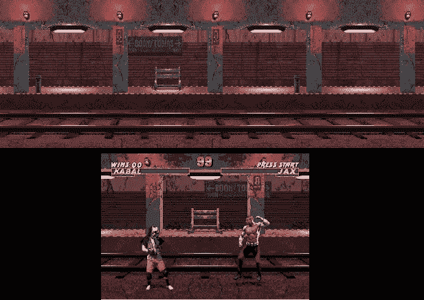
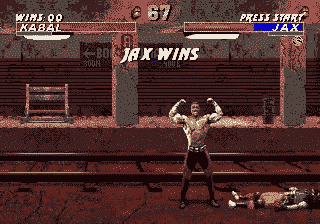
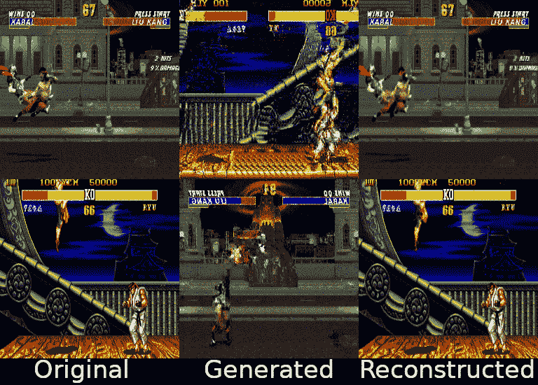

# 凡人战士(或街头 Kombat)图片到图片转换真人快打成为街头战士

> 原文：<https://medium.com/analytics-vidhya/mortal-fighter-or-street-kombat-picture-to-picture-transformation-of-mortal-kombat-into-street-3b0c6b004dc7?source=collection_archive---------13----------------------->

作为研究强化学习(RL)代理的迁移学习的更大努力的一部分，我使用 CycleGAN [1]对世嘉创世纪游戏《真人快打 3》(MK)和《街头霸王 2》(SF)进行了不成对的图像到图像翻译。这个项目的灵感来自于相关 atari 游戏之间的图像到图像转换迁移学习[2]。我想在一个视觉上更复杂的环境中测试迁移学习技术，看看我是否能取得类似的结果。本文将主要关注该项目的图像到图像的翻译部分，我将介绍数据集的创建和 CycleGAN 在生成的数据集上的训练。

**数据集创建和预处理**

我为这个项目创建的数据集很大，而且非常具体，所以与其分享图像本身，我不如详细说明我是如何收集图像的，并讨论在为 CycleGAN 构建数据集时需要注意的一些问题。

我用来训练 RL 特工的视频游戏环境是 OpenAI 健身房复古图书馆[3]。Gym Retro 提供了一个易于使用的视频游戏模拟器界面，并使输出视频可作为图像逐帧。收集图像的一个简单方法是使用[健身房复古文档](https://retro.readthedocs.io/en/latest/getting_started.html)中提供的随机动作代理，并使用 OpenCV 或 matplotlib 保存每个时间步的观察图像。我使用 OpenCV 每 90 个时间步长采样一张图片，并在我的最终数据集中从每场比赛中收集了大约 7000 张图片。虽然使用随机代理收集图像非常容易，但它可能无法覆盖整个视频游戏环境。在我的例子中，当角色移动时，MK 和 SF 滚动到左边和右边，随机行动代理主要停留在关卡的中心，而 RL 代理随着比赛的进行倾向于移动到地图的最左边。使用由随机代理生成的数据集提供了水平中心的良好变换，但是左极端的差变换，因为它在数据集中表示不足。

满级在顶部，游戏显示在底部

在图像到图像的转换中，我希望背景和角色风格(如服装)被转换，因此在 RL 代理被训练的图像和新环境之间会有相似性，但保留角色的位置和方位，以便保留代理做出动作选择所需的信息。为了做到这一点，我发现被转换图像的特征是数据集中所有图像的一致特征，而被保留的特征是数据集中不相似的特征。例如，在两个游戏中，所有图像的背景都非常一致。虽然在两个游戏中，当角色移动时，屏幕会左右滚动，但它被限制在关卡的边缘，因此在每个数据集的 7000 张图像中，背景的相同部分会经常出现。对于角色服装和风格，由于在每个数据集中只有两个角色，所以在每个图像中也可以看到角色服装。所以为了保存角色的位置，当我收集图像时，我试图通过每 90 帧采样来收集尽可能多的独特角色位置。我选择每 90 帧采样一次，因为 Sega Genesis 模拟器以每秒 30 帧的速度运行，两秒钟的时间似乎足够让角色从上一个样本中发生实质性的移动。

收集完数据后，我必须在预处理中解决一些问题。第一个问题是图像大小，《街头霸王》和《真人快打》都是世嘉创世纪游戏，但它们的分辨率不同。SF 和 MK 图像分别是 256x200 和 320x224，我选择将 SF 图像拉伸到 MK 图像大小，以便保持所有未来的域之间的转换一致。另一个问题是游戏中的电影和过场动画。出于我的目的，我只需要在角色可由代理控制时转换图像，所以我删除了匹配倒计时图像，以便将转换集中在最相关的图像上。后来，我发现也有必要删除比赛胜利的图像，因为它们导致 CycleGAN 无法训练。

胜利屏幕

在 MK 中也有一个复杂的情况，每张地图有两个关卡，在我的情况下，比赛从地铁关卡开始，但可以根据角色的动作过渡到街道关卡。我将 MK 水平分成两个独立的数据集，以便在 MK 和 SF 域之间进行一对一的转换。由于 CycleGAN 单独对每个图像进行操作，并且没有连续图像相关的概念，如果我将两个域都留在 MK 图像中，我将允许 SF 到 MK 变换在连续图像上产生街道级和地铁级变换之间振荡。虽然分割 MK 域对于获得一致的转换是必要的，但这意味着要让一个代理在 SF play MK 上训练，我必须训练两个 CycleGAN，并在比赛从地铁过渡到街道级别时在它们之间切换。为了分割图像，我简单地对图像中像素的平均红色值设定了阈值。

在需要从数据集中移除的区域过渡期间也存在视觉效果。在地铁和街道平面之间的过渡中，屏幕淡出为白色，然后又淡出到新的位置。由于 MK 和 SF 域之间的图像是不成对的，这意味着没有正确的变换应该是什么样子的基本事实，允许全白真人快打图像进入数据集将意味着从任何街头霸王图像到全白图像的变换是有效的变换，这将是无用的。为了检测发白的图像，我对图像中像素的平均绿色值进行了阈值处理。

我所做的大部分预处理都是针对《真人快打》和《街头霸王》的，但这些步骤应该会让我们很好地了解在选择游戏进行图像到图像的转换时，以及在使用视频游戏图像构建图片到图片的转换数据集时，应该寻找什么。

**训练自行车手**

有许多 CycleGAN 实现，对于这个项目，我选择使用 CycleGAN 论文作者创建的 [PyTorch 库](https://github.com/junyanz/pytorch-CycleGAN-and-pix2pix)，因为它是主动维护的，并且具有用于创建新的 CycleGAN 模型的模板，我使用这些模板来集成 CycleGAN 和 RL 代理。

在训练 CycleGAN 的时候，我遇到了很多模式崩溃的问题。当来自源域的所有图像都被映射到目标域中的一个小的子集，甚至是单个图像时，不成对图像的模式崩溃就会发生。如果生成伪图像的神经网络可以学习产生来自目标域的单个真实图像，或者真实图像的非常接近的近似，那么它可以将来自源域的每个输入图像映射到目标域中的单个图像，并且满足 GAN 损失，这是基于鉴别器检测伪图像的能力。CycleGAN 旨在通过引入循环一致性丢失来防止这种情况发生，这要求从源域转换到目标域的映像必须转换回源域。因此，发生器 A 从域 A 获取输入，并产生一个看起来像来自域 B 的假图像，然后发生器 B 获取假图像并将其转换回域 A，在域 A 中比较真实图像和双重转换图像。循环一致性损失应该强制进行一对一的变换，因为来自源域的特征必须在目标域中表示，以便恢复原始图像，但是结果表明，通过隐写术的能力，模式崩溃仍然是可能的。

模式崩溃的例子

隐写术是一种在图像中隐藏信息的做法。之前在 CycleGAN [4]中观察到了这种模式崩溃，这归因于发生器 A 和 B 共同工作来隐藏和恢复存储为不可见高频图像分量的信息。生成器 A 将学习隐藏信息，而生成器 B 将学习恢复隐藏的信息以产生图像的精确重建。由于该信息是低振幅且不可见的，所以很难检测出生成的图像是伪造的。我还认为，在我的案例中，数据集中有多个相同的图像导致了模式崩溃。在两轮比赛之间，胜利的屏幕会显示很长一段时间，这意味着尽管每 100 帧才采样一次，但这些场景的许多相同图像会出现在数据集中。我相信，在数据集中有相同的图像更容易发生模式折叠，并且胜利信息的部分明显地出现在折叠的变换图像中。

除了移除相同的图像，我还发现了两种对抗这种模式崩溃的技术[5]。首先，在将伪图像传递给生成器 B 进行重建之前，可以将低振幅高斯白噪声添加到伪图像中，这破坏了高频域，因此低振幅不可见信息无法在生成器之间传递。如果我使用较低的标准差，噪声对可见图像的影响不足以导致训练失败。第二，可以添加猜测鉴别器，其使用原始图像和重建图像作为成对的例子，并且以与原始 GAN 鉴别器相似的方式操作。[使用来自【5】](https://github.com/dbash/pix2pix_cyclegan_guess_noise)的 pythorch 库，我首先使用加性噪声进行了测试，发现 SF 到 MK 转换给出了噪声标准偏差(std)为 0.1 的最佳结果，而 MK 到 SF 给出了 std 为 0.04 的最佳结果。我无法解释为什么不同的变换方向需要不同的噪声水平，但是从 MK 到 SF 的 0.1 的标准差导致训练完全失败。然后，我在两个方向上测试了一个 lambda 权重为 10 的猜测鉴别器，发现它也提高了性能，但简单的高斯噪声提供了大致相同的性能，并且不需要训练任何额外的神经网络。

作为一个有趣的旁注，我遇到了[一些工作](https://ieeexplore.ieee.org/stamp/stamp.jsp?arnumber=8731888)增强了 CycleGAN 隐藏信息的能力，能够在单个图像转换中嵌入和恢复多个图像，嵌入的图像在转换后的图像中不可见。一个人的缺陷实际上是另一个人的特征。

**结论**

我在这个项目中学到了很多。我进入这个项目时，对 GAN 的工作方式几乎一无所知，甚至不知道成对和不成对图像变换之间的区别，现在，我对 GAN 的工作方式以及成对和不成对图像变换的不同略有所知。虽然我最终能够训练一个我认为对我的项目产生足够好的结果的生成器，但我不认为这个项目表明这种方法是普遍可行的。CycleGAN 的作者展示了它运行良好的各种用例，例如马到斑马的数据集转换，但也展示了转换失败的地方，例如猫到狗。我不清楚您如何提前知道您的数据是否适合图像翻译，并且很难产生好的结果。在《真人快打》和《街头霸王》上从头开始训练一个特工比在不同领域之间转换图像要简单得多。在未来，我想尝试使用超像素分割或全对象分割等方法对图像进行预处理，以了解在简化的图像上进行迁移学习是否有任何好处，以及在简化的图像上使用图片到图片的转换，以了解 GAN 训练是否更有效。

**参考文献**

[1]朱，j .，帕克，t .，伊索拉，p .和埃夫罗斯，A. (2017 年)。*使用循环一致对抗网络的不成对图像到图像翻译*。[在线]arXiv.org。可在:【https://arxiv.org/abs/1703.10593v6 【2020 年 2 月 2 日获取】。

[2] Gamrian，s .和 Goldberg，Y. (2018 年)。*通过图像到图像的翻译为相关的强化学习任务转移学习*。[在线]arXiv.org。可在:[https://arxiv.org/abs/1806.07377](https://arxiv.org/abs/1806.07377)【2020 年 2 月 2 日获取】

[3]普法乌，v .，尼科尔，a .，黑塞，c .，夏沃，l .，舒尔曼，j .和克里莫夫，O. (2018)。*健身房复古*。[在线] OpenAI。可在:[https://openai.com/blog/gym-retro/](https://openai.com/blog/gym-retro/)【2020 年 2 月 2 日获取】。

[4] Chu，c .，Zhmoginov，a .和 Sandler，M. (2017)。*隐写术大师 cycle gan*。[在线]arXiv.org。可在:[https://arxiv.org/abs/1712.02950](https://arxiv.org/abs/1712.02950)【2020 年 2 月 3 日获取】。

[5]巴什基罗娃博士、乌斯曼博士和萨恩科博士(2019 年)。*周期一致的 GANs 的对抗性自卫*。[在线]arXiv.org。可在:【https://arxiv.org/abs/1908.01517 【2020 年 2 月 3 日进入】。