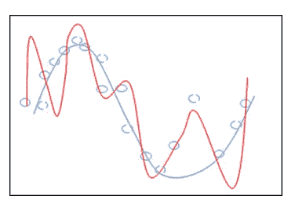
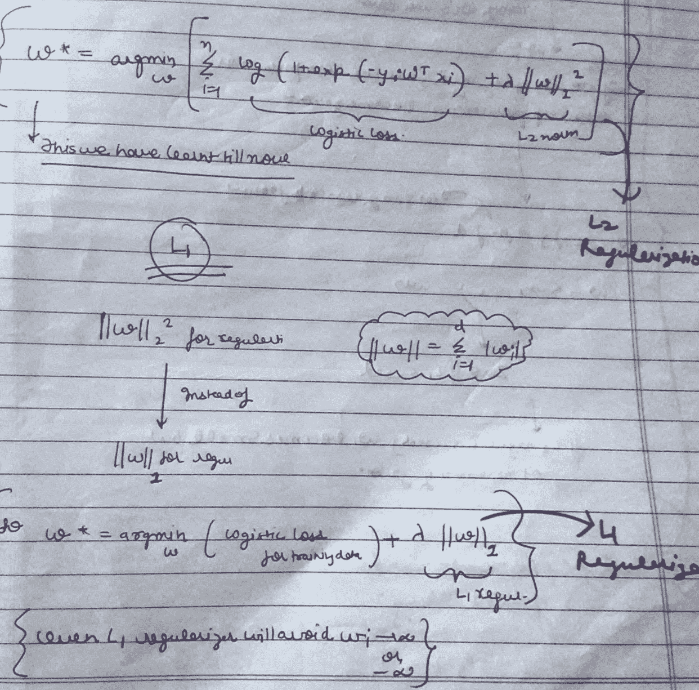
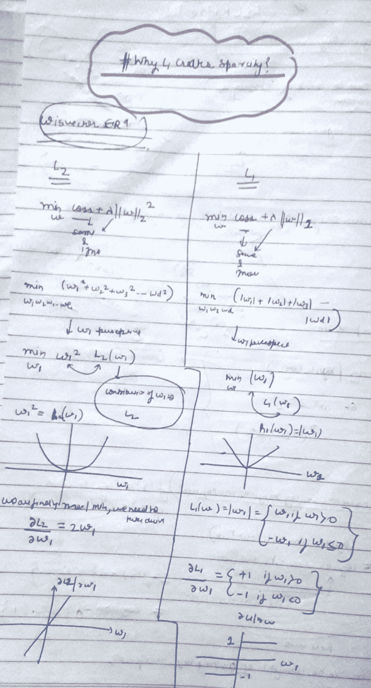
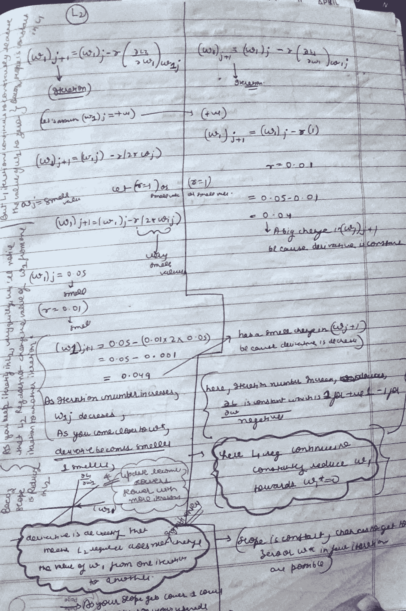
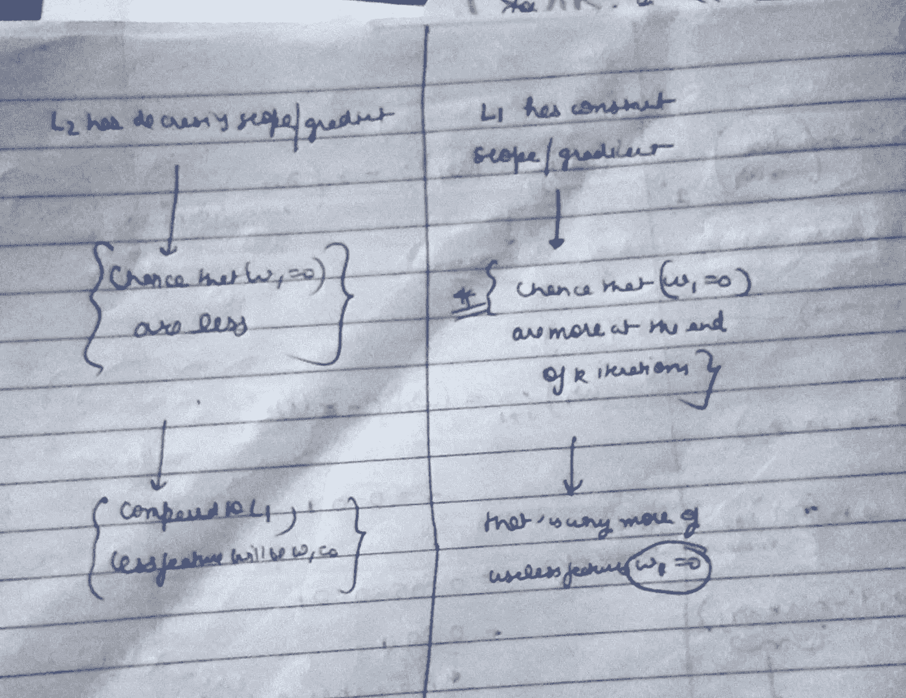

# 最常见的数据科学问题？(第一部分)

> 原文：<https://medium.com/analytics-vidhya/most-common-data-science-question-part-1-e049e338af4f?source=collection_archive---------25----------------------->

与 L2 正则化相比，为什么 L1 正则化会产生稀疏性？

所以在机器学习中，我们有两种类型的正则化。L1(拉索)和 L2(岭)正则化，所以在这篇文章中，我们要看看以下几点。

1.  ***什么是 SPARCITY？***
2.  ***L1 和 L2 正规化有什么区别？***
3.  ***L1 为什么创造了斯巴达，斯巴达的用处在哪里？***

我假设你知道什么是正则化，如果你不知道什么是正则化，那么就把它理解为优化问题中的一个额外项，这有助于减少过度拟合。

下面是逻辑回归优化问题中的 L2 正则化的图片，我已经在那里清楚地标记了正则化项。

## 什么是节俭？？

Sparcity 或 sparce matrix 是其中大部分值为“0”的矩阵，这样理解，你想求 logistic 回归中的权向量(w*)，那么它会是这样的

w*= <w1>如果有 d 维。</w1>

现在这样理解，d 维意味着 d 个特征，所以我们有一个问题，其中有 d 个特征，现在 w1 可以理解为特征 1 的权重，w2 可以理解为特征 2 的权重，等等。

假设我们知道一些特征不太重要，并且对目标(y)没有贡献，如果我使用 L2 正则化，那么这些特征的权重值将会更小，如果我使用 L1 正则化，那么这些特征的权重值将会是 0，这仅仅意味着 L1 正则化给出了一个权重向量 w*，其中大部分值为“0”(我们假设 d 特征中只有少数特征是重要的，这就是为什么 L1 将它们设为 0)

所以我认为很明显 L1 正则化产生了稀疏矩阵(意味着矩阵中的大部分权重值将为 0)

## L1 正规化和 L2 正规化有什么区别？

我将首先用一个非常简单的方法进行 L2 正则化，我希望最后你会自动给出为什么 L1 正则化给出稀疏矩阵的答案。

我们知道最优化问题通常是什么样子，

**(有一些损失函数+有一些正则项)。**

为了简化计算，假设只有一个权重 w1，如图 1 所示，如果我们可以检查 w1，它将应用于所有的 d 维权重。所以我们现在只取 w。

因此，我们有一个问题，其中我们有一个函数 f(x)=w1，我们想找到 w1 的值，它给出了 f(x)的最小值，让我们绘制 f(x)对 w1，它形成了一个 y=x 图，如图 1 图像 1 所示

我们已经知道，要得到最小值或最大值，我们需要找到导数，并放入梯度下降更新函数。让我们求 f(x)对 w1 的导数，结果是 2w1。

让我们画出导数，

参考图片 1 图片 2

让我们把导数代入梯度函数，

**(w1)j+1 =(w1)j-r(df(x)/d(w1))**

在输入导数值后，

**(w1)j+1=(w1)j-r(2w1)，这里 r 是步长，假设取步长为 0.01，假设取(w1)(0)=0.05，((w1)(0)是随机选择的第一个值，其中 j=0)**

所以**(w1)1 =(0.05)(0)-0.01 *(2 * 0.05)(0)，她的(0)就是 j=0。**

**(w1)1=0.049，我们可以看到从 w1(0)到 w1(1)有一个微小的变化，w1(0)为 0.05。**

如果你看到导数图，我们可以看到斜率持续减小，当你在 L2 迭代时，很快我们会注意到，L2 正则化不会从一次迭代到另一次迭代改变 w1 的值，这是因为同样的原因(斜率在 L2 正则化中持续减小)。

随着迭代次数的增加，w1(j)减小，并且随着越来越接近 w*，导数变得越来越小。这就是 w1=0 的机会较少的原因。与 L1 相比，L2 的功能更少，甚至为零。

## L1 正则化

现在让我们看看 L1 正则化中发生了什么，为什么它给出稀疏矩阵，所以相同的损失函数，所以我们不用担心损失函数，所以在 L2 正则化项中没有平方项，所以当我们对它求导时，我们得到一个常数，如图 1、图 3 和图 4 所示。

因此，在导数项中没有“w”项，这意味着当我们像图 2 那样应用梯度下降时，w1(j+1)与 w1(j)相比会有很大变化，因为差异部分非常小。

这里迭代次数增加，可微项是常数，正为 1，负为-1。并且 l1 正则化继续不断地将 w1 向“0”减小。

所以基本上斜率是恒定的，很有可能在几次迭代中得到 w=0。

**本文到此为止，感谢阅读。**