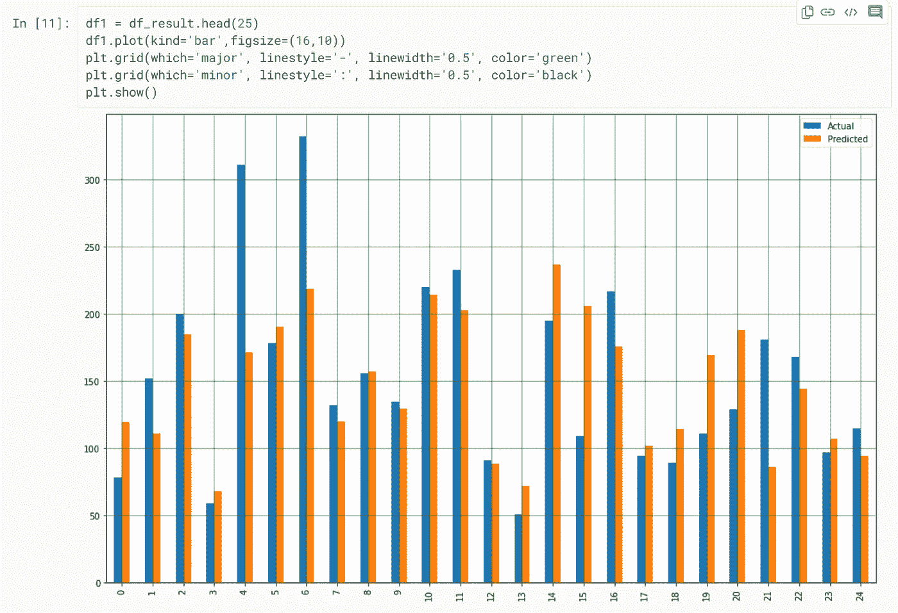

# 最常用的 Scikit-Learn 算法第 1 部分|Snehit Vaddi

> 原文：<https://medium.com/analytics-vidhya/most-used-scikit-learn-algorithms-part-1-snehit-vaddi-7ec0c98e4edd?source=collection_archive---------6----------------------->

如果你对数据科学有一点点兴趣，这篇博客肯定会帮助你😇。如果你是机器学习的初学者，这个博客绝对是为你量身定做的！！如果不是没有问题，修改机器学习的基础知识总是值得的😉


**只是一瞥 ML 基础知识:**

机器学习一般分为两大类:**监督** **学习和** **非监督学习**。

在**监督学习**中，一个算法在一个带标签的数据集上被训练。标记数据集是一个既有输入参数又有输出参数的数据集。监督学习进一步分为两种类型。**分类**和**回归**。🤩

**分类:**样本属于两个或两个以上的类，我们想从已经标记的数据中学习如何预测未标记数据的类。简单来说，分类问题是这样的，给定的样本可以是这个也可以是那个。*例如*，Gmail 将邮件分为不同的类别，如社交类、促销类、更新类、主要类和论坛类。📩

**回归:**如果期望输出由一个或多个连续变量组成，那么这个任务叫做回归。比如一个城市的温度。这里的温度持续上升或下降。📈

**sci kit 学习简介:**😍

**Scikit-learn** 是基于 SciPy 构建的用于机器学习的 Python 模块。Scikit-learn 为机器学习提供了各种重要的功能，如分类、回归和聚类算法，旨在与 Python 数值和科学库(如 **NumPy** 和 **SciPy** )进行互操作。

**sci kit-Learn 中的监督算法**:😎

正如我们之前讨论的，机器学习有两种算法，即**监督的**和**非监督的**。让我们看看 Scikit learn 在监督算法方面提供的一些最受欢迎的内容:

*   支持向量机
*   最近的邻居
*   广义线性模型
*   朴素贝叶斯
*   决策树
*   随机梯度下降
*   神经网络模型(受监督的)
*   多类和多标签算法

您可以在此查看所有可用的监督算法[。](https://scikit-learn.org/stable/supervised_learning.html)

**sci kit-Learn 中的无监督算法**:🤠

Scikit-learn 还提供了许多有用的无监督算法。其中一些是:

*   使聚集
*   双聚类
*   流形学习
*   高斯混合模型
*   新奇和异常检测
*   神经网络模型(无监督)。

您可以在此查看所有可用的监督算法[。](https://scikit-learn.org/stable/supervised_learning.html)

**sci kit-Learn 中的模型选择和评估:**🤓

**模型选择**是在不同的**机器学习**方法之间进行选择的过程——例如 SVM、逻辑回归等。**模型评估**是寻找代表我们的数据的最佳**模型**以及所选模型在未来工作情况的过程。为了避免过拟合和欠拟合。scikit-learn 提供的一些方法有:

*   交叉验证:评估估计器性能
*   调整估计器的超参数
*   模型评估:量化预测的质量
*   模型持久性
*   验证曲线:绘制分数以评估模型。

**让我们实现一些 Scikit-learn 算法:**🔥🎇

***安装并导入 Scikit-Learn:***

如果您已经安装了 NumPy 和 scipy，安装 scikit-learn 最简单的方法是使用 pip:

```
pip install -U scikit-learn
```

或者使用 conda:

```
conda install scikit-learn
```

***线性回归模型:***

线性回归模型的目标是找到一个或多个特征与连续目标变量之间的关系。只有一个特征叫做单变量线性回归；如果有多个特征，称为*多元* ple 线性回归。它执行回归任务。

让我们通过导入类似`sklearn` ( **alias Scikit-learn** )和`numpy`的模块开始构建模型。

sklearn.datasets 包由几个内置数据集组成。点击查看完整列表[。现在，让我们导入糖尿病数据集并研究它。](https://scikit-learn.org/stable/datasets/index.html)

正如我们所看到的，糖尿病数据集由总共 422 个样本组成，每个样本有 10 个特征。现在，我们可以使用 sklearn.model_selection 包的`train_test_split`函数将数据集分割成测试集和训练集。

把数据拆分成训练集和测试集之后，最后，就是训练我们算法的时候了。为此，我们需要导入 LinearRegression 类，实例化它，并调用`fit()`方法以及我们的训练数据。

现在我们已经完成了模型的训练，是时候做一些预测了。对于预测，我们使用模型完全看不到的训练集，并观察我们的算法/模型预测的准确性。🤞🤞

我们还可以使用以下脚本将比较结果可视化为条形图:



***SVM(支持向量机)型号:***

支持向量机(SVM)是最受欢迎和谈论最多的机器学习算法之一。SVM 可用于分类和回归。

SVM 的主要目标是**在 N 维空间中找到一个超平面，该超平面清楚地分类数据点**。SVM 不能应用于大多数大型数据集，因为类必须由线性边界分隔。详细解释[此处](https://towardsdatascience.com/a-friendly-introduction-to-support-vector-machines-svm-925b68c5a079)。

让我们看一个使用乳腺癌数据集的例子。

如您所见，该数据集由 30 个特征和 569 个样本组成，并且只有两个类别，即 ***恶性*** 或 ***良性*** 。现在，我们可以使用 sklearn.model_selection 包的`train_test_split`函数将数据集拆分成测试集和训练集。

现在我们来建立一个支持向量机模型。为此，引入 SVM 模块并使用`SVC()`函数创建一个支持向量分类器对象。然后，可以使用`fit()`函数对模型进行训练，并使用`predict()`函数对训练集进行预测。

既然是分类问题，我们可以用不同的评价指标比如****预测******召回*** 。*

*   *准确性:分类器多长时间正确一次？*
*   *精度:有多少百分比的阳性元组被如此标记？*
*   *有多少百分比的阳性元组被如此标记？*

***随机森林模型:***

*随机森林是一种监督集成学习算法，用于分类和计算以及回归问题。但是，它主要用于分类问题。众所周知，森林是由树木组成的，更多的树木意味着更健壮的森林。类似地，随机森林算法在数据样本上创建决策树，然后从每个样本中获得预测，最后通过投票选择最佳解决方案。*

*这是一种比单一决策树更好的集成方法，因为它通过平均结果来减少过拟合。*

****为什么随机？*** 🤔*

*在随机森林模型中，随机表示两个特征，一个是训练数据集整个构建树的随机采样，另一个是在分裂节点时考虑的特征的随机子集。*

****算法是如何工作的？****

*它包括四个步骤:*

*步骤 1:从给定的数据集中选择随机样本。*

*第二步:为每个样本构造一个决策树，从每个决策树中得到一个预测结果。*

*第三步:对每个预测结果进行投票。*

*第四步:选择得票最多的预测结果作为最终预测。*

*现在我们对随机森林的工作有了一个基本的概念，让我们在 Iris 数据上试试这个算法，它是 Scikit-learn 的一个内置数据集。*

*因此，虹膜数据集由 150 个样本组成，每个样本具有 4 个特征。数据集有 3 个类。现在，我们可以使用 sklearn.model_selection 包的`train_test_split`函数将数据集拆分成测试集和训练集。*

*拆分后，您将在训练集上训练模型，并在测试集上执行预测。*

***n_estimators** 参数是在**森林**中使用的树木数量。它用于控制流程中要使用的树的数量。*

*训练后，使用实际值和预测值检查准确性。*

***导入并上传 Jupyter 笔记本到 Jovian.ml:***

***结论:**🤩*

*到 **Scikit Learn for 初学者**系列的第 1 部分结束时，我们已经学习了机器学习的基础知识、ML 的类型、Scikit-Learn 的介绍、Scikit-Learn 提供的不同算法，并且还实现了最流行的监督学习算法，如 SVM、线性回归和随机森林。在本系列的第 2 部分，我们将学习更多有趣的无监督算法。敬请期待！！😎*

***参考文献:**📗*

*   ***完成 part-1 笔记本**:[https://jovian.ml/v-snehith999/scikit-learn-part-1](https://jovian.ml/v-snehith999/scikit-learn-part-1)*
*   *scikit-Learn official github[https://scikit-learn.org/stable/](https://scikit-learn.org/stable/)*
*   *Scikit-Learn 简介:[https://medium . com/@ deepanshugaur 1998/sci kit-Learn-part-1-Introduction-fa 05 b 19 b 76 f 1](/@deepanshugaur1998/scikit-learn-part-1-introduction-fa05b19b76f1)*
*   *线性回归:[https://towards data science . com/a-初学者指南-python-with-scikit-learn-83 A8 f 7 AE 2 b4f](https://towardsdatascience.com/a-beginners-guide-to-linear-regression-in-python-with-scikit-learn-83a8f7ae2b4f)*
*   *SVM:[https://www . data camp . com/community/tutorials/SVM-classification-sci kit-learn-python](https://www.datacamp.com/community/tutorials/svm-classification-scikit-learn-python)*
*   *随机森林:[https://www . data camp . com/community/tutorials/random-forests-classifier-python](https://www.datacamp.com/community/tutorials/random-forests-classifier-python)*

***作者:**🤠*

*   ***T5【斯内希特】瓦迪 ***

*我是一个机器学习爱好者。我教机器如何看、听和学习。*

***领英:**[**https://www.linkedin.com/in/snehit-vaddi/**](https://www.linkedin.com/in/snehit-vaddi-73a814158/)*

***GitHub:**[https://github.com/snehitvaddi](https://github.com/snehitvaddi)*