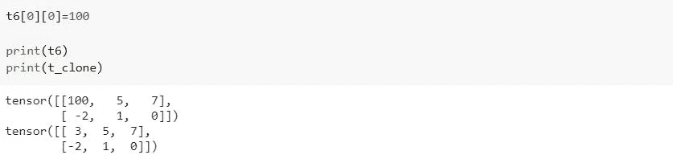

# 最想要的 PyTorch 张量运算！

> 原文：<https://medium.com/analytics-vidhya/most-wanted-pytorch-tensor-operations-dfa89b0187ef?source=collection_archive---------11----------------------->

在本帖中，我们将向 PyTorch 介绍我们自己。它是由脸书人工智能研究实验室于 2016 年开发的。该库主要用于计算机视觉、机器学习和深度学习应用。目前，我正在参加一个名为“PyTorch 深度学习:零到 GANs”的训练营。在这个程序的范围内，我们将通过使用这个库来学习和实现许多东西。随着我在训练营的进步，我的目标是分享我在这里学到的东西！

如果你不知道 PyTorch，不要担心。我也是一个完全的深度学习初学者。我们将在各门课程之间复习定义和解释，希望能一起学习。我们开始吧！

# PyTorch 是什么？

PyTorch 是一个基于 Python 的科学计算包，面向两组受众:

*   代替 NumPy 使用 GPU 的能力
*   深度学习研究平台，提供最大的灵活性和速度。[0]

上面的定义提出了这个问题:GPU 的到底是什么，使用它们的力量意味着什么？

嗯，GPU 代表图形处理单元。据说，在执行某些特定任务时，它们比 CPU(中央处理器)更强大、更快。
**这是一个庞大的话题，这里不赘述。如果你对此感到好奇，请点击此链接了解更多信息:【https://bit.ly/2JjYnh8】[](https://bit.ly/2JjYnh8)*

*PyTorch 使用**张量**进行数值计算。它包括许多功能，将帮助我们轻松地做这些计算。*

> *一个**张量**是一个数字，向量，矩阵，或者任何 n 维数组。*

*为了决定引入哪些功能，我使用了 [Google Trends！这个平台让我们可以看到人们在谷歌上搜索的趋势。这是我输入“PyTorch 张量”时得到的结果。](https://trends.google.com/trends/explore?q=PyTorch%20tensor)*

**

*一年期的利息*

**

*看来中国爱 PyTorch！*

*从分析中，人们主要搜索 PyTorch 张量的以下函数:*

**

*在这里你可以看到关于 PyTorch 张量的十大搜索。*

*因此，我们将涵盖以下功能:*

*   *torch.from_numpy() —。numpy()*
*   *torch.size() — torch.shape()*
*   *torch.rand()*
*   *。克隆()*
*   *。重塑()*
*   *火炬。Tensor.tolist()*

# ***如何把一个 numpy 数组变成 PyTorch 张量(反之亦然)？***

*将 numpy 数组转换成张量相对容易。我们将使用 torch.from_numpy()函数。让我们看一个例子。*

> *Numpy 是另一个使科学数学运算更容易的库。*

**

*np 在这里是 numpy 的别名。这样我们可以使用 numpy 方法，只需输入 np 而不是 numpy。我们可以使用任何东西，但是最好遵循通用的约定来编写可读性更好、更容易理解的代码。*

*我们创建了我们的数组，现在是时候导入火炬并转换它了。*

**

*瞧啊。我们有了一个全新的张量。还能更容易吗！？*

*当我们将 numpy 数组转换为张量时，有一些事情需要考虑。例如:*

**

*哎呀 numpy 数组中的相同元素也发生了变化。那是因为 t1 和 nd_arr 共享同一个内存。所以对其中任何一个的修改都会影响到另一个。小心！*

*from_numpy()只支持一些特定的数据类型。*

**

*我们得到一个类型错误，因为仅支持以下数据类型:float64、float32、float16、complex64、complex128、int64、int32、int16、int8、uint8 和 bool。*

*另一件需要记住的重要事情是:我们从 numpy 数组转换而来的张量是不可调整大小的。换句话说，你不能改变张量的维数。*

*关于这个函数的更多信息，你可以查阅文档:[https://bit.ly/33E9Cs3](https://bit.ly/33E9Cs3)*

*现在我们已经学习了如何将 numpy 数组转换成 pytorch 张量，是时候用另一种方法了。把张量变成 numpy 数组！为此，我们将创建一个新的张量。*

**

*对于这个过程，我们将使用。numpy()函数。*

**

*因为 PyTorch 也支持 numpy 数组支持的数据类型，所以我们不会得到类型错误。*

*不要忘记:张量和转换后的 numpy 数组共享同一个内存位置。*

**

*这个操作被称为“numpy 桥”。更多信息，请查看文档:[https://bit.ly/33Drcw6](https://bit.ly/33Drcw6)*

# ***我的张量的大小&形状是什么？***

*当我们比较 numpy 和 PyTorch 时，大小和形状概念有点不同。Size 指的是一个整数，即 numpy 数组中元素的数量。Shape 指的是一个 tuple (a，b)，其中:
-a =数组中的行数，
- b=数组中的列数。*

*对于 PyTorch，使用 size()和 shape 没有区别。这就是我们如何了解张量的大小/形状。*

**

*如您所见，numpy 和 PyTorch 的概念有些不同。这里有一个很好的学习资源:[https://bit.ly/2IbbEZ8](https://bit.ly/2IbbEZ8)*

# ***如何用随机数构成张量？***

*PyTorch 有许多不同的功能，允许我们创建随机张量。*

*   *torch.rand():返回用区间[0，1]上均匀分布的随机数填充的张量*
*   *torch.rand_like(input):返回一个与`input`大小相同的张量，用区间[0，1]上均匀分布的随机数填充。*
*   *torch.randint():返回一个张量，其中填充了在`low`(含)和`high`(不含)之间均匀生成的随机整数。*
*   *torch.randint_like(input):对 randint 执行完全相同的操作，但使用输入张量指定其大小。*
*   *torch.randn():从均值为 0、方差为 1 的正态分布(也称为标准正态分布)返回一个填充有随机数的张量。*
*   *torch.randn_like(input):与 randn 执行完全相同的操作，但使用输入张量指定其大小。*
*   *torch.randperm():返回从`0`到`n - 1`的整数随机排列。*

*这里我们只实现 torch.rand()，因为其他函数非常相似。查看文档了解更多信息:[https://bit.ly/3mxzHjP](https://bit.ly/3mxzHjP)*

**

*如果您再次运行该单元，您将看到不同的元素。*

*指定的大小必须是整数类型。*

**

# ***如何复制/克隆张量？***

*我们有不止一种方法可以克隆张量[1]。*

```
*y = tensor.new_tensor(x) #a

y = x.detach().clone() or x.clone().detach() #b

y = torch.empty_like(x).copy_(x) #c

y = torch.tensor(x) #d*
```

*根据 stackoverflow，b 明显优于其他。所以我们现在就实施。你可以在这篇文章中了解到更多关于它背后的原因:https://bit.ly/2JCwyRp*

*在这个版本中，我们将张量从其计算路径中分离出来并克隆，或者我们先克隆然后分离。*如果您首先分离张量，然后克隆它，计算路径不会被复制，相反的方法会被复制，然后被放弃。由此可见，* `*.detach().clone()*` *是非常略有效率的。[1]**

**

*我们轻易地克隆了我们的张量！*

*同样，当我们克隆一个张量时，新的张量与原来的张量不共享相同的存储位置。但是一些克隆方法共享相同的内存，确保你选择你需要的那个！*

**

*进行相同操作的另一种方法是这样，但这不是最佳做法。所以最好避免用这个。*

**

*当您使用这种方法时，它也是有效的，但是 PyTorch 抛出一个类似这样的小警告:UserWarning:要从张量复制构造，建议使用 sourceTensor.clone()。detach()或 sourceTensor.clone()。分离()。需要 _grad_(True)，而不是 torch.tensor(sourceTensor)。*

*这里很好地解释了两种方法的区别:
[https://bit.ly/3qvWv5J](https://bit.ly/3qvWv5J)*

# ***如何重塑一个张量？***

*PyTorch 提供了操纵张量大小的不同方法。我们将在这里介绍其中一种，剩下的选项留给您。请点击这里查看:[https://bit.ly/3lHnoQN](https://bit.ly/3lHnoQN)*

*我们将使用 torch.reshape()方法。它基本上返回一个元素数量相同但形状不同的张量。换句话说，行数和列数是不同的。*

**

*当你在一个元组中指定新的大小时，它会自动为你创建新的张量。*

**

*小心，调整后的张量和原来的张量共享同一个内存位置！*

# *如何从列表中创建一个张量(反之亦然)？*

*把列表变成张量真的很容易。这个过程非常类似于将 numpy 数组转化为张量。*

**

*只要列表包含适当的数据类型和大小，就可以很容易地创建张量。让我们看一个例子:*

**

*确保你的维度适合形成张量！*

*我们也可以使用 torch 将张量转换成列表。Tensor.tolist()函数。*

**

*暂时就这样吧！希望你喜欢这个教程。敬请期待即将到来的，别忘了自己练习。*

> *包括这篇文章代码的笔记本链接可以在这里找到:【https://jovian.ai/semanurkps/most-wanted-tensor-operations*
> 
> *Jovian AI 用 PyTorch 进行深度学习:Zero to GANs
> https://jovian . AI/learn/Deep-Learning-with py torch-Zero to GANs*

***参考文献***

*[0][https://py torch . org/tutorials/初学者/blitz/tensor _ tutorial . html](https://pytorch.org/tutorials/beginner/blitz/tensor_tutorial.html)*

*[1][https://stack overflow . com/questions/55266154/py torch-preferred-way-to-copy-a-tensor](https://stackoverflow.com/questions/55266154/pytorch-preferred-way-to-copy-a-tensor)*