# 最广泛使用的优化技术:优化算法。

> 原文：<https://medium.com/analytics-vidhya/most-widely-used-optimization-techniques-optimizing-algorithms-b81015ea377d?source=collection_archive---------8----------------------->

图:梯度下降

下面提到的是一些广泛使用的优化算法，我将在这篇文章中讨论

1.  **香草渐变下降，**
2.  **基于动量梯度下降，**
3.  **内斯特罗夫加速梯度下降，**
4.  **阿达格拉德，**
5.  **RMSProp，**
6.  **亚当**

在进入这些技术之前，让我告诉你为什么我们想出这些技术，或者我们通常用于更新权重和偏差的梯度下降更新规则有什么问题，如下所示

**w = w—eta * dw————-(1)**

其中，‘w’—与输入相关的权重，eta —学习率，dw —损失 w.r.t 权重的导数。让我们分析一下斜率的图形

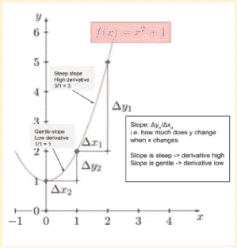

图 1:斜率

从上图可以看出，当斜率较陡时，导数较高，当斜率较缓时，导数较低。您可能想知道它是如何与我们的更新规则相关联的？。

因此，当我们的初始化点在平坦区域时，这可能是个问题，因为算法移动得不够快。如果碰巧我们的‘w’和‘b’的随机初始化在平坦区域开始，那么该算法将需要运行许多时期来脱离平台，并且运行许多时期可能会花费我们更多的时间。

梯度下降的一个主要问题是，由于这些区域中的梯度非常小，所以需要花费大量时间来导航缓坡区域。

> 好了，现在我们要知道为什么我们会想出新的技术，对吧！

## **当有平坦区域时，我们可以考虑做什么？**

只是一个模糊的想法是迈出更大的步伐吧！。因此，一个直观的解决方案将是，如果算法被反复要求向同一方向前进，那么它可能会获得一些信心，并开始在该方向上迈出更大的步伐。

比方说，当你去某个购物市场，被问到不知道路线时，有人会说直走大约 1 公里，你就可以找到商店了。既然这样说了，你就不会在 100 米后问每个人同样的路线，对吗？所以你有信心，移动 1 公里会让你到达你想要的目的地，这些算法也是如此。

## 各种优化算法:

V

**ωt+1 =ωt—η* ∇ωt———-(2)**

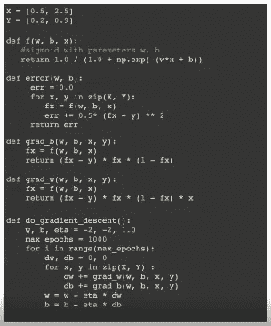

图 2:VGD 代码

M **基于网膜的梯度下降:**现在不是直接更新权重，而是让在它移动的方向上加速一点，这样它在同一个方向上移动的步数就少了。

**这背后的直觉**是，随着我们沿着一个系列或方向越走越远，随着我们沿着同一方向前进，我们可以越来越不重视后面的梯度，因为随着我们前进，“伽马”越来越强，这意味着它开始衰减，而对我们已经采取的最后一步越来越重要。

**υ*t*=γ*υ*t*1+η∇ω*t———-(3)***

**ωt+1 =ωt—υ*t————-(4)***

υt1-运动历史，γ-范围从 0-1，η-学习率

这里，我们取一个指数衰减的加权和，随着我们越来越深入这个序列，权重衰减得越来越多。

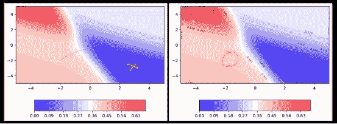

图 3(a) : MBGD(29 个时期)图 3(b) : VGD(40 个时期)

从上面的图中我们可以看到，在图 3(a)中，仅仅 29 个时期，即使在缓坡区域，MBGD 也能够迈出大步，因为动量在继续。但是在图 3(b)中，花了 40 个时期，也不能越过平台。

> 动作快总是好的吗？
> 
> 会不会出现一种情况，动力会促使我们跑过我们的目标？

不，总是快速移动不是一个好主意，因为会出现超调和围绕最小值振荡的问题。因此，这是 MBGD 和 VGD 的高学习率超调的共同问题。

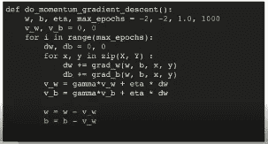

图 3(c):代码 _MBGD

所以为了解决超调的问题，他们引入了所谓的内斯特罗夫加速梯度下降。

N 我们在这里做的是，首先根据过去的历史，然后在向前移动之前，计算第二步在该点的导数，而在动量中，我们在迈出一步之前计算导数，然后根据历史和当前移动，这将导致超调问题。

现在让我们后退一点，看看 MBGD 的方程——将方程(3)代入方程(4)

**ωt+1 =ωt—γ*υ*t*1—η∇ω*t———-(5)***

从上面的等式中我们可以看出，运动分两步进行

一、首先是历史项—γ*υ*t*—1

二。接下来是关于重量项——η∇ω*t*

因此，每次移动两步时，都有可能超过两步之间的最小值。所以我们可以考虑先用历史项移动，然后从第一步(ωtemp)后我们所处的位置开始计算第二步。

利用上述直觉，**内斯特罗夫加速梯度下降**解决了超调和多次振荡的问题。

**ωtemp =ωt—γ*υt-1———-(6)；**根据运动和历史进行计算

**ωt+1 =ωtempη* ∇ωtemp—--(7)；**向ωtemp 的导数方向进一步移动。

**υt =γ*υt-1+η* ∇ωtemp———-(8)；**根据ωtemp 的导数更新运动历史。

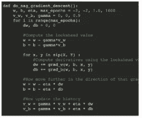

图 4(a) : Code_NAG

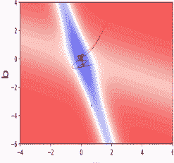

图 4(b):图表 _

向前看有助于 NAG 比 MBGD 更快地纠正其路线。因此，振荡更小，逃离极小值谷的机会也更小。

A**daGrad:**adagrad 的动机来自于数据集的稀疏和密集特征。当在特定特征中，如果大多数点是‘0’，那么更新权重没有意义，因为这意味着因为‘0’值。因此，我们可以做的是，对于 1 的数量少于 0 的情况，我们可以提高这些特征的学习率，降低稀疏特征的学习率。

Adagrad 的基本直觉是参数的学习速率与其更新规则成比例地衰减。

**υt =υt1+(∇ωt)^2——-(9)**

在密集特征的情况下，它在大多数迭代中递增，导致更大的υt 值。

对于稀疏特征，它不会增加太多，因为梯度值通常为 0，导致较低的υt 值。

**ωt+1 =ωt(∇ωt)*η/√((υt)+ε)—-(10)**

根据上面的等式，我们可以说分母项‘υt’用于调节学习速率η，这就是为什么它被称为自适应学习速率。

I .对于密集特征，υt 越大，√(υt)越大，从而降低η。

二。对于稀疏特征，vt 更小，√(υt)变得更小，从而将η降低到更小的程度。“ε”项被添加到分母√(υt ) + ε中，以防止在非常稀疏的特征的情况下出现被零除的误差，即在测量实例之前所有数据点都为零。

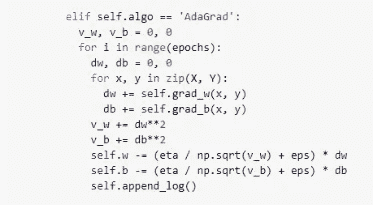

图 5(a):代码 _ 阿达格勒

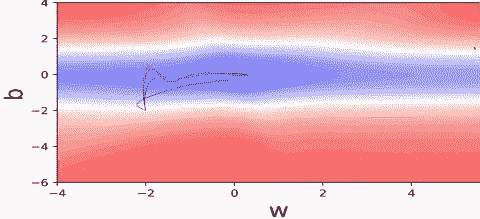

图 5(b):图表 _

黑色-香草梯度下降，红色-基于动量的梯度下降，蓝色-内斯特罗夫加速梯度下降，绿色-阿达格拉德

因此，从图中我们可以观察到，对于曲线(黑色、红色和蓝色)，我的“w”最初没有变化，只有“b”在变化。这就是这些算法的问题所在，问题是我的“w”是一个非常稀疏的特征，这就是为什么它的导数在大多数情况下为零，并且没有更新，而“b”是它正在更新的大部分密集特征。

从绿色曲线中我们可以清楚地看到，对应于稀疏特征的参数得到了更好的更新。但是仍然缺少收敛，RMS Prop 开始解决这个收敛问题。

随着分母的增长，LR 衰减非常剧烈(对于对应于密集特征的参数来说，这不是好事)

R 所以 RM prop 的动机或直觉是，为什么不衰减分母，并防止它衰减？对！。

这里我们采用指数衰减增长来使曲线收敛到最小值。

**υt = beta *υt 1+(1—beta)*(∇ωt)^2——-(11)**

**ωt+1 =ωt(∇ωt)*η/√((υt)+ε)———-(12)**

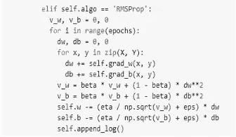

图 6(a) : Code_RMSProp

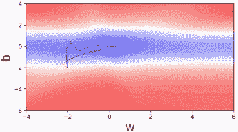

图 6(b):图形 _，布朗均方根 Prop

从上面的图中我们可以说，Adagrad 在接近收敛时被卡住了(由于学习速率的衰减，它不再能够在垂直(b)方向上移动)。RMS prop 通过减少衰减来解决这个问题。

A **dam :** 我们知道动量和 RMS prop 都在使用历史。动量用的是梯度的历史，均方根用的是梯度平方的历史，对吧！。

现在，在动量的情况下，该累积历史实际上有助于快速移出平坦表面，并用于更新当前权重。在 rms prop 中，历史被用来调整学习率，学习率被适当地用来收缩或增长。

> 我们能把这两者结合起来吗？。

是的，我们可以利用动量和均方根来加快移动速度，同时利用均方根来防止学习速度过快或无效。

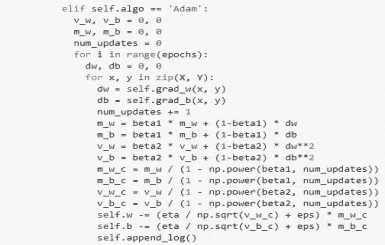

图 7(a):代码 _Adam

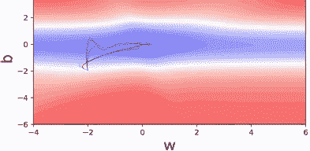

图 7(b):图表 _，青色-亚当

从上面的图中我们可以看到，它超过了最小值，因为它使用了基于动量的 gd。

**mt =β1 * vt-1+(1—β1)(wt)——-(13)**

**vt =β2 * vt—1+(1—β2)(wt)2—-(14)**

**wt+1 = wt—mt *η/√((vt)+ε)——-(15)**

等式(13)利用了动量的优势，等式(14)利用了 rms prop 的优势。并且如(15)所示执行更新。adam 还提供了所谓的偏差校正，以确保训练更加平滑，或者说输入不像奇怪的那种。使用下面提到的等式更新 mt 和 vt。

**mt = mt/(1—beta1^t)———-(16)**

**vt = vt/(1-beta2^t)——————-(17)**

这些概念来自四分之一的实验室:

 [## IIT 马德拉斯大学教授 PadhAI - AI 课程

### 经济实惠的数据科学和人工智能课程，由来自 IIT 马德拉斯的一些最好的老师授课

padhai.onefourthlabs.in](https://padhai.onefourthlabs.in/) 

#深度学习#机器学习#数据科学#优化#亚当