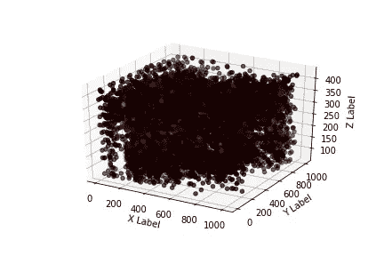
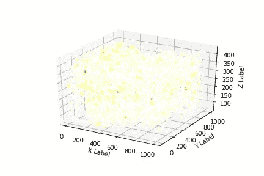
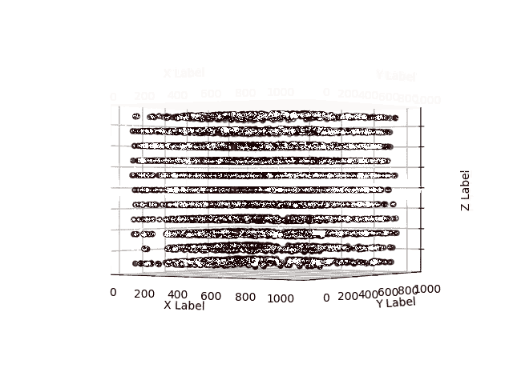
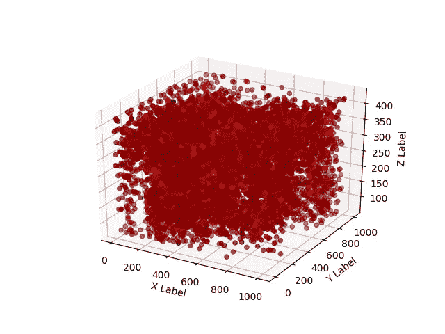
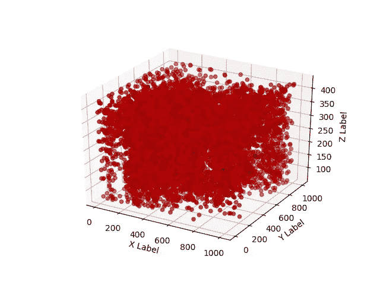
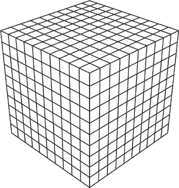
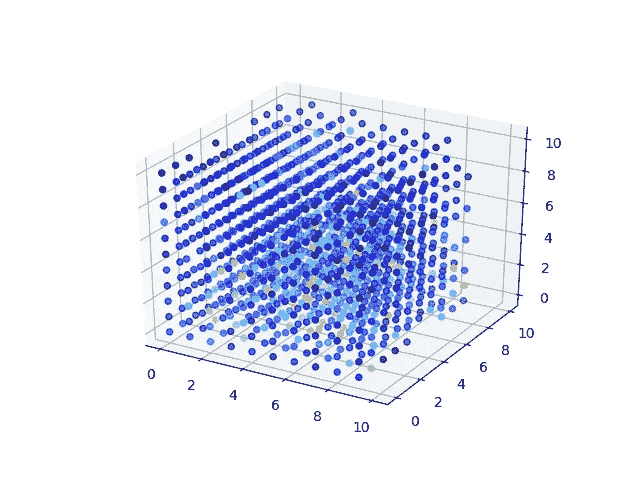
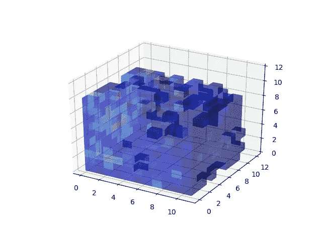
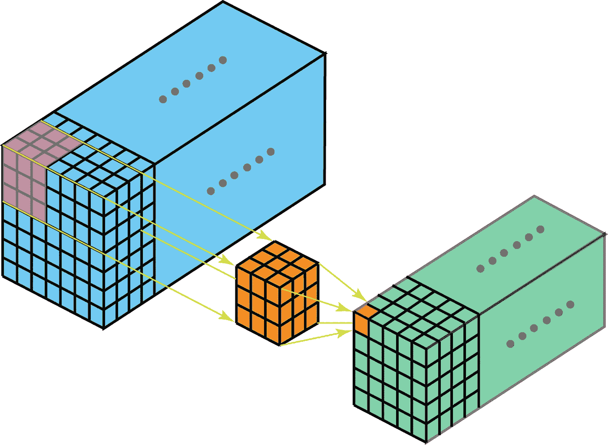

# 从老鼠大脑中的神经元活动解码物体

> 原文：<https://medium.com/analytics-vidhya/mouse-brain-responses-demystified-81f4c979a96d?source=collection_archive---------16----------------------->

# 介绍

人脑是人体最复杂的部分。我们仍然没有真正理解大脑是如何工作的，并且很难在人身上做实验。通过探索动物的大脑，我们可以发现大脑中的规律。我们可以找出不同的行为模式，或者在人类身上应用技术，找出相似或不同之处。这片土地尚未被发现，有待开发。

# 背景

2018 年*，Carsen Stringer，Marius Pachitariu，Nicholas 斯坦梅茨，Matteo Carandini，Kenneth D. Harris* 制作了一个数据集，其中包含小鼠大脑中 10 000 个神经元对视觉刺激的反应记录。每种视觉刺激都呈现在老鼠周围的三个屏幕上，平均每秒一幅图像。

视觉刺激意味着显示图像，例如，著名的 ImageNet 数据集中的猫、鸟、蛇。用老鼠大脑内部的[神经像素电极阵列](https://www.nature.com/articles/nature24636)来测量反应。

在对数据集的描述中，他们说回答非常稀少。只有一小部分细胞被任何特定的刺激驱动超过其基线放电率两个标准偏差以上。这意味着大多数神经元对刺激的反应并不特别，但我们可以假设我们可以找到特定的模式。

不同的设置总共有 32 个记录:

*   小鼠(6 只小鼠)
*   方向
*   图像增强(白化、填充零非感受野)
*   测量设备的数量
*   测量设备的放置
*   长度、显示的图像数量

我们将只使用未经处理的自然图像记录。每个记录代表 2，800 个连续重复的图像刺激序列(至少两次)。

## 数据

对于每一幅图像，我们都有 *XYZ* 神经元的坐标和它们的值。我们应该把它形象化，看看它是什么样子。



带有神经元反应(左)和反转颜色(右)的热图

播放并旋转一会儿后，我们可以立即看到电极被放置在特定的平面上。



我们可以在这个 *z* 坐标上看到切片，稍后会用到。此外，我们可以再次看到，数据是稀疏的，在常规热图上只有几个红色响应。

我们试图通过数据集提供商提供的有用代码来消除噪声，其中 spont 是大脑活动的自发记录:

```
mu = spont.mean(axis=0) # get rid of spontaneous noise
sd = spont.std(axis=0) + 1e-6
responses = (responses - mu) / sd
spont = (spont - mu) / sd
sv,u = eigsh(spont.T @ spont, k=32)
responses = responses - (responses @ u) @ u.T
# mean center each neuron
responses -= responses.mean(axis=0)
```

现在是时候可视化各个类的平均响应，看看是否已经有明显的差异。



每类 3、4、9 的平均回答

看到这个之后，我们有了一个计算均方差的想法，不幸的是，这个方法并不成功。它仍然有随机的性能。

# 方法

我们尝试了多种方法，其中一些完全失败了，我们花了太多时间试图让它们奏效。其他的不那么成功，我们早就放弃了。

## 表格学习

没有充分的理由，我们试图完全忽略空间信息。从众多可用选项中，我们选择了这些分类器:AdaBoostClassifier、RandomForestClassifier 和 XGBoostClassifier。我们还尝试了一个 fast.ai 深度学习框架(批量归一化和辍学的 ANN 架构)。

我们的数据看起来像这样:

没有空间信息的数据结构

通过五次交叉验证计算准确度。我们能得到的最佳精度结果和虚拟模型一样好。

```
AdaBoost: 0.17% 
Random Forest: 0.19%
XGBoost: 0.174%Most frequent (dummy) predictor: 0.16%
```

## 表格平均法

为了克服第一种方法的过度拟合等问题，我们尝试以类似网格的方式对大脑的平均区域进行处理，但随后再次丢弃空间信息，并将其放入一个表格中:

无空间信息的分割数据结构

然而，这也无济于事。任何分类器的分数都没有提高。

## 空间数据呢？

我们可能会想到将数据放入一些网格中，制作体素(3D 像素)。



3D 体素网格

虽然他们只测到了小鼠大脑中的 10 000 个神经元，但它们所分配的体积大约是 ***1000*** *(宽度)* ***x 1000*** *(深度)****×13****(高度)* 个单位。这给出了 13 密耳的体素，但其中只有 10 000 个被占用。这将是浪费和低效的。我们在单次试验中有大约 5000 个样本，所以这是巨大的数据膨胀。再者，大部分是零。我们可以使用稀疏矩阵，但是它很难处理，而且一些算法不能处理稀疏矩阵。

另一个想法是再次使用分而治之的方法。我们可以像以前一样将 3D 空间划分成一些块/子空间，然后使用卷积神经网络来保存空间信息并提取已知模式。

在预处理之后，我们使用了两种可能的可视化。在右边，我们可以看到该区域是如何划分的，但内部体素没有显示，因为它们的脸被覆盖。在左边，我们可以看到每个区域，但我们看不到每个点覆盖哪个区域。



左侧为散点图，右侧为体素网格

区域的粒度是一个关键的选择。区域应该足够大以避免维数灾难，但也应该足够小以代表空间中大脑的小区域。

下一个重要的选择是模型的架构。对于那些不确定卷积是什么的人，我们建议查看这个[链接](https://towardsdatascience.com/a-comprehensive-introduction-to-different-types-of-convolutions-in-deep-learning-669281e58215)。简而言之，卷积是对特征的提取，例如，在单通道版本中:


单通道卷积

然而，我们的数据集是由 3D 数据棱柱构成的，所以我们应该使用 3D 版本的卷积。它仍然有过滤器，在这种情况下是 3D 的，通过体素的补丁以滑动窗口的方式应用，提取最重要的特征。



*在 3D 卷积中，3D 滤镜可以在所有 3 个方向上移动(高度、宽度、图像的通道)*。在每个位置，逐元素的乘法和加法提供一个数。由于过滤器在三维空间中滑动，*输出数字也在三维空间中排列。然后输出 3D 数据。*

我们选择了下述第一种架构:

```
MouseNet
====================================================================
Layer (type)         Output Shape         Param #    Trainable 
====================================================================
Conv3d               [16, 11, 6, 6]       432        True      
____________________________________________________________________
BatchNorm3d          [16, 11, 6, 6]       32         True      
____________________________________________________________________
ReLU                 [16, 11, 6, 6]       0          False     
____________________________________________________________________
Conv3d               [32, 6, 3, 3]        13,824     True      
____________________________________________________________________
BatchNorm3d          [32, 6, 3, 3]        64         True      
____________________________________________________________________
ReLU                 [32, 6, 3, 3]        0          False     
____________________________________________________________________
Conv3d               [32, 6, 3, 3]        27,648     True      
____________________________________________________________________
BatchNorm3d          [32, 6, 3, 3]        64         True      
____________________________________________________________________
ReLU                 [32, 6, 3, 3]        0          False     
____________________________________________________________________
MaxPool3d            [32, 2, 1, 1]        0          False     
____________________________________________________________________
Flatten              [64]                 0          False     
____________________________________________________________________
Linear               [13]                 845        True      
____________________________________________________________________
Total params: 42,909
Total trainable params: 42,909
Total non-trainable params: 0
Optimized with 'torch.optim.adam.Adam', betas=(0.9, 0.99)
Using true weight decay as discussed in [https://www.fast.ai/2018/07/02/adam-weight-decay/](https://www.fast.ai/2018/07/02/adam-weight-decay/) 
Loss function : CrossEntropyLoss
```

它是卷积层的重复，[批量归一化](https://arxiv.org/pdf/1502.03167.pdf)和 [ReLU](https://towardsdatascience.com/activation-functions-neural-networks-1cbd9f8d91d6) 激活函数。以下是二维图像上*步幅=2* 和*填充=1* 的卷积示例:


填充=1，步幅=2 卷积

我们使用 [pytorch](https://pytorch.org/) 库和 [fast.ai](https://www.fast.ai) 模块来创建这个网络。

# 结果

我们无法得到一些像样的结果。我们所有的尝试都以随机行为告终。一些可能的问题是不好的空间划分，也许一些更聪明的方法会挑选更重要的领域。在某些空间中，具有某种相关性的聚类是可能的。

# 结论

我们没有发现小鼠大脑的不同部分对图像刺激有某种相关性。然而，我们并没有说它不存在。我试过的方法都不成功，很难说出到底是什么问题。

## 未来的工作

有一些神经网络将点云作为它们的输入，但我没有发现任何一个还会结合点的强度，而不仅仅是空间信息。我自己创建这样一个网络并不是一件简单的事情，我也没有成功地让它运转起来。如果这样的网络存在，它将完美地满足我们的目的，因为点云是存储神经元数据的最有效的方式。

关于小鼠大脑区域的专家知识不仅有助于可视化，也有助于分类。我们可能对老鼠大脑的某些部分有较高的分辨率，而对其他部分分辨率较低。

我们应该考虑神经元和它们的低级特征提取。从低级特征构建图像上的对象的语义的任务可能非常困难，几乎是不可能的。更小的步骤，如解码特定图像，而不是图像的语义可能更有帮助。

神经元归一化是神经科学界的重要技术。如果我们在刺激前后都有反应，我们可以更好地去噪反应。即使使用我们的数据，考虑从数据中去除自发反应的噪声对于能够识别自发反应和对刺激的反应之间的差异是至关重要的。

我所有的代码都可以在 [GitHub](https://github.com/xbankov/Neuroscience) 找到。

# 参考

博文中的一切都是 Mikulábanko VI 做的。借助其他一些博客文章和学术论文。我的大部分想法来自塔尔图大学的计算神经科学导论课，老师是 Raul Vicente Zafra。我要感谢的讲师和学生的问题和建议。

[深度学习中不同类型卷积的全面介绍](https://towardsdatascience.com/a-comprehensive-introduction-to-different-types-of-convolutions-in-deep-learning-669281e58215)

[Fast.ai 框架](https://docs.fast.ai/index.html)

[Pytorch](https://pytorch.org/)

谢尔盖·约菲，克里斯蒂安·塞格迪；批量标准化:通过减少内部协变量转移加速深度网络训练:CoRRABS/1502.03167；2015;[网址](http://arxiv.org/abs/1502.03167)；arXiv2018 年 8 月 13 日星期一； [biburl](https://dblp.org/rec/bib/journals/corr/IoffeS15)

Brosch，t .，Tang，L. Y .，Yoo，y .，Li d . k .，Traboulsee，a .，& Tam，R. (2016 年)。应用于多发性硬化病变分割的具有多尺度特征整合捷径的深度 3D 卷积编码器网络。IEEE 医学成像汇刊，35(5)，1229–1239。

哈韦伊，m .，戴维，a .，沃德-法利，d .，比亚尔，a .，库维尔，a .，本吉奥，y .，… &拉罗歇尔，H. (2017)。基于深度神经网络的脑肿瘤分割。*医学图像分析*， *35* ，18–31。

Kamnitsas，k .，Ledig，c .，Newcombe，V. F .，Simpson，J. P .，Kane，A. D .，Menon，D. K .，… & Glocker，B. (2017)。高效的多尺度 3D CNN 与完全连接的 CRF 一起用于精确的脑部病变分割。*医学图像分析*， *36* ，61–78。