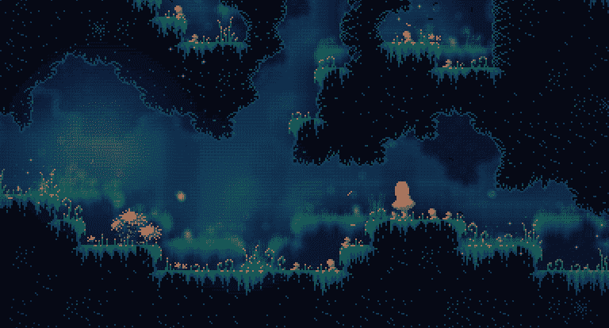
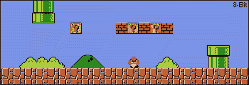
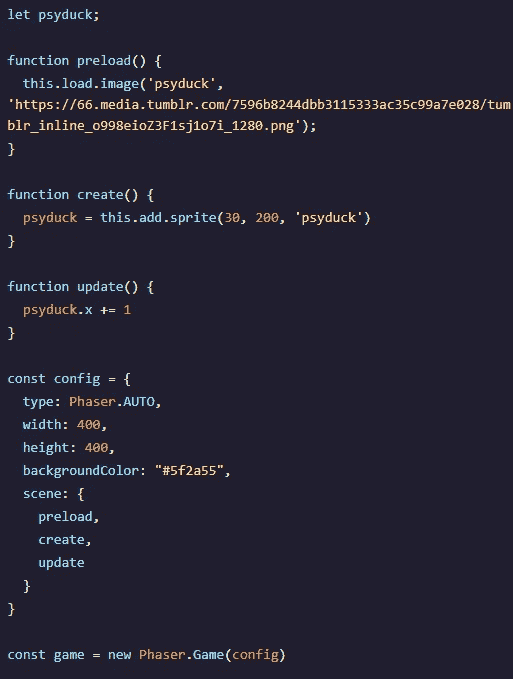

# 用 PhaserJS 移动—动画运动(在用户输入之前)

> 原文：<https://medium.com/analytics-vidhya/movement-with-phaserjs-animated-motion-before-user-input-474b4598ceee?source=collection_archive---------7----------------------->

如果你是从这篇文章开始学习 Phaser，**请阅读我的第一篇关于最初设置你的程序的文章**！否则，让我们让一些精灵动起来！

如前所述，设置游戏是我们程序最重要的事情，好像我们不能，那么我们就不会有游戏(当然)；但是什么才是真正的游戏呢？嗯，会玩！这包括在屏幕上控制你的精灵，不管它是乒乓球拍还是马里奥。这意味着运动！

让我们来看看 Phaser 开始使用移动的一些方法。这篇文章将讲述我们如何让物体在场景中移动(敌人、环境、NPC 等)。这将发生在我们构建初始代码的同一个 JS 文件中。

# **在我们的画布上移动**

好吧！我们已经学会了如何装载我们的资产，所以让我们移动他们。现在我们将不再使用*和*动作中的动画(即角色移动时的行走动画)，但是我们可以让精灵在画布上移动，这是一个很好的开始。那么我们应该把这些代码放在哪里呢？

简单回顾一下，首先我们必须定义一个全局变量作为我们的 sprite。这样，我们可以在不同的功能之间引用它。

> 记住全局变量在大型应用中是危险的。在开发过程中，它们会给你带来很多错误和混乱。为了这个小项目的简单性，我们只将它声明为一个全局变量。

现在我们已经定义了 sprite，让我们创建一个函数来移动这些像素。我个人打算用一张 Psyduck 的图，但是你想用什么就用什么(只要记住 Psyduck 的规则，一切还是可以的)！

首先，我们要在 Phaser 程序中创建一个更新函数。这将从我们的 preload 函数和 create 函数中提取信息。让我们看看这些代码是什么样子的，看看它们是如何组合在一起的。

让我们把它分解成简单的步骤！如果我们看看我们每个人的功能，我们可以理解这是多么简单。

1.  这里的第一个函数是 preload()。我们在之前的博客中了解到了这一点；这装载了我们的资产。在我的例子中，我在这里导入了一个 Psyduck 图像。在 preload()中，我们调用 this.load.image()，这是我们为添加一个带有两个参数的资产而设置的标准。现在我们的 Psyduck 将在程序启动时作为*加载*，并且能够被使用和传递给其他函数！两个参数中的第一个是我们引用的资产的名称(' psyduck ')，第二个参数是到实际图像的链接，因此我们可以在声明的 psyduck 调用中使用它。
2.  接下来，我们在 create()方法中添加精灵。与 preload()函数中的图像非常相似，create 具有类似的语法，只是交换出一个单词。这一次我们称之为雪碧。这将需要三个参数，分别是(x，y，reference)。x 和 y 是我们的精灵的像素位置；告诉程序把它们放在哪里。第三个参数，即引用参数，是从 preload()函数中声明的名称中提取的。在这种情况下，我们引入标记为“psyduck”的资产。现在让我们将这个创建保存到一个变量中！
3.  第三，我们有 update()函数，它将成为用户的输入，并告诉 sprite 要做什么。现在我们调用 psyduck.x += 1。这是什么意思？嗯，我们告诉资产 psyduck 在 x 轴上移动，因此 **psyduck.x** 和 **+= 1** 。+= 1 就像在 JavaScript 中一样，是一种每次调用 update()就增加 1 的方法。

> 顺便提一下:Phaser 中的 update()方法有两个参数，如果你想让它缺省运行的话，这两个参数是不必要的，但是如果你想的话，你也可以放入你自己的信息！更新可能需要的两个参数是**时间**和**增量**。时间是…嗯…你的游戏运行所经过的时间，以毫秒为单位。Delta 是自上次 update()方法调用以来的时间差。因为 Phaser 试图在一秒钟内调用 60 次 update()方法，所以我们可以保留默认设置，这样就可以了。

最后，我们有我们的配置，这是我们在上一篇文章中谈到的。既然你知道 config 是什么，我要说的就是在它里面添加 update()函数(正如你看到的，它被添加到场景嵌套对象中)。

哇哦。激动人心。我们的化身在移动。

但我听到你心里在想，“但是罗格，我们没有把我们自己的输入放入雪碧，它们只是在自己移动！”这就是下一步！

加入我们的下一篇文章，看看用户输入是如何让游戏变得生动的！！