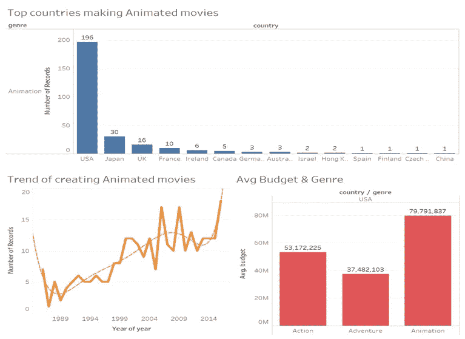
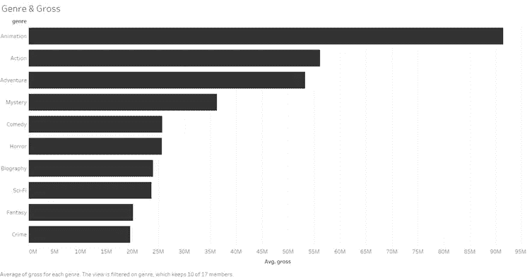
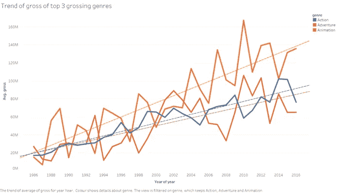
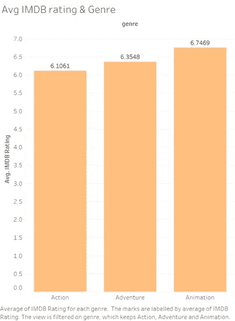

# 电影行业可视化| Tableau

> 原文：<https://medium.com/analytics-vidhya/movie-industry-visualization-tableau-1e410f2384de?source=collection_archive---------11----------------------->

**数据分析&可视化项目:莫希特·舒克拉(**[https://github.com/mshukla20/Movie-Industry-Visualization](https://github.com/mshukla20/Movie-Industry-Visualization))的《电影工业》

**基于动画(CGI)的电影会取代现实电影吗？**

2009 年，动画电影《阿凡达》在全球获得了 27.9 亿美元的票房。在不久的将来，我们将会看到动画电影的增加。一直都有这样的电影，在其中，是人类的动画师代替了演员。新的动画电影通常使用演员为角色配音，并通过动作捕捉(mo-cap)提供动作。

我们会看到人工智能计算机接管所有创造性的角色吗——写作、导演和表演？这确实是一种可能性，我们必须问自己，这是不是我们想要的未来。还是会成为伙伴关系的东西——AI/human？我从过去三十年的电影工业中没有什么可视化的东西来证明基于动画类型的电影正在过度增长。

1.  **仪表板 1:**

*制作动画电影的顶级国家:*美国(好莱坞)是世界上最好和最大的电影产业之一，记录了世界上最多的动画电影，其次是日本。

*动画电影的趋势:*如果我们看到从 90 年代到 2010 年代制作的动画电影的趋势，我们可以看到，随着我们走在时间轴的前面，它是线性增加的。

*美国前三大电影类型的平均预算:*分配给动画电影类型的平均预算约为每部电影 7900 万美元，相比之下&动作冒险类型的预算最高。

**2。可视化 1:自 1986 年至 2016 年以来所有顶级流派的平均总值**

-在世界上票房最高的十大电影类型中，**动画**类型的平均最高票房约为 9200 万美元。

最低的平均最低票房是犯罪类型，大约 2000 万美元。

**3。可视化 2:世界上票房最高的三个流派的时间表**

-我们可以看到，与动作和冒险电影相比，动画电影(橙色)的总收入呈线性增长。

-我们可以预测，未来动画电影的总收入也会有类似的增长。

4.**可视化 3: IMDB 评级**

- IMDB 评分是观看电影或评判电影时最关键的方面之一。30 年来动画电影的平均 IMDB 评分为 6.7，高于电影行业前 3 大流派。

**5。**结论:

-我们考虑并分析了 1986 年至 2016 年这三十年间全球顶级电影的数据。

-使一部电影成功与否的所有重要因素。IMDB 评级、分配的预算，最后是电影类型的票房收入(毛收入)。所有的一切都让我们意识到动画这一类型正在日益壮大。

-有一天，基于动画(CGI)的电影将取代真人演员和明星，一切都将是数字的。

-该技术可能很快会被未来的强国接受为可行的性能方法。

-对于一个经常看电影的人来说，随着《阿凡达》和《人猿星球》电影的成功，它已经被接受了。

-在好莱坞，扫描演员的身体以获得用于特定动作的数字版本并能够在数字制作后操纵它们正成为一种更常见的做法。

——电影是最初的现实主义形式；CGI 还没有完全实现，但它正在取得重大进展。