# 使用 PySpark 进行电影镜头数据分析[适合初学者]

> 原文：<https://medium.com/analytics-vidhya/movie-lens-data-analysis-using-pyspark-for-beginners-9c0f5f21eaf5?source=collection_archive---------3----------------------->

Apache Spark 正被广泛应用于大数据分析。我们可以在 spark 框架中使用 Scala、Python 或 R。在本文中，我们将使用 python 来工作。

任何项目的第一步都是加载数据，我们将在 spark 生态系统中加载两个包含以下数据的 CSV 文件(movies.csv 和 ratings.csv)。

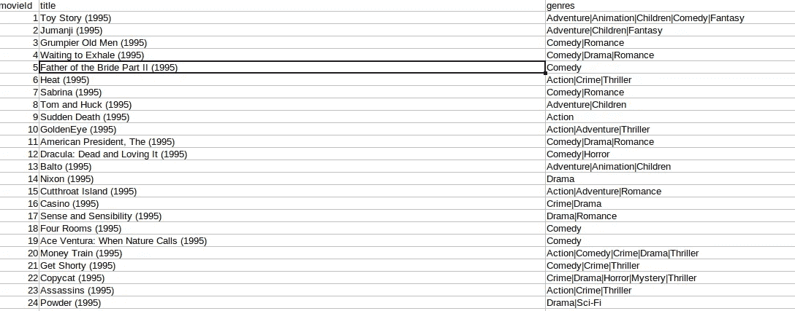

电影. csv

电影数据集有一个唯一的电影 Id、标题和类型(一部电影可以被划分到多个类型中)

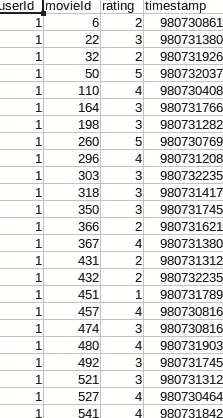

评级. csv

分级数据集具有唯一的用户 Id、电影 Id、分级和时间戳。

现在，我们将通过在 shell 中使用以下命令来加载这些数据集

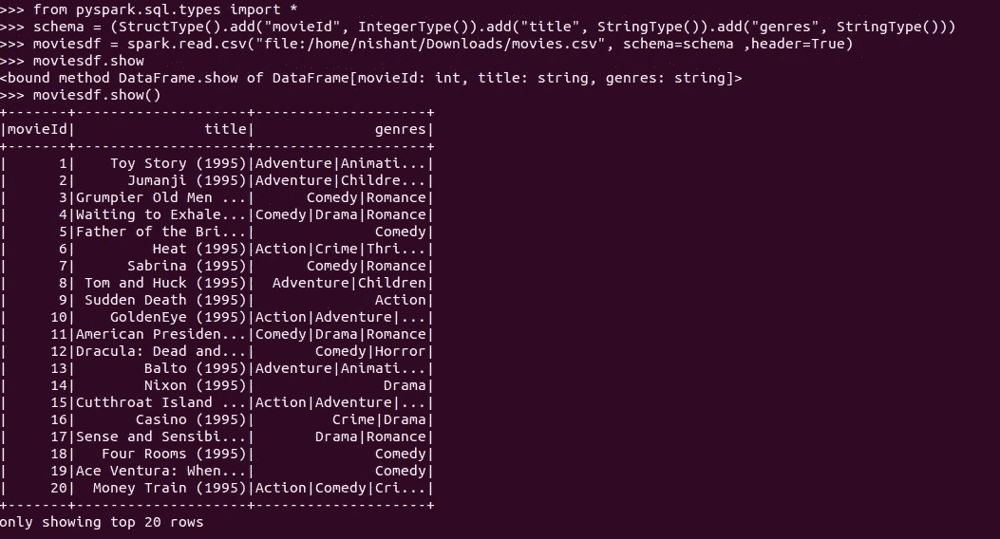

加载 csv 文件

我们将创建一个模式来确保每一列都有我们需要的数据类型。为此，我们将创建 StructType 并使用目标数据类型向其添加 StructFields。然后，当我们从本地机器读取文件时，我们将传递这个模式，并设置 header = True(它将 CSV 文件的第一行作为表的列名，默认情况下它是 False，如果没有设置 True，则保留默认的列名，如 _c0、_c1)。现在我们已经创建了名为 moviesdf 的数据帧，现在我们将对它执行各种转换。

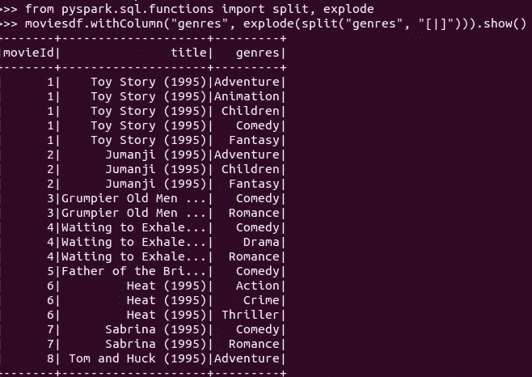

使用爆炸功能将每部电影与每种类型分开

首先，我们必须了解 withColumn 是如何工作的，withColumn 用于在数据帧中创建一个新列，它带有某种条件或者只是填充常量值。如果列已经存在，就像在这种情况下(类型列)，我们可以用一些条件填充它。

流派列有与该电影相关的各种流派，但我们需要分别处理每个流派，因此我们将使用“|”操作符拆分流派，然后使用 explode，以便每个不同的流派都在各自的行中。这将忽略数据集内存在的 null 或空类型，如果出于某种原因您希望它们持续存在，那么您可以使用 explode_outer，因为它也将存储 null 或空值。

根据电影的类型列出电影的数量。

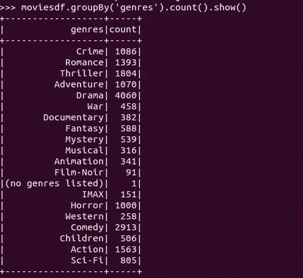

我们必须根据电影的类型对其进行分组，并计算行数，以了解不同类型的电影数量。正如我们在这里看到的，drama 以一定的优势赢得了比赛。

*现在问题来了，他们有没有没有指定类型的电影。*

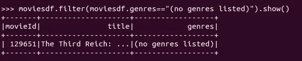

我们将根据我们的条件过滤数据帧，电影结果是《第三帝国:兴衰》。我想这个应该在纪录片栏目下。如果你不这么认为，请评论:)

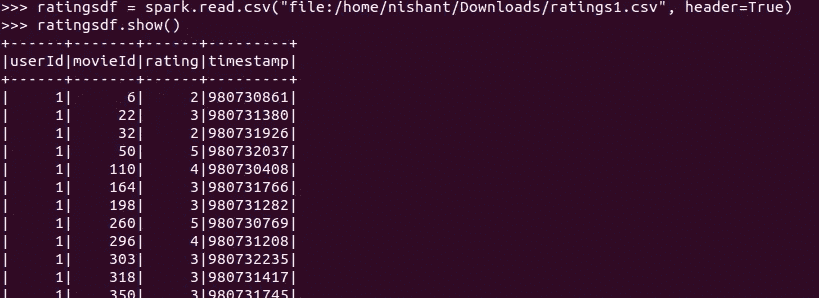

正在读取分级 csv 文件

我们将读取第二个数据集，但这一次我们不会传递模式，spark 框架将通过默认情况下将它分配给 StringType 来处理它。您可以使用 df.schema 命令对此进行交叉检查。

现在，我们将 movieId 作为两个数据集中的公共主键，我们可以通过某种条件连接这些数据帧，并在一个视图中获得可用信息的完整视图。

*连接两个数据帧(moviesdf 和 ratingsdf)*

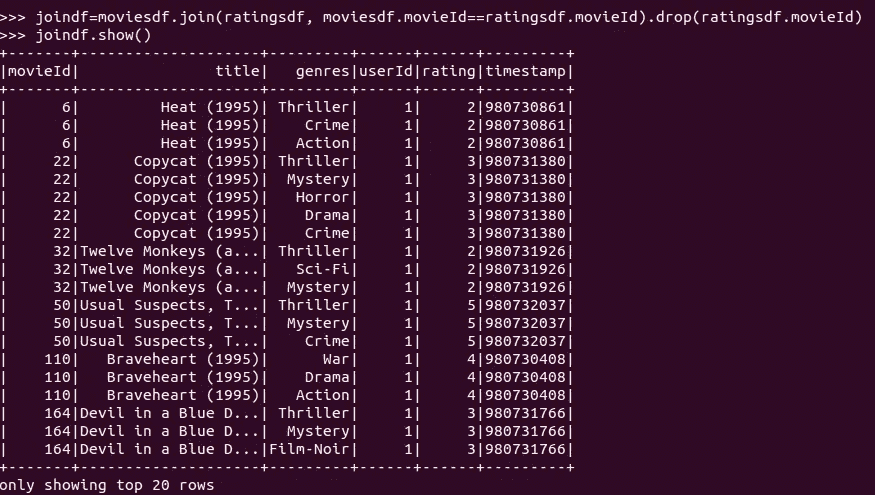

两个数据框架之间的内部连接

这里 moviesdf 是左表，ratings df 是右表。当两个电影 id 匹配时，我们执行内部连接，我们得到结果，因此 movie id 列出现在两个数据帧中，所以我们必须删除一个 movieId 列，否则它们都将出现在最终的数据帧中，这是不必要的，因为它们是相同的。因为是内部连接，所以我们可以不指定连接类型就得到结果。如果你想执行外部或左连接等，那么你可以使用一个共同的一般方式是 moviesdf.join(ratingsdf，on=['movieId']，how='outer ')。

在上图中，我们可以看到，对于同一个电影 Id 和片名，存在不止一种类型。*假设我们只想要每个电影 Id 和标题行中的第一行。*

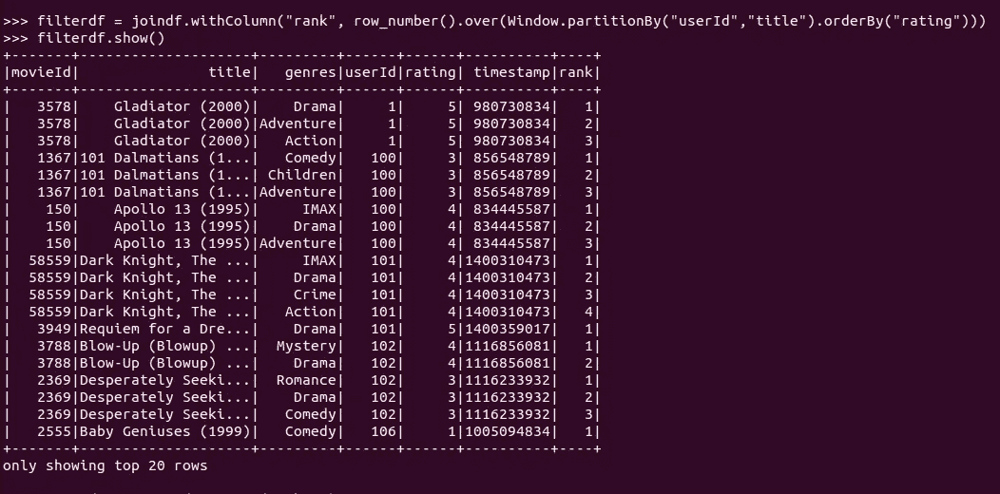

我们将通过在 spark 中使用窗口操作来实现这一点，spark 在开发中被广泛使用。我们将创建一个 movieId 和 title 相同的窗口，如果它们包含相同的 movieId 和 title 值，则将它们组合在一起并存储在同一个分区中，并按评级对它们进行排序(尽管在现实生活中，我们可能会得到不同的时间戳，我们必须按此对它们进行排序，但在这里时间戳是相同的，因此我们可以按评级或时间戳对它们进行排序)。在行号的帮助下，我们会给它一个序列号，然后我们可以选择行号的最低或最高值，但这样做时，我们会保留这些等级值，并使用列来实现这一点。它将创建一个名为 rank 的新列，其中包含递增的序列值。

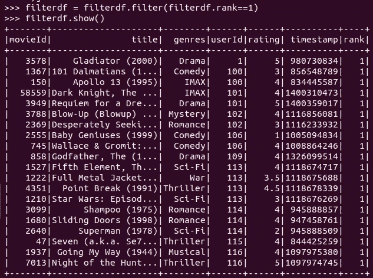

现在我们可以过滤掉等级等于 1 的记录，这样每部电影只有一行。如果您愿意，也可以在转换后删除 rank 列，因为我们已经过滤掉了记录，所有行的值都相同。

*找出用户最喜欢的 10 部电影(高评分)和最差的(低评分)(例如让用户标识为 544)*

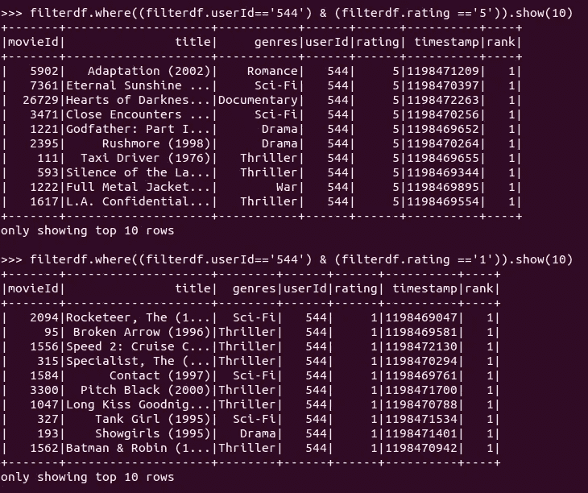

为特定用户找出按其类型分级的所有电影的数量。

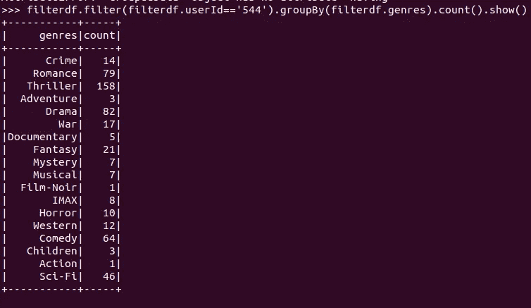

现在这可能相当简单，首先，我们将检查用户 id 是否为 544，然后我们将按照他们的类型对他们进行分组，并对其使用一些聚合函数，因为我们只想计算记录的数量，因此我们将使用 count。

如果你有任何建议，请在回复中告诉我！

我希望这篇文章对你有帮助！