# Selenium Python —来自 IMDB 评论的电影推荐(无需实际阅读评论)

> 原文：<https://medium.com/analytics-vidhya/movie-recommendation-from-imdb-reviews-without-actually-read-the-reviews-fe8865a70bd5?source=collection_archive---------8----------------------->

Python web crawling selenium 包和 web scrapping BeautifulSoup 包可以给你一个你想看的电影推荐，不用看所有的影评


来源:今日印度(Breaking Bad)

你是否曾经想看一部电影或开始看一部新的电视节目，但你不知道它是好是坏。你可以看到评级，但有时评级是有偏见的。那就留给我们评论吧。这些评论让我们对人们如何看待这部电影或电视剧有了更深入的了解。但是谁有时间去读那些评论呢？

作为程序员，我们可以用代码让枯燥的过程变得更快更有趣。所以，我们用 Python 给我们推荐一部电影或者电视剧。我们走吧！

# 导入包

我们使用 Python 从 IMDB 评论中获取评论。我们需要一个网页抓取包去 IMDB 评论页面和网页清理包在页面上获得所有的评论。这是我们需要的包裹。

```
import requests
from bs4 import BeautifulSoup
from selenium import webdriver
from selenium.webdriver.common.keys import Keys
import pandas as pd
from vaderSentiment.vaderSentiment import SentimentIntensityAnalyzer
from textblob import TextBlob
import time
```

如果您没有这些包，您必须首先在您的命令提示符下用这行代码安装它。

```
pip install (name of the package)
```

例如:pip 安装熊猫

以下是对所有软件包的解释:

*   请求包用于获取网页的 url，以清除评论
*   BeautifulSoup 包用于获取网页的 HTML，以清除评论
*   webdriver 包是用于网页抓取的
*   Keys 包是另一种在网页中点击按钮的方式
*   熊猫包装是在一个数据框架中进行审查
*   SentimentIntensityAnalyzer 包是使用 Vader perspection 对评论进行情感分析
*   TextBlob 包使用 textblob 对评论进行情感分析
*   时间包是为了在我们进行网页抓取时暂停一下

为什么要用两种情绪分析？因为我检查了情感分析的准确性，结果不是很好。因此，为了消除这个错误，我使用了[Vader impression](/@jeffsabarman/sentiment-analysis-vader-sentiment-vs-textblob-part-1-a8ccd2d610de)和 textblob 来给出我们可以选择的结果。说到底，看不看由我们自己决定。

让我们开始旅程吧

# 网页抓取到 IMDB 用户评论网站

导入所有必需的包后，让我们开始 web 爬行之旅。首先，我们必须设置要运行的 web 浏览器。就我个人而言，我使用谷歌浏览器。因此，我将向您展示如何使用 chrome 网络浏览器进行网络抓取。在跳转到代码之前，请确保安装了 chromedriver。如果你使用另一个浏览器，你也必须安装你选择的浏览器。

首先，你必须在帮助部分检查你的 chrome 版本，然后是关于谷歌 chrome。

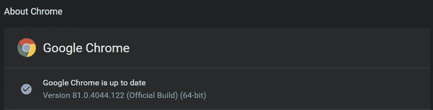

谷歌 Chrome 版本

如你所见，我的谷歌浏览器版本是 81 版。在你知道版本之后，你必须安装你的版本的 chrome 驱动程序。

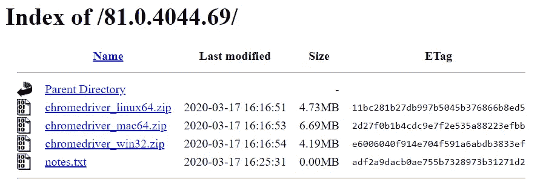

chrome 驱动程序安装

你安装好之后，我们可以继续我们的旅程。

```
movie = input("What movie or tv shows do you want to watch? : ")#Set the web browser
driver = webdriver.Chrome(executable_path=r"C:\chromedriver.exe")

#Go to Google
driver.get("https://www.google.com/")
```

首先，我们要求您输入想要观看的电影或电视节目的名称。然后，我们为 web 爬行部分设置“driver”变量。驱动变量是我们之前安装的 chrome 驱动。我们必须使用“executable_path=r”，否则我们会得到一个错误。在里面，我们输入你之前安装的 from 驱动的地址(只是从你的目录中复制地址作为文本)。

之后我们使用。获取方法去谷歌。当你来到谷歌，你必须检查元素。你可以在你想要检查的东西上点击右键并点击检查。对于这个例子，谷歌搜索栏。

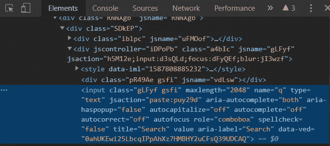

检查元素谷歌搜索框

从突出显示的部分可以看到，有一个 name='q '。

```
#Enter the keyword
driver.find_element_by_name("q").send_keys(movie + " imdb")
time.sleep(1)
```

所以我们用。按名称查找元素。我们使用“by_name ”,因为我们要获取的元素是 name 元素。之后我们使用。send_keys()来输入 google 搜索栏的关键字。我们输入电影的名字和“imdb”来搜索谷歌。例如，如果电影变量是复仇者，则输入到 google 搜索栏的关键字是复仇者 imdb。电影变量是您之前输入的内容。我们使用 time.sleep(1)将下一个驱动程序代码延迟 1 秒。

输入关键字后，你必须点击谷歌搜索按钮。和以前一样，你在谷歌搜索按钮上点击右键，然后点击 inspect。

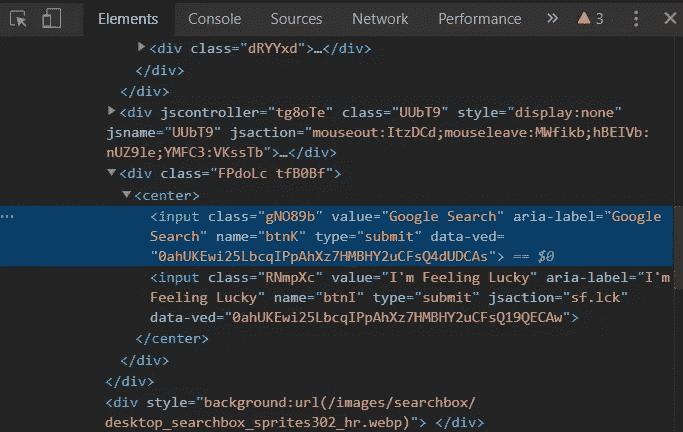

检查元素谷歌搜索按钮

从突出显示的部分可以看到，有一个 name='btnK '。

```
#Click the google search button
driver.find_element_by_name("btnK").send_keys(Keys.ENTER)
time.sleep(1)
```

所以我们用。按名称查找元素。我们像以前一样使用“by_name ”,因为我们想要获取的元素是 name 元素。之后我们使用。send_keys(按键。回车)点击按钮。我们也可以使用。单击()选择其他选项。

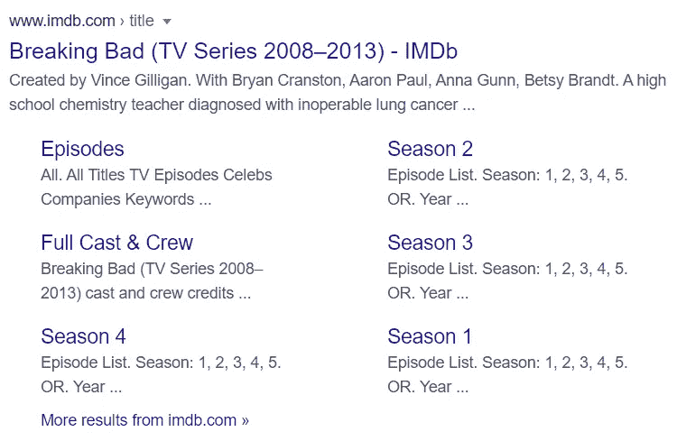

打破糟糕的 IMDB 谷歌搜索结果

我们将使用电视节目《绝命毒师》作为例子。搜索关键字后，您将进入结果页面。第一个结果将是电影的 imdb 页面。之后，您检查来自 web 的链接，这是 inspect 元素。

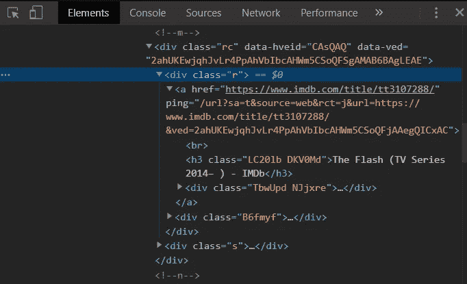

检查第一个 url 的元素

从突出显示的部分来看，类的名称是“r”

```
driver.find_element_by_class_name("r").click()
```

我们使用。单击()以单击该链接。你点击之后，它会自动转到该电影的 imdb 页面。

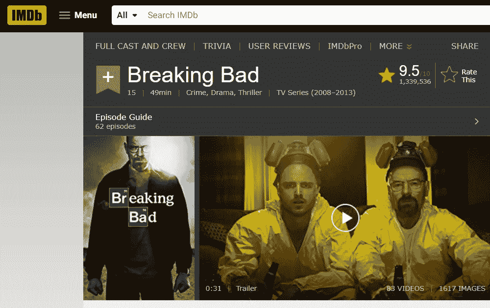

致命的 IMDB 页面

之后，您选择用户评论。这次我使用 xpath 来简化元素的查找。

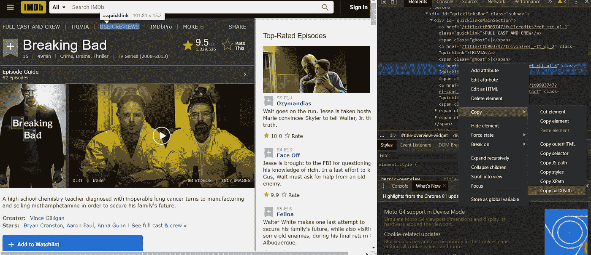

用户检查检查元素

```
#Click the user reviews
driver.find_element_by_xpath("/html/body/div[3]/div/div[2]/div[5]/div[1]/div/div/div[1]/div[1]/div[1]/a[3]").click()
```

在我们点击用户评论后，我们跳转到用户评论页面。

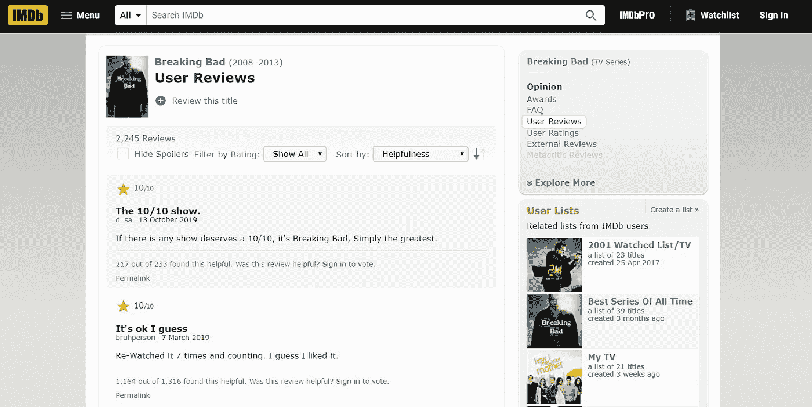

用户评论页面

当我们进入用户评论页面后，网络爬行之旅就结束了。

# 网络搜集评论

我们使用 BeautifulSoup 包来删除 IMDB 评论页面上的评论。

```
#Scrap IMBD review
ans = driver.current_url
page = requests.get(ans)
soup = BeautifulSoup(page.content, "html.parser")
all = soup.find(id="main")
```

首先，我们使用变量“ans”来存储用户评论页面的 url。我们使用 request 来获取链接和 BeautifulSoup 来获取页面的 HTML。我们使用。find 获取所有评论并将评论存储在变量中。

```
#Get the title of the movie
all = soup.find(id="main")
parent = all.find(class_ ="parent")
name = parent.find(itemprop = "name")
url = name.find(itemprop = 'url')
film_title = url.get_text()
```

通过找到存储电影标题的正确元素，我们可以从页面中获取电影的标题。

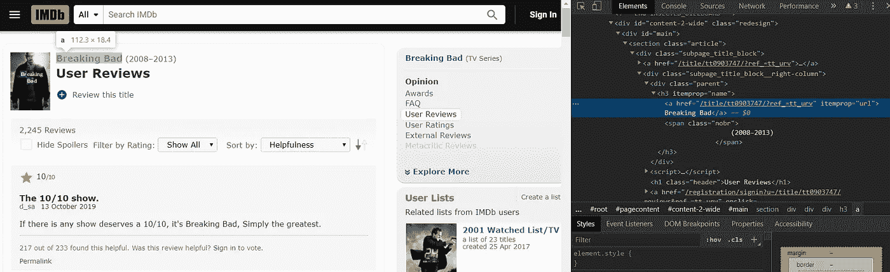

移动检查元素的标题

```
#Get the title of the review
title_rev = all.select(".title")
title = [t.get_text().replace("\n", "") for t in title_rev]
```

之后我们可以用。选择("。title”)从元素中提取。我使用 lambda 表达式来获取页面中的所有评论标题。所有评论的标题都存储在 title 变量中。我们使用。get_text()用于从 HTML 中获取文本。

```
#Get the review
review_rev = all.select(".content .text")
review = [r.get_text() for r in review_rev]
```

我们通过使用。选择("。内容。正文”)。的。内容和。文本来自 inspect 元素。我们还像以前一样使用 lambda 表达式将所有的评论存储在变量“review”中。

标题和审查变量的类型是列表。

```
#Make it into dataframe
table_review = pd.DataFrame({
    "Title" : title,
    "Review" : review
})
```

我们可以将评论的标题和评论存储在一个数据帧中。在我们得到所有评论后，让我们开始情感分析。

```
#Vadersentiment
analyser = SentimentIntensityAnalyzer()
sentiment1 = []
sentiment2 = []

for rev in review:
    score1 = analyser.polarity_scores(rev)
    com_score = score1.get('compound')
    if com_score  >= 0.05:
        sentiment1.append('positive')
    elif com_score > -0.05 and com_score < 0.05:
        sentiment1.append('neutral')
    elif com_score <= -0.05:
        sentiment1.append('negative')
```

第一个，我用的是 Vader perspective 包。你可以在这里了解 Vader 情操[。之后，我们使用 TextBlob。](/@jeffsabarman/sentiment-analysis-vader-sentiment-vs-textblob-part-1-a8ccd2d610de)

```
#TextBlob
for rev in review:
    score2 = TextBlob(rev).sentiment.polarity
    if score2 >= 0:
        sentiment2.append('positive')
    else:
        sentiment2.append('negative')
```

在我们使用 TextBlob 情感分析之后，我们可以得到结果。

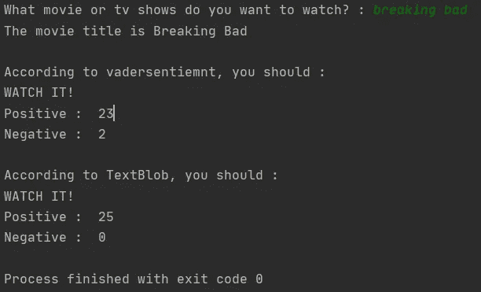

程序输出

根据我们的节目，我们应该看《绝命毒师》！

如你所见，给予正面评价的有 23 条，负面评价的有 2 条。textblob 给所有的评论一个积极的情绪。结果不一样，但是你可以假设《绝命毒师》是好的，你应该看。

在这之后的挑战，你可以添加一个驱动程序，点击更多的评论，并从 IMDB 获得所有的评论，而不只是从一个页面。

下面是整体代码:[网页抓取和抓取 IMDB 评论](https://github.com/jeffsabarman/Web-Scraping/blob/master/Web%20Crawling%20and%20Scraping%20IMDB%20Review.py)

因此，有一个程序可以让你根据 IMDB 的评论建立自己的电影推荐。当你想看电影或者电视剧的时候，你可以先用这个程序来帮助你的决定！享受这个节目吧！

如果你对任何步骤有任何麻烦或困惑，请在 [instagram](https://www.instagram.com/jeffsabarman/?hl=en) 上联系我，或者查看我的 [github](https://github.com/jeffsabarman) 。

如果你喜欢这类内容，请告诉我！你可以在 instagram 或者 twitter @jeffsabarman 上找到我。