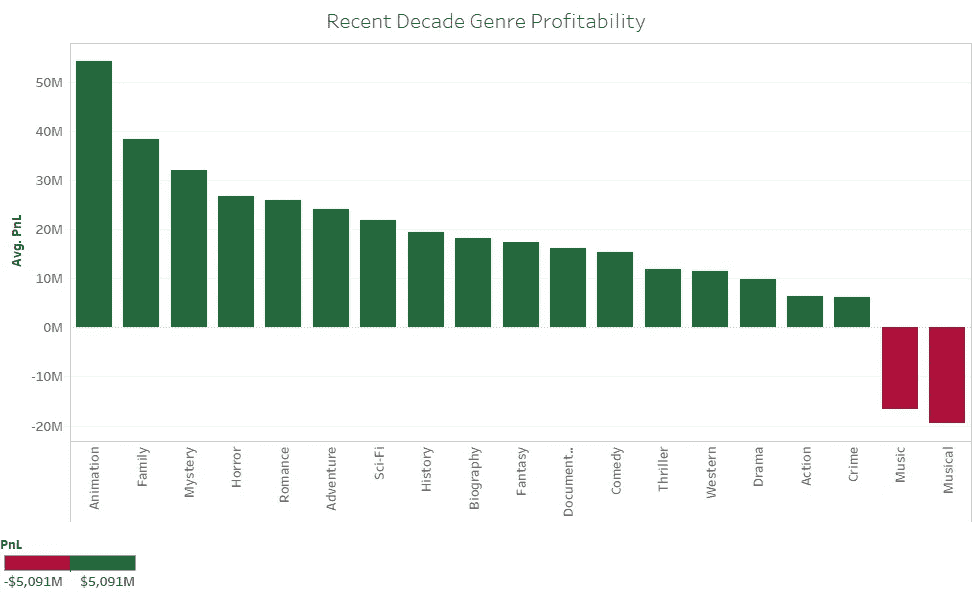

# 电影推荐系统

> 原文：<https://medium.com/analytics-vidhya/movie-recommendation-system-19bfebdf400a?source=collection_archive---------8----------------------->

Kunal Bhardwaj&[Veera Vignesh](https://www.linkedin.com/in/veeravignesh1)([博客](https://veeravignesh1.github.io/))原创作品


# 介绍

电影已经成为我们文化的一部分很长时间了。这一切都始于公元前 5 世纪的戏剧。19 世纪 90 年代放映的短片被认为是电影业的突破。20 世纪可以说是电影和所用技术发展的行业增长的催化剂。行业经历了许多方面，例如

*   无声时代
*   好莱坞的崛起
*   黄金时代
*   大片的出现
*   现代电影业

现在，这个行业已经成熟，已经成为一个 400 亿美元的产业，美国是仅次于中国和印度的第三大售票市场。

美国拥有世界著名的制片公司，如华纳兄弟、索尼电影公司、华特·迪士尼、环球电影公司等等。

# 问题陈述

制片公司制作的电影主要是为了让电影受欢迎和有利可图。假设制作公司有兴趣回答以下问题

**拍一部成功的电影需要考虑哪些因素？**

# 目标

*   分析影响电影成功的因素，如总值，脸书喜欢，评论家评论，IMDb 评分等。
*   根据所选择的类型推荐合适的导演、演员、情节，使我们的电影盈利

# 数据

*   为了分析提到的问题[，IMD b-5000-电影数据集](https://data.world/popculture/imdb-5000-movie-dataset)从[数据世界](https://data.world/)中获得
*   我们的数据包括从 1916 年到 2016 年的 5048 部电影
*   每一个观察值都代表了由不同字段(如标题、年份、导演、演员等)生成的单个电影。总共有 **5048 行 28 列**。

# 特征工程

*   Genre 列包含用管道运算符(' | ')分隔的多个值，excel 用于将它们分成单独的列。前 3 个流派仅被考虑和命名为流派 _1、流派 _2、流派 _3。现在我们的数据集包含 5048 行和 30 列

这些修改是使用 **excel** 完成的。在初始修改之后，使用 pandas 将数据加载到 python 上，以进行进一步分析

# 探索性数据分析

```
# importing necessary modules
**import** pandas **as** pd
**import** numpy **as** np
**import** matplotlib.pyplot **as** plt
**import** seaborn **as** sns
**import** os
**import** statsmodels.api **as** stm# Loading the data into the dataframe

df = pd.read_csv('movie_metadata.csv')

# Displaying 5 samples of the dataset
df.sample(5)
```


5 行× 28 列

describe()函数的输出是


```
#To understand about the missing values in the data

df.info()<**class** '**pandas**.**core**.**frame**.**DataFrame**'>
RangeIndex: 5043 entries, 0 to 5042
Data columns (total 28 columns):
color                        5024 non-null object
director_name                4939 non-null object
num_critic_for_reviews       4993 non-null float64
duration                     5028 non-null float64
director_facebook_likes      4939 non-null float64
actor_3_facebook_likes       5020 non-null float64
actor_2_name                 5030 non-null object
actor_1_facebook_likes       5036 non-null float64
gross                        4159 non-null float64
genres                       5043 non-null object
actor_1_name                 5036 non-null object
movie_title                  5043 non-null object
num_voted_users              5043 non-null int64
cast_total_facebook_likes    5043 non-null int64
actor_3_name                 5020 non-null object
facenumber_in_poster         5030 non-null float64
plot_keywords                4890 non-null object
movie_imdb_link              5043 non-null object
num_user_for_reviews         5022 non-null float64
language                     5031 non-null object
country                      5038 non-null object
content_rating               4740 non-null object
budget                       4551 non-null float64
title_year                   4935 non-null float64
actor_2_facebook_likes       5030 non-null float64
imdb_score                   5043 non-null float64
aspect_ratio                 4714 non-null float64
movie_facebook_likes         5043 non-null int64
dtypes: float64(13), int64(3), object(12)
memory usage: 1.1+ MB# To better understand the count of the missing values
df.isnull().sum().sort_values(ascending=**False**)gross                        884
budget                       492
aspect_ratio                 329
content_rating               303
plot_keywords                153
title_year                   108
director_name                104
director_facebook_likes      104
num_critic_for_reviews        50
actor_3_name                  23
actor_3_facebook_likes        23
num_user_for_reviews          21
color                         19
duration                      15
facenumber_in_poster          13
actor_2_name                  13
actor_2_facebook_likes        13
language                      12
actor_1_name                   7
actor_1_facebook_likes         7
country                        5
movie_facebook_likes           0
genres                         0
movie_title                    0
num_voted_users                0
movie_imdb_link                0
imdb_score                     0
cast_total_facebook_likes      0
**dtype: int64**
```

因为总额和预算是具有许多缺失值的重要字段..让我们看看它的分布情况

```
# Distribution of the Gross
sns.distplot(df.loc[df.gross.isna()==**False**,'gross'],color='g')
plt.title('Distribution of Gross')
plt.xlabel('Gross in USD')
plt.ylabel('Frequency in Log')
plt.show()
print(f'Mean: {df.gross.mean():.2f}')
print(f'Median: {df.gross.median():.2f}')
```


```
**Mean**: 48468407.53
**Median**: 25517500.00# Distribution of the Budget
sns.distplot(df.loc[df.budget.isna()==**False**,'budget'],color='g')
plt.title('Distribution of budget')
plt.xlabel('Budget in USD')
plt.ylabel('Frequency in Log')
plt.show()
```


```
print(f'Mean: {df.budget.mean():.2f}')
print(f'Median: {df.budget.median():.2f}')
```

*   很明显，这两种分布都高度向右倾斜，估算中值将是一种更好的方法。
*   由于数据跨度超过 100 年，用整个系列的中值来估算价值是错误的，因为货币价值会随着时间而变化。

**用相应年份的中位数进行估算将是一种更好的方法**

```
# Grouping by title_year and imputing gross and budget with median.
df.loc[df.gross.isnull(), 'gross'] = df.groupby('title_year')['gross'].transform('median')
df.loc[df.budget.isnull(), 'budget'] = df.groupby('title_year')['budget'].transform('median')df.isnull().sum()color                         19
director_name                104
num_critic_for_reviews        50
duration                      15
director_facebook_likes      104
actor_3_facebook_likes        23
actor_2_name                  13
actor_1_facebook_likes         7
gross                        130
genres                         0
actor_1_name                   7
movie_title                    0
num_voted_users                0
cast_total_facebook_likes      0
actor_3_name                  23
facenumber_in_poster          13
plot_keywords                153
movie_imdb_link                0
num_user_for_reviews          21
language                      12
country                        5
content_rating               303
budget                       100
title_year                   108
actor_2_facebook_likes        13
imdb_score                     0
aspect_ratio                 329
movie_facebook_likes           0
**dtype: int64**# Dropping values with both gross and budget that is not available

df.drop(df.index[(df.gross.isna() == **True**) & 
    (df.budget.isna() == **True**)], inplace=**True**)df.shape(4946, 28)df.isnull().sum().sort_values(ascending=**False**)aspect_ratio                 309
content_rating               264
plot_keywords                140
num_critic_for_reviews        42
gross                         33
actor_3_facebook_likes        19
actor_3_name                  19
num_user_for_reviews          15
color                         15
facenumber_in_poster          13
duration                      12
actor_2_name                  11
title_year                    11
director_facebook_likes       11
actor_2_facebook_likes        11
director_name                 11
language                       9
actor_1_name                   7
actor_1_facebook_likes         7
budget                         3
country                        1
movie_facebook_likes           0
genres                         0
movie_title                    0
num_voted_users                0
movie_imdb_link                0
imdb_score                     0
cast_total_facebook_likes      0
**dtype: int64**
```

删除这 97 个观察值实际上减少了 director_name 和 director_facebook_likes 中的空值数量。由于空值的数量在质因数总观察值的 1%以内，我们可以继续分析

# 假设一:电影的票房与预算有关吗？

让我们先了解一下历年来预算总额的总体趋势。


20 世纪 70 年代被恰当地称为工业的黄金时代，因为我们可以看到电影制作的数量激增，电影制作的预算也急剧增加。

现在让我们深入了解一下..让我们假设电影产量最高的那一年，然后把它推广到所有年份

```
print(f"In the year {df.groupby('title_year')['gross'].count().idxmax()}",end='')
print(f" there were about {df.groupby('title_year')['gross'].count().max()} movies released, which maximum as per our data")In the year 2009.0 there were about 260 movies released, which maximum as per our data# Plotting regplot for 2009
sns.regplot(df.loc[df.title_year==2009,'budget'],df.loc[df.title_year==2009,'gross'],scatter_kws={'alpha':0.3})
plt.title('Gross vs Budget for the 2009')
plt.show()
```


我们可以观察到总额和预算之间存在线性关系。这只针对当年电影数量最多的一年。

```
# Understanding the plot of all the movies over the years
plt.scatter(df.budget,df.gross,alpha=0.3)
plt.xscale('log')
plt.yscale('log')
plt.show()
```


从上图可以清楚地看出，我们的假设成立，因为我们可以看到预算和总收入之间的线性关系。

# 假设 2:当今时代制作成功电影的最佳类型是什么？

在进入当前时代之前，让我们通过绘制最高票房的电影和了解各种类型电影的数量来探索有史以来最好的电影类型。


树的大小表示在该特定类型中发行的电影的数量，类型的颜色表示该特定类型的平均总收入。

由此我们可以理解，尽管动画类型的电影数量较少，但总收入约为 8000 万美元。《冒险》包含大量电影，平均总收入也为 8000 万美元

现在，让我们来探索当前十年(2010-2016)的趋势



从图表中可以清楚地看到，《T2》动画和《T3》的平均总收入更高，而该类型电影的发行数量更少，我们的制作公司可以利用这一机会并加以利用。

# 假设三:成功电影的常见剧情？

为此，字段 plot_keywords 得出在特定类型的有利可图的电影中更经常出现的关键字。基于关键词的频率，我们可以做出一个图表。


管道运算符将 plot_keywords 分隔成单独的字段。对于这一特定类型的所有有利可图的电影，关键字被过滤掉以制作 Tableau 仪表板


整个分析然后被转换成 Tableau Dashboard，这将提高报告的可用性。

[电影仪表盘](https://public.tableau.com/views/MovieAnalysis_15709753412350/Landingpage?:embed=y&:display_count=yes&:origin=viz_share_link)

有关更多详细信息:

[Github 链接](https://veeravignesh1.github.io/projects/movie-recommendation-system/)

# 参考

1.  [Statista](https://www.statista.com/statistics/237749/value-of-the-global-entertainment-and-media-market/)
2.  [电影史](https://en.wikipedia.org/wiki/History_of_film)
3.  [票房](https://en.wikipedia.org/wiki/Box_office)