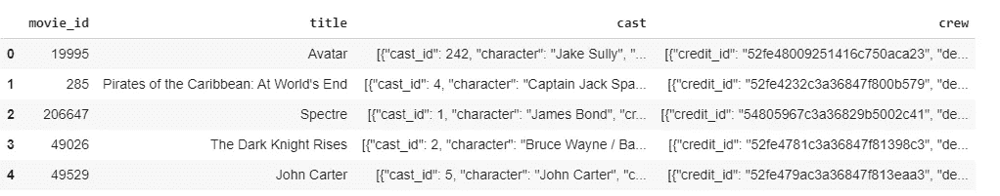
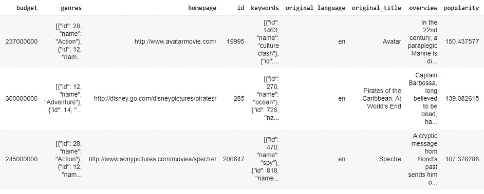
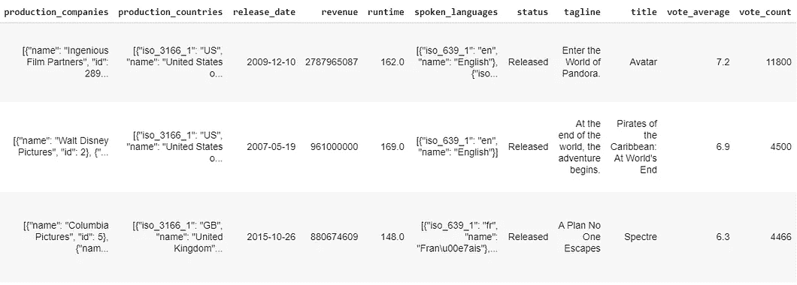
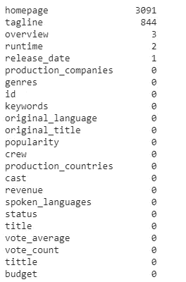
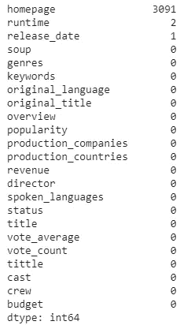
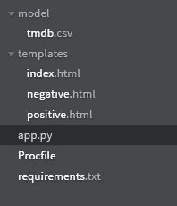
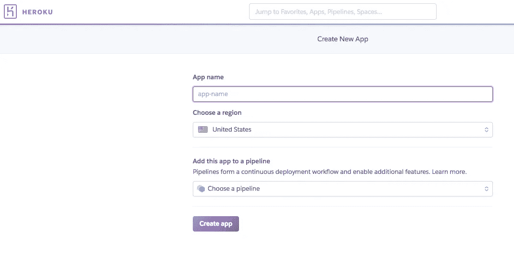

# 电影推荐系统| Python AI Web 应用|云部署

> 原文：<https://medium.com/analytics-vidhya/movie-recommendation-system-python-flask-web-application-heroku-deployment-7e39492b640c?source=collection_archive---------1----------------------->


> 最后的申请我们可以在这里勾选
> 
> 完整的代码在 Github 上。检查[这里](https://github.com/inboxpraveen/recommendation-system)。

嗨，在这篇博客中，我将解释以下内容:

1.  数据预处理
2.  构建电影推荐器机器学习模型
3.  创建网页并将它们连接到 Flask 渲染
4.  使用 python 和表单验证创建完整的接口和异常处理
5.  部署到 Herokuapp.com

所以，事不宜迟，我们开始吧。此外，如果您已经熟悉某个部分，请随意跳过它。


# 第 1 部分:数据预处理

我们先来看看数据集。我们将使用来自 Kaggle.com[的](https://www.kaggle.com/) [TMDB5000 数据集](https://www.kaggle.com/tmdb/tmdb-movie-metadata)。数据集由 2 个文件组成，分别是 tmdb _ 5000 _ credits . CSV&tmdb _ 5000 _ MOVIES . CSV，还有一个数据集叫做[电影数据集](https://www.kaggle.com/rounakbanik/the-movies-dataset)，里面有超过百万的电影评论和评分。然而，我没有使用它有两个原因。

1.  数据集对于系统来说太大了，估计需要 45–50GB 的 RAM。
2.  生产的机器学习模型对 Heroku 来说也太大了。Heroku 不允许我们在免费账户上存储超过 250MB 的内容。

让我简单介绍一下数据集，以便我们可以专注于构建机器学习模型部分。

我们将 2 个 CSV 文件加载到 df1 和 df2 熊猫数据帧中。



图 1:数据帧 1 — tmdb_5000_credits.csv



图 2:数据帧 2 — tmdb_5000_movies.csv

我没有处理两个数据帧，而是合并了两个数据帧，这样我们就只能处理一个数据帧。幸运的是，数据集没有大量的空值。让我们一个一个来处理。这里是所有列的概述。



图 NaN 的所有列视图

查看 id 列，它对于每部电影都是唯一的，我们不需要它，因为它对推荐没有贡献。此外，标语栏应该删除，因为大多数电影都有一个概述，因此标语会产生更多类似的上下文。删除这两列会产生一个包含 21 个属性的数据框。

有多个列(见图 3 ),其中有一个包含字典的字符串或节点。我们可以使用 ast 模块中的 literal_eval 来删除这些字符串或节点，得到嵌入的字典。所以我们使用 literal_eval 来表示属性转换、关键字、船员和类型。现在我们有了字典形式的这些属性，我们可以使用这些属性并获得重要的特征，如导演姓名，这是我们推荐系统的一个非常重要的因素。此外，对于演员、关键字和流派属性，我们可以在列表中返回每个类别中的前 3 名。现在，我们可以创建一个单独的列，它是所有这 4 个属性的总和，这 4 个属性是我们的推荐系统非常重要的因素。让我们把这个列叫做“汤”(因为它就像一个汤/4 个属性的组合)。

现在让我们检查 NaN 值的数据集。



图 5:更新了所有列的视图

由于我们的主页有很多空值，我们没有其他选择，只能放弃它。我们也可以用平均值填充运行时的空值。因为我们有一部未发行的电影，我们可以删除那一行，因为这部电影是未发行的。现在我们有了最终的数据集，可以进行一些机器学习建模了。

# 第二部分:构建电影推荐器机器学习模型

为了构建我们的模型，我们首先创建一个计数矩阵，它是在[计数矢量器](https://scikit-learn.org/stable/modules/generated/sklearn.feature_extraction.text.CountVectorizer.html)的帮助下创建的。我们用英语停用词&创建一个计数向量，并对我们在上一节中创建的 soup 列进行拟合和转换。Scikit-learn 有一个非常漂亮的方法叫做[余弦相似度](https://www.machinelearningplus.com/nlp/cosine-similarity/)。它只是一个度量标准，用于确定文档的相似程度，而不考虑文档的大小。在为我们的数据集构建余弦相似性矩阵之后，我们现在可以对结果进行排序，找出前 10 部相似的电影。我们将电影标题&索引返回给用户。

# 第 3 节:创建网页并将其连接到 Flask 渲染

注意:下面是最终的目录设置:



图 6:目录设置

网页需要看起来非常简单，但信息量足够让每个人都明白。此外，我喜欢设计好的用户界面效果，让用户感觉非常好。

我用一个名为 movie 的类创建了一个 div，并提供了关于推荐系统的最少信息。我还提供了谷歌的博客链接来获取更多信息&阅读推荐系统。这是谷歌博客的链接。我在一个表单中提供了主输入字段，用户输入电影名称，表单通过按钮的动作提交。提交后，电影名称在后端被捕获并进一步处理。我还在 div 和其他 CSS 属性上提供了良好的效果，使页面看起来非常棒，非常令人愉快。

现在我们已经创建了 index.html 网页，我们需要将它连接到烧瓶，并在链接最初打开时呈现它。所以让我们跳到 [flask web 应用框架](https://github.com/pallets/flask)的基础上，为用户呈现它。

注意:如果你不熟悉 flask web 应用开发，请参考这个[链接](https://realpython.com/python-web-applications/)。

我们使用 app.py 中的以下代码来简单地呈现我们刚刚创建的页面。

```
*import flask**app = flask.Flask(__name__, template_folder=’templates’)**# Set up the main route
@app.route(‘/’, methods=[‘GET’, ‘POST’])**def main():
    if flask.request.method == ‘GET’:
        return(flask.render_template(‘index.html’))*
```

现在我们已经渲染了 index.html，让我们希望用户输入一个电影名。进入后，用户单击提交按钮，表单被提交。

# 第 4 部分:使用 python 和表单验证创建完整的接口和异常处理

现在我们有了一个电影名，它由用户在表单中提交。让我们将这个名称保存在 python 中的 m_name 变量中。我们接受使用 post 方法提交的表单。

```
if flask.request.method == ‘POST’:
    m_name = flask.request.form[‘movie_name’]
    m_name = m_name.title()
```

我们还将输入的电影名称转换为标题格式。标题形式只是将每个单词的每个字符转换成大写字母。现在我们有两个选择:

*   如果输入电影名称拼写错误或不在数据库中。

*—如果错误，显示错误页面&根据输入可能相似的电影名称。*

*   如果输入了正确的电影名称，并且存在于数据库中，则显示推荐。

下面是执行相同操作的代码。

```
if m_name not in all_titles:
   return(flask.render_template(‘negative.html’,name=m_name))
else:
   result_final = get_recommendations(m_name)
   names = []
   dates = []
   for i in range(len(result_final)):
      names.append(result_final.iloc[i][0])
      dates.append(result_final.iloc[i][1]) return flask.render_template(‘positive.html’,movie_names=names,movie_date=dates,search_name=m_name)
```

让我们仔细看看 positive.html 和 negative.html。

*   Negative.html

如果来自用户的输入与包含数据库中存在的所有电影名称的 all_titles 列表不匹配，则渲染 negative.html。

Negative.html 页面简单地显示了无法找到所搜索电影的可能原因。它还在整个数据库中进行搜索，并利用类似的单词搜索技术( [difflib.get_close_matches()方法](https://github.com/enthought/Python-2.7.3/blob/master/Lib/difflib.py)在 python 中& [Levenshtein 距离方法](https://en.wikipedia.org/wiki/Levenshtein_distance))来找到最接近的匹配，并向用户建议与用户输入的电影名称非常相似的电影名称。所有这些都是使用 javascript 完成的，最终呈现在 HTML 页面上。

*   Positive.html

如果输入的电影名称与数据库匹配，则渲染 Positive.html。如果是这样，我们通过传递电影名来调用 get_recommendations 函数。get_recommendations 函数与我们在第 2 节中讨论的函数相同。我们获取电影名称，计算关于数据集的余弦矩阵，并找到与输入电影最相似的电影。我们对结果进行排序并返回前 10 个结果。我们将相似的电影名称以及它们的发行日期列表发送给 positive.html。我们创建了一个表格布局，并打印出 10 部电影及其上映日期。

UI 部分纯粹是 CSS & Javascript 上的。这是基于我个人对制作一个令人愉快的设计网站的兴趣，然而，它是完全可选的，应用程序仍然工作得很好。

# 第 5 节:部署到 Herokuapp.com

*   注册一个 Heroku 帐户

要在 Heroku 上部署应用程序，您需要在平台上拥有一个帐户。注册又快又容易(而且完全免费)。现在就去 signup.heroku.com 的[开始吧。](https://signup.heroku.com/trailhead)

*   当你登录到你闪亮的新 Heroku 账户后，你会发现你自己在 Heroku 仪表板上。上面写着“Heroku 入门”。如果你是 Heroku 的新手，选择一个代表你的编程语言的图标，按照入门指南创建一个新的应用程序。
*   但是 Heroku 提供了一种方法，通过使用一种叫做 Buttons 的工具，你可以更快地开始。只需点击一个按钮，您就可以部署一个预配置的应用程序，它拥有所需的一切，包括代码、配置和附加组件。通过创建你的第一个带有按钮的 Heroku 应用程序，你可以感受到这个平台的易用性。您还可以获得一个真正的、功能正常的 Node.js 应用程序，您可以探索和修改它以了解更多信息。
*   点击此按钮安装您的第一个应用程序:


1.  为您的新应用程序输入名称，或者让 Heroku 为您选择一个名称。
2.  选择创建运行时的地区:美国或欧洲。
3.  点击**创建应用**部署应用。在一两分钟内，你的应用程序将在 Heroku 上启动并运行！



图 7: Heroku 应用程序创建仪表板

现在您已经创建了您的应用程序，选择应用程序并转到部署选项。

在部署方法下，单击 Heroku Git，您将看到从您的系统进行部署的过程。

> 最后的申请我们可以在这里勾选
> 
> 完整的代码在 Github 上。检查[这里](https://github.com/inboxpraveen/recommendation-system)。

> *如果你喜欢，可以看看我在* [*用计算机视觉进行深度学习*](https://medium.com/hitchhikers-guide-to-deep-learning) *上发表的文章。*