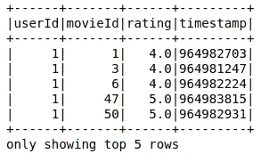
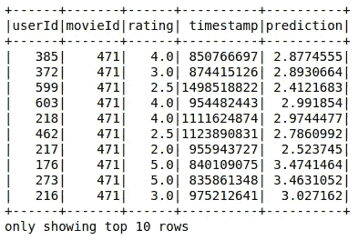
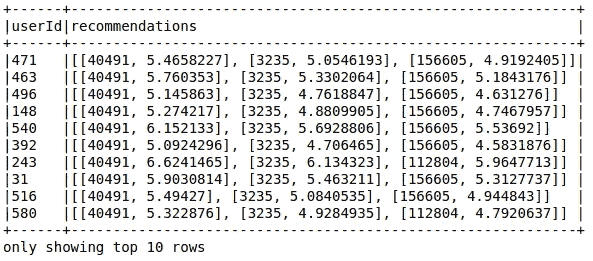

# Pyspark 协同过滤的电影推荐

> 原文：<https://medium.com/analytics-vidhya/movie-recommendation-with-collaborative-filtering-in-pyspark-8385dccecfca?source=collection_archive---------8----------------------->


嘿伙计们，

今天，我们将探索一种名为“[带 ALS](https://spark.apache.org/docs/latest/mllib-collaborative-filtering.html) 的协同过滤”的酷机器学习算法，它通常用于根据用户和用户对电影的偏好(通过用户给出的评级来判断)推荐电影/歌曲或任何功能。这个算法被许多著名的[公司使用，比如 Youtube、Reddit、网飞](https://en.wikipedia.org/wiki/Collaborative_filtering#Application_on_social_web)和我。很酷不是吗？

所以基本上，协同过滤模型以 userId，item 列和 ratings 列作为特征列，并训练自己为每个用户推荐项目。所以，让我们不要在无聊的理论部分浪费太多时间，直接进入有趣的编码部分。不过，如果你想了解更多关于这个算法的内容，你可以点击这里访问[。](https://databricks.com/blog/2014/07/23/scalable-collaborative-filtering-with-spark-mllib.html)

现在，让我们开始吧！我将使用公开可用的电影数据集，可以在这里找到。因此，首先让我们读取和显示数据。

```
ratings = spark.read.option(“inferSchema”,True)\
                    .option(“header”,True)\
                    .csv(“ml-latest-small/ratings.csv”)ratings.show(5)
```



电影数据集

现在，让我们继续前进，启动我们的 ALS 模型，并将我们的数据集分成两部分进行训练和测试(事实上是 80:20 的比例)。

```
from pyspark.ml.recommendation import ALSals = ALS(maxIter=10, regParam=0.5, userCol="userId", 
                      itemCol = "movieId", ratingCol =    "rating", coldStartStrategy = "drop")train, test = ratings.randomSplit([0.8, 0.2])
```

简单介绍一下所使用的参数，三个参数 userCol、itemCol 和 ratingCol 用于设置功能，maxIter 用于 ALS 将执行的迭代次数(可根据使用情况决定)，regParam 指定 ALS 中的正则化参数(默认值为 1.0)，而 [coldStartStrategy](https://spark.apache.org/docs/2.2.0/ml-collaborative-filtering.html#cold-start-strategy) 表示当运行预测且模型未针对特定用户进行训练/未找到某个用户的评级或项目时，如果给定“drop”作为参数值，它将删除这些用户。

所以，现在让我们训练我们的模型并生成预测。

```
#Training the Model
alsModel = als.fit(train)#Generating Predictions
prediction = alsModel.transform(test)prediction.show(10)
```



生成的预测

因此，有些预测似乎很准确，但有些很糟糕(坦白地说:P)，不管怎样，现在我们的模型已经训练好了，让我们来看看它有多好。

```
from pyspark.ml.evaluation import RegressionEvaluatorevaluator = RegressionEvaluator(metricName="mse", labelCol="rating",  predictionCol="prediction")mse = evaluator.evaluate(prediction)print(mse)Output: 1.0168009658367847
```

嗯，精度也不错(没必要一开始就判断模型)。因此，这个模型似乎运行得很好。所以让他给每个用户推荐前 3 部电影吧。

```
recommended_movie_df = alsModel.recommendForAllUsers(3)recommended_movie_df.show(10, False)
```



输出是给每个用户的推荐列表，可以很容易地转换成列。您还可以传递数据集，并通过使用*recommendeforusersubit()*函数为其生成建议。

所以，这就是我的观点。希望你会喜欢我的文章，如果有任何建议，请在下面评论。请检查我以前的文章，链接如下:

[](/analytics-vidhya/spark-delta-lake-d05dd480287a) [## 火花三角洲湖

### 火花上的酸以及一些升级。

medium.com](/analytics-vidhya/spark-delta-lake-d05dd480287a) 

所以，下次见，再见，再见！