# 电影推荐系统(Spark，SQL 和 Python)

> 原文：<https://medium.com/analytics-vidhya/movie-recommendations-system-spark-sql-with-python-4ad29f238ab?source=collection_archive---------7----------------------->

## 使用 Spark 在 AWS 上的集群管理器，从 100 万个评级中创建了“相似电影推荐”模型。执行 SQL 命令，SQL 风格的函数，并通过 MLLib 改进电影推荐模型。

图片来源:互联网

由于近年来电影业技术的进步，越来越多的人在舒适的沙发上欣赏他们最喜欢的电影。因此，看到网飞、Hulu、Disney+等不同电影流媒体服务之间争夺霸主地位的大战就不足为奇了。跨越新闻头条(亚历山大，2020)。尽管有不同的营销策略和原创内容，但所有这些网站都有一个共同点:“电影推荐系统”。

通过两种方法向观众推荐电影:协同过滤或基于内容的过滤。基于内容的过滤基于你观看历史的基因做出了他们的预测，如果你喜欢《老友记》或《疯狂动物城》，那么你会在你的推荐列表中看到《Shazam》，这是纯粹的“喜剧”。另一方面，协同过滤系统是基于相似用户的历史来进行预测的。电影流媒体服务同时使用两者以获得最佳效果。(基尔日纳，2018 年)

在这个项目中，我们将探索使用 Python 中的 Spark 代码为《星球大战》(1997)电影获得电影推荐的协同过滤方法。这些推荐是由那些在观看《星球大战》(1997)的同时评论了其他电影的人的观看历史产生的。如果他们对《星球大战》(1997)的评价很高，他们很可能也会对其他类似的电影有同样的想法。该项目使用三个独立的数据集:

1.  **u.ITEM** 文件包含:“电影 ID”、“电影名称”
2.  **u.DATA** 文件包含:100，000 个电影评级的“用户 ID”、“电影 ID”、“电影操作”、“时间戳”。数据集来自 1998 年
3.  **“收视率”**文件包含类似于 **u.DATA** 文件的功能，但适用于 100 万电影收视率。数据集来自 2003 年

# **I/探索性数据分析(EDA)**

首先，我们将引入的 Pyspark 包运行到 Anaconda 环境中。每次运行程序时，我们都需要在“本地”设置正确的上下文和一些配置。然后我创建了弹性分布式数据集(RDD)，这是分布在集群中许多机器上的数据元素的分布式集合，通常在 Java 或 Scala 编程中更常见。之后，我们指定使用 lambda 的“map”函数将数据解析为不同的值，并通过 countByValue()函数根据值对所有评论进行计数。因此，我们会将每个评论分数分类为一个关键，而具有类似分数的评论数量在 RDD 的价值。下面的结果告诉我们，观众在评分时通常是慷慨的，大多数电影的评分在 2 到 4 之间，其中 4 是评论数量最多的。只有大约 2000 部电影被评为最佳或经典电影，这需要真正的努力。

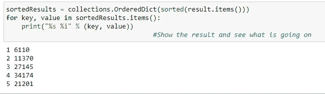

接下来，我们将使用 map()函数和 lambda 方法创建“movies”变量，只提取一个“MovieID”列表作为键，并将每一行的值赋为“1 ”,以便我们稍后可以将它们加在一起。然后，我们通过 reduceByKey()函数将共享同一个“MovieID”键的所有行加起来，计算一部电影被评论的次数。之后，我们交换了键和值之间的位置，以便“出现次数”成为键，而“MovieID”成为值。通过 sortByKey()，我们发现“50”是最受欢迎的电影，有 584 条评论。

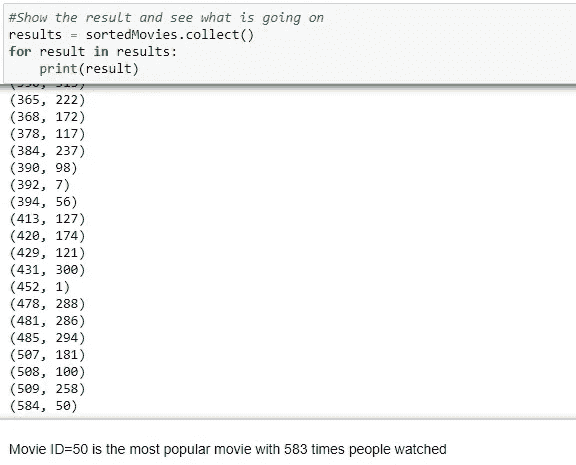

为了检查它是什么电影，我们建立了一个字典来匹配“电影 ID”和“电影名称”。后来我们终于发现，一直以来都是《星球大战(1997)》

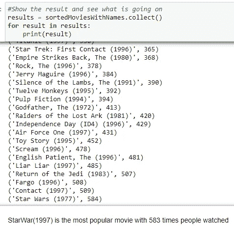

# **II/电影推荐和潜在模型优化方法**

为了重新创建电影推荐系统，我们必须遵循三个步骤。首先，我们找到由同一个人观看的每一对电影。然后，我们在观看了这两部电影的所有用户中测量他们的评分的相似性。最后，我们先按电影排序，然后按相似度排序

**通过代码的方法:**

1.  将输入分级映射到(用户 ID，(电影 ID，分级))
2.  查找评级为同一用户的每一对电影

> 这可以通过“自加入”操作来完成
> 
> 此时，我们有(userID，((电影 ID1，评级 1)，(电影 ID2，评级 2)))

3.过滤掉重复的对

4.让电影配对成为关键

> 映射到((movieID1，movieID2)，(rating1，rating2) /// movieID: keys，rating: values

5.groupByKey()来获取为每个电影对找到的每个评级对

6.计算电影对中每个电影的评分之间的相似性

7.排序、保存和显示结果

值得注意的是，我们使用的模型实现了“共面度量”。我们还将最低共同评价人或最低分数的阈值设置为 0.95，将发生阈值设置为 50。与其他项目不同，这不能用 Jupyter 笔记本上的脚本来完成，而是用 Anaconda 提示符来完成。在开始菜单的 Anaconda 提示符下运行命令‘spark-submit Movies-similarities . py 50’。确保将文件保存在中。py 而不是。ipynb 格式，并在正确的驱动器上运行您的代码，以便它可以顺利运行。完成后，我们有以下最终建议:

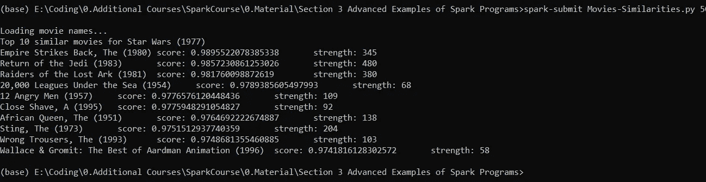

“分数”表明你的预测有多准确，“强度”象征着看过《星球大战》(1977)的类似用户的数量。在这份报告中,“得分”更可信，这就是为什么我们在推荐《绝地归来》之前推荐《帝国反击战》,尽管后者实力较低。然而，我们需要确保适度的“实力”门槛，因为我们有一些不相关的推荐，如《海底两万里》(20，000 leafs of the Sea)、《近距离》(Close Shave)和《超级无敌掌门狗》(Wallace & Gromit)，只有不到 100 篇类似的评论。

**有五种方法可以改进结果，即未来的研究者改进模型**:

> 丢弃所有像“1”这样的坏评级，只保留好的推荐
> 
> 尝试不同的相似性度量，而不是“同侧度量”，如皮尔逊相关系数、贾卡系数、条件概率
> 
> 发明一种新的相似性度量标准，将共同评价者的数量考虑在内
> 
> 通过使用类型数据集将“内容过滤方法”与“协作过滤”相结合，以逼真地模拟电影推荐系统
> 
> 调整我们上面设置的阈值

在这种情况下，我们将查看前 3 项建议旁边的，系统将建议我们修改阈值的其他 3 项建议是什么。我们忽略前三部电影的原因是因为它们的“得分”都在 300 分以上，如果我们包括它们，我们的比较就没有用了。

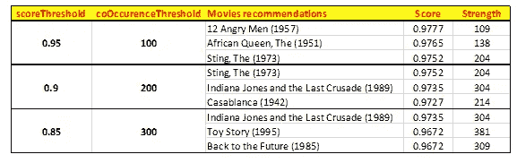

从上表可以清楚地看出，最后一个阈值分数组合是最好的，因为它包括了所有在类型方面与《星球大战 1977》相似的经典作品:冒险、动作和科幻

# **III/云集群上的电影推荐(亚马逊网络服务-EC2)**

在这一部分中，我们使用 AWS 中的 EC2 在云集群上运行 Spark，从而获得了一百万个电影评级，而不仅仅是 100.000 个。

## **a)AWS Elastic MapReduce 和 PartitionBy()简介**

**AWS 弹性 MapReduce:**

1.  在您自己的集群上租用时间的非常快速和简单的方法
2.  在 Hadoop 的 Yarn 集群管理器上为您设置默认的 spark 配置
3.  Spark 还有一个内置的独立集群管理器和脚本来建立自己的基于 EC2 的集群(Barr，2009)
4.  EMR 上的 Spark 并不贵，但也不便宜
5.  确保首先在数据的一个子集上本地运行

**PartitionBy():** 是 RDD 上的一个方法，你可以用它来说“嘿，我要运行一些大型操作，但是我没有足够的计算机资源来实际上把它分成许多不同的执行器，许多不同的运行”这基本上告诉我我想把这个作业分成多少部分。确定多少分区是足够的非常重要

1.  太少，我们将无法充分利用您的群集
2.  太多会导致混排数据的开销太大
3.  至少要有与可用内存中的内核或执行器一样多的分区
4.  对于大型操作，在 10 台计算机上使用 partition by(100)通常是一个合理的起点

## **b)流程和审核:**

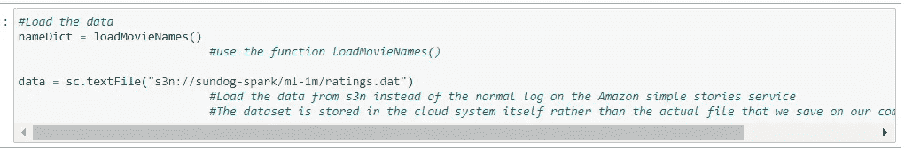

1.  我们将使用**‘u . DATA’**文件，但对于 100 万电影收视率。我们从 s3n 加载数据，而不是 Amazon simple stories 服务上的普通日志。数据集存储在云系统本身，而不是我们保存在计算机上的实际文件。(Sundog-Spark)。SparkConf 是空的，而不是后面有东西，因为我要在命令行上传递它。利用 EMR elastic Map Reduce 上的一些预聚集的东西，这些东西会自动告诉 Spark 在 Hadoop 线程上运行

2.重复我们在第二部分中创建的代码。

3.打开 AWS，通过在驱动程序中使用一个空的默认 SparkConf 来指定每个执行器的**内存——这样，我们将使用默认的 EMR 设置，以及您从主节点传递到 spark-submit 的任何命令行选项。在这个项目中，默认的 executor 内存预算 512MB 不足以处理一百万个电影评级。因此，我们必须做的是:**

> spark-submit-executor-memory 1g 电影-相似点-1M.py 260

(从我们集群的主节点。executor-memory 1g 用于指定 u 将为每个 executor 放置 1gb，以便顺利运行一切)

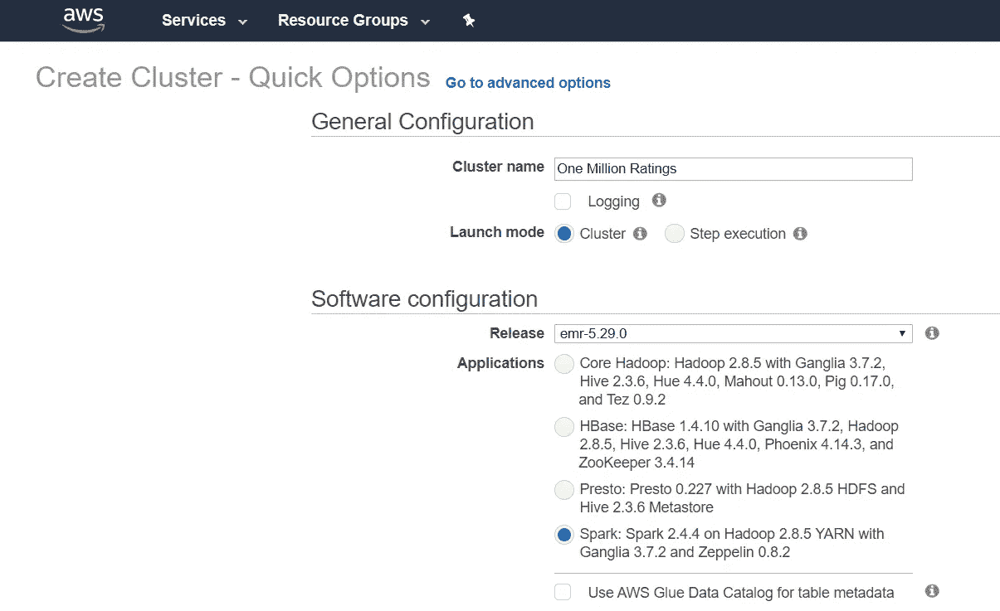

4.在联机集群上运行数据集。为了做到这一点，我们必须经历许多小步骤。我们将脚本和数据放在 EMR 可以轻松访问的地方。接下来，使用 AWS 控制台为 Spark 启动 EMR 集群，**其中，AWS 在那一刻开始计费。**然后，获取主节点的外部 DNS 名称，并使用“Hadoop”用户帐户和您的私钥文件登录。复制你的驱动程序和任何需要的文件。最后，运行 spark-submit 并观察输出。

> ***但是一定要记得在完成后终止集群***

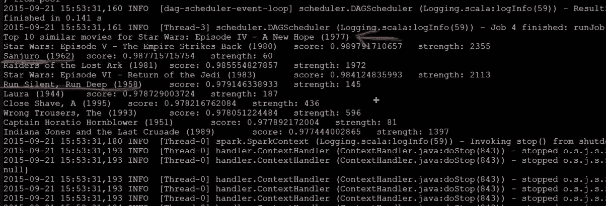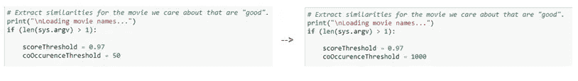

就像我们之前的《星球大战:第五集》是最相似的电影。但在那之后，《三十郎(1962)》和《无声无息，深入运行》分别以 0.9877 和 0.9791 的“分数”排名第二和第五。然而，当我们看“实力”时，只有 60 人评价“星球大战 4”，也评价“三十郎(1962)”，只有 145 人评价“无声无息，深入运行”。这些都是很低的值。由于我们正在处理 100 万个结果，因此最好将“强度”阈值提高一点，以显示更正确的结果，如“夺宝奇兵”或“星球大战:第六集”。后来，我们将发生阈值从 50 固定为 1000，以便它可以产生更准确的值

请记住，我们稍后可能会遇到一些问题。其中之一是当我们有遗嘱执行人未能发出心跳。因此，当您对每个执行器要求太多，并且需要更多执行器时，您可以修改 partitionBy()，通过使用更小的分区来减少每个执行器的工作量。另一个问题是管理依赖关系，因为你的执行器有时可能不属于你的驱动脚本。我们既可以使用广播变量来共享 RDD 之外的数据，也可以使用一些没有预装在 EMR 上的 Python 包。

# **使用 Spark 的机器学习库(MLlib)的 IV/电影推荐系统**

## **a) MLlib 能力**

1.  **特征提取**:对搜索有用的词频/逆文档频率
2.  **基本统计**:卡方检验、皮尔逊或斯皮尔曼相关、最小值、最大值、平均值、方差
3.  **ML 模型**:线性回归、逻辑回归、SVM、朴素贝叶斯、决策树、K 均值聚类(McDonald，2019)
4.  分析的主成分，奇异值分解
5.  使用交替最小二乘法的建议

MLlib 数据有三种类型:矢量(密集或稀疏)，标记点，评级

## **b)流程和评审:**

我们首先向 **u. Data** 添加了 3 个以上的假评论来测试我们的模型，创建了配置和检查点。然后，我们加载数据并训练模型

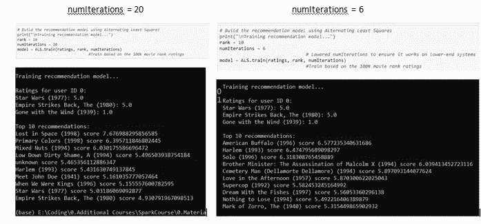

每次运行代码时，它都会产生与之前不同的结果。不幸的是，所有 numIterations = 20 的电影推荐都与《星球大战帝国反击战》不相似。在 numIterations = 6 的情况下，该模型推荐的《美国水牛城》(American Buffalo)或《哈莱姆(Harlem，1993)》甚至与《星球大战》(Star War)电影相去甚远。这些都是粗略的结果，我们可以进一步改进模型。如果模型对所选参数非常敏感，我们可以将数据分为“训练”和“测试”组，以评估参数的各种排列。创建一个嵌套循环(黑盒),尝试你能想到的所有组合。但是这是相当不可靠的，因为你可以过度拟合结果。如果我们在不同的人使用它的地方或者从不同的时间框架改变他们的 UI，这种方法的预测并不总是有效的。因此，在分析大数据时，我们需要始终保持警惕和怀疑，即使我们的模型。在这种情况下，normal Spark 实际上提供了比 MLLib 更准确的结果。

# **用 SparkSQL 和 DataFrames 简化代码**

在这个项目的这一部分，我们将看到 SparksSQL 如何帮助我们简化与 RDD 相比的数据帧代码。Dataframe 属于数据集伞，DataFrame 是一个表或类似二维数组的结构，其中每列包含一个变量的值，每行包含每列的一组值。(Geeksforgeeks，2019)由于与 RDD 相比具有距离优势，它被认为是 Spark 的未来。

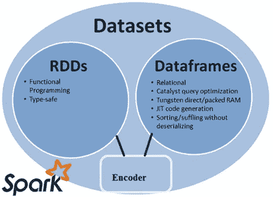

与之前的大块代码不同，当我们对 SQL 使用 DataFrame 而不是 RDD 格式时，代码更加充分。所有的动作都可以呈现在一行代码中，如下所示。我们可以同时根据 ID 对数据进行分组，然后对它们进行计数，然后按照电影评论的数量进行升序排序。与《星球大战(1997)》是最受欢迎的电影相比，我们以更快的速度实现了相同的 EDA 分析。

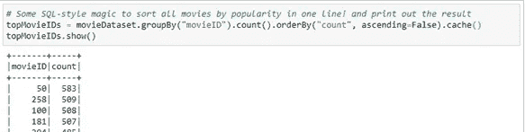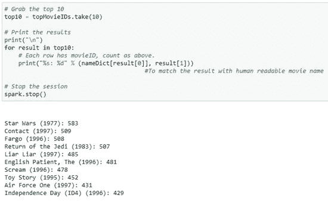

# **六/结论**

这个项目是一个很好的机会，让我们了解 Spark 是如何根据协作过滤方法在中构建有效的电影推荐系统的。这也证明了机器学习并不总是关于使用最先进的技术，而是我们实际上对问题的理解程度。通过简单的 Spark 代码战胜复杂的 MLlib，可以明显看出

**Github**:[https://Github . com/lukastuong 123/Python-Projects/tree/master/Project-% 20 movie % 20 建议% 20(Spark % 2C % 20 SQL % 20 with % 20 Python)](https://github.com/Lukastuong123/Python-Projects/tree/master/Project-%20Movie%20Recommendations%20(Spark%2C%20SQL%20with%20Python))

**参考&来源:**

**极客 forgeeks。(2019).** Python |熊猫 DataFrame。从 https://www.geeksforgeeks.org/python-pandas-dataframe/[取回](https://www.geeksforgeeks.org/python-pandas-dataframe/)

**亚历山大，J. (2020)** 。流媒体战争终于开始了，但这更多的是一场礼貌的争吵，而不是全面战争。检索自[https://www . the verge . com/2020/2/6/21126156/streaming-wars-Disney-plus-网飞-wall-street-subscribers-HBO-max-peacock](https://www.theverge.com/2020/2/6/21126156/streaming-wars-disney-plus-netflix-wall-street-subscribers-hbo-max-peacock)

**麦克唐纳，C. (2019)。**阿帕奇 Spark 机器学习教程| MapR。检索自[https://mapr . com/blog/Apache-spark-machine-learning-tutorial/](https://mapr.com/blog/apache-spark-machine-learning-tutorial/)

巴尔，J. (2009 年 4 月 2 日)。宣布亚马逊弹性 MapReduce。检索自[https://AWS . Amazon . com/blogs/AWS/announcing-Amazon-elastic-MapReduce/](https://aws.amazon.com/blogs/aws/announcing-amazon-elastic-mapreduce/)

**Kirzhner，E. (2018)。**机器学习。协同过滤与基于内容的过滤的解释。检索自[https://code burst . io/explain-of-recommender-systems-in-information-retrieval-13077 E1 d 916 c](https://codeburst.io/explanation-of-recommender-systems-in-information-retrieval-13077e1d916c)

**电影评论数据集【https://grouplens.org/datasets/movielens/】:**

**灵感来源:凯恩，F. (2020)。**用 Apache Spark 和 Python 驯服大数据——动手吧！[幻灯片]。检索自[https://www . udemy . com/course/taming-big-data-with-Apache-spark-hands-on/](https://www.udemy.com/course/taming-big-data-with-apache-spark-hands-on/)