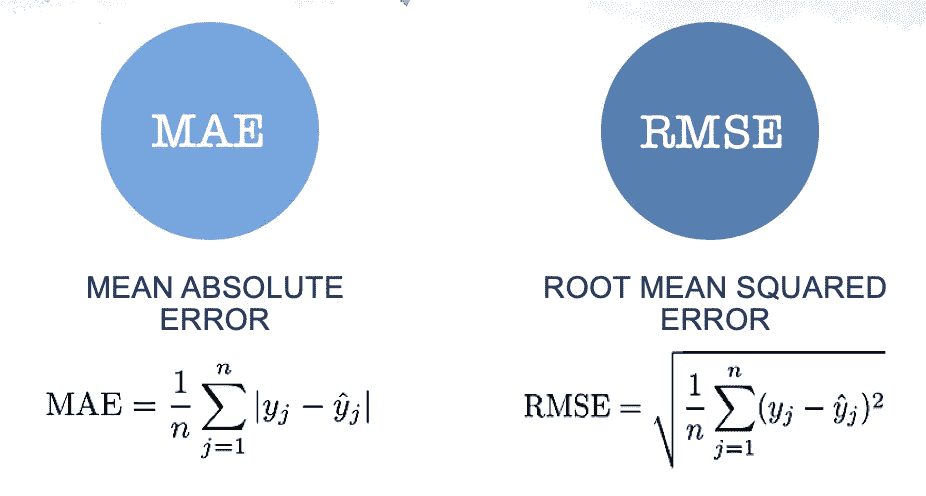

# 基于内容和协同过滤的电影推荐系统

> 原文：<https://medium.com/analytics-vidhya/movie-recommender-system-using-content-based-and-collaborative-filtering-84a98b9bd98e?source=collection_archive---------6----------------------->

网飞推荐电影

*   使用协同过滤和基于内容的过滤方法创建了一个电影推荐系统。
*   *通过计算 RMSE 值比较所有方法的结果*

## 介绍

为消费者匹配最合适的产品是提高用户满意度和忠诚度的关键。因此，越来越多的零售商对推荐系统感兴趣，该系统分析用户对产品的兴趣模式，以提供适合用户口味的个性化推荐。

## 推荐系统方法

推荐系统中的机器学习算法通常分为两类:

1.  协同过滤
2.  基于内容的过滤

## 协作过滤:

*   这种方法基于用户和目标项目之间过去的交互。
*   协同过滤系统的输入将是用户与目标项目交互的所有历史数据。
*   这些数据通常存储在一个矩阵中，其中行是用户，列是项目。

来源:https://medium . com/@ CVxTz/movie-recommender-model-in-keras-E1 d 015 a 0 f 513

## 基于内容的过滤:

*   处理用户提供的数据，无论是显式的(评级)还是隐式的(点击链接)。
*   基于该数据，生成用户简档，然后使用该简档向用户提出建议。

## MOVIELENS 数据集:

*   2000 万收视率
*   138，000 名用户将 465，000 个标签应用于 27，000 部电影

MovieLens 数据集示例

## 绩效指标:

1.  **平均绝对误差:**测量预测评分与真实评分的平均偏差(误差)。
2.  **均方根误差:**更严厉地惩罚大错误。

## 使用协同过滤的推荐器

**方法 1: *随机梯度下降作为学习算法***

*   我们使用随机梯度下降通过循环训练集中的所有评级来优化算法。
*   系统预测用户 *u* 对用户 *i* (r *ui* )的评分，并计算相关的预测误差:

*   然后，在梯度的相反方向上，以与γ成比例的幅度修改参数，产生:

*   训练 100 个周期后的 RMSE:**0.983**

**方法二:*深度学习作为一种学习算法***

1.  **数据预处理:**这包括查看数据的形状，移除不一致和垃圾值。
2.  **将数据分割成训练和测试**:我们使用‘sk learn . train _ test _ split’库进行了 80–20 分割。
3.  **定义模型**:

*   为电影矩阵和用户矩阵创建单独的嵌入。
*   使用点积合并嵌入的矩阵。
*   尝试各种深度学习层，如密集层、批量标准化、矩阵点积后的丢弃。(以组合的方式给出最佳结果)

4.**决定参数**如隐藏层、漏失、学习率、优化器、时期。

5.**训练模特**

6.使用训练好的模型进行**预测**

模型的总结

***实验***

*   我们试验了不同的隐藏层数、下降值、优化器和学习率。
*   我们发现，具有 50 个节点的 1 个隐藏层、20%的丢弃、Adam 优化器、0.001 学习率和 100 个时期的组合给出了均方根误差的最佳值( **0.81** )。

***结果***

*   我们使用矩阵分解和 Keras 层来为我们的推荐系统训练深度学习模型。
*   一旦模型被训练，系统可以显示输入用户 ID 的前 N 部推荐电影。
*   在下面的截图中，我们得到了用户 id“1”的前 15 部推荐电影。

## 使用基于内容过滤的推荐器

***高层流程***

1.  **数据预处理:**这包括查看数据的形状，去除不一致的地方，垃圾值等等。
2.  **将数据拆分为训练和测试:**我们使用“sklearn.train_test_split”库进行了 80–20 拆分。
3.  **定义模型:**

*   我们使用 MovieLens 评级数据，其中每个标签通常是一个单词或短语。特定标签的含义、价值和用途由每个用户决定。
*   我们使用“sk learn . feature _ extraction . text”tfidf 矢量器计算用户评级数据的 TF-IDF 矩阵。
*   我们定义了一个自动编码器模型，其编码大小为 100，中间层大小为 1000。

**4。决定参数，如隐藏层，辍学，学习率，优化，纪元。**

**5。训练模型**

**6。使用训练好的模型进行预测**

***方法论***

*   我们使用从用户评级数据获得的 TF-IDF 值来训练自动编码器。
*   在自动编码器收敛之后，我们从模型的编码器部分获得编码字嵌入，并计算嵌入内的余弦相似度。
*   然后，我们根据数据集使用电影 Id 查询这个余弦相似性矩阵，并仅根据评级返回给定用户的前 20 部电影。

***观察结果***

*   我们评估了电影《玩具总动员》和《黄金眼》返回的前 20 部电影。
*   我们注意到相当多的电影坚持玩具总动员的冒险，喜剧和幻想类型。
*   然而，该模型不提供诸如其他迪士尼/皮克斯/动画电影或《玩具总动员》的续集或前传的电影之类的电影，这些电影可以被安全地视为与电影相似。
*   我们还注意到一些异常值，如恐怖电影和 R 级电影，它们与我们的查询不相关。

使用基于内容的过滤的推荐

# 比较和结论

*   **将我们的结果与相邻表格中 Surprise library(一个用于推荐系统的 python scikit)的开发人员发布的 MovieLens 数据集的基准测试结果**进行比较。
*   我们可以看到**深度学习算法比其他算法表现更好**，但是它**需要很长时间来训练**。
*   深度学习算法还可以**扩展**到更大的数据集，而不会影响 RMSE 值。

# 参考

[https://www . kdnugges . com/2019/09/machine-learning-recommender-systems . html](https://www.kdnuggets.com/2019/09/machine-learning-recommender-systems.html)

[https://towards data science . com/creating-a-hybrid-content-collaborative-movie-recommender-using-deep-learning-cc8b 431618 af](https://towardsdatascience.com/creating-a-hybrid-content-collaborative-movie-recommender-using-deep-learning-cc8b431618af)

[https://nipunbatra.github.io/blog/2017/recommend-keras.html](https://nipunbatra.github.io/blog/2017/recommend-keras.html)

[https://towards data science . com/deep-auto encoders-for-collaborative-filtering-6 cf 8d 25 bbf 1d](https://towardsdatascience.com/deep-autoencoders-for-collaborative-filtering-6cf8d25bbf1d)

[https://medium . com/@ connectwithgosh/recommender-system-on-the-movie lens-using-an-auto encoder-using-tensor flow-in-python-f13d 3 E8 d 600d](/@connectwithghosh/recommender-system-on-the-movielens-using-an-autoencoder-using-tensorflow-in-python-f13d3e8d600d)

[https://medium . com/@ connectwithgosh/recommender-system-on-the-movie lens-using-an-auto encoder-using-tensor flow-in-python-f13d 3 E8 d 600d](/@connectwithghosh/recommender-system-on-the-movielens-using-an-autoencoder-using-tensorflow-in-python-f13d3e8d600d)