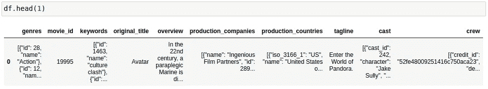

# 电影推荐网站应用

> 原文：<https://medium.com/analytics-vidhya/movie-recommender-web-app-e6c5ea5c4659?source=collection_archive---------14----------------------->

**基于内容的**

电影推荐系统是机器学习中一个基本而重要的项目。在这篇博客中，我将向你展示如何用一个漂亮的网站创建一个基于内容的电影推荐系统，并在 Heroku 上部署这个模型。

要打开电影推荐系统，请点击链接:

[T3【https://nikmoviemaniac.herokuapp.com/】T5](https://nikmoviemaniac.herokuapp.com/)

# **数据采集**

我使用过 **TMDB 5000** 电影数据集，可以通过以下链接在 kaggle 上找到:

[https://www.kaggle.com/tmdb/tmdb-movie-metadata](https://www.kaggle.com/tmdb/tmdb-movie-metadata)。

该数据集包含两个 csv 文件:

1.  tmdb_5000_credits.csv
2.  tmdb_5000_movies.csv

# **数据预处理**

我将在 *Jupyter-Notebook* 中预处理数据集。

使用 *pandas* 读取数据集:

合并 id 和 movie_id 列上的 csv 文件，并将合并后的 csv 文件命名为 ***df*** 。合并后将有大量的列。

为了建立一个基于内容的推荐系统，我们不需要很多栏目，比如预算、主页、流行度、运行时间等等。因此，我将删除这些列，最后一列将留给我们，

测向数据帧的第一列

该数据集中的许多列，如流派、关键词等。都是 Json 格式的，所以，我们必须对它们进行解码并从中提取有用的内容。

现在，数据集将如下所示:

检查数据集中是否有空值，如果有，则清理数据集。到这里为止，有 4803 行和 10 列。

在许多列中，我有列表形式的元素。现在，我将删除列表中的逗号，并删除列表中每个元素*(例如，将“science fiction”转换为“science fiction”)*之间的空格，以便我们可以获得有意义的关键字，因为在后面的步骤中，我将组合一些功能来执行一些非常重要的步骤，我们将在后面看到。我也将文本转换成小写，因为 Python 是区分大小写的，它会不同地考虑“冒险”和“冒险”。

现在，让我们删除逗号，空格并将列表转换为字符串，

数据集的“概述、标语、关键词”列包含无用的元素，如数字和停用词，为了解决这个问题，我遇到了一个非常有用且重要的算法，它是从文本中提取重要的词，该算法是 [***快速自动关键词提取(RAKE)***](https://pypi.org/project/rake-nltk/) 算法。

我将对数据集的列应用 RAKE 算法。

组合除了 original_title 和 movie_id 之外的所有列，因为在基于内容的电影推荐系统中，没有使用 movie_id 和 about original_title，电影的名称需要在单独的列中。

现在，我删除了所有不必要的列，只保留了 original_title 和 combined_features 列。

数据集将如下所示:

由于用户可以搜索任何格式的电影，例如让我们考虑*“蝙蝠侠大战超人:正义黎明”电影，用户可以搜索“蝙蝠侠大战超人”、“蝙蝠侠超人”、“蝙蝠侠正义黎明”*等。因此，我将删除所有无用的字符，合并来自 original_title 列和用户输入的所有单词。

最后将这种格式的数据集转换成一个新的 csv 文件。

点击此链接可以找到包含所有代码的 jupyter-notebook 文件，[https://github . com/NIKsaurabh/Movie-Recommendation-we b-App/blob/master/tmdb . ipynb](https://github.com/NIKsaurabh/Movie-Recommendation-Web-App/blob/master/tmdb.ipynb)

在这里，我已经完成了数据预处理步骤，并创建了一个最终的 csv 文件以供将来使用。

# **创建一个烧瓶应用**

在这个 *python* 文件中，我将使用我之前创建的 csv 文件。

我使用 **NearestNeighbors** 方法根据用户的输入找到最相关的电影。

首先，我将导入数据集，之后，我将执行的主要步骤是，我将使用 **CountVectorizer** 创建 **count_matrix** 。

> CountVectorizer 将计算文本中出现的字数。

CountVectorizer 对每个文本的工作方式如下。

现在，我将创建*相似性得分矩阵*，它是一个正方形矩阵，包含 0 到 1 之间的值，因为这里我使用余弦相似性，cos 的*值位于 1 和 0 之间*。

如果两部电影高度相关，那么它们之间的角度接近于零，相似性得分接近于 1。

现在，我将使用我创建的 html 页面接受用户的输入，链接到整个代码(HTML，css 等。)在博客的最后提供。

我将删除用户输入中所有不需要的字符。

如果与用户输入相同的标题出现在数据集的“*title”*列中，则找到用户选择的索引，并且使用该索引，我们可以使用*nearest neighbors . kneighbors()找到相关电影的索引和距离。*

如果用户的输入与'*标题*'列中的任何一行都不匹配，则提取包含用户输入的电影名称列表，并对该列表进行排序，使用排序后的列表中的第一个电影名称来查找其索引，并执行上述步骤来查找相关电影的索引和距离。

python 文件中的 **flask** 代码看起来像这样，

这里 *main_page.html* 是用户输入电影名称的网页。 *movie_list.html* 是显示推荐电影列表的网页。

为了将模型部署到 Heroku，我们还需要两个文件，

1.  Procfile
2.  requirements.txt

Flask 搜索“**模板**文件夹中的 HTML 文件和“**静态/样式**文件夹中的 CSS 文件，所以，永远不要忘记把你的文件放在正确的位置，否则它将无法工作。

将所有文件和文件夹上传到 **github。**

打开 [Heroku](https://www.heroku.com/) 并创建一个帐户或登录。

点击新建/创建新应用。

输入应用程序名称，然后单击创建应用程序。

点击 **GitHub** 并搜索您的存储库。

点击连接。

然后单击部署分支。

如果一切顺利，它将开始安装 requirements.txt 文件中列出的软件包，最后它会给出一个以*herokuapp.com 结尾的 url。*

你可以通过点击下面的链接找到整个项目:

 [## NIKsaurabh/电影-推荐-网络-应用

### 这是一个基于内容的电影推荐 web 应用程序，托管在 heroku 上。tmdb_5000.csv 数据集用于此…

github.com](https://github.com/NIKsaurabh/Movie-Recommendation-Web-App) 

谢谢大家；)