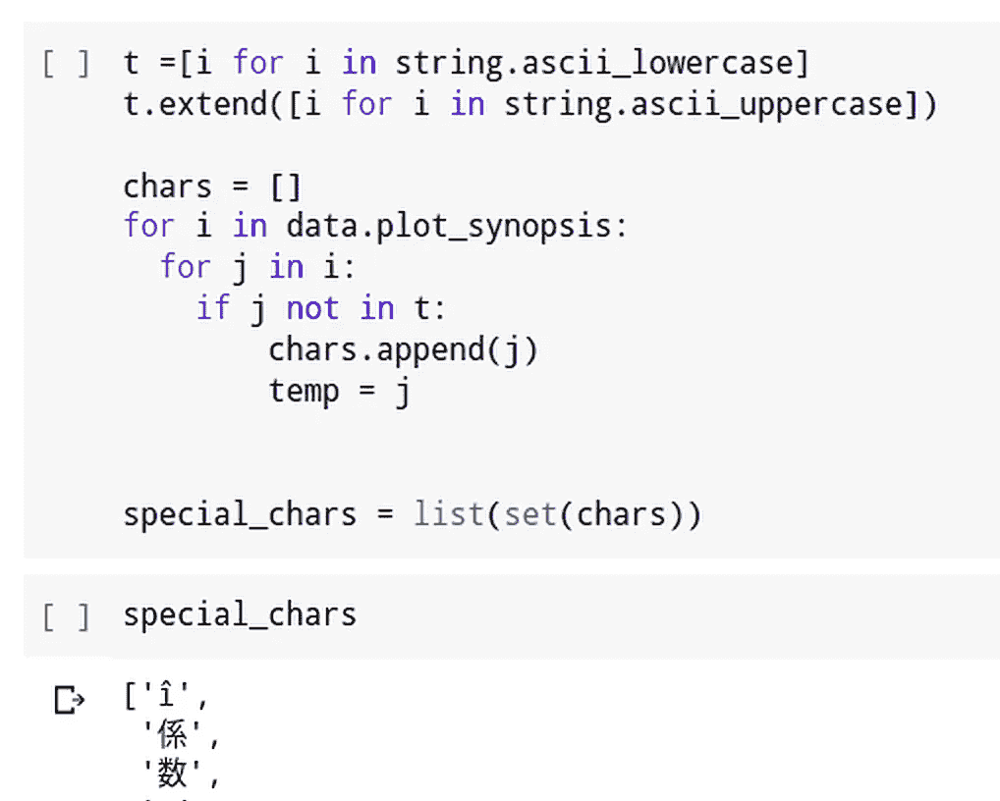

# 电影标签预测

> 原文：<https://medium.com/analytics-vidhya/movie-tag-prediction-dcdd2f86fcd1?source=collection_archive---------13----------------------->

浪漫的、恐怖的、虚构的

如果给定了电影名，有机会得到电影的类型吗？

不，但是如果你在那里提供电影的概要，那么我们可以建立一个机器学习模型来预测这部电影的类型，哦，真的吗？那怎么做呢？

电影的概要对于建立机器学习模型来预测电影的标签是有价值的，这可以帮助推荐系统检索相似的电影。

好吧，让我告诉你，在知道如何建立一个电影标签预测模型之前，你必须清楚一些概念。这篇文章的主旨是假设读者在进一步讨论之前对下面的主题感到满意。

1.  Nlp 特征化技术。
2.  像[逻辑回归](/@yernagulahemanth/logistic-regression-part-i-40d8fed8fdd4)这样的机器学习算法。
3.  Python。

**内容**

1.  数据概述
2.  清理和预处理数据
3.  特征化数据
4.  应用模型

**数据概述:**用于构建该模型的数据取自 [Kaggle](https://www.kaggle.com/cryptexcode/mpst-movie-plot-synopses-with-tags) ，如图 1 所示。

图 1

**栏目说明:**

1.  **imdb_id :** IMDB 电影 id。
2.  **片名:**电影名。
3.  **剧情 _ 剧情简介:**电影概要。
4.  **标签:**电影的标签。
5.  **分割:**代表训练、测试或验证数据。
6.  电影概要是从哪里收集来的？

正如您在这里看到的，目标列是“标签”，它有许多值(标签)，这意味着这是一个多标签问题。多标签是指每个数据点都会有一堆标签，不像每个数据点只有一个标签，比如每部电影都会有很多标签，比如暴力、邪教、哥特、残忍、虐待狂、自我感觉良好、复仇、励志、浪漫、愚蠢。

我为此选择的绩效指标是 f1 分数

**微平均 F1 分数(平均 F 分数)**:F1 分数可以解释为精确度和召回率的加权平均值，其中 F1 分数在 1 时达到其最佳值，在 0 时达到其最差分数。精确度和召回率对 F1 分数的相对贡献是相等的。F1 分数的公式为:

*F1 = 2 *(精度*召回)/(精度+召回)*

在多类别和多标签的情况下，这是每个类别的 F1 分数的加权平均值。

**清理&预处理数据:**总共有 70 个唯一标签，每个电影可能有一个或多个标签。标签的绘图如下所示

图 2

很少有像“sci-fi”这样的标签，如果我们清理数据，这个标签可能会分成两个标签，所以我们应该将这个 sci-fi 替换为 science_fiction，第一个直方图的标签丢失了，出现了什么问题？问题是甚至<space>也被认为是一个标签。所以让我们去掉数据中多余的空格。</space>

完成上述更改后，标签分布如下

图 3

> 剧情要点:
> 
> 大多数标签出现不到 1000 次
> 
> 只有八个标签出现超过 1000 次
> 
> 谋杀是出现次数最多的标签，大约 6000 次

让我们看看标签的文字云

图 4

> 剧情要点:
> 
> 最常见的标签是谋杀和暴力
> 
> 下一个重要的标签是闪回，浪漫，复仇，邪教和喜剧

据我观察，数据中有一些特殊的字符，就像来自其他语言的字符一样。我用谷歌翻译 API 把这些字符翻译成英语。

**找出特殊字符**

图 5

**用英文翻译替换那些特殊字符**

图 6

一些被替换的单词

图 7

> 我们已经清理完了剩下的数据特征和应用模型🙌🏻
> 
> 根据数据集中的拆分列拆分数据

图 8

**特色化技术:**

1.  特征化文本
2.  特征化目标标签

**1。特征文本:**

用于文本的特征化技术是

1.  TFIDF 单克
2.  TFIDF 二克
3.  TFIDF 三克
4.  TFIDF Char-3 克
5.  TFIDF Char-4 克
6.  TFIDF 单克+ TFIDF 双克+TFIDF 三克
7.  TFIDF Char-3 克+TFIDF Char-4 克
8.  tfi df 1 克+tfi df 2 克+tfi df 3 克+tfi df 3 克+tfi df 4 克

**2。特征化目标标签:**

如我们所知，总的类别标签是 71 个标签，并且每个电影可以在这 71 个标签中获得任意数量的标签，单词包技术被应用于这些标签，并且每个数据点的目标标签用这个单词包向量来表示。

**在对上述特征应用模型后，进行了以下观察**

**结论**

1.得到的最大 f1 值为 37.805% ~ 38%。
2。几乎所有的载体都有超过 30%的 f1 值，除了 Tri gram 载体。
3。与 sgd 逻辑回归相比，正常逻辑回归的 f1 值最高。
4。基于 Uni+Bi+Tri+Chr3+Chr4 向量的逻辑回归的最佳 alpha 值为 0.001，sgd 逻辑回归的最佳 alpha 值为 0.1。