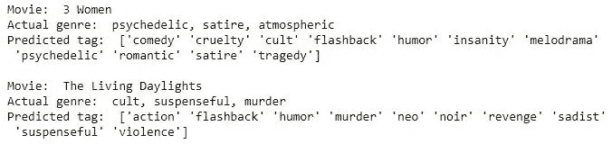

# 使用机器学习模型的电影标签预测。

> 原文：<https://medium.com/analytics-vidhya/movie-tag-s-prediction-using-machine-learning-models-d5fde119db6d?source=collection_archive---------10----------------------->


来源:[https://www . research gate . net/figure/Color-online-Word-Clouds-for-a-children-and-b-Romantic-Movies _ fig 3 _ 329106615](https://www.researchgate.net/figure/Color-online-Word-Clouds-for-a-Childrens-and-b-Romantic-Movies_fig3_329106615)

***致敬 Les gars！！！***

在这篇博文中，我们将讨论如何解决多标签分类问题。

预测电影的标签有助于我们找出电影的类型、情节结构、元数据和情感体验等信息。这些信息可以用于构建自动系统来预测电影的标签。

在本案例研究中，我们将重点构建一个自动引擎，它可以从电影情节概要数据中提取标签。剧情梗概不过是一部电影的详细或部分概要。请注意，特定的电影可能只有一个标签，也可能有多个标签。这就是多标签分类发挥作用的地方。

既然我们在讨论多标签分类问题，那就让我们来讨论多类和多标签问题之间的区别。

**多类分类**指两个以上类的分类任务；例如对一组电影类型进行分类，这些电影类型可以是动作片、喜剧片或冒险片。多类别分类假设每个样本被分配给一个且只有一个标签:一个类型可以是动作片或喜剧片，但不能同时是两者。

另一方面，**多标签分类**给每个电影分配一组目标标签。例如对一组电影进行分类，这些电影可以是动作片、喜剧片、冒险片或动作片、喜剧片、恐怖片、惊悚片。一个标签可以同时涉及宗教、政治、金融或教育中的任何一个，也可以什么都不涉及。

你可以阅读更多关于多标签和多类别分类的详细示例[这里](https://scikit-learn.org/stable/modules/multiclass.html)。


在左侧，我们有一个二进制分类设置，可以将电子邮件分类为垃圾邮件或非垃圾邮件。中间的图片显示了一个多类分类设置，一个动物可以属于且只能属于一个类。在最右边，我们有一个多标签分类设置，其中图像中的对象可以属于一个或多个类别——“猫”和“鸟”。来源:[https://www . Microsoft . com/en-us/research/uploads/prod/2017/12/40250 . jpg](https://www.microsoft.com/en-us/research/uploads/prod/2017/12/40250.jpg)

# 数据:

我们将在这个博客中使用的数据来源于 [Kaggle](https://www.kaggle.com/cryptexcode/mpst-movie-plot-synopses-with-tags) 。该数据包含大约 14K 部电影和 71 个独特的标签。

# 每个数据点都有以下属性。

1.  **IMDB_ID** :包含 IMDB 分配的电影 ID 的唯一标识符。
2.  **片名**:该片名属性包含电影名称。
3.  **剧情概要**:该字段包含电影剧情概要。
4.  **标签**:该属性包含电影被分配到的所有标签的信息。
5.  **分割**:电影在标准数据分割中的位置，表示一个数据点是否属于训练、测试或验证数据
6.  **Synopsis_Source** :每部电影的剧情概要的来源 IMDB 或维基百科。

# 标签特征的探索性数据分析。

**1。a .加载数据，显示前 2 行。**

```
data = pd.read_csv(“mpst_full_data.csv”)
print(“Number of data points: “, data.shape[0])
data.head(2)
```


图 1:数据集的前 2 行

**b .让我们找出数据集中存在的数据点和属性的数量:**

```
data.shape
(14828, 6)
```

在这里，我们可以看到总共有 14828 个数据点/行。如上所示，每个数据点有 6 个属性/列。

## **2。从给定的 CSV 文件创建 SQL db 文件，并删除数据集中存在的重复条目。**

**a .**创建 db 文件:

```
#Learn SQL: [https://www.w3schools.com/sql/default.asp](https://www.w3schools.com/sql/default.asp)
start = datetime.now()
if not os.path.isfile('mpst.db'):
    disk_engine = create_engine('sqlite:///mpst.db')
    start = dt.datetime.now()
    chunksize = 15000
    j = 0
    index_start = 1
    for df in pd.read_csv('mpst_full_data.csv', chunksize=chunksize, iterator=True, encoding='utf-8'):
        df.index += index_start
        j+=1
        df.to_sql('mpst_full_data', disk_engine, if_exists='append')
        index_start = df.index[-1] + 1
else:
    print("Database Already Exist.")print("Time taken to run this cell :", datetime.now() - start)
```

**b .删除数据集中存在的重复条目:**

```
con = sqlite3.connect('mpst.db')data_no_dup = pd.read_sql_query('SELECT title,plot_synopsis,tags,split,synopsis_source,COUNT(*) as cnt_dup FROM mpst_full_data GROUP BY title', con)con.close()
```

让我们创建另一个名为“tag_count”的列，它将计算每部电影的标签数量。

```
data_no_dup["tag_count"] = data_no_dup["tags"].apply(lambda text: len(str(text).split(", ")))
data_no_dup.head()
```


图 2:带有新列“tag_count”的修改后的数据集

**d .让我们找出数据集中存在的数据点和属性的数量:**

```
data_no_dup.shape
(13757, 7)
```

在这里，我们可以看到总共有 13757 个数据点。如上所示，每个数据点有 7 个属性。(之前创建了 6 + 1 新自定义)

**3。列车、验证和测试数据点的分布**

```
sns.countplot(data_no_dup['split'])
plt.show()
```


图 3:数据点的分布

**4。检查数据分布的来源**

```
sns.countplot(data_no_dup['synopsis_source'])
plt.show()
```


图 4:不同来源的电影分布

**5。检查每部电影的标签分布:**

```
plt.figure(figsize=(20,5))
plt.plot(data_no_dup["tag_count"])
plt.xlabel('movies')
plt.ylabel("no.of tags per movie")
plt.show()
```


图 5:每部电影的标签

**6。找出确切的数字:**

```
data_no_dup["tag_count"].value_counts()
```


图 6:多少部电影包含多少个标签**【左栏**:标签数量，**右栏**:电影数量】

**7。统计数据集中唯一标签的数量:**

为此，我们通过应用[计数矢量器](https://scikit-learn.org/stable/modules/generated/sklearn.feature_extraction.text.CountVectorizer.html)方法来遵循 BoW(单词包)技术。

**什么是弓？**

它是文本文档的最简单表示。换句话说，它将找出特定单词在特定文档中出现的次数。

更简单地说，我们可以说它会选择单词及其出现频率，然后将它们放入一个包中。因此它的名字叫做单词袋(Bow)

```
vectorizer = CountVectorizer(preprocessor=lambda x: x,tokenizer = lambda x: str(x).split(", ") )
tag_vect = vectorizer.fit_transform(data_no_dup["tags"])print("Number of data points :", tag_vect.shape[0])
print("Number of unique tags :", tag_vect.shape[1])Number of data points : 13757
Number of unique tags : 71tags = vectorizer.get_feature_names()#zipping tags and tags_count into one list
freqs = tag_vect.sum(axis=0).A1
result = list(zip(tags, freqs))
```

**8。最常见标签的词云:**


图 7:出现最多的标签的 Wordcloud

从上图我们可以得出结论:“谋杀”、“闪回”、“暴力”、“浪漫”、“迷幻”、“邪教”等标签出现最多。

类似地，像“善恶”、“娱乐”、“悬疑”这样的标签属于较少出现的。

# 数据清理

在本节中，我们将看到我们用来进行数据预处理的技术。

1.  移除数据集中存在的任何 HTML 标记。
2.  单词的去缩略(像不会=不会)。
3.  将每个单词转换成小写。
4.  移除[停用词](https://en.wikipedia.org/wiki/Stop_words)。
5.  单词被[词条化](https://en.wikipedia.org/wiki/Lemmatisation)。(第三人称的单词被改为第一人称，过去将来时的动词被改为现在时)。
6.  最后滚雪球[词干](https://en.wikipedia.org/wiki/Stemming)。

```
def decontracted(phrase):
    # specific
    phrase = re.sub(r"won't", "will not", phrase)
    phrase = re.sub(r"can\'t", "can not", phrase)# general
    phrase = re.sub(r"n\'t", " not", phrase)
    phrase = re.sub(r"\'re", " are", phrase)
    phrase = re.sub(r"\'s", " is", phrase)
    phrase = re.sub(r"\'d", " would", phrase)
    phrase = re.sub(r"\'ll", " will", phrase)
    phrase = re.sub(r"\'t", " not", phrase)
    phrase = re.sub(r"\'ve", " have", phrase)
    phrase = re.sub(r"\'m", " am", phrase)
    return phrase stopwords = set(stopwords.words('english'))
sno = nltk.stem.SnowballStemmer('english')
lemmatizer = WordNetLemmatizer() preprocessed_synop = []
for sentance in tqdm(data_no_dup['plot_synopsis'].values):
    sentance = re.sub(r"http\S+", "", sentance)
    sentance = BeautifulSoup(sentance, 'lxml').get_text()
    sentance = decontracted(sentance)
    sentance = re.sub("\S*\d\S*", "", sentance).strip()
    sentance = re.sub('[^A-Za-z]+', ' ', sentance)
    stemmed_sentence = []
    for e in sentance.split():
        if e.lower() not in stopwords:
            s=(sno.stem(lemmatizer.lemmatize(e.lower()))).encode('utf8')#lemitizing and stemming each word
            stemmed_sentence.append(s)
    sentance = b' '.join(stemmed_sentence)
    preprocessed_synop.append(sentance)

data_no_dup['CleanedSynopsis'] = preprocessed_synop #adding a column of CleanedText which displays the data after pre-processing of the review 
data_no_dup['CleanedSynopsis'] = data_no_dup['CleanedSynopsis'].str.decode("utf-8")
```

***原文:***

```
A 6th grader named Griffin Bing decides to gather their entire grade in a sleepover protest in an old house about to be demolished after their plan for using a new space in their town was thrown out because of their youth. However, only Griffin and his best friend Ben Slovak show up. Griffin discovers a Babe Ruth baseball card that, unbeknownst to him, is worth huge amounts of money. Excited that the card could help his family, which is struggling financially, Griffin takes it to the local collectibles dealer, S. Wendell Palomino. S. Wendell tells the boys that the card is an old counterfeit of a valuable one, worth only one hundred dollars. A dejected Griffin later chances upon Palomino on television, stating that the card he stole was worth at least a million dollars. Enraged, Griffin and Ben try to steal it back from Swindle\'s shop, only to find that it has gone, and they have to break into Swindle\'s house. Now, in order to get the card back, Griffin must gather a team of local students with unique skills to break into Palomino\'s heavily guarded home to retrieve the card before the big auction where Swindle plans to sell the card. The team consists of seven people (including Ben and Griffin): Savannah the Dog whisperer, to get past Swindle\'s massive, violent Guard Dog Luthor; Logan the actor, to distract Swindle\'s eagle-eyed neighbor who spends his days watching the entire street\'s goings-on; Antonia "Pitch" Benson the "born to climb" girl, to scale the skylight in Swindle\'s house; Darren Vader who the others had no choice but to add to the team, for he threatened to rat them out (But Darren proved to be useful pulling people up the skylight); Melissa the unsociable computer genius, who was used to break into Swindle\'s UltraTech alarm system. The tension is piled with an unexpected visit from the auctioneer, yet another even more menacing guard dog, and a betrayal from the person who begged to be in the group. The book was followed by multiple sequels, titled Zoobreak, Framed!, Showoff, Hideout , Jackpot and Unleashed.
```

***已清理文本:***

```
grader name griffin bing decid gather entir grade sleepov protest old hous demolish plan use new space town thrown youth howev griffin best friend ben slovak show griffin discov babe ruth basebal card unbeknownst worth huge amount money excit card could help famili struggl financi griffin take local collect dealer wendel palomino wendel tell boy card old counterfeit valuabl one worth one hundr dollar deject griffin later chanc upon palomino televis state card stole worth least million dollar enrag griffin ben tri steal back swindl shop find gone break swindl hous order get card back griffin must gather team local student uniqu skill break palomino heavili guard home retriev card big auction swindl plan sell card team consist seven peopl includ ben griffin savannah dog whisper get past swindl massiv violent guard dog luthor logan actor distract swindl eagl eye neighbor spend day watch entir street go antonia pitch benson born climb girl scale skylight swindl hous darren vader other choic add team threaten rat darren prove use pull peopl skylight melissa unsoci comput genius use break swindl ultratech alarm system tension pile unexpect visit auction yet anoth even menac guard dog betray person beg group book follow multipl sequel titl zoobreak frame showoff hideout jackpot unleash
```

# 预测电影标签的机器学习方法

首先，我们必须从 csv 文件中读取数据，并使用数据集**中给出的拆分列将数据拆分为 train 和 test。**

**读取数据**

```
data_with_all_tags = pd.read_csv("/content/drive/My Drive/ML/data_with_all_tags.csv")
data_with_all_tags.head()
```

**拆分成列车并测试**

```
conn = sqlite3.connect('data.db')
data_with_all_tags.to_sql('data', conn, if_exists='replace', index=False)
train = pd.read_sql("Select * From data where split = 'train' OR split='val'",conn)
test =  pd.read_sql("Select * From data where split = 'test'",conn)
conn.close()
```

让我们讨论一下我们将在模型中使用的一些术语。

[**OneVSRestClassifier**](https://scikit-learn.org/stable/modules/generated/sklearn.multiclass.OneVsRestClassifier.html)**:**该策略包括为每个类安装一个分类器。对于每个分类器，该类与所有其他类相匹配。

[**计数向量化**](https://scikit-learn.org/stable/modules/generated/sklearn.feature_extraction.text.CountVectorizer.html) **:** 将文本文档的集合转换为令牌计数的矩阵

[**TfidfVectorizer**](https://scikit-learn.org/stable/modules/generated/sklearn.feature_extraction.text.TfidfVectorizer.html) :给不太常用的词分配更多权重。简单来说，TFIDF 是词频(TF)和逆文档频(IDF)的乘积。

TF =(术语 t 在文档中出现的次数)/(文档中的术语总数)

IDF = log(文档总数/其中包含术语 t 的文档数)

**指标:**

> 真阳性(TP) =所有正确预测的阳性点中，实际上是正确的。
> 
> 假阳性(FP) =在所有正确预测的阳性点中，实际上是不正确的。
> 
> 真阴性(TN) =在所有正确预测的阴性点中，实际上是正确的。
> 
> 假阴性(FN) =所有正确预测的阴性点中，实际上是不正确的

精度是真阳性与假阳性之和中真阳性的分数。

> 精度=TP/(TP+FP)

回忆是真阳性和假阴性总和中真阳性的一部分。

> 召回=TP/(TP+FN)

F1 分数是精确度和召回率的调和平均值。

> f1= 2(精度*召回)/(精度+召回)

我们要用的度量是微 f1，它是微精度和微召回的调和平均值。

微精度是所有真阳性的总和与所有真阳性和假阳性的总和。

> 微精度=TP1+TP2+…/((TP1+TP2+……)+(FP1+FP2+……))

对于交叉验证，我使用了 [GridSearchCV](https://scikit-learn.org/stable/modules/generated/sklearn.model_selection.GridSearchCV.html) 和 5 重交叉验证。

# **机器学习模型:**

## 使用所有标签:

1.  **使用 TFIDF 矢量器:**

在基线模型构建部分，我们尝试了多项模型，包括多项式、逻辑回归、具有对数损失的 SGD 分类器、具有铰链损失的 SGD 分类器。在所有情况下，我们都希望最大化微观平均 F1 分数。给我们微观平均 F1 分数的最大值的基线模型是逻辑回归(0.2601)

让我们来看一个简单的代码片段，它是我们在 OneVsRest 和逻辑回归中使用的。在整个实验中，我使用了相同的代码结构。所以，如果你想改变任何模型，只要把 LogisticRegression 换成任何模型就行了。

```
lr = LogisticRegression(class_weight='balanced')clf = OneVsRestClassifier(lr)
clf.fit(X_train_multilabel, y_train_multilabel) prediction16 = clf.predict(X_test_multilabel)precision16 = precision_score(y_test_multilabel, prediction16, average='micro')recall16 = recall_score(y_test_multilabel, prediction16, average='micro')f1_score16 = 2*((precision16 * recall16)/(precision16 + recall16))print("precision16: {:.4f}, recall16: {:.4f}, F1-measure: {:.4f}".format(precision16, recall16, f1_score16))
```

上述代码块的输出:

```
precision16: 0.1673, recall16: 0.5839, F1-measure: 0.2601
```


图 8:基线模型的不同模型的得分比较

**让我们比较实际标签和模型预测标签**


图 9:实际标签和模型预测标签之间的比较

**2。使用 AVGW2V *:***

与上述讨论相同，物流回归给出了最高的 F1 分(0.214)


图 10:AVG W2V 车型评分对比

**让我们看看模型预测的标签:**


图 11:实际标签和预测标签之间的标签比较

**3。使用 LSTM-CNN 模型:**


图 12: LSTM-CNN 模型

**我们来看看准确度:**

```
test_loss, test_acc = model.evaluate(X_test, y_test_multilabel, verbose=2)print('\nTest accuracy:', test_acc)
Test accuracy: 0.13583815097808838
```

所以我们在这里也没有得到太多的准确性。

**标签比较:**


图 13:标签比较

## **用前 3 个标签建模**

在 EDA 部分，我们已经看到一部普通的电影由三个标签组成。因此，让我们建立一个模型，可以预测前三个标签。我们使用了相同的特征集，但是这一次，标签的数量等于 3

```
cnt_vectorizer = CountVectorizer(tokenizer = tokenize, max_features=3, binary='true').fit(y_train
```

1.  **使用 TFIDF 矢量器:**

在这里，具有对数损失的 SGD 分类器给了我们最高的 F1 分数，即 0.586


图 14:前 3 个标签的得分比较

在这里，我们可以看到准确性分数的显著提高。

**标签比较:**


图 15:实际标签和模型预测标签之间的比较

**2。使用 AVGW2V :**


图 16:分数比较

这里我们可以看到 LogisticRegression 给出了最高的 F1 分(0.562)

**标签比较:**


图 17:标签比较

**3。LSTM-CNN 模式:**


图 18:排名前三的标签的 LSTM-CNN 模型

这里我们得到了 0.283 的精度

**标签对比:**


图 19:实际标签与预测标签

## 用前 5 个标签建模

在这里，代码是变化是非常简单的。我们只需将“max_features”的值从 3 更改为 5，代码片段的其余部分保持不变。

```
cnt_vectorizer = CountVectorizer(tokenizer = tokenize, max_features=5, binary='true').fit(y_train)
```

1.  **使用 TFIDF 矢量器:**


图 20:准确度分数

这里物流回归也给出了最高的 F1 分(0.535)

**标签比较:**


图 21:实际标签与预测标签

**2。使用 AVGW2V :**


图 22:使用 AVG W2V 的准确度分数

在这里，具有铰链损失的 SGD 分类器给出了最高的 F1 分数。

**标签比较:**


图 23:实际标签与预测标签

**3。LSTM-CNN 模式:**


图 24 : LSTM-CNN 模型

这里我们得到了 0.213 的精度

**标签比较:**


图 25:实际标签与预测标签

## 用前 30 个标签建模

在这一部分，我们必须从所有 71 个标签中手动选择前 30 个出现的标签。要做到这一点，首先我们必须读取数据集，然后使用 BoW 技术对标签进行矢量化，以找出哪些标签出现了多少次。

```
data = pd.read_csv("data_with_all_tags.csv")vectorizer = CountVectorizer(preprocessor=lambda x: x, tokenizer = lambda x: str(x).split(", ") )
tag_vect = vectorizer.fit_transform(data["tags"])tags = vectorizer.get_feature_names()
freqs = tag_vect.sum(axis=0).A1
result = list(zip(tags, freqs))print((result))
```

以下是上述代码单元的输出:


图 26:所有出现的标签

现在我们必须由此创建一个 dataframe，然后根据标签出现的次数对其进行降序排序。之后，我们必须根据它们的频率选择前 30 个标签。

```
tag_counts = pd.DataFrame(result,columns=['tag','tag_counts'])tag_counts_sorted = tag_counts.sort_values(['tag_counts'], ascending=False)tag_counts = tag_counts_sorted['tag'][:30]
print(tag_counts)
```

让我们看看前 30 个标签:


图 27:前 30 个标签

现在，我们必须将这 30 个标签与每部电影中出现的所有标签进行比较，然后删除这 30 个标签旁边的所有标签。

然后删除由于我们所做的预处理而没有标签的行。

***之前比较:***


图 28:每部电影的原始标签

这里我们可以看到长度:13757，这意味着我们有 13757 个数字行(或)电影。

**后*比较:*后**


图 29:比较后每个电影的标签

在这里，我们可以注意到长度已经减少到 13010，这意味着所有没有标签的电影都被删除。

现在，将按照与之前车型相同的流程来获取 F1 分数

1.  **AVGW2V :**


图 30:准确度分数

物流回归给出了最高的 F1 分(0.32)

**标签比较:**



图 31:实际标签与预测标签

**2。LSTM-美国有线电视新闻网:**


图 32 : LSTM-CNN 模型

这里我们得到了 0.043 的精度

**标签比较:**


图 33:实际标签与预测标签

## 用前 5 个标签建模

在这里，我们将遵循与上一个相同的步骤(前 30 个)，而不是 30 个标签，将为前 5 个标签。

在本节中，我们不会使用 sklearn 的 CountVectorizer 方法，而是手动使用它来获得更高的精度。

手动实现标签的 [Onehotencoding](https://www.geeksforgeeks.org/ml-one-hot-encoding-of-datasets-in-python/) 后，应该是这样的:


图 34:标签的一个酒店编码

在此之后，其余的过程都是相同的。

1.  **AVGW2V:**


图 35:准确度分数

在这里，我们可以看到 LogisticRegression 给出了最高的 f1 分数(0.59)，不仅是这个模型，而且是我们尝试过的所有其他模型。

**标签对比:**


图 36:实际标签与预测标签

在标签预测中，我们还可以看到该模型与其他模型之间的差异。

**2。LSTM 型号:**


图 37 : LSTM 模型

这里我们得到了 0.66 的精度，与其他 LSTM 模型或 ML 模型相比，这是非常显著的

**标签预测:**


图 38:实际标签与预测标签

# 主题建模

在[机器学习](https://en.wikipedia.org/wiki/Machine_learning)和[自然语言处理](https://en.wikipedia.org/wiki/Natural_language_processing)中，**主题模型**是[统计模型](https://en.wikipedia.org/wiki/Statistical_model)的一种，用于发现文档集合中出现的抽象“主题”。

主题建模是一种常用的文本挖掘工具，用于发现文本中隐藏的语义结构。

[***【潜在狄利克雷分配(LDA)***](http://blog.echen.me/2011/08/22/introduction-to-latent-dirichlet-allocation/) *是一个流行的主题建模算法，在 Python 的 Gensim 包中有很好的实现。*

## ***让我们开始吧***

让我们读取预处理的数据集

```
dataframe = pd.read_csv("data_with_all_tags.csv")
```

现在让我们只提取那些我们需要的特征

```
data = dataframe[['title', 'plot_synopsis', 'tags', 'split', 'CleanedSynopsis']]data.shape
(13757, 5)
```

让我们添加一个概要的所有单词来创建数据语料库

```
data["synopsis_words"] = data["CleanedSynopsis"].apply(lambda x: x.split())data_words=[]
for sent in data["synopsis_words"].values:
    data_words.append(sent)
```

让我们为 LDA 创建一个字典和语料库

```
id2word = corpora.Dictionary(data_words)corpus = [id2word.doc2bow(text) for text in data_words]
```

## 构建主题模型:

我们拥有训练 LDA 模型所需的一切。除了语料库和词典，您还需要提供主题的数量。

```
# Build LDA model
lda_model = gensim.models.LdaMulticore(corpus=corpus,
                                           id2word=id2word,
                                           num_topics=10, 
                                           random_state=100,
                                           chunksize=10,
                                           passes=10,
                                           alpha='symmetric',
                                           iterations=100,
                                           per_word_topics=True,
                                           workers=7)
```

## 查看 LDA 模型中的主题:

上面的 LDA 模型是用 10 个不同的主题构建的，其中每个主题是关键字的组合，并且每个关键字对主题有一定的权重。

您可以使用`lda_model.print_topics()`查看每个主题的关键词以及每个关键词的权重(重要性),如下所示。

```
pprint(lda_model.print_topics())[(0,
  '0.009*"kill" + 0.006*"father" + 0.006*"get" + 0.005*"love" + 0.004*"famili" '
  '+ 0.004*"brother" + 0.004*"son" + 0.004*"meet" + 0.004*"take" + '
  '0.004*"fight"'),
 (1,
  '0.014*"tell" + 0.012*"go" + 0.011*"see" + 0.011*"say" + 0.011*"back" + '
  '0.010*"get" + 0.007*"ask" + 0.007*"find" + 0.007*"look" + 0.007*"room"'),
 (2,
  '0.015*"kill" + 0.011*"polic" + 0.007*"car" + 0.006*"shoot" + 0.006*"offic" '
  '+ 0.006*"frank" + 0.006*"man" + 0.006*"john" + 0.006*"find" + 0.005*"gun"'),
 (3,
  '0.008*"georg" + 0.008*"get" + 0.008*"billi" + 0.007*"jim" + 0.007*"ray" + '
  '0.006*"scott" + 0.006*"go" + 0.005*"rachel" + 0.005*"find" + 0.005*"bella"'),
 (4,
  '0.009*"hous" + 0.008*"find" + 0.007*"mother" + 0.007*"mari" + '
  '0.007*"father" + 0.006*"child" + 0.006*"kill" + 0.006*"home" + '
  '0.005*"woman" + 0.005*"famili"'),
 (5,
  '0.016*"go" + 0.015*"tell" + 0.014*"get" + 0.012*"say" + 0.012*"sam" + '
  '0.011*"david" + 0.009*"mike" + 0.009*"charli" + 0.008*"ask" + '
  '0.008*"sarah"'),
 (6,
  '0.008*"human" + 0.007*"power" + 0.006*"world" + 0.005*"use" + 0.005*"earth" '
  '+ 0.005*"destroy" + 0.004*"find" + 0.004*"one" + 0.004*"alien" + '
  '0.004*"reveal"'),
 (7,
  '0.006*"king" + 0.006*"kill" + 0.005*"return" + 0.005*"vampir" + '
  '0.004*"villag" + 0.004*"take" + 0.004*"arriv" + 0.004*"one" + '
  '0.003*"father" + 0.003*"son"'),
 (8,
  '0.008*"kill" + 0.006*"war" + 0.006*"attack" + 0.006*"soldier" + '
  '0.005*"ship" + 0.005*"order" + 0.005*"forc" + 0.005*"men" + 0.005*"group" + '
  '0.005*"escap"'),
 (9,
  '0.006*"new" + 0.005*"love" + 0.005*"life" + 0.005*"time" + 0.005*"one" + '
  '0.005*"friend" + 0.005*"make" + 0.005*"day" + 0.004*"go" + 0.004*"film"')]
```

*这个怎么解读？*

题目 0 是 a 表示为 *'0.009* "杀"+ 0.006* "父"+ 0.006* "得"+ 0.005* "爱"+ 0.004* "家" ' '+ 0.004* "兄"+ 0.004* "子"+ 0.004* "遇"+ 0.004* "取"+ ' '0.004* "斗" '*

这意味着促成这个话题的前 10 个关键词是:“杀死”、“父亲”、“得到”..依此类推，主题 0 上“杀死”的权重是 0.009

权重反映了关键词对主题的重要性。

## 找出每个句子中的主导主题:

主题建模的一个实际应用是确定给定文档是关于什么主题的。

为此，我们找到了在该文档中贡献百分比最高的主题号。

下面的`format_topics_sentences()`函数很好地将这些信息聚集在一个可显示的表中。

```
data_list = dataframe.CleanedSynopsis.values.tolist()def format_topics_sentences(ldamodel=None, corpus=corpus, texts = data_list):
    # Init output
    sent_topics_df = pd.DataFrame()# Get main topic in each document
    for i, row_list in enumerate(ldamodel[corpus]):
        row = row_list[0] if ldamodel.per_word_topics else row_list            
        # print(row)
        row = sorted(row, key=lambda x: (x[1]), reverse=True)
        # Get the Dominant topic, Perc Contribution and Keywords for each document
        for j, (topic_num, prop_topic) in enumerate(row):
            if j == 0:  # => dominant topic
                wp = ldamodel.show_topic(topic_num)
                topic_keywords = ", ".join([word for word, prop in wp])
                sent_topics_df = sent_topics_df.append(pd.Series([int(topic_num), round(prop_topic,4), topic_keywords]), ignore_index=True)
            else:
                break
    sent_topics_df.columns = ['Dominant_Topic', 'Perc_Contribution', 'Topic_Keywords']# Add original text to the end of the output
    contents = pd.Series(texts)
    sent_topics_df = pd.concat([sent_topics_df, contents], axis=1)
    return(sent_topics_df)df_topic_sents_keywords = format_topics_sentences(ldamodel=lda_model, corpus=corpus, texts=data_words)# Format
df_dominant_topic = df_topic_sents_keywords.reset_index()
df_dominant_topic.columns = ['Document_No', 'Dominant_Topic', 'Topic_Perc_Contrib', 'Keywords', 'Text']
```


图 29:主导主题

让我们将这些主要主题保存到一个 csv 文件中，然后将它与我们的原始数据连接起来。

```
df_dominant_topic.to_csv("dominant_topics.csv")df_topic = pd.read_csv("dominant_topics.csv")
combined_df = pd.concat([data, df_topic], axis=1)
```

让我们将数据集分为训练和测试，像之前一样应用矢量器来获得 f1 分数

```
data_test=combined_df.loc[(combined_df['split'] == 'test')]
data_train=combined_df.loc[(combined_df['split'] == 'val') | (combined_df['split'] == 'train')]
```

应用 TFIDF 矢量器后，我们得到了以下准确度分数。


图 30:准确度分数

# 让我们使用 Flask 来实现我们的模型

首先在 Flask 中编写所需的代码来创建一个 API。[这里](https://www.tutorialspoint.com/flask)是它的一个很好的教程。

让我们运行它。


图 31:索引页面

打开索引页面后，输入剧情梗概来预测标签


图 32:预测的标签

因此，我们的模型预测了我们给出的大纲的标签，即“闪回”。

# **结论:**

1.  我们从整个项目中获得的最高微观平均 F1 分数是 0.59。
2.  一般来说，我们习惯于看到 90%以上的准确率，但我们没有一个大的数据集，但我们仍然得到了体面的 F1 分数。
3.  对于主题建模，我们得到的最高 f1 分数是 LogisticRegression 的 0.374

# 参考资料:

1.  研究论文:[https://arxiv.org/pdf/1802.07858.pdf](https://arxiv.org/pdf/1802.07858.pdf)
2.  概念帮助:[应用人工智能课程](https://medium.com/u/bc8571e39021?source=post_page-----d5fde119db6d--------------------------------)
3.  数据集:[https://www . ka ggle . com/cryptexcode/mpst-movie-plot-synopses-with-tags](https://www.kaggle.com/cryptexcode/mpst-movie-plot-synopses-with-tags)
4.  Github 链接:[https://github.com/sandeeppanda22/Movie-Tag-Prediction](https://github.com/sandeeppanda22/Movie-Tag-Prediction)
5.  领英简介:[https://www.linkedin.com/in/sandeepkumarpanda/](https://www.linkedin.com/in/sandeepkumarpanda/)