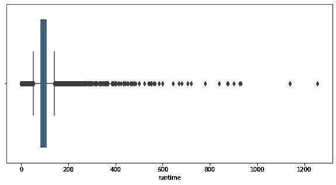

# 具有惊奇功能的电影推荐系统

> 原文：<https://medium.com/analytics-vidhya/movies-recommender-system-with-surpriselib-33580ae9b47c?source=collection_archive---------12----------------------->


来源:https://newslagoon.com/

大家好！我想分享一下电影推荐系统，其中一个是它的协同过滤模型。在我们进入数据集之前，让我们看看为什么我们需要推荐系统？

首先，有些人可能对选择看哪部电影感到困惑。推荐系统，就像我们知道的，它会根据你看过的电影给你推荐电影。推荐系统会给你推荐流派，演员，导演，电影评级，你已经做了很多。简单地说，就像你在看 youtube，下一个视频*推荐*会在你看完那个视频后出现在你面前。机器会学习你喜欢什么，你经常看什么，也许是基于视频的“流派”或“类型”以及关于视频的更多信息。

> 推荐系统或推荐系统(**有时用同义词如平台或引擎**代替“系统”)是信息过滤系统的一个子类，它试图预测用户对一个项目的**、**或**偏好**。它们主要用于商业应用。—维基百科

我知道有四种类型的推荐系统。

1.  **人口统计过滤**

*   决定对项目进行评级的标准或分数。
*   计算每一项的分数
*   根据分数对项目进行排序，并输出最佳结果
*   它向每个用户提供一般化的推荐，而不是个性化的推荐


基于内容的过滤和协同过滤的区别

2.**基于内容的过滤**

基于内容的过滤使用项目特征，根据用户以前的行为或明确的反馈，推荐与用户喜欢的项目相似的其他项目

3.**协同过滤**

协同过滤基于这样的假设，即过去同意的人将来也会同意，并且他们会像过去一样喜欢相似种类的项目。

4.**混血儿**

称为*【混合】*原因混合推荐系统是协同过滤和基于内容的过滤的结合。

# 探索性数据分析

这个数据集，我从 kaggle 上得到的，但是真的很抱歉来源(url)已经关闭，可能这个链接或数据集已经被那个用户删除了。这个数据集是关于 IMDB 中直到 2018 年第一季度的每一部电影。这是第一个 csv 的数据帧信息。

```
<class 'pandas.core.frame.DataFrame'>
RangeIndex: 45466 entries, 0 to 45465
Data columns (total 24 columns):
 #   Column                 Non-Null Count  Dtype  
---  ------                 --------------  -----  
 0   adult                  45466 non-null  object 
 1   belongs_to_collection  4494 non-null   object 
 2   budget                 45466 non-null  object 
 3   genres                 45466 non-null  object 
 4   homepage               7782 non-null   object 
 5   id                     45466 non-null  object 
 6   imdb_id                45449 non-null  object 
 7   original_language      45455 non-null  object 
 8   original_title         45466 non-null  object 
 9   overview               44512 non-null  object 
 10  popularity             45461 non-null  object 
 11  poster_path            45080 non-null  object 
 12  production_companies   45463 non-null  object 
 13  production_countries   45463 non-null  object 
 14  release_date           45379 non-null  object 
 15  revenue                45460 non-null  float64
 16  runtime                45203 non-null  float64
 17  spoken_languages       45460 non-null  object 
 18  status                 45379 non-null  object 
 19  tagline                20412 non-null  object 
 20  title                  45460 non-null  object 
 21  video                  45460 non-null  object 
 22  vote_average           45460 non-null  float64
 23  vote_count             45460 non-null  float64
```

我将尝试结合 csv 数据集来建立模型，有最终的数据集将训练到我们的模型。


结合一些数据帧，一个用户 Id 可以给出这个数据集中的一些电影。

我将尝试清理这个数据集，并对这个数据集进行一些探索性的数据分析。让我们看看我们能从中得到什么。


IMDB 用户给出的投票平均值分布图

从该图中，我们知道用户评级类似于多模态分布。但是我们可以结合投票计数来为每部电影给出一个更好的计算评级(**这被称为基于用户评分投票的简单推荐器**)。我会假设电影评分为零，也许这部电影还没有被 IMDB 用户评分。


分布图从运行时间电影，这将是许多离群值。



Ofc 在运行时有许多异常值。我们来看看为什么这部电影耗时太长。


运行时间超过 6 小时的电影样本。

我们有 67 个运行时间超过 360 (6 小时)分钟的数据，几乎都是纪录片。所以我们尝试显示运行时间少于 360 分钟的分布。


每部电影的运行时间都有双峰分布。有些电影的播放时间在 0-50 之间，让我们看看这是什么类型的电影。

从我制作表格来看，这个数据集有大约 1800 部电影，运行时间不到 50 分钟，大部分甚至不到 10 分钟。我认为不到 10 分钟的电影或者很短的电影。但是，我试着在谷歌上搜索原标题和样本。那部电影大约有 110 分钟。因此，我们可以得出结论:

*   这个数据不清楚运行时间
*   数据输入错误
*   从 IMDB API 获取此数据时出现问题
*   所有电影都会被拿去做模特

# **造型**


演示协同过滤

```
from surprise import Reader
from surprise import Datasetreader = Reader(rating_scale=(0, 5))
data = Dataset.load_from_df(df[['userId','movieId','rating']], reader)
```

我将尝试用 load dataframe 设置数据，我们的功能是用户 Id、电影 Id 和评级。数据必须有三个数据，即用户、*对象*(你想推荐什么平台)和*对象*的评分。度量优化侧重于给出最低 RMSE(均方根误差)的每个模型的 RMSE 分数。我将尝试比较包含在 surpriselib 包中的 3 个建模。

*   **仅基线**

预测给定用户和项目的基线估计值的算法。

*   **NMF(非负矩阵分解)**

优化过程是一个(正则化的)随机梯度下降，具有特定的步长选择，以确保因子的非负性，前提是它们的初始值也是正的。

*   **共同聚类**

预测 r^uir^ui 被设置为:


您可以从 surpriselib 包中获得完整的文档

其中，崔璀是协同集群崔璀的平均评级，Cu Cu 是 uu 的集群的平均评级，Ci Ci 是 ii 的集群的平均评级。如果用户未知，则预测是 r^ui=μir^ui=μi.；如果项目未知，则预测是 r^ui=μur^ui=μu.；如果用户和项目都未知，则预测是 r^ui=μr^ui=μ.


使用 surpriselib 包中的交叉验证得出每个模型的结果

从我们的预测**来看，最好(最低)**的 RMSE 分数只有**基线**。因此，我们可以尝试用基线中的优化参数来建立最终模型。

# 最终建模

预测给定用户和项目的**基线估计**的算法。


您可以从 surpriselib 包中获得完整的文档

**如果用户 u 未知，则偏差 bu 假设为零。这同样适用于带 bi 的项目 I。**解释公式。

*   r^ui:用户 u 对项目 I 的估计评级
*   bui:用户 u 对项目 I 的基线评分。
*   μ:所有评分的平均值。

**基线可以用两种不同的方法估算:**

*   使用随机梯度下降(SGD)。
*   使用交替最小二乘法(ALS)。

他们有 ALS 的每个参数。

*   ' reg_i ':项目的正则化参数。默认值为 10。
*   ' reg_u ':用户的正则化参数。默认值为 15。
*   “n _ epochs”:ALS 过程的迭代次数。默认值为 10。

为了 SGD。

*   “reg”:被优化的成本函数的正则化参数。默认值为 0.02。
*   ' learning _ rate ':SGD 的学习速率。默认值为 0.005。
*   “n _ epochs”:SGD 过程的迭代次数。默认值为 20。

我将尝试从 surpirse lib 的文档中推荐这个参数。让我们看看我们的模型的性能。


使用基线选项参数进行结果交叉验证。

从与 RMSE 的交叉验证分数中，我们知道默认参数下没有显著的 RMSE 分数，只有 0.001。我们尝试用这个模型来预测我们的数据。先拆分数据，然后我们预测，看结果。


该表显示了我们模型的 10 个最佳预测

这是我们模型的最佳预测，它们没有误差。我认为这是一个不错的预测，因为给这个项目(Ui)打分的用户数量从 1948 年到大约 60000 年不等。


该表显示了我们模型的 10 个最差预测

我们的模型有最坏的预测。我们知道 **movieId 193** 上最坏的预测，电影的片名是“*星际迷航世代*”，电影被 6537 用户评为**。用户" **165352** " **评分 5** ，我们的模型 BaselineOnly 算法预测几乎**接近 0** 。**


这部电影的评分均值约为 2，从计数图中我们得出结论，只有少数用户 **(4.5%)** 的投票得分为 5。投票由总用户投票中的**评分 1 & 3** 和 **(45%)** 决定。这意味着这个评分为 5 分的用户可能是该用户给这部电影的所有投票中的异常值。

以上都是我的看法，希望大家能对这个数据集有所感悟。我做的每一个模型都还有很多错误和缺点。这个推荐系统还有很多需要优化的地方，可以结合协同过滤和基于内容的过滤。此外，您可以使用 surpriselib 中的所有方法，并找到提供您想要优化的最佳指标的最佳参数。

关于这些数据的更多细节，代码，和更多的可视化你可以通过点击这个链接[https://github.com/Anugrahn](https://medium.com/analytics-vidhya/github.com/Anugrahn/Data-Science-Practice)到达我的 github。随便问，让我们开始讨论家伙！

谢谢，我希望你们喜欢它。下一个故事再见。祝您愉快！:)