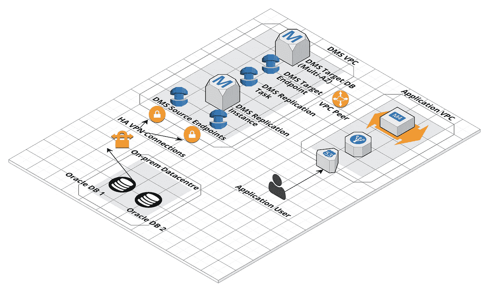
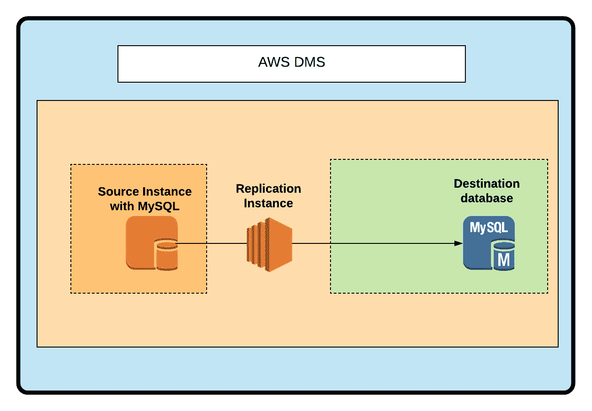
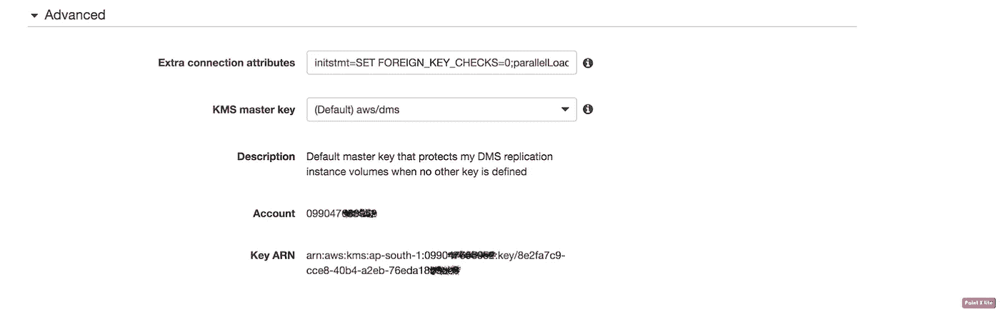
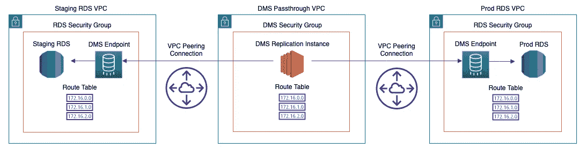
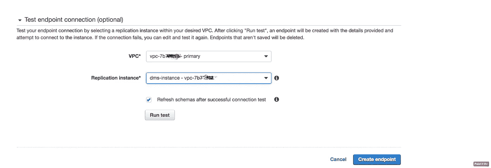
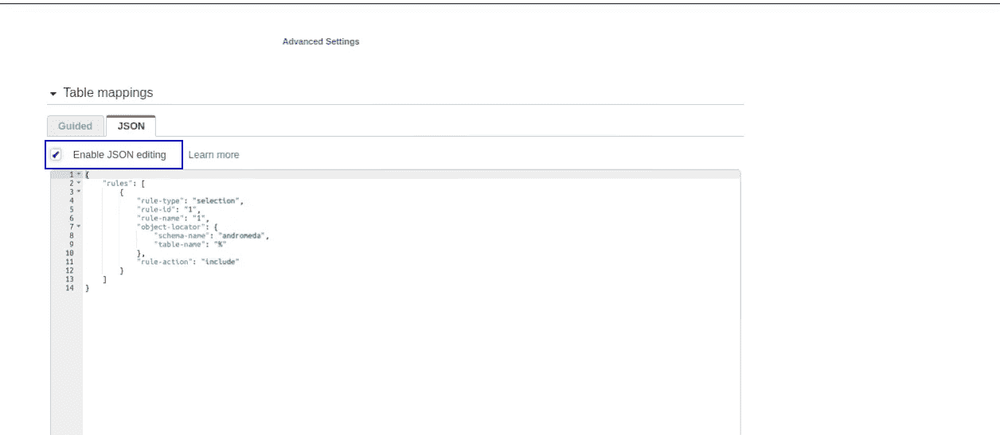
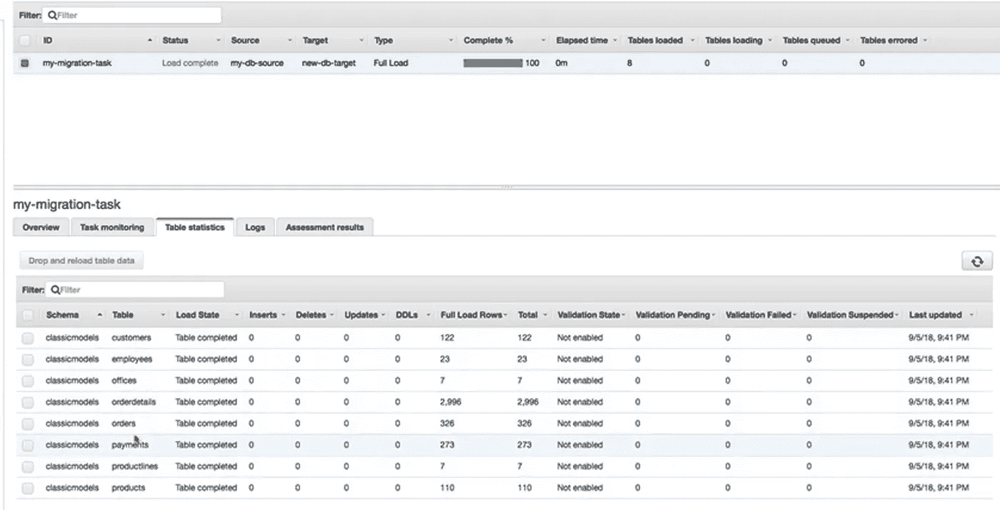

# BigData/ELT:几乎不停机的无服务器数据库迁移和复制

> 原文：<https://medium.com/analytics-vidhya/moving-an-on-premise-production-database-to-a-managed-cloud-serverless-database-in-nearly-no-d1fb3f47cfd3?source=collection_archive---------14----------------------->

通过无服务器迁移和复制流程将本地生产数据库迁移到云中，几乎不需要停机…


图片来源:谷歌

# 目录

1.  **为什么选择无服务器的数据库迁移和复制方法？**
2.  **先决条件— ETL + AWS DMS + AWS RDS**
3.  **一步一步的流程和演示**
4.  **奖励-专业提示！**

# **1:为什么采用无服务器方法进行数据库迁移和复制？**

在我之前的一篇博客中(链接附后)，我已经提到了为什么无服务器方法在卓越运营、安全性、性能、可靠性和成本方面总是一个好的选择。

> **提示:**这些也被称为良好架构框架的 **5 支柱**。根据我自己的经验，应该严格控制性能成本。因为这五大支柱是相辅相成的，其中性能&成本是最重要的。

[](https://towardsdatascience.com/amazon-s3-data-lake-storing-analyzing-the-streaming-data-on-the-go-a-serverless-approach-48b68a9433ff) [## 亚马逊 S3 数据湖|移动存储和分析流数据|无服务器方法

### 通过存储流数据创建亚马逊 S3 数据湖，并在旅途中以近乎实时的方式进行分析…

towardsdatascience.com](https://towardsdatascience.com/amazon-s3-data-lake-storing-analyzing-the-streaming-data-on-the-go-a-serverless-approach-48b68a9433ff) 

因此，一个叫做[https://debezium.io/](https://debezium.io/)的流行开源变更数据捕获(CDC)平台可用于迁移和复制 CDC，这很神奇，我也亲自使用过。但是，就架构良好的框架的 5 个支柱而言，它有以下缺点:

*   ***卓越运营:*** 源数据库上的全局读锁，需要运营维护，Debezium 延迟监控，运行 Debezium 的服务器维护等。
*   ***安全:*** 非托管安全既针对动态加密也针对静态加密。
*   ***性能/可伸缩性:*** 这可以通过 Docker 轻松实现可伸缩性。但是自动缩放有时很麻烦。
*   ***可靠性:*** 对 Zookeeper、Kafka 等有几个内部依赖使得它不太可靠。
*   ***费用:*** 免费但是，维护费用摆在那里！

> 因此，我将使用 AWS DMS 服务，使用一个受管理的无服务器流程进行迁移和复制，并向您演示如何设置。但是它也有自己的缺点，我在最后的奖金部分提到了，还有解决的方法！

# 2: **先决条件— ETL + AWS DMS + AWS RDS**



体系结构

***2.1: ETL:*** ETL 代表提取转换负载。通常，ETL 数据管道用于为非结构化数据提供结构。

但是，我们也可以使用它将结构化数据源从一个关系数据库迁移到另一个关系数据库或非关系数据库。我们现在就去，但不是从零开始，而是以一种或多或少无服务器的方式。

***2.2: AWS DMS:*** 亚马逊 Web 服务(AWS)数据迁移服务(DMS)是我们用来建立一个完整的羽翼未丰的 ETL 过程的服务。通常建立一个 ETL 过程很容易，但是维护一个 ETL 过程并不简单，因为它依赖于 **Docker** 、 **Debezium** 、 **Kafka** 等。

如果你想从头开始学习，下面是我的文章，你可以看看下面，我在下面的文章中讨论的 ETL 的过程与我们将要运行的复制实例是一样的(稍后解释)。

如果你想从头开始学习，下面是我的文章，你可以看看下面，我在下面的文章中讨论的 ETL 的过程与我们将要运行的复制实例是一样的(稍后解释)。

[](https://towardsdatascience.com/4-easy-steps-to-setting-up-an-etl-data-pipeline-from-scratch-a6e67c40b6e1) [## 从头开始设置 ETL 数据管道的 4 个简单步骤

### 用几个命令建立 ETL 管道

towardsdatascience.com](https://towardsdatascience.com/4-easy-steps-to-setting-up-an-etl-data-pipeline-from-scratch-a6e67c40b6e1) 

现在，我们知道为什么我们需要 AWS DMS。因此，AWS DMS 主要由 3 部分组成:

*   ***AWS DMS 端点:*** 这些是源和目标端点。在设置时，应该为需要与源和目标联网的复制实例处理 VPC 联网 esp。AWS 还提供了对此进行测试的选项。
*   ***AWS DMS 复制实例:*** 只是一个 ec2 实例，它将运行我们的整个 ETL 过程。复制实例存储 CDC(变更数据捕获)检查点和指定持续时间内的表历史(以便在我们停止复制时重新加载),并且在幕后为我们完成所有繁重的工作。下面附上我的参考 Github 回购，以便更好地理解。
*   ***AWS DMS 复制任务:*** 将在复制实例内部运行的 ETL 任务。出于学习和理解的目的，下面附上使用 Debezium CDC 设置 ETL 的代码，AWS 使用相同的方法进行数据迁移和复制。

[](https://github.com/burhanuddinbhopalwala/etl-elasticsearch-app) [## burhanuddinbhopalwala/ETL-elastic search-app

### 通过 debezium (cdc)、相应的连接器 kafka 和 kafka-connect 提取转换加载(ETL)管道，用于…

github.com](https://github.com/burhanuddinbhopalwala/etl-elasticsearch-app) 

# **3:一步一步的流程和演示**



DMS —鸟瞰视图

在这个演示中，我将一个托管在 ec2 实例上的数据库作为源端点，AWS RDS 作为目标端点。

**步骤 1 设置源和目标端点:**附加以下配置。

注意:使用连接属性设置***parallel load threads***并行加载表或者 ***使用 BCPFullLoad*** 批量加载。你可以根据你的需要改变它。它们很重要，一些 ***连接属性*** 如下:

*   ***安全策略*** —通过打开事务来更改 SQL Server 的行为，以防止在 AWS DMS 读取日志时事务日志被截断。有效值为 EXCLUSIVE_AUTOMATIC_TRUNCATION 或 RELY _ ON _ SQL _ SERVER _ REPLICATION _ AGENT(默认值)。
*   ***useBCPFullLoad***—指示 AWS DMS 使用 BCP(批量复制)进行数据加载。有效值为 Y 或 n。当目标表包含源表中不存在的标识列时，必须通过将参数设置为 n 来禁止使用 BCP 加载表
*   ***BCPPacketSize***—如果 BCP 启用了数据加载，则输入 BCP 使用的最大数据包大小。有效值为 1–100000(默认值为 16384)。
*   ***控制表文件组*** —指定用于 AWS DMS 流程在数据库中创建的控制表的文件组。
*   ***平行螺纹***——上面讨论过。

端点配置:

端点配置



高级设置—连接属性

**步骤 2 设置复制实例:**在步骤 3 中附加到主配置下。

> **注意:**如果您的源和目标(比如说转移和生产)位于不同的 VPC，那么复制实例将无法工作，除非两端都通过 VPC 对等连接进行连接。



不同端点中源和目标的 VPC 对等

在继续之前，请手动运行端点和复制实例之间的连接测试。



**步骤 3 设置复制任务**:这是最重要的部分，因为如果复制任务配置不正确，它将很容易进入**出错**状态，然后您需要一个使用 Cloudwatch 日志的任务监视器。下面是附加的配置模板和截图。

对于所有配置，请参考以下主配置文件:

复制任务设置

在高级设置下使用下面的表格映射:



复制任务的表映射

```
**{
 "rules": [
  {
   "rule-type": "selection",
   "rule-id": "1",
   "rule-name": "1",
   "object-locator": {
    "schema-name": "<SOURCE_DB_NAME>",
    "table-name": "%"
   },
   "rule-action": "include"
  }
 ]
}**
```

> **提示** *:你可以使用 AWS CLI 也可以使用上面的配置来创建复制实例和任务。*

***最终结果:***

如您所见，所有经典型号都已迁移，并将根据上面选择的配置开始复制 CDC！



经典模型—迁移

**4:** **奖金—亲小贴士！**

**4.1: DMS 的局限性(我们遇到了😤):**

> 列的 AUTO_INCREMENT 属性未迁移到目标数据库列。
> 
> 对列值的一部分创建的索引不会被迁移。所以，二级索引，默认值，过程，触发器等等。作为数据迁移的一部分未被迁移。—原因是 AWS 专注于数据迁移的极简方法(仅对象)。
> 
> DMS 没有迁移默认值。

因此，迁移索引的一个好的解决方案是转储模式并使用 ***Truncate*** only 选项启动复制任务，这将保留转储模式(带有自动增量、索引、默认值)并仅迁移和复制 CDC。

Aliter 的最佳解决方案是手动迁移索引，如果您在整个数据迁移过程之后意识到这一点的话。这一招也相当好用！

> 另一个限制是，如果 MySQL 兼容的源代码在满载时停止，AWS DMS 任务不会因出错而停止。任务成功结束，但目标可能与源不同步。如果发生这种情况，要么重新启动任务，要么重新加载受影响的表，这是唯一的解决方案。

**4.2: *成本*** :通常用于高达 1–2tb 的 ***数据迁移 t2 .中型或 t2 .大型* *效果相当好*** 成本约为 45–50 美元/月。增加实例类型只会有助于初始数据迁移，但复制速度在所有实例类型中都保持不变。尽量不要选择更高的实例类型，这只会让你花费更多！

如果您选择在迁移后复制持续的 CDC 更改，那么只有您愿意选择验证更改(仅当您需要时)，AWS DMS 将按小时计费。因为 ***启用*** ***验证会大大增加迁移时间，从而增加成本。***

差不多就是这样！

***连接*** 🤝 ***:***

*   ***邮箱***:*bbhopalw @ Gmail*
*   【www.linkedin.com/in/bbhoaplw】*领英* : [*领英*](http://www.linkedin.com/in/bbhoaplw)

***供进一步阅读***✍️***:***

***大数据&云工程博客:***

*   ***走向数据科学出版:***[*【https://medium.com/@burhanuddinbhopalwala】*](/@burhanuddinbhopalwala)

***后端工程&软件工程博客:***

*   ***DEV 社区:*** [*https://dev.to/burhanuddinbhopalwala*](https://dev.to/burhanuddinbhopalwala)