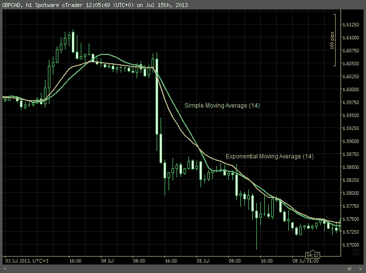
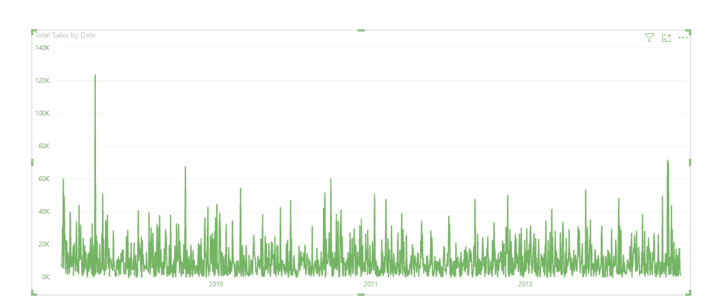
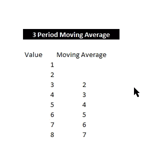
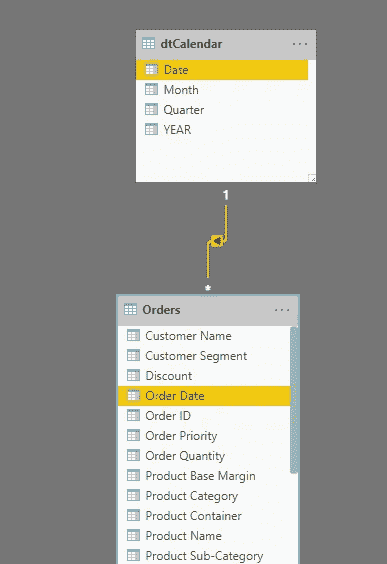
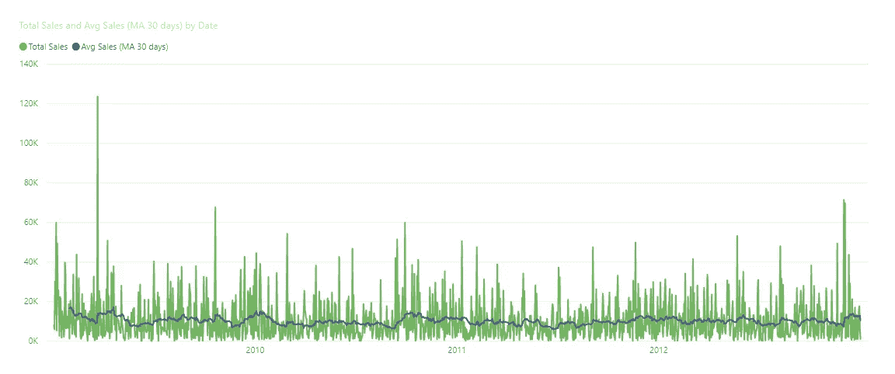

# 使用 DAX 的移动平均线(幂 BI)

> 原文：<https://medium.com/analytics-vidhya/moving-average-using-dax-power-bi-413a31099091?source=collection_archive---------1----------------------->



最初发布

[](https://www.vivran.in/post/moving-average-using-dax) [## 使用 DAX 的移动平均线

### 移动平均法使用时间序列中最近 k 个数据值的平均值。我们称之为移动…

www.vivran.in](https://www.vivran.in/post/moving-average-using-dax) 

让我们考虑一组销售数据。目标是分析每天的销售量。如果我们只是构建一个按天划分销售额的报告，结果很难理解。

以下是每日总销售额的时间序列:

```
Total Sales = SUM(Orders[Sales]) 
```



上图显示了总销售额的巨大变化和水平趋势模式。

在统计数据建模中，一种常见的方法是计算某段时间内高于一天水平的平均值，特别是当时间序列在一段时间内显示水平模式时。它也被称为移动平均线。

# 什么是均线？

***移动平均值*** 方法使用时间序列中最近的 *k* 数据值的平均值。我们称之为移动，是因为每当一个新的观察值对时间序列可用时，它就用最新的值替换等式中最早的观察值，并计算新的平均值。因此，计算平均值的周期随着每个随后的周期而变化或移动。

以下是 3 期移动平均线的示例( *k =* 3)



# 计算功率 BI 中的移动平均值

这里的目标是计算过去 30 天的移动平均值。

所以， *k =* 30

专家建议在数据模型中至少创建一个日历表。在当前模型中，我已经创建了一个日历表并建立了关系:



你可以参考下面这篇关于[日历表](https://community.powerbi.com/t5/Community-Blog/Time-Intelligence-Calendar-Table/ba-p/1000565)的文章。

然后，使用以下代码创建一个度量:

```
Avg Sales (MA 30 days) =//Selecting the date in the rangeVAR _LastDate =MAX ( dtCalendar[Date] )//Defining the duration to be considered for average calculation(k)VAR _Duration = 30//Filtering the Calendar Table for the defined rangeVAR _CalculationPeriod =FILTER (ALL ( dtCalendar ), — Removing any external filters context appliedAND (dtCalendar[Date] > _LastDate — _Duration, — the range start datedtCalendar[Date] <= _LastDate — the range end date))//Calculating the Moving AverageVAR _MovingAverage =IF (COUNTROWS ( _CalculationPeriod ) >= _Duration, — Condition to check minimum number of days for the calculation.CALCULATE (AVERAGEX(dtCalendar,[Total Sales]), — Calculating average of the total sales amount_CalculationPeriod))RETURN_MovingAverage
```

该公式首先确定最后可见的日期；在视觉化中，因为视觉化设定的筛选内容是在日期层级，所以它会传回选取的日期(VAR _LastDate)

然后，它创建一个集合，包含最后一个日期和最后一个日期减去 30 天之间的所有日期(VAR _CalculationPeriod)。

最后，最后一步是在 CALCULATE 中使用这个时间段作为过滤器，以便最终的 AVERAGEX 在 30 天内迭代，计算每日销售额的平均值。

计算结果如下图所示:



均线比日线销售更平滑，简化了趋势分析过程。

你可以在这里找到示例 pbix 文件

*我写关于*[*MS Excel*](https://www.vivran.in/my-blog/categories/excel)*[*权力查询*](https://www.vivran.in/my-blog/categories/powerquery)*[*权力毕*](https://www.vivran.in/my-blog/categories/powerbi)*[*权力中枢*](https://www.vivran.in/my-blog/categories/power-pivot)*[*DAX*](https://www.vivran.in/my-blog/categories/dax)*[*数据分析【数据*](https://www.vivran.in/my-blog/categories/data-analytics)*****

**[@imVivRan](https://twitter.com/imvivran)**