# 带样本码的麦卡洛克-皮茨神经元和感知器模型

> 原文：<https://medium.com/analytics-vidhya/mp-neuron-and-perceptron-model-with-sample-code-c2189edebd3f?source=collection_archive---------0----------------------->

# **深度学习的基础积木——人工神经元**

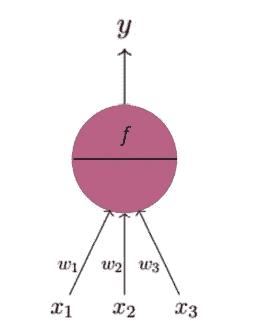

x1、x2、x3 是因变量所依赖的不同因素(变量)。每个因素(变量)被赋予一些初始随机权重。神经元将输入视为加权因子的线性集合。然后在聚合的顶部，应用一些激活来预测 y。

## **谁提出了这个模型？**

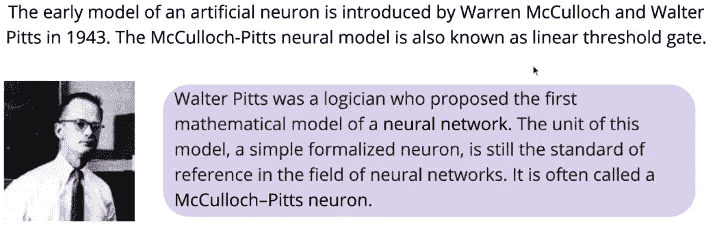

来源:[https://www . I-programmer . info/babb ages-bag/325-mccull och-Pitts-neural-networks . html](https://www.i-programmer.info/babbages-bag/325-mcculloch-pitts-neural-networks.html)

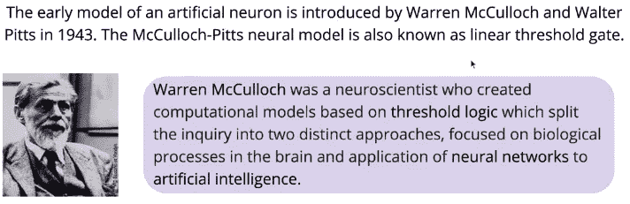

来源:[https://www . I-programmer . info/babb ages-bag/325-mccull och-Pitts-neural-networks . html](https://www.i-programmer.info/babbages-bag/325-mcculloch-pitts-neural-networks.html)

## **MP 神经元的数学模型**

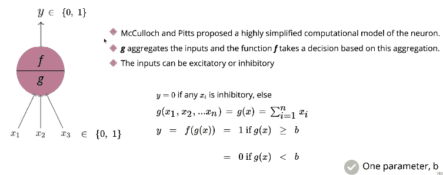

输入和输出将只是布尔型的。它没有真正的价值。其中 b 是决定 y 应该是 1 还是 0 的阈值。f 是激活函数，它以 g 集合作为输入进行决策。

## MP 神经元和任务的数据类型

这里的任务是找到“b ”,它增加了神经元的输出，使其与实际输出相同。

*1)LBW 数据*

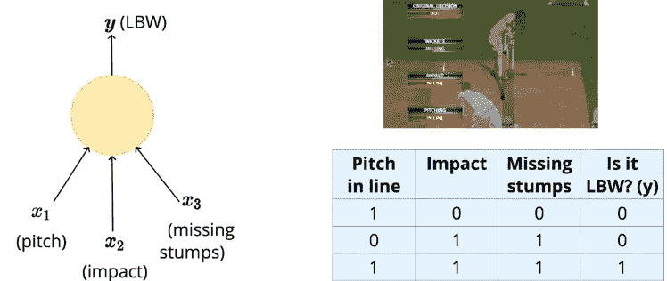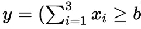

**麦卡洛克·皮茨函数**

每个变量都采用二进制输入，其中预测是使用麦卡洛克皮茨函数完成的。这里调整阈值(b ),使其适用于所有给定的数据。示例—对于第一行，(1+0+0)=1，因此阈值“b”应小于 1，以获得 y=0。

*2)移动数据*

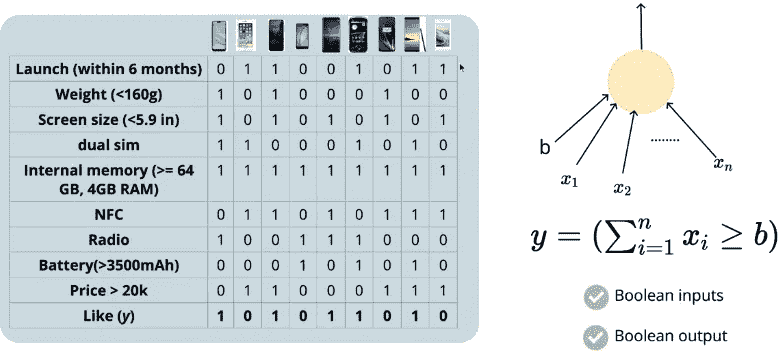

这里的任务是找到“b ”,它增加了神经元的输出，使其与实际输出相同。

# MP 神经元丢失

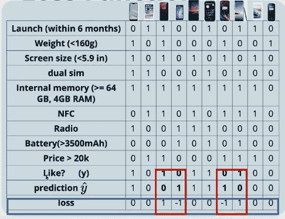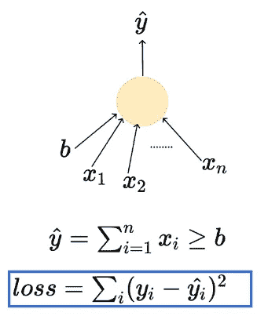

这里我们取损失的平方，因为简单差的和(y-y^)may)抵消了正负误差。我们也没有选择|y-y^|，因为它是**不可微的**，所以**梯度**不能被计算以更新损失。

## 学习算法

强力搜索可以提供一个参数。

对于 10 次观察，取“b”为(0，1，2，…10)，并计算每个 b 值的总损耗。图损失 vs“b”，损失的最小值将给出最佳阈值(b)。

# MP 神经元评估

这通常在测试数据集上完成，您将使用从训练数据集获得的最佳阈值(b)进行预测。计算测试数据预测值的准确率。

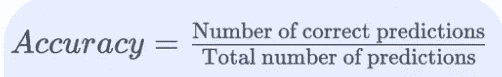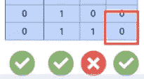

精确度=3/4=0.75

x1+x2+x3+的几何解释。Xn+b=0 是如果值> 0，那么它将位于一侧，否则位于另一侧。误差不能为零，因为所有点不能被直线或平面分开。

## 限制

所以以下几点是 MP 神经元的限制:

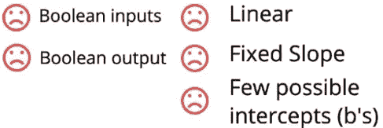

为了克服这个限制，我们提出了一个新的模型，感知器模型

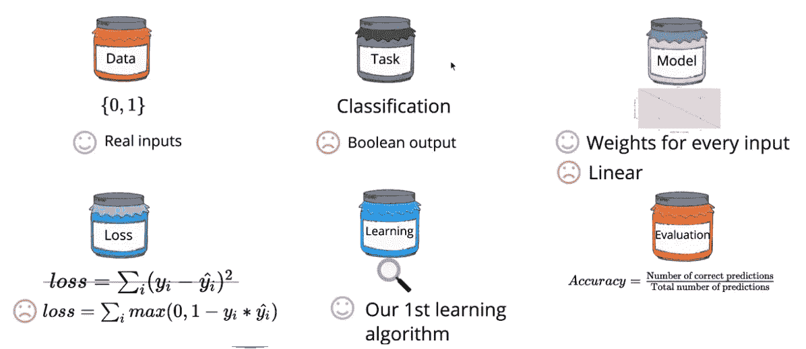

## **感知器模型**

它可以处理**实际值输入**。因此**数据的标准化**是横向扩展单元所必需的。因此所有值将位于-1 到+1 之间，平均值为 0。但是这个模型还是一个二元分类模型。

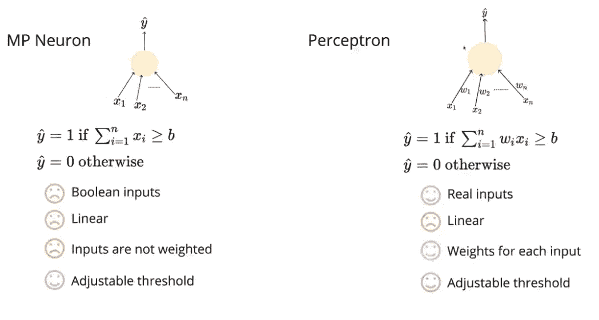

感知器模型具有将权重分配给模型的变量和实值输入的优点

**- >工序**

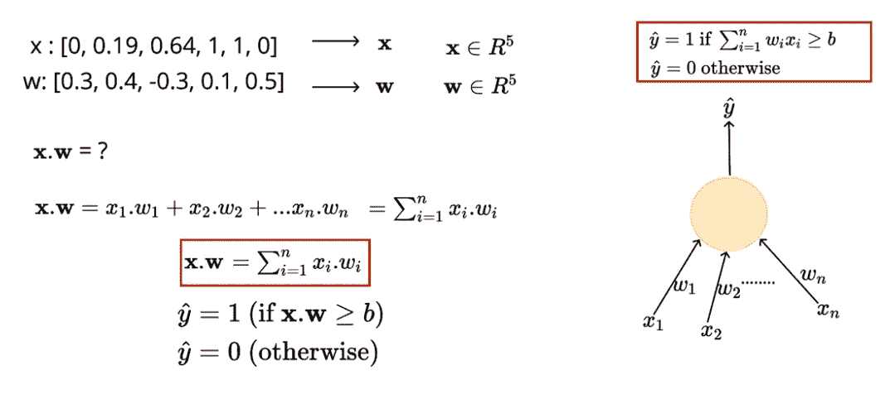

这里的灵活性增加了，因为重量和“b”都是可调的，所以平面或直线可以旋转它们的位置以便分类。我们没有选择更多的函数族来处理，因为现在，数据必须是线性可分的。

**- >感知器损耗**

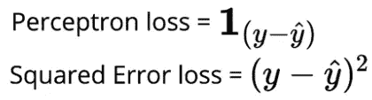

当输出为布尔型时，平方损耗与感知器损耗相同。

**- >学习算法**

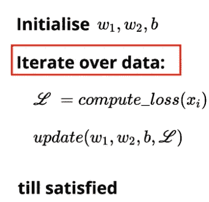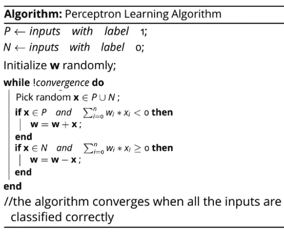

迭代，直到损失随着迭代次数而变得恒定。更新重量和偏差参数，以最大限度地减少损失。

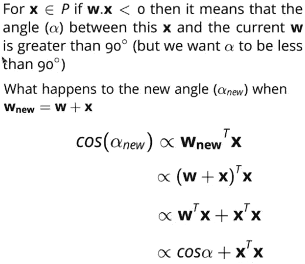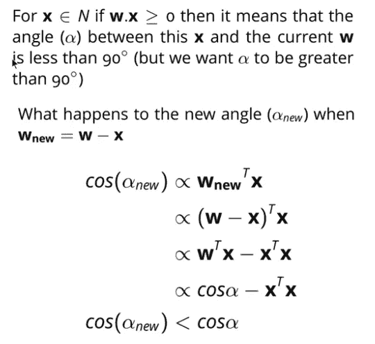

**- >评估**

它的表现与 MP 神经元模型相同。

型号代码可以在下面的 GitHub 链接中找到。

[https://github . com/Rana Singh-p/padhaiAI/tree/master/Python % 20MP % 20 neuron % 2C % 20 perceptron % 2C % 20 test train](https://github.com/ranasingh-gkp/padhaiAI/tree/master/Python%20MP%20Neuron%2C%20Perceptron%2C%20TestTrain)

# 参考:

1.  维基百科(一个基于 wiki 技术的多语言的百科全书协作计划ˌ也是一部用不同语言写成的网络百科全书ˌ 其目标及宗旨是为全人类提供自由的百科全书)ˌ开放性的百科全书
2.  四分之一实验室的深度学习
3.  [https://www . I-programmer . info/babb ages-bag/325-mccull och-Pitts-neural-networks . html](https://www.i-programmer.info/babbages-bag/325-mcculloch-pitts-neural-networks.html)