# MP 神经元模型

> 原文：<https://medium.com/analytics-vidhya/mp-neuron-model-f4feb53c21a2?source=collection_archive---------6----------------------->

## 深度学习

# 生物神经元

[https://miro . medium . com/max/1030/1 * 1 oh53 ndpitvnoogccufa . png](https://miro.medium.com/max/1030/1*1Oh53dNdPITVnoOVGCCUFA.png)

*   *树突是从其他神经元或感觉器官带来的输入。*
*   *突触是两个神经元之间相互作用的强度。*
*   Soma 是某种处理单元，它接收所有的神经元并在其上进行某种处理。

# 人工神经元

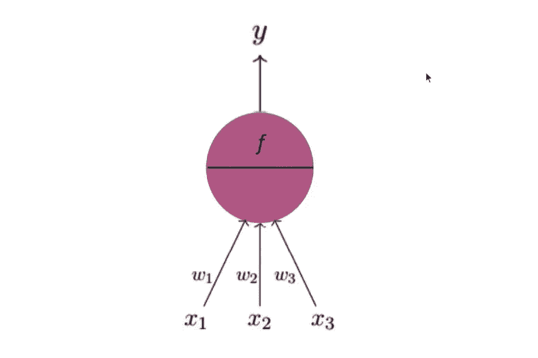

*   *x1、x2 和 x3 是生物神经元中对应于树突的输入。*
*   *w1、w2、w3 代表突触对应的权重。*
*   *圆形部分对应胞体，输出箭头对应轴突。*

# 麦卡洛克-皮茨神经元

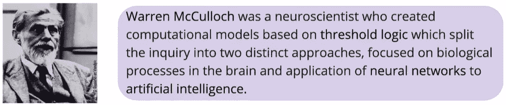

*   人工神经元的早期模型是由沃伦·麦卡洛克(神经科学家)和沃尔特·皮特(逻辑学家)于 1943 年提出的
*   麦卡洛克-皮茨神经元也被称为线性阈值门

## 模型

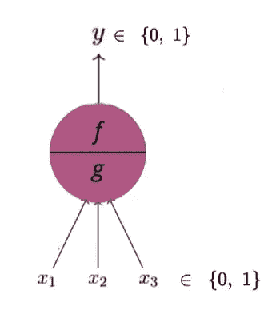

*   输入只能是布尔值。
*   输出只能是布尔值。
*   g 汇总输入，f 根据汇总做出决策。

**条件**

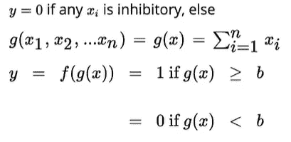

*   如上图所示，g 取所有输入的总和，f 取 g 作为输入。这些都是布尔输入。
*   这里 b 是一个阈值。

## 数据和任务

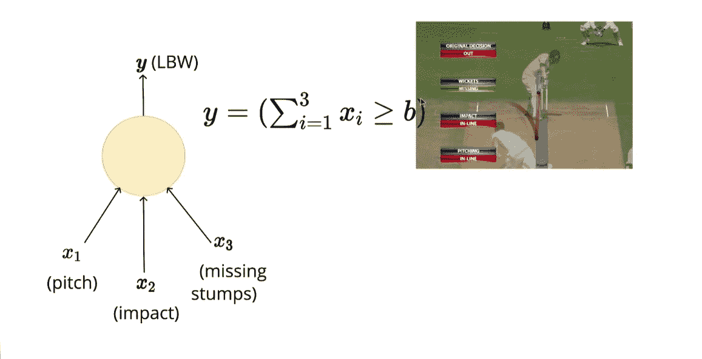

*   在这个例子中，我们希望我们的模型基于某些因素来预测决策是否是低体重，例如，球是否在直线上投球，它的影响以及它是在树桩上执行任务还是击中树桩。

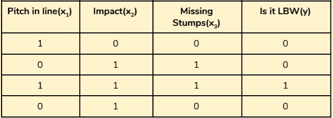

## 损失函数

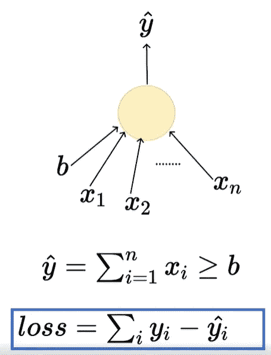

*   损失往往是模型在预测时产生的误差，也可能是真实值和预测值之间的差异。
*   我们取真实值和预测值之间的差值的平方，以便去除负号，如果真实值为 0 而预测值为 1，则可能出现负号，因为在 MP 神经元模型的情况下，我们有二进制输出。

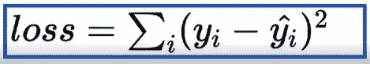

> 注意:你可能会问，为什么我们不取值的模，因为模的值是不可微的，我们以后会知道为什么可微性是重要的。

## 学习算法

*   我们希望损失函数最小，因此我们希望插入 b 的值，然后开始逐个输入，这样我们得到的输出就与真实值相同或接近。
*   在 MP 神经元模型的情况下，我们只能有一个参数，因此我们可以使用 **bruit 力搜索技术**来计算 b 的值。
*   假设我们有 n 个要素，那么 b 的值必须在 0 到 n 的范围内，b 只能有离散值，因为输入也是离散值。

## 估价

*   我们的模型将如何处理以前没有见过的数据或测试数据。
*   我们将基于准确性来评估我们的 MP 神经元模型，准确性是正确预测的数量除以预测的总数。

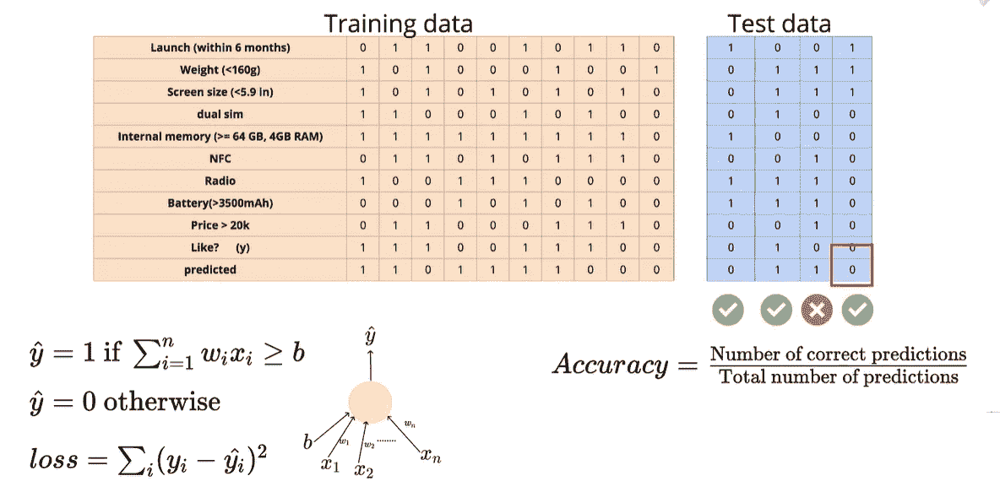

*   在上面的例子中，测试集的精度是 3/4，相当于 75%。

# MP 神经元后面的几何图形

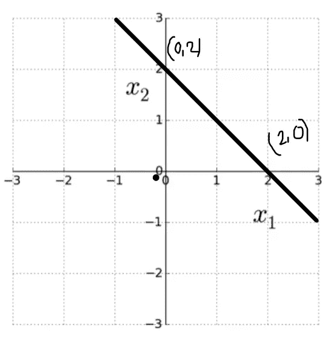

图 1

*   情商。线的是:y = mx + c
*   用 x1 替换 x，用 x2 替换 y

=> x2 = mx1 + c

=> mx1 -x2 +c

*   一般的情商。的行可以写成:

**ax1 + bx2 +c = 0**

*   在图中，这些点被认为是:a = 2，b=1，c = -2

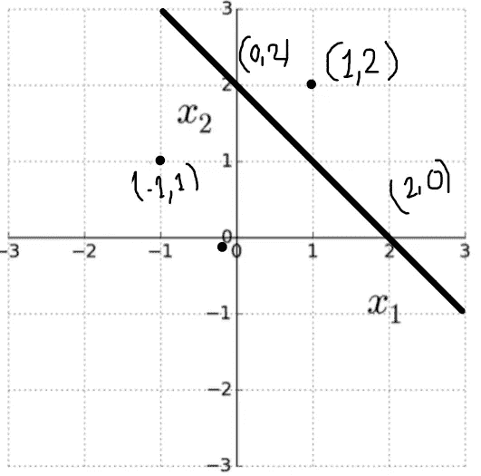

图 2

*   在这个图(图 2)中，我们可以看到两点(1，2)和(-1，1)
*   考虑点(1，2)，将它代入等式，得到值 2。
*   如果 ax1 + bx2 + c > 0，则它在该线之上。
*   如果 ax1 + bx2 + c < 0 then it is below the line .
*   If ax1 + bx2 + c = 0 then it is on the line .

# MP Neuron Model

> Here we are loading breast cancer dataset from scikit-learn and training it using MPNeuron model

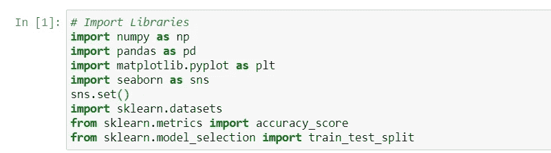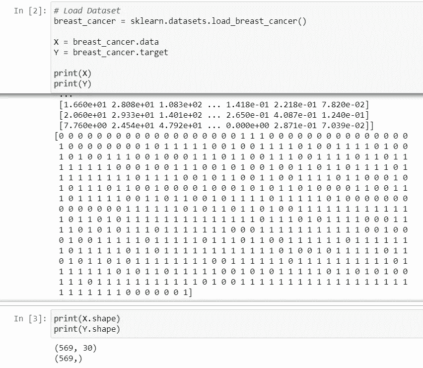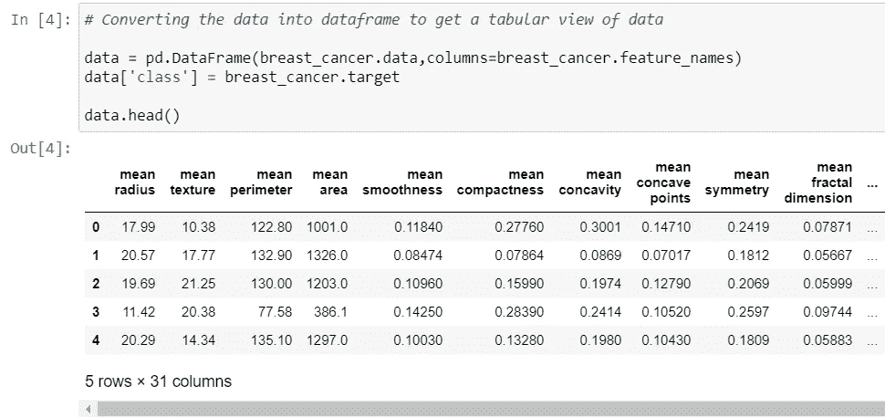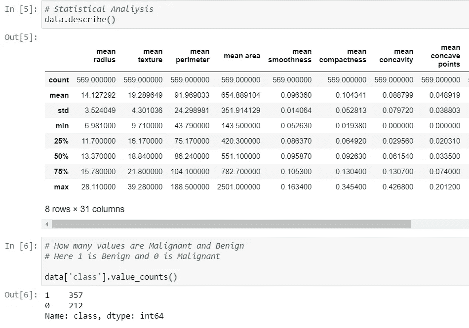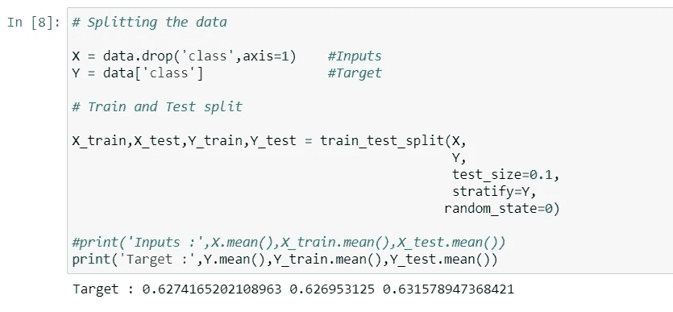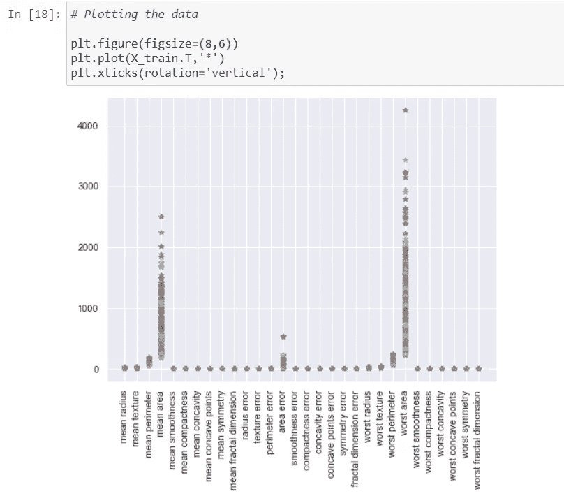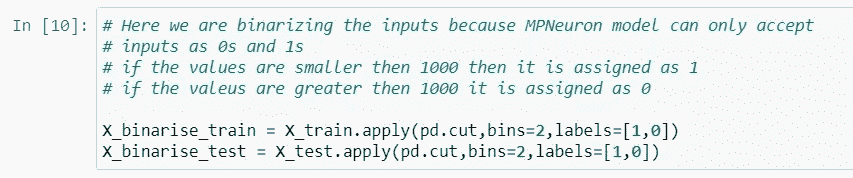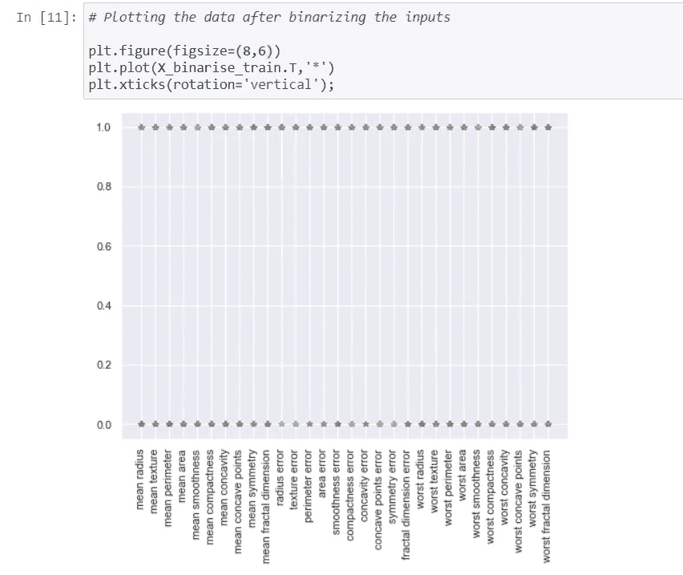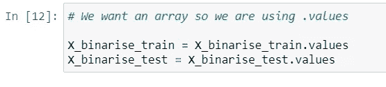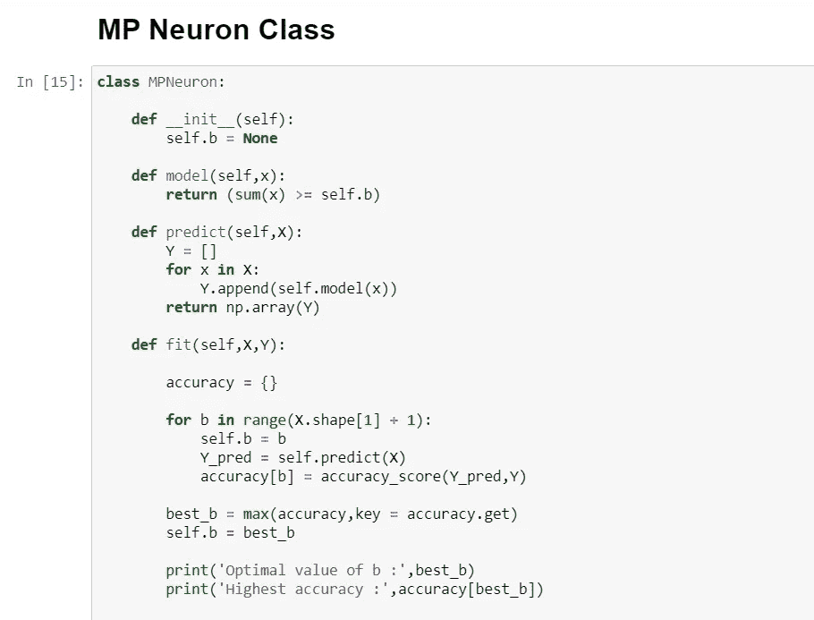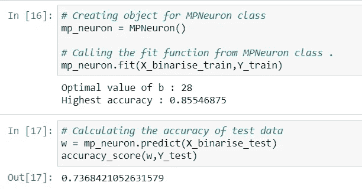

> Note : MPNeuron is just a basic model with just one parameter b so we cannot accept more accuracy then what we get , if we move ahead with some more advance models like **感知器**，**乙状结肠神经元**我们会得到更好的精确度。

**参考文献:**

*   [https://www.guvi.in/](https://www.guvi.in/)(AI 与深度学习认证课程)