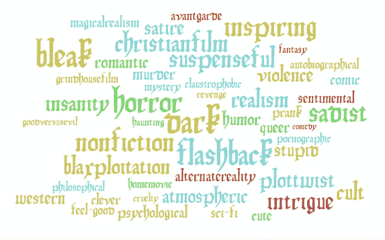
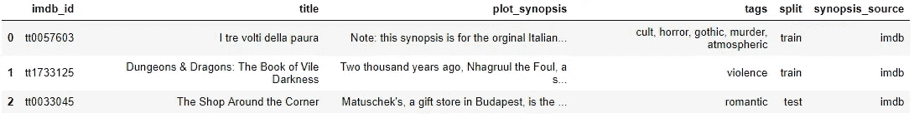
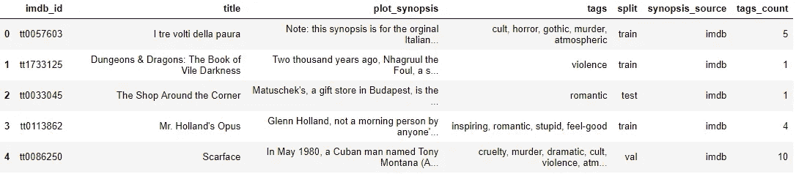
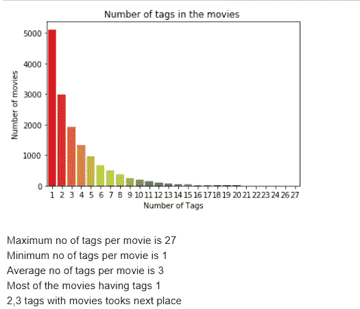
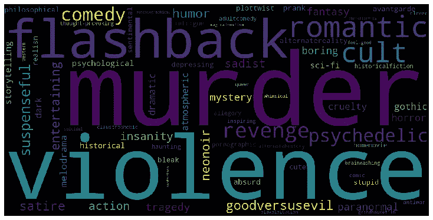
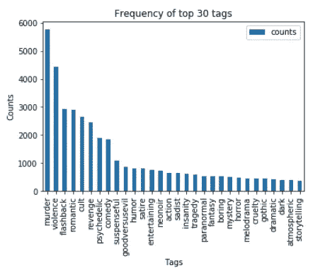
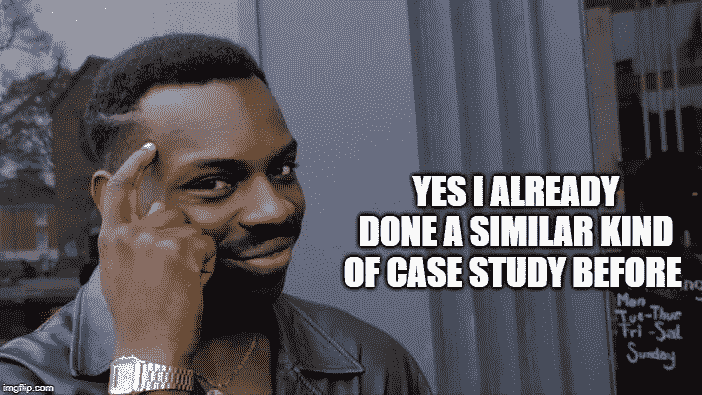
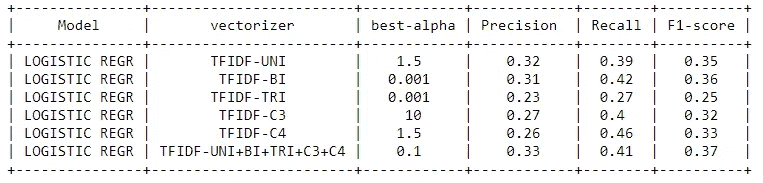
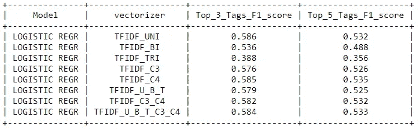

# MPST:带标签的电影剧情简介

> 原文：<https://medium.com/analytics-vidhya/mpst-movie-plot-synopses-with-tags-ff9abcf1b8ec?source=collection_archive---------14----------------------->



电影标签

大家好，在这里我们可以看到如何处理一个多类分类问题。为此，我们将使用来自 kaggle competitions 的名为 MPST 的数据集，该数据集在进入细节之前，根据电影大纲预测电影标签。首先，看一下数据，我会给你有助于你练习的数据源链接，[点击这里](https://www.kaggle.com/cryptexcode/mpst-movie-plot-synopses-with-tags)查看数据源。

看到这些数据，我们会想到几个问题，比如……，“如何处理这个问题...?"，“必须使用哪种机器学习算法...?"，“必须使用哪个指标...?"如果你是机器学习的新手，你肯定会想到这些问题，这是我的建议当你试图用你的数据做些什么时，首先研究关于数据集的研究论文开始案例研究是一个非常好的习惯[点击这里](https://www.aclweb.org/anthology/L18-1274)下载数据集 MPST 的研究论文。

我希望您阅读上述研究论文，如果没有，请阅读该论文。相信我，这非常重要，因为我个人的经验，当我开始这个案例研究时，我忽略了阅读研究论文并应用了许多算法，花了很多天才找到哪个算法是合适的，在阅读研究论文后，我获得了许多信息。

现在，让我们深入我们的案例研究 **MPST 带标签的电影剧情简介**这个案例研究基本上是借助电影剧情简介(电影的短篇故事或电影的概要)来预测电影标签。

我们来看看， **EDA(探索性数据分析)**还有看了 mpst__data.csv 之后数据是什么样子的。



mpst__data.csv

现在，我们将在清理数据(如检查 NaN 值和删除重复条目)后看到一些关于标记功能的数据分析，我将在本博客的结尾分享完整的代码文档，以便您可以从中进行检查:)

> **标签特征分析:**

检查下面每部电影的标签数量，我们可以看到每部电影的标签数量。



每部电影的标签数

检查每部电影的最大、最小和平均标签数。



标签分析

让我们在单词云权重可视化中看到一些独特的标签(这意味着我们可以通过查看单词在单词云中的大小来查看最常出现的标签，大小越大，权重越大，这意味着最常出现的标签)。



如果我们观察上面的词云，最常见的 5 个标签是谋杀，暴力，闪回，浪漫，邪教

让我们看看频率格式。



如果我们观察上面的词云，我们会得到同样的结果，前 5 个标签是谋杀，暴力，闪回，浪漫，邪教。


你如何知道这些步骤来实现这样的分析



通过实践:从这个开始，尝试类似的数据集，并应用你从这个博客中学到的东西

是的，如果你是机器学习的新手，你可能会想到他是如何知道所有这些步骤的，我从以前的作业中学到了所有这些东西，这些都在我的课程中。从那次经历中，我学到了所有这些东西，并应用在这个案例研究中。

> 数据预处理和矢量化；

现在让我们看看数据预处理，在此之前，我们如何选择特征为 X，我们已经知道 **Y** 是**标签**，现在我们如何选择 X…？通过查看数据，我们希望基于标题特征来预测电影标签，我们无法预测得那么准确，因为它没有更多信息，因此我们可以选择包含更多信息的 plot_synopsis 特征，这可以帮助我们更准确地预测标签，因此我们可以选择我们的 **X** 作为 **plot_synopsis。**

现在，我们将在 plot_synopsis 功能上应用数据预处理和文本到数字的矢量化(BOW、TFIDF、AVGW2V、TFIDFW2V、CHAR-3、CHAR-4)，单击此[链接](https://github.com/satyakrishnapst/Movie_plot_synopsis_tags)查看代码实现。

> 将标签转换为多标签设置:

我们已经知道预处理的 X 特征，现在我们必须将我们的 Y 类标签准备成 one-hot-encoded 形式，如下所示:

```
# binary='true' will give a binary vectorizer
vectorizer = CountVectorizer(tokenizer = lambda x: x.split(), binary='true')
multilabel_y = vectorizer.fit_transform(pure_df['pre_pro_tags'])
multilabel_y.shape# if we observe we have 71 unique tags its look like multi class 
(14752, 71)
```

> 建模:

现在，我们已经准备好数据，是时候应用模型了。在应用模型之前，查看研究论文，了解它们实现了什么，我们还可以检查“哪种算法和指标适合多类分类”。在研究论文中，我们应用了带有逻辑回归、TFIDF 矢量化的[**OneVsRestClassifier**](https://scikit-learn.org/stable/modules/generated/sklearn.multiclass.OneVsRestClassifier.html)，以及 uni、bi、trigrams、c3、c4 特征化等所有 TFIDF 矢量化工具的组合。

```
alpha = [0.001,0.01,0.1,0.5,0.9,1,1.5,10,100,1000]
#penalty = ['l1','l2']params  = {'estimator__C': alpha}
clf_estimator_6 = OneVsRestClassifier(LogisticRegression(class_weight='balanced',penalty='l2',n_jobs=-1),n_jobs=-1)#we using RandomizedSearchCV for hyper parameter tuning
RS_clf_6 = RandomizedSearchCV(estimator=clf_estimator_6, param_distributions=params, n_iter=10, cv=5, scoring='f1_micro', n_jobs=-1,verbose=10)
RS_clf_6.fit(x_train_uni_bi_tri, y_train_6)
print('Best estimator: ',RS_clf_6.best_estimator_)
print('Best Cross Validation Score: ',RS_clf_6.best_score_
```

取而代之的是应用所有的矢量化&算法。我们正在尝试研究论文的实现。根据研究论文，我们使用逻辑回归和 OnevsRest。因为这是一个多类分类，我们坚持使用 F1 分数作为损失度量的 TFIDF 矢量化，这适用于多类分类。通过应用所有这些，我们将得到如下结果。

> 结果:



结果接近研究论文 0.37，为最高 F1 分

我们还可以应用其他因子分解，如 [**LDA 主题建模**](https://www.machinelearningplus.com/nlp/topic-modeling-gensim-python/) ，但结果不会符合我们的预期。

> 对前 3 名和前 5 名标签应用模型:

与其预测每部电影的所有标签，不如我们预测前 3 或前 5 个标签…！我们已经在标签数据分析中看到，大部分电影都有 3-5 个标签

```
#top-3 tags 
#Refer above research paper we first analysis on top 3 tags 
vectorizer = CountVectorizer(tokenizer = lambda x: x.split(), binary='true',max_features=3)# simply we pass max_features = 3 or 5 
multilabel_y3 = vectorizer.fit_transform(pure_df['pre_pro_tags'])
multilabel_y3.shape# it will return top 3 or 5 features based on max_features value
(14752, 3)
```

> 让我们看看前 3 名和前 5 名的结果:



我们得到 0.58 作为预测前 3 名标签的最高 F1 分

通过简单的矢量化，我们得到了接近研究论文的最佳结果。然而，我们也可以 hstack the 特征和 TFIDF_U_B_T_C3_C4 组合特征，我们可以得到 0.48 作为所有 71 标签的最高 F-1 分数。

查看我的 [***GitHub 链接***](https://github.com/satyakrishnapst/Movie_plot_synopsis_tags) 以获得完整的文档代码，我建议您尝试使用我在[***paper space***](https://www.paperspace.com/)GPU 中的代码，它们的计算速度更快。

如果你有任何疑问，你可以在下面自由评论，我一定会回复你的问题:)

我希望你们喜欢我的解释方式。

继续爱 ML:)

谢谢你。

> **参考文献:**

1.  https://www.appliedaicourse.com/
2.  [https://www.aclweb.org/anthology/L18-1274/](https://www.aclweb.org/anthology/L18-1274/)
3.  [https://www . machine learning plus . com/NLP/topic-modeling-gensim-python/](https://www.machinelearningplus.com/nlp/topic-modeling-gensim-python/)
4.  [https://stack overflow . com/questions/49856775/understanding-character-level-feature-extraction-using-tfidfvectorizer](https://stackoverflow.com/questions/49856775/understanding-character-level-feature-extraction-using-tfidfvectorizer)